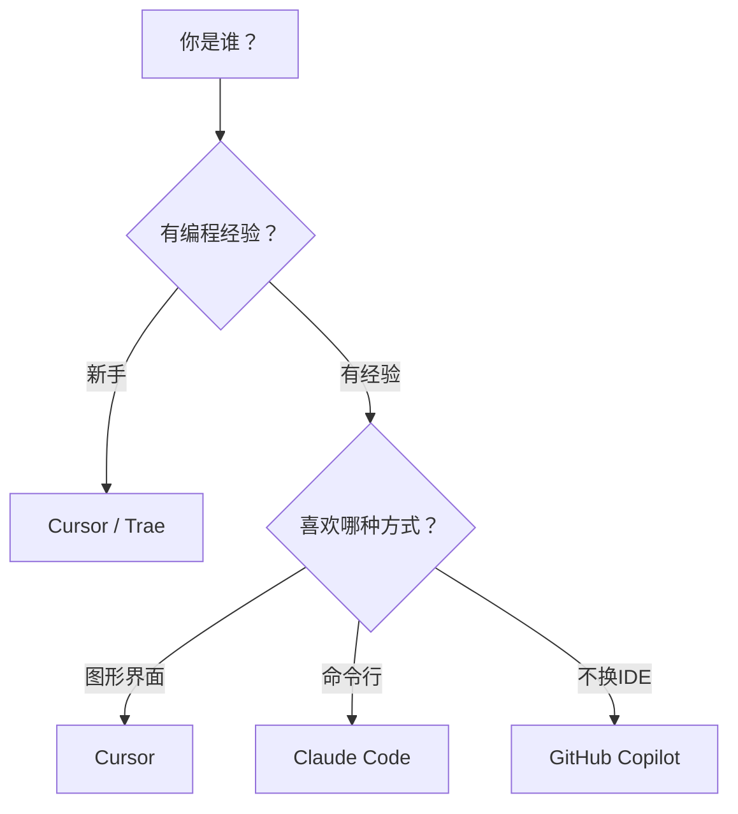

## AI编程

> 2025 年是 AI 编程元年，开发者的工作方式正在被重新定义。

### 什么是 AI 编程？

AI 编程不是让 AI 替你写所有代码，而是让 AI 成为你的**编程搭档**：

- **你负责思考** — 需求分析、架构设计、技术选型
- **AI 负责执行** — 代码生成、重构优化、Bug 定位、文档编写

这种"人机协作"模式正在成为主流开发方式。

### AI 编程能做什么？

| 能力 | 说明 | 效率提升 |
|------|------|:--------:|
| 代码生成 | 根据自然语言描述生成代码 | 3-5x |
| 代码解释 | 阅读理解陌生代码 | 5-10x |
| Bug 定位 | 分析错误原因并给出修复方案 | 2-3x |
| 重构优化 | 改善代码质量和性能 | 2-4x |
| 写测试 | 自动生成单元测试和集成测试 | 5-8x |
| 文档生成 | 自动生成注释和技术文档 | 10x+ |

### 主流 AI 编程工具

目前 AI 编程工具主要分为三类：

#### 1. AI IDE（集成开发环境）

| 工具 | 特点 | 适合谁 |
|------|------|--------|
| **Cursor** | 基于 VS Code 改造，原生 AI 体验，Tab 补全强大 | 日常开发首选 |
| **Windsurf** | 轻量快速，自动化程度高 | 喜欢简洁体验的开发者 |
| **Trae** | 字节出品，中文支持好，免费额度大 | 国内开发者 |

#### 2. AI 命令行工具（Agent）

| 工具 | 特点 | 适合谁 |
|------|------|--------|
| **Claude Code** | Anthropic 官方出品，推理能力强，支持多文件操作 | 复杂项目重构、全栈开发 |
| **Codex CLI** | OpenAI 出品，轻量快速 | 快速原型开发 |
| **Gemini CLI** | Google 出品，免费额度大 | 预算有限的开发者 |

#### 3. AI 编程助手（插件）

| 工具 | 特点 | 适合谁 |
|------|------|--------|
| **GitHub Copilot** | 集成 GitHub 生态，支持多 IDE | 已有 IDE 不想换的开发者 |
| **通义灵码** | 阿里出品，中文理解好，免费 | 国内企业开发者 |
| **CodeGeeX** | 智谱出品，开源模型驱动 | 注重隐私的开发者 |

### 如何选择？

**简单原则**：

- 想要**开箱即用**，选 Cursor
- 想要**深度控制**，选 Claude Code
- 想要**不换环境**，选 GitHub Copilot
- 想要**省钱**，选 Trae / Gemini CLI

### 高效使用 AI 编程的关键

#### 1. 学会提示词工程

好的提示词 = 更好的输出。三个核心原则：

- **具体**：不说"帮我写个接口"，要说"帮我写一个用户登录的 REST API，使用 JWT 鉴权，包含参数校验"
- **有上下文**：提供项目背景、技术栈、已有代码结构
- **有约束**：指定代码风格、框架版本、性能要求

#### 2. 善用迭代

AI 不是一次就能写对的，正确的工作流是：

1. 描述需求 → AI 生成初版
2. 审查代码 → 发现问题
3. 追问修改 → AI 修正
4. 确认通过 → 合入项目

#### 3. 保持学习

AI 能帮你写代码，但不能帮你理解代码。坚持：

- 读懂 AI 生成的每一行代码
- 理解背后的设计思路
- 用 AI 加速学习，而不是跳过学习

### 注意事项

| 类别 | 说明 |
|------|------|
| 🔒 安全 | 不要把密钥、密码、敏感数据发给 AI |
| ✅ 审核 | AI 生成的代码必须人工 review 后再上线 |
| 📖 版权 | 注意 AI 生成代码的版权归属问题 |
| 🧠 独立思考 | 不要丧失独立解决问题的能力 |

---

> 🧭 接下来，本栏目将逐一介绍各个 AI 编程工具的详细使用方法。
