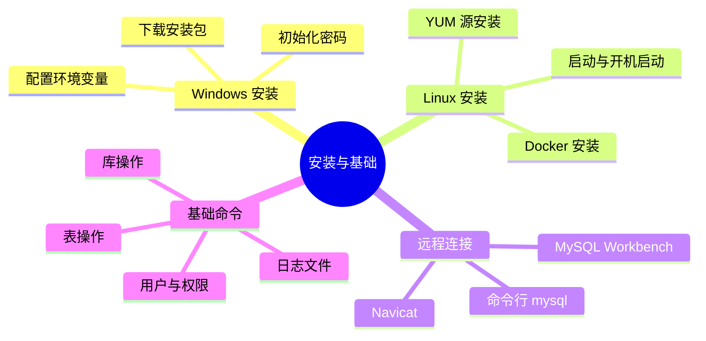
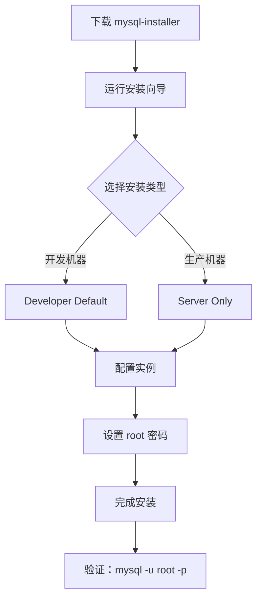
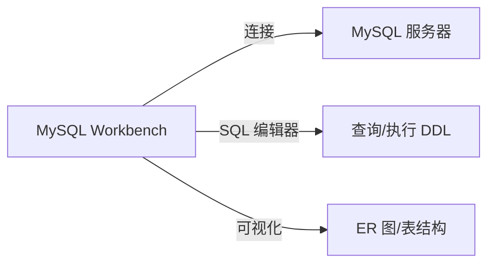
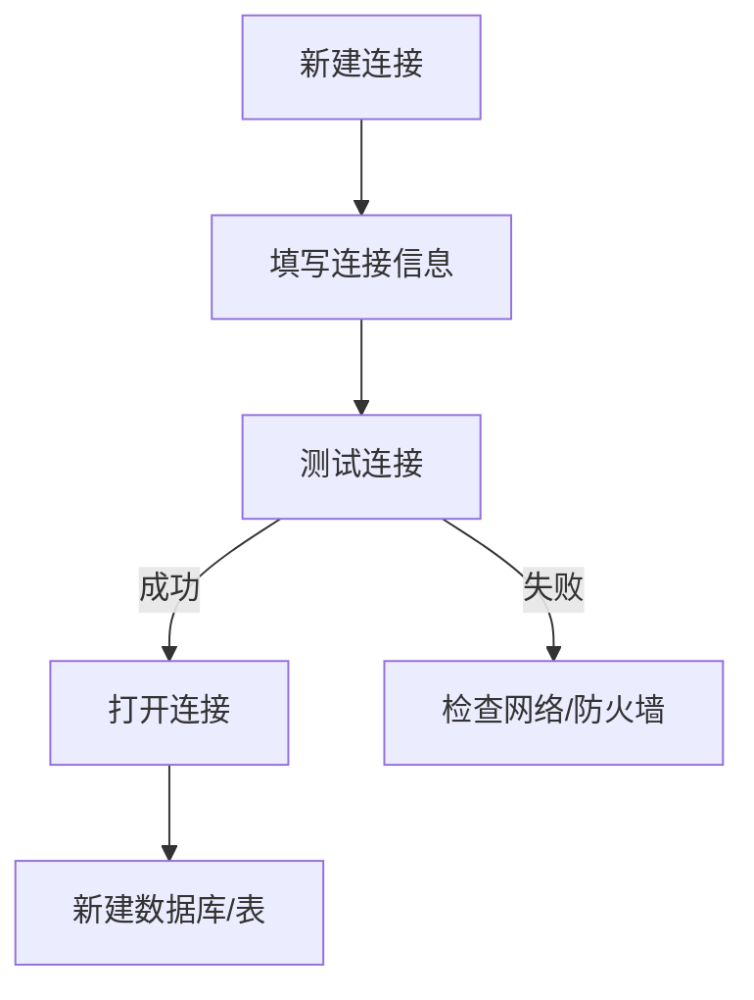

# 安装与基础

## 本篇目标



---

## Windows 安装

### 方式一：下载安装包（MySQL Installer）

适合桌面开发环境，一步一步可视化安装。

**下载地址**：https://dev.mysql.com/downloads/mysql/

选择 **Windows (x86, 64-bit), MSI Installer** 或 **ZIP Archive**。



**安装完成后配置环境变量**：

```
我的电脑 → 属性 → 高级系统设置 → 环境变量 → 系统变量 → Path
添加：C:\Program Files\MySQL\MySQL Server 8.0\bin
```

### 方式二：ZIP 解压版（推荐开发环境）

不装服务，纯绿色，适合喜欢干净的开发者。

```bash
# 1. 解压到指定目录
C:\tools\mysql-8.0\

# 2. 创建配置文件 my.ini
# C:\tools\mysql-8.0\my.ini
[mysqld]
basedir=C:\tools\mysql-8.0\
datadir=C:\tools\mysql-8.0\data\
port=3306
```

**初始化并启动**：

```bash
cd C:\tools\mysql-8.0\bin

# 初始化（生成临时密码）
mysqld --initialize --console
# 记住终端输出的临时密码，如：Ckj#5k!o0qX

# 安装服务
mysqld --install MySQL80

# 启动服务
net start MySQL80

# 登录
mysql -u root -p
# 输入刚才的临时密码
```

**修改 root 密码**：

```sql
ALTER USER 'root'@'localhost' IDENTIFIED BY '你的新密码';
```

---

## Linux 安装（CentOS/Ubuntu）

### 方式一：YUM/apt 安装（推荐）

```bash
# CentOS
sudo yum install -y mysql-server

# Ubuntu
sudo apt install -y mysql-server
```

```bash
# 启动并设置开机启动
sudo systemctl start mysqld
sudo systemctl enable mysqld

# 查看状态
sudo systemctl status mysqld
```

### 方式二：Docker 安装（强烈推荐）

一行命令，不污染宿主机环境，随用随开：

```bash
# 拉取镜像
docker pull mysql:8.0

# 运行容器
docker run -d \
  --name mysql8 \
  -p 3306:3306 \
  -e MYSQL_ROOT_PASSWORD=root123 \
  -e MYSQL_DATABASE=mydb \
  -v ~/mysql/data:/var/lib/mysql \
  mysql:8.0
```

```bash
# 登录容器内 MySQL
docker exec -it mysql8 mysql -u root -proot123

# 外部访问（需要先改密码加密规则）
docker exec -it mysql8 mysql -u root -proot123 -e "
ALTER USER 'root'@'%' IDENTIFIED WITH mysql_native_password BY 'root123';
"
```

::: tip Docker 方式的优势
- 多个 MySQL 版本同时运行（5.7/8.0）
- 卸载只需 `docker rm`，不留垃圾
- 可以配合 `docker-compose.yml` 一键启动整套环境
:::

---

## 远程连接

### 方式一：MySQL Workbench（官方免费）

下载地址：https://dev.mysql.com/downloads/workbench/



新建连接填写：
- Hostname：`localhost` 或服务器 IP
- Port：`3306`
- Username：`root`
- Password：你的密码

### 方式二：Navicat（推荐，功能更强）

商业软件，支持中文，图形化界面友好。



### 方式三：命令行 mysql（最通用）

```bash
# 本地登录
mysql -u root -p

# 远程登录
mysql -h 192.168.1.100 -P 3306 -u root -p

# 登录的同时指定数据库
mysql -u root -p mydb

# 执行 SQL 文件
mysql -u root -p mydb < init.sql

# 导出数据
mysqldump -u root -p mydb > backup.sql
```

---

## 基础命令

### 库操作

```sql
-- 查看所有数据库
SHOW DATABASES;

-- 创建数据库
CREATE DATABASE mydb DEFAULT CHARSET utf8mb4;

-- 切换数据库
USE mydb;

-- 查看当前数据库
SELECT DATABASE();

-- 删除数据库（危险操作！）
DROP DATABASE mydb;
```

### 表操作

```sql
-- 查看所有表
SHOW TABLES;

-- 查看表结构（字段信息）
DESC user;

-- 查看建表语句
SHOW CREATE TABLE user\G

-- 创建表
CREATE TABLE `user` (
    `id` BIGINT NOT NULL AUTO_INCREMENT,
    `username` VARCHAR(64) NOT NULL,
    `email` VARCHAR(128),
    `status` TINYINT DEFAULT 1,
    `created_at` DATETIME DEFAULT CURRENT_TIMESTAMP,
    PRIMARY KEY (`id`)
) ENGINE=InnoDB DEFAULT CHARSET=utf8mb4;

-- 删除表（危险操作！）
DROP TABLE user;
```

### 用户与权限

```sql
-- 查看所有用户
SELECT user, host FROM mysql.user;

-- 创建用户
CREATE USER 'app'@'%' IDENTIFIED BY 'App@123456';

-- 授权
GRANT ALL PRIVILEGES ON mydb.* TO 'app'@'%';

-- 刷新权限
FLUSH PRIVILEGES;

-- 删除用户（危险操作！）
DROP USER 'app'@'%';
```

::: tip 授权说明
`'app'@'%'` 的 `%` 表示允许远程任意 IP 连接。生产环境建议限制为具体 IP：
```sql
CREATE USER 'app'@'192.168.1.%' IDENTIFIED BY 'App@123456';
GRANT ALL PRIVILEGES ON mydb.* TO 'app'@'192.168.1.%';
```
:::

### 日志文件

MySQL 有几类常用日志：

| 日志 | 作用 | 路径（Linux默认） |
|------|------|------------------|
| 错误日志 | 记录启动/运行错误 | `/var/log/mysqld.log` |
| 查询日志 | 记录所有SQL（很占空间） | 可配置 |
| 慢查询日志 | 记录慢SQL | `/var/lib/mysql/*.slow.log` |
| 二进制日志 | 记录变更，用于主从复制 | `/var/lib/mysql/mysql-bin.*` |

```sql
-- 查看慢查询配置
SHOW VARIABLES LIKE 'slow_query%';
SHOW VARIABLES LIKE 'long_query_time%';

-- 开启慢查询日志（临时，重启失效）
SET GLOBAL slow_query_log = 'ON';
SET GLOBAL long_query_time = 1;  -- 超过1秒的SQL记入日志

-- 查看二进制日志
SHOW BINARY LOGS;

-- 查看当前连接数
SHOW STATUS LIKE 'Threads_connected';
SHOW STATUS LIKE 'Max_used_connections';
```

---

## SQL 基础语法

### SELECT 查询

```sql
-- 基本查询
SELECT * FROM user;

-- 条件查询
SELECT username, email FROM user WHERE status = 1;

-- 排序
SELECT * FROM user ORDER BY created_at DESC;

-- 分页（LIMIT）
SELECT * FROM user LIMIT 10 OFFSET 0;
SELECT * FROM user LIMIT 10;  -- 第1页
SELECT * FROM user LIMIT 10 OFFSET 10;  -- 第2页

-- 聚合统计
SELECT COUNT(*) FROM user;
SELECT COUNT(*) FROM user WHERE status = 1;
SELECT MAX(created_at) FROM user;
```

### INSERT 插入

```sql
-- 单条插入
INSERT INTO user (username, email, status) VALUES ('zhangsan', 'zhangsan@example.com', 1);

-- 批量插入
INSERT INTO user (username, email, status) VALUES
('zhangsan', 'zhangsan@example.com', 1),
('lisi', 'lisi@example.com', 1),
('wangwu', 'wangwu@example.com', 0);
```

### UPDATE 更新

```sql
-- 更新（必须带 WHERE，否则全表更新！）
UPDATE user SET status = 0 WHERE id = 1;

-- 批量更新
UPDATE user SET status = 0 WHERE status = 1 AND created_at < '2024-01-01';
```

### DELETE 删除

```sql
-- 删除（必须带 WHERE，否则全表删除！）
DELETE FROM user WHERE id = 1;

-- 物理删除（危险！）
DELETE FROM user;  -- 清空整张表
TRUNCATE TABLE user;  -- 效率更高，但不可回滚
```

::: warning DELETE vs TRUNCATE
- `DELETE`：一行一行删，记录到事务日志，可以回滚，但慢
- `TRUNCATE`：直接删表数据文件，不可回滚，但快

**永远不要用 TRUNCATE，除非你确定不需要这个数据**。
:::

---

## 本篇小结

| 知识点 | 核心要记的 |
|--------|-----------|
| Windows 安装 | ZIP 解压版 + my.ini + `mysqld --initialize` |
| Linux 安装 | Docker 最干净，`systemctl start mysqld` |
| 远程连接 | Workbench / Navicat / 命令行 mysql |
| 基础库操作 | `CREATE DATABASE` / `USE` / `DROP` |
| 基础表操作 | `CREATE TABLE` / `DESC` / `SHOW CREATE TABLE` |
| 用户权限 | `CREATE USER` / `GRANT` / `FLUSH PRIVILEGES` |
| 常用 SQL | `SELECT` / `INSERT` / `UPDATE` / `DELETE` |
| 日志 | 慢查询日志、`SHOW STATUS` 查看连接数 |

---

> 下一篇：[CRUD与索引](02-crud-index.md) —— 建表、增删改查、约束、索引创建。