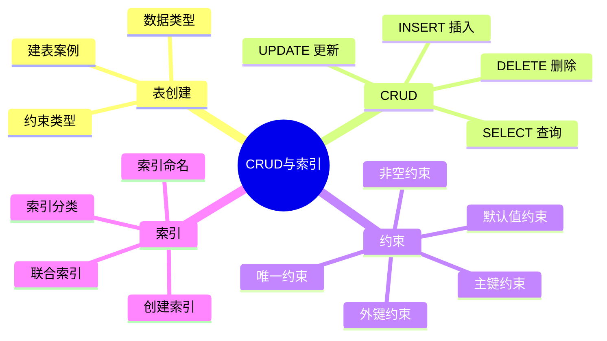
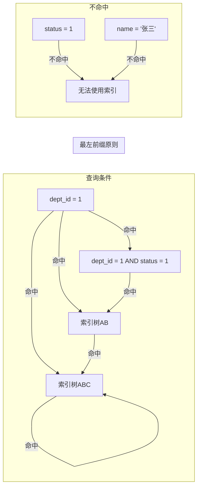

# CRUD与索引

## 本篇目标



---

## 表创建

### 常用数据类型

| 类型 | 说明 | 常见用途 |
|------|------|----------|
| `INT` / `BIGINT` | 整数 | ID、年龄、数量 |
| `VARCHAR(n)` | 可变字符串 | 姓名、用户名（需指定长度） |
| `TEXT` | 长文本 | 文章内容、备注 |
| `DATETIME` | 日期时间 | 创建时间、更新时间 |
| `TIMESTAMP` | 时间戳 | 自动记录变更时间 |
| `DECIMAL(p,s)` | 精确小数 | 金额（不用 FLOAT） |
| `TINYINT` | 微整数 | 状态码（0/1）、开关 |
| `JSON` | JSON数据 | 动态扩展字段 |

::: tip VARCHAR vs TEXT
- `VARCHAR`：有最大长度限制（65535 字节），存普通文本
- `TEXT`：最大 65535 字符，不支持默认值，存大段文章/富文本内容
- **金额永远用 DECIMAL**，FLOAT/DOUBLE 有精度丢失
:::

### 约束类型

```sql
-- NOT NULL：非空约束
username VARCHAR(64) NOT NULL

-- DEFAULT：默认值
status TINYINT DEFAULT 1

-- AUTO_INCREMENT：自增（只能用于主键）
id BIGINT NOT NULL AUTO_INCREMENT

-- PRIMARY KEY：主键（唯一 + 非空）
PRIMARY KEY (id)

-- UNIQUE：唯一约束
UNIQUE KEY uk_username (username)

-- FOREIGN KEY：外键约束
FOREIGN KEY (dept_id) REFERENCES dept(id)

-- COMMENT：字段注释
email VARCHAR(128) COMMENT '用户邮箱'
```

### 实战建表

```sql
CREATE TABLE `dept` (
    `id` BIGINT NOT NULL AUTO_INCREMENT,
    `name` VARCHAR(64) NOT NULL COMMENT '部门名称',
    `created_at` DATETIME DEFAULT CURRENT_TIMESTAMP,
    PRIMARY KEY (`id`),
    UNIQUE KEY `uk_name` (`name`)
) ENGINE=InnoDB DEFAULT CHARSET=utf8mb4 COMMENT='部门表';

CREATE TABLE `employee` (
    `id` BIGINT NOT NULL AUTO_INCREMENT,
    `name` VARCHAR(64) NOT NULL COMMENT '员工姓名',
    `email` VARCHAR(128) COMMENT '邮箱',
    `salary` DECIMAL(10,2) DEFAULT 0 COMMENT '薪资',
    `status` TINYINT DEFAULT 1 COMMENT '状态：1在职 0离职',
    `dept_id` BIGINT COMMENT '所属部门ID',
    `created_at` DATETIME DEFAULT CURRENT_TIMESTAMP,
    PRIMARY KEY (`id`),
    KEY `idx_status` (`status`),
    KEY `idx_dept_id` (`dept_id`),
    CONSTRAINT `fk_dept` FOREIGN KEY (`dept_id`) REFERENCES `dept`(`id`)
) ENGINE=InnoDB DEFAULT CHARSET=utf8mb4 COMMENT='员工表';
```

---

## CRUD

### INSERT 插入

```sql
-- 单条插入（指定字段）
INSERT INTO employee (name, email, salary, dept_id) VALUES
('张三', 'zhangsan@example.com', 8000.00, 1);

-- 批量插入（性能更好，推荐）
INSERT INTO employee (name, email, salary, dept_id) VALUES
('张三', 'zhangsan@example.com', 8000.00, 1),
('李四', 'lisi@example.com', 9000.00, 1),
('王五', 'wangwu@example.com', 10000.00, 2);

-- 一次性插入多条数据
INSERT INTO employee VALUES
(NULL, '赵六', 'zhaoliu@example.com', 11000.00, 1, 2, NOW());
```

### SELECT 查询

```sql
-- 查询所有字段
SELECT * FROM employee;

-- 查询指定字段
SELECT name, email, salary FROM employee;

-- 条件查询（WHERE）
SELECT * FROM employee WHERE status = 1;
SELECT * FROM employee WHERE salary > 8000;
SELECT * FROM employee WHERE dept_id = 1 AND status = 1;
SELECT * FROM employee WHERE name LIKE '张%';  -- 模糊匹配

-- 排序（ORDER BY）
SELECT * FROM employee ORDER BY salary DESC;  -- 降序
SELECT * FROM employee ORDER BY salary ASC;   -- 升序，默认

-- 分页（LIMIT）
SELECT * FROM employee LIMIT 10;  -- 取前10条
SELECT * FROM employee LIMIT 10 OFFSET 10;  -- 第2页

-- 去重（DISTINCT）
SELECT DISTINCT dept_id FROM employee;

-- 聚合统计（GROUP BY + 聚合函数）
SELECT dept_id, COUNT(*) as count, AVG(salary) as avg_salary
FROM employee
WHERE status = 1
GROUP BY dept_id
HAVING COUNT(*) > 1;  -- 分组后过滤

-- 联合查询（JOIN）
SELECT e.name, d.name as dept_name
FROM employee e
LEFT JOIN dept d ON e.dept_id = d.id
WHERE e.status = 1;
```

### UPDATE 更新

```sql
-- 更新单个字段
UPDATE employee SET salary = 8500 WHERE id = 1;

-- 更新多个字段
UPDATE employee SET salary = 8500, status = 1 WHERE id = 1;

-- 批量更新（带 WHERE）
UPDATE employee SET salary = salary * 1.1 WHERE dept_id = 1 AND status = 1;

-- 注意：永远带 WHERE，否则全表更新！
UPDATE employee SET status = 0;  -- 危险！全表更新
```

### DELETE 删除

```sql
-- 按条件删除
DELETE FROM employee WHERE id = 1;

-- 批量删除
DELETE FROM employee WHERE status = 0 AND created_at < '2024-01-01';

-- 危险操作：清空整张表
DELETE FROM employee;   -- 逐行删除，记录事务日志，可以回滚
TRUNCATE TABLE employee; -- 直接删文件，不可回滚，速度快
```

---

## 索引

索引是 MySQL 性能优化最核心的内容。没有索引的查询相当于翻全书找内容，有了索引相当于查目录。

### 索引分类

| 索引类型 | 关键字 | 说明 |
|----------|--------|------|
| 主键索引 | `PRIMARY KEY` | 主键自动创建，唯一且非空 |
| 唯一索引 | `UNIQUE KEY` | 值唯一，可空 |
| 普通索引 | `KEY` / `INDEX` | 普通索引，允许重复 |
| 联合索引 | `KEY idx(a,b,c)` | 多列组合成一个索引 |
| 全文索引 | `FULLTEXT KEY` | 大文本内容搜索 |

### 创建索引

```sql
-- 建表时创建
CREATE TABLE `user` (
    `id` BIGINT NOT NULL AUTO_INCREMENT,
    `username` VARCHAR(64) NOT NULL,
    `email` VARCHAR(128),
    `status` TINYINT DEFAULT 1,
    PRIMARY KEY (`id`),
    UNIQUE KEY `uk_username` (`username`),          -- 唯一索引
    KEY `idx_status` (`status`),                      -- 普通索引
    KEY `idx_email_status` (`email`, `status`)        -- 联合索引
) ENGINE=InnoDB DEFAULT CHARSET=utf8mb4;
```

```sql
-- 已存在的表添加索引
-- 普通索引
CREATE INDEX idx_status ON employee(status);

-- 唯一索引
CREATE UNIQUE INDEX uk_email ON employee(email);

-- 联合索引
CREATE INDEX idx_dept_status ON employee(dept_id, status);

-- 添加主键（如果还没有）
ALTER TABLE employee ADD PRIMARY KEY(id);
```

### 查看索引

```sql
SHOW INDEX FROM employee;

-- 输出示例
-- Table   Non_unique  Key_name           Seq_in_index  Column_name
-- employee  0         PRIMARY               1            id
-- employee  0         uk_email              1            email
-- employee  1         idx_dept_status      1            dept_id
-- employee  1         idx_dept_status      2            status
```

### 删除索引

```sql
DROP INDEX idx_status ON employee;
```

### 联合索引与最左前缀原则

```sql
-- 联合索引 (dept_id, status, name)
KEY idx_dept_status_name (dept_id, status, name)
```

这个联合索引相当于三个索引：
- `(dept_id)`
- `(dept_id, status)`
- `(dept_id, status, name)`



**能用索引的情况**：
- `dept_id = 1`
- `dept_id = 1 AND status = 1`
- `dept_id = 1 AND status = 1 AND name = '张三'`

**不能使用索引的情况**：
- `status = 1`（没有最左前缀）
- `name = '张三'`（没有最左前缀）

### 索引命名规范

| 类型 | 命名示例 |
|------|----------|
| 主键索引 | `PRIMARY`（自动） |
| 唯一索引 | `uk_字段名` |
| 普通索引 | `idx_字段名` 或 `idx_字段1_字段2` |
| 外键索引 | `fk_表名_字段` |

---

## 实战：完整建表+索引案例

```sql
-- 订单表
CREATE TABLE `orders` (
    `id` BIGINT NOT NULL AUTO_INCREMENT COMMENT '订单ID',
    `order_no` VARCHAR(32) NOT NULL COMMENT '订单号',
    `user_id` BIGINT NOT NULL COMMENT '用户ID',
    `amount` DECIMAL(10,2) NOT NULL DEFAULT 0 COMMENT '订单金额',
    `status` TINYINT NOT NULL DEFAULT 1 COMMENT '状态：1待支付 2已支付 3已取消',
    `created_at` DATETIME NOT NULL DEFAULT CURRENT_TIMESTAMP COMMENT '创建时间',
    `paid_at` DATETIME COMMENT '支付时间',
    PRIMARY KEY (`id`),
    UNIQUE KEY `uk_order_no` (`order_no`),
    KEY `idx_user_id` (`user_id`),
    KEY `idx_status_created` (`status`, `created_at`),
    KEY `idx_user_status` (`user_id`, `status`)
) ENGINE=InnoDB DEFAULT CHARSET=utf8mb4 COMMENT='订单表';

-- 用户表
CREATE TABLE `user` (
    `id` BIGINT NOT NULL AUTO_INCREMENT COMMENT '用户ID',
    `username` VARCHAR(64) NOT NULL COMMENT '用户名',
    `phone` VARCHAR(16) COMMENT '手机号',
    `status` TINYINT NOT NULL DEFAULT 1 COMMENT '状态：1正常 0禁用',
    `created_at` DATETIME NOT NULL DEFAULT CURRENT_TIMESTAMP COMMENT '注册时间',
    PRIMARY KEY (`id`),
    UNIQUE KEY `uk_username` (`username`),
    UNIQUE KEY `uk_phone` (`phone`),
    KEY `idx_status` (`status`)
) ENGINE=InnoDB DEFAULT CHARSET=utf8mb4 COMMENT='用户表';
```

### 索引设计思路

根据常见查询来设计索引：

| 常见查询 | 设计索引 |
|---------|----------|
| 按订单号查详情 | `uk_order_no` |
| 按用户查所有订单 | `idx_user_id` |
| 按状态+时间查订单 | `idx_status_created` |
| 按用户+状态查订单 | `idx_user_status` |

::: tip 索引不是越多越好
每建一个索引，都会增加写操作的开销（INSERT/UPDATE/DELETE 需要同时更新索引）。
**原则**：只给高频查询字段建索引，定期清理不用的索引。
:::

---

## 本篇小结

| 知识点 | 核心要记的 |
|--------|-----------|
| 数据类型 | INT/BIGINT、VARCHAR/TEXT、DATETIME、DECIMAL |
| 约束 | PRIMARY KEY、UNIQUE、NOT NULL、DEFAULT、FOREIGN KEY |
| INSERT | 单条/批量插入，批量性能更好 |
| SELECT | WHERE、ORDER BY、LIMIT、GROUP BY、HAVING、JOIN |
| UPDATE | 必须带 WHERE，否则全表更新 |
| DELETE | TRUNCATE 不可回滚，DELETE 可回滚 |
| 索引类型 | 主键/唯一/普通/联合/全文 |
| 最左前缀 | 联合索引从最左边开始才能命中 |
| 索引命名 | `uk_` 唯一、`idx_` 普通 |

---

> 下一篇：[事务与锁](03-transaction-lock.md) —— ACID、隔离级别、锁机制。