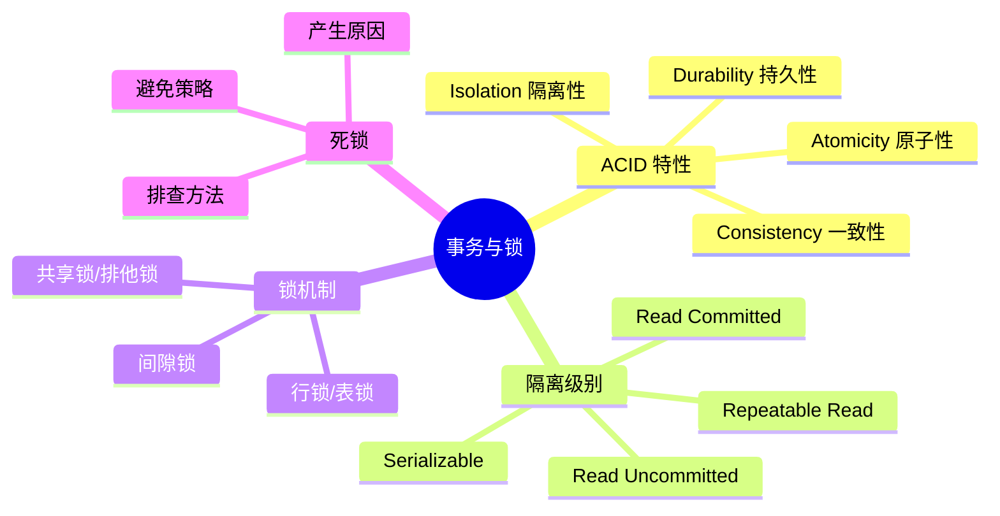
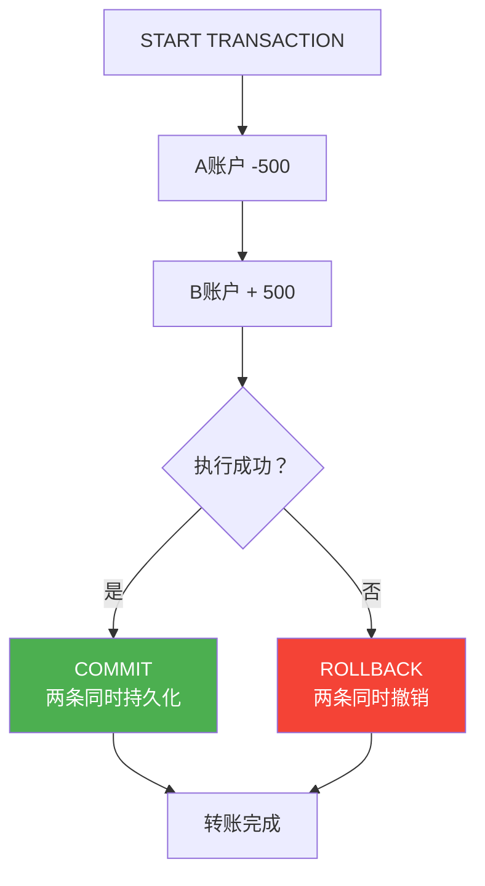
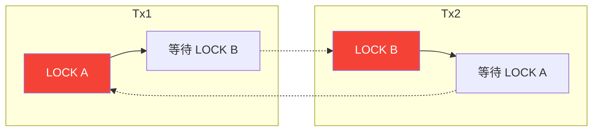
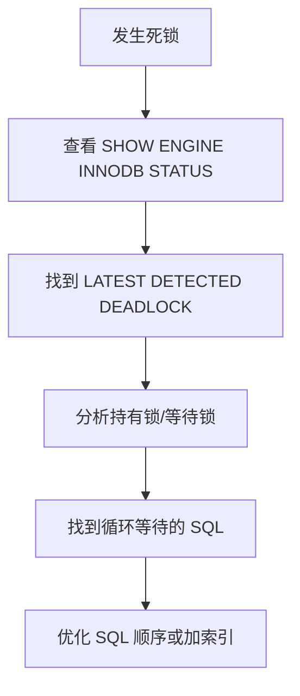

# 事务与锁

## 本篇目标



---

## 为什么需要事务

现实中的例子：银行转账。A 账户有 1000 元，转给 B 账户 500 元。这个操作包含两步：

1. A 账户减 500 元
2. B 账户加 500 元

**如果没有事务**：第一步成功了，但第二步失败了，A 扣了 500 但 B 没收到——钱凭空消失了。

**有事务**：两步都在同一个事务里，要么同时成功，要么同时回滚。



---

## ACID 四大特性

### A — Atomicity（原子性）

事务是最小执行单位，不可再分。事务里的所有操作要么全部成功，要么全部失败回滚。

### C — Consistency（一致性）

事务执行前后，数据库状态保持一致。转账前后总金额不变（A少了500，B多了500，总额不变）。

### I — Isolation（隔离性）

并发执行的事务之间相互隔离，不能互相干扰。隔离级别决定了隔离程度。

### D — Durability（持久性）

事务一旦提交，对数据的改变就是永久性的，即使系统崩溃也不丢。

---

## 事务操作命令

```sql
-- 开启事务
START TRANSACTION;
-- 或
BEGIN;

-- 提交（所有操作生效）
COMMIT;

-- 回滚（所有操作撤销）
ROLLBACK;

-- 设置保存点
SAVEPOINT sp1;

-- 回滚到保存点
ROLLBACK TO sp1;

-- 释放保存点
RELEASE SAVEPOINT sp1;
```

### 自动提交

MySQL 默认 autocommit = 1，即每条 SQL 自动提交。

```sql
-- 查看自动提交配置
SHOW VARIABLES LIKE 'autocommit%';

-- 关闭自动提交（手动控制事务）
SET autocommit = 0;
```

---

## 隔离级别

并发情况下，事务之间会相互影响。隔离级别越高，数据越安全，但性能越差。

| 隔离级别 | 脏读 | 不可重复读 | 幻读 | 并发性能 |
|----------|------|-----------|------|----------|
| Read Uncommitted | 可能 | 可能 | 可能 | 最高 |
| Read Committed | 不可能 | 可能 | 可能 | 较低 |
| Repeatable Read（MySQL默认） | 不可能 | 不可能 | 可能 | 较低 |
| Serializable | 不可能 | 不可能 | 不可能 | 最低 |

### 脏读（Dirty Read）

一个事务读到了另一个事务**未提交**的数据。

```
Tx1: 开启事务 → UPDATE account SET money = money - 500 → 未提交
Tx2: 读取 account（读到了 Tx1 未提交的数据）
Tx1: ROLLBACK（撤销）
```

Tx2 读到了"假数据"——这就是脏读。

### 不可重复读（Non-repeatable Read）

同一事务内，两次读取同一行数据，结果不一样（因为另一个事务提交了修改）。

```
Tx1: 读取用户余额 = 1000
Tx2: 开启事务 → UPDATE account SET money = 2000 → COMMIT
Tx1: 再次读取用户余额 = 2000（和第一次不一样！）
```

### 幻读（Phantom Read）

同一事务内，两次查询返回的行数不一样（因为另一个事务插入了新行）。

```
Tx1: SELECT * FROM orders WHERE status = 1  -- 返回 10 条
Tx2: INSERT INTO orders (...) VALUES (...) → COMMIT
Tx1: SELECT * FROM orders WHERE status = 1  -- 返回 11 条（多了1条"幻影"）
```

### MySQL 默认隔离级别：Repeatable Read

MySQL InnoDB 默认 Repeatable Read，通过 MVCC（多版本并发控制）和间隙锁来解决幻读。

---

## 设置隔离级别

```sql
-- 查看当前会话隔离级别
SELECT @@tx_isolation;

-- 设置当前会话隔离级别
SET SESSION TRANSACTION ISOLATION LEVEL READ COMMITTED;

-- 设置全局隔离级别（需要重启或 SUPER 权限）
SET GLOBAL TRANSACTION ISOLATION LEVEL READ COMMITTED;
```

```sql
-- 配置文件中设置（my.ini / my.cnf）
[mysqld]
transaction-isolation = READ-COMMITTED
```

---

## 锁机制

InnoDB 是行级锁，锁住的是索引记录，不是整个数据行。

### 锁的类型

| 锁类型 | 关键字 | 说明 |
|--------|--------|------|
| 共享锁（S） | `LOCK IN SHARE MODE` | 允许多个事务同时读 |
| 排他锁（X） | `FOR UPDATE` | 独占锁，写操作互斥 |
| 意向共享锁 | IS | 表明事务想加共享锁 |
| 意向排他锁 | IX | 表明事务想加排他锁 |

### 加锁方式

```sql
-- 共享锁：允许其他事务读，但阻止写
SELECT * FROM employee WHERE id = 1 LOCK IN SHARE MODE;

-- 排他锁：阻止其他事务读写
SELECT * FROM employee WHERE id = 1 FOR UPDATE;

-- 普通 SELECT（不加锁，快照读）
SELECT * FROM employee WHERE id = 1;  -- 不加锁，用 MVCC 读取历史版本
```

### 行锁 vs 表锁

| 锁类型 | 锁定范围 | 特点 |
|--------|----------|------|
| 行锁 | 单行或多行 | 粒度小，并发好，但开销大 |
| 表锁 | 整张表 | 粒度大，并发差，但开销小 |

```sql
-- 表锁（MyISAM 引擎）
LOCK TABLES employee READ;
LOCK TABLES employee WRITE;
UNLOCK TABLES;

-- InnoDB 表锁（尽量避免）
LOCK TABLE employee WRITE;  -- 锁住整张表
```

### InnoDB 行锁的规则

1. **只有通过索引检索数据才加行锁**，否则加表锁
2. 主键索引和唯一索引会命中行锁
3. 普通索引可能会加间隙锁（Next-Key Lock）

### 间隙锁（Gap Lock）

当查询条件使用普通索引，且范围较大时，InnoDB 不仅锁住匹配的行，还会锁定行之间的"间隙"，防止幻读。

```sql
-- 假设 status 有索引，值可能是 1, 2, 3
-- 执行这条SQL会锁住 status = 2 的行，以及 (1,2) 和 (2,3) 之间的间隙
SELECT * FROM employee WHERE status = 2 FOR UPDATE;
```

间隙锁可能会导致锁定不需要的范围，影响并发性能。

---

## 死锁

### 什么是死锁

两个或多个事务相互持有对方需要的锁，形成循环等待。

```
Tx1: 持有了 A 锁，等 B 锁
Tx2: 持有了 B 锁，等 A 锁
```



### 死锁示例

```sql
-- Tx1 先执行
START TRANSACTION;
UPDATE account SET money = money - 500 WHERE id = 1;  -- 锁住 id=1
UPDATE account SET money = money + 500 WHERE id = 2;  -- 等待 id=2

-- Tx2 在 Tx1 执行完第一步后执行
START TRANSACTION;
UPDATE account SET money = money - 300 WHERE id = 2;  -- 锁住 id=2
UPDATE account SET money = money + 300 WHERE id = 1;  -- 等待 id=1 → 死锁！
```

### 死锁排查

```sql
-- 查看最近死锁日志
SHOW ENGINE INNODB STATUS;

-- 输出中会显示：
-- LATEST DETECTED DEADLOCK
-- ---TRANSACTION 1
-- ...持有的锁和等待的锁...
-- ---TRANSACTION 2
-- ...持有的锁和等待的锁...
```



### 如何避免死锁

| 策略 | 说明 |
|------|------|
| 按固定顺序访问表 | 多表操作时按相同顺序加锁 |
| 减小事务范围 | 快进快出，不要在事务里等待用户输入 |
| 减少索引 | 避免因普通索引导致的间隙锁范围过大 |
| 设置锁超时 | `innodb_lock_wait_timeout` 超过则自动回滚 |

```sql
-- 设置锁等待超时（秒）
SET GLOBAL innodb_lock_wait_timeout = 10;
```

---

## 实战：转账事务

```sql
-- 转账：李四转给王五 1000 元
START TRANSACTION;

-- 1. 检查李四余额是否足够
SELECT balance FROM account WHERE username = '李四' FOR UPDATE;

-- 2. 扣款
UPDATE account SET balance = balance - 1000 WHERE username = '李四';

-- 3. 入账
UPDATE account SET balance = balance + 1000 WHERE username = '王五';

-- 4. 检查结果
SELECT balance FROM account WHERE username IN ('李四', '王五');

-- 5. 提交
COMMIT;
```

::: tip 余额检查要用 FOR UPDATE
`SELECT balance` 不加锁的话，两个事务可能同时读到余额够用，都去扣款，导致超额扣款。
:::

---

## 本篇小结

| 知识点 | 核心要记的 |
|--------|-----------|
| ACID | 原子性、一致性、隔离性、持久性 |
| 事务命令 | `START TRANSACTION` / `COMMIT` / `ROLLBACK` |
| 脏读 | 读到了另一个事务未提交的数据 |
| 不可重复读 | 同一事务内两次读取结果不同 |
| 幻读 | 同一事务内两次查询返回行数不同 |
| MySQL默认隔离级别 | Repeatable Read |
| 共享锁 | `LOCK IN SHARE MODE`，多事务可同时读 |
| 排他锁 | `FOR UPDATE`，独占锁，写互斥 |
| 死锁 | 循环等待，`SHOW ENGINE INNODB STATUS` 排查 |
| 避免死锁 | 按固定顺序加锁、减小事务范围 |

---

> 下一篇：[SQL优化](04-sql-optimize.md) —— EXPLAIN执行计划、索引失效场景、慢查询分析。