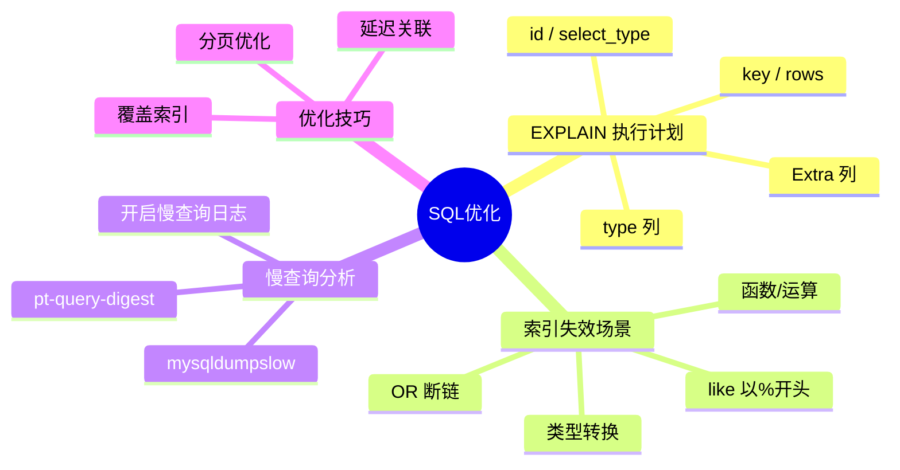
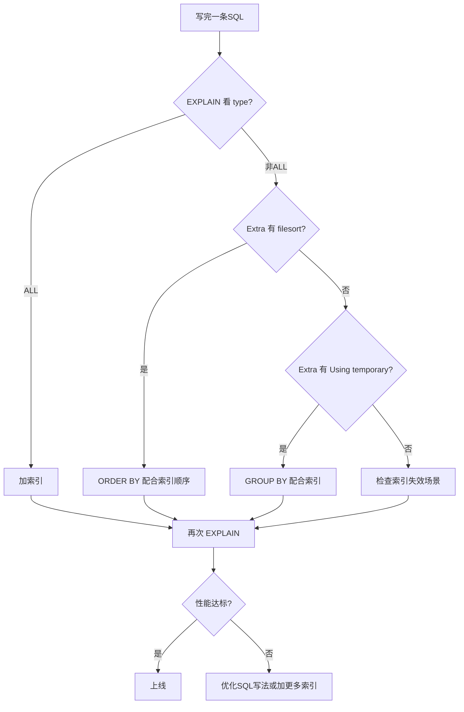

# SQL优化

## 本篇目标



---

## 为什么 SQL 需要优化

上线前 SQL 跑得挺快，上线后数据量大了突然变慢——这不是代码问题，是 SQL 本身没写好，加上没有索引。

| 数据量 | 全表扫描 | 有索引 |
|--------|----------|--------|
| 100 条 | 0.001s | 0.001s |
| 10 万条 | 0.3s | 0.001s |
| 1000 万条 | 30s+ | 0.002s |

**结论**：没有索引的查询，数据量大了就是灾难。优化 SQL 先从读懂执行计划开始。

---

## EXPLAIN 执行计划

`EXPLAIN` 是 MySQL 最重要的调试工具，能告诉你 MySQL 是怎么执行这条 SQL 的。

```sql
EXPLAIN SELECT * FROM employee WHERE username = 'zhangsan';
```

### 输出字段解读

| 字段 | 含义 | 看什么 |
|------|------|--------|
| `id` | 查询序号，大的先执行 | id 越大优先级越高 |
| `select_type` | 查询类型 | SIMPLE（简单查询）/ PRIMARY（主查询） |
| `type` | 访问类型，**最关键** | ALL（全表）/ ref（索引）/ const（常量） |
| `possible_keys` | 可能用到的索引 | 列出所有可用的索引 |
| `key` | 实际用到的索引 | NULL = 没走索引 |
| `key_len` | 索引使用长度 | 越长说明索引越精确 |
| `rows` | 预估扫描行数 | 越大越慢 |
| `Extra` | 额外信息 | Using filesort / Using index |

### type 列（访问类型）

从好到差排序：

| type | 含义 | 性能 |
|------|------|------|
| `const` | 常量访问，主键或唯一索引精准命中 | 最快 |
| `eq_ref` | 唯一索引等值关联 | 快 |
| `ref` | 普通索引等值关联 | 快 |
| `range` | 索引范围查询 | 较快 |
| `index` | 全索引扫描 | 较慢 |
| `ALL` | **全表扫描** | **慢，需要优化** |

```sql
-- const：主键精准查询
EXPLAIN SELECT * FROM employee WHERE id = 1;

-- eq_ref：多表关联，主键/唯一索引
EXPLAIN SELECT * FROM employee e LEFT JOIN dept d ON e.dept_id = d.id;

-- ref：普通索引等值查询
EXPLAIN SELECT * FROM employee WHERE dept_id = 1;

-- range：范围查询
EXPLAIN SELECT * FROM employee WHERE id > 10 AND id < 100;

-- ALL：全表扫描（需要优化）
EXPLAIN SELECT * FROM employee WHERE name = '张三';  -- name 没有索引
```

**如果看到 `type = ALL`，说明没走索引，必须优化**。

### Extra 列（重要信号）

| Extra 内容 | 含义 | 建议 |
|-----------|------|------|
| `Using filesort` | 文件排序，**无法利用索引** | 必须优化 |
| `Using temporary` | 使用了临时表 | 必须优化 |
| `Using index` | **覆盖索引**，性能好 | 最好情况 |
| `Using index condition` | 下推索引过滤 | 较好 |
| `Using where` | 服务端用 WHERE 过滤 | 正常 |

**`Using filesort` 出现的原因**：

ORDER BY 的列没有索引，或 ORDER BY 的顺序和索引顺序不匹配。

```sql
-- 假设有联合索引 idx_name_status(name, status)
EXPLAIN SELECT * FROM employee ORDER BY name;  -- Using filesort！因为不是 idx_name_status(name)
EXPLAIN SELECT * FROM employee ORDER BY name, status;  -- 有序，无需 filesort
```

---

## 索引失效场景

明明建了索引，SQL 却不走索引——这是最常见的问题。

### 场景一：like 以 % 开头

```sql
-- 走索引（前置通配符）
EXPLAIN SELECT * FROM employee WHERE name LIKE '张%';  -- 走索引

-- 不走索引（以通配符开头）
EXPLAIN SELECT * FROM employee WHERE name LIKE '%三%';  -- 全表扫描
EXPLAIN SELECT * FROM employee WHERE name LIKE '%三';   -- 全表扫描
```

**原因**：LIKE '%xxx' 开头不确定，索引无法加速，只能全表扫描。

**解决方案**：如果必须模糊匹配，用 Elasticsearch。

### 场景二：函数/运算作用于索引列

```sql
-- 不走索引：LEFT() 函数作用于列
EXPLAIN SELECT * FROM employee WHERE LEFT(name, 1) = '张';

-- 走索引：先运算后比较
EXPLAIN SELECT * FROM employee WHERE name LIKE '张%';

-- 不走索引：运算作用于列
EXPLAIN SELECT * FROM employee WHERE salary * 1.1 > 10000;

-- 走索引：移到右边
EXPLAIN SELECT * FROM employee WHERE salary > 10000 / 1.1;
```

### 场景三：OR 断裂

```sql
-- OR 断链，只有 dept_id 走索引，name 不走
EXPLAIN SELECT * FROM employee WHERE dept_id = 1 OR name = '张三';

-- 改写成 UNION，走索引
EXPLAIN SELECT * FROM employee WHERE dept_id = 1
UNION
SELECT * FROM employee WHERE name = '张三';
```

### 场景四：类型转换

```sql
-- phone 是 VARCHAR 类型
-- 不走索引：传入 INT，MySQL 需转换每行
EXPLAIN SELECT * FROM user WHERE phone = 13800138000;

-- 走索引：传入字符串
EXPLAIN SELECT * FROM user WHERE phone = '13800138000';
```

### 场景五：IS NULL / IS NOT NULL

```sql
-- 不推荐：!= NULL 永远为 unknown，不会利用索引
EXPLAIN SELECT * FROM employee WHERE name IS NOT NULL;  -- 可能不走索引

-- 推荐：用具体值替代
EXPLAIN SELECT * FROM employee WHERE name != '';  -- 空字符串代替 NULL
```

### 场景六：联合索引不符合最左前缀

```sql
-- 联合索引 idx_dept_status(dept_id, status)
-- 走索引
EXPLAIN SELECT * FROM employee WHERE dept_id = 1;
EXPLAIN SELECT * FROM employee WHERE dept_id = 1 AND status = 1;

-- 不走索引：跳过了最左前缀
EXPLAIN SELECT * FROM employee WHERE status = 1;
```

---

## 慢查询分析

### 开启慢查询日志

```sql
-- 查看配置
SHOW VARIABLES LIKE 'slow_query%';
SHOW VARIABLES LIKE 'long_query_time%';

-- 开启慢查询日志（临时）
SET GLOBAL slow_query_log = 'ON';
SET GLOBAL slow_query_log_file = '/var/lib/mysql/mysql-slow.log';
SET GLOBAL long_query_time = 1;  -- 超过1秒的SQL记入日志

-- 永久开启需在 my.ini 添加：
-- [mysqld]
-- slow_query_log = ON
-- slow_query_log_file = /var/lib/mysql/mysql-slow.log
-- long_query_time = 1
```

### 分析慢查询日志

```bash
# 查看慢查询日志文件位置
SHOW VARIABLES LIKE 'slow_query%';

# Linux 下用 mysqldumpslow 分析
mysqldumpslow -s t /var/lib/mysql/mysql-slow.log     # 按总时间排序
mysqldumpslow -s c /var/lib/mysql/mysql-slow.log     # 按查询次数排序
mysqldumpslow -s r /var/lib/mysql/mysql-slow.log     # 按返回行数排序

# 显示前10条最慢的SQL
mysqldumpslow -t 10 /var/lib/mysql/mysql-slow.log
```

### pt-query-digest（更强大）

```bash
# 安装
yum install -y percona-toolkit

# 分析
pt-query-digest /var/lib/mysql/mysql-slow.log

# 输出：
# Overall: 100 total, 10 unique
# Query_time: 0.050 - 5.200 avg: 0.800
# Time: 10.500s
# Rank: 1
# Response time: 5.200s
# Query: SELECT * FROM employee WHERE name LIKE '%张%'
```

### 快速定位慢 SQL

```sql
-- 查看当前正在执行的慢查询
SHOW FULL PROCESSLIST;

-- 查看总查询次数和慢查询次数
SHOW STATUS LIKE 'Slow_queries';
-- Value: 5  （重启后清零）

-- 查看哪个库最慢
SHOW DATABASES;
```

---

## 实战优化技巧

### 技巧一：覆盖索引

只查索引列就能拿到结果，不需要回表。

```sql
-- 联合索引 (dept_id, status)
KEY idx_dept_status (dept_id, status)

-- 不需要回表，直接从索引拿数据
EXPLAIN SELECT dept_id, status FROM employee WHERE dept_id = 1;
-- Extra: Using index

-- 需要回表
EXPLAIN SELECT * FROM employee WHERE dept_id = 1;
-- Extra: Using index condition
```

### 技巧二：延迟关联

分页查询深度翻页很慢，先查 ID 再回表取数据。

```sql
-- 深度分页慢：偏移10000条，取10条
EXPLAIN SELECT * FROM employee ORDER BY id LIMIT 10000, 10;
-- rows: 10010（扫了1万多行）

-- 延迟关联：先查ID，再回表取数据
EXPLAIN SELECT * FROM employee e
INNER JOIN (SELECT id FROM employee ORDER BY id LIMIT 10000, 10) t
ON e.id = t.id;
-- rows: 10（只扫了10行）
```

### 技巧三：分页优化（游标分页）

比 OFFSET 更快，不用跳过前面的行。

```sql
-- 传统 OFFSET
SELECT * FROM employee ORDER BY id LIMIT 10000, 10;

-- 游标分页：记住上一页最后一条的ID
SELECT * FROM employee WHERE id > 10000 ORDER BY id LIMIT 10;
-- 只取第10001-10010条，不扫描前10000条
```

### 技巧四：强制使用索引

```sql
-- 强制走某个索引（不推荐作为长期方案）
EXPLAIN SELECT * FROM employee FORCE INDEX (idx_dept_id) WHERE dept_id = 1;
```

### 技巧五：批量插入优化

```sql
-- 逐条插入（慢）
INSERT INTO employee (name, salary) VALUES ('张三', 8000);
INSERT INTO employee (name, salary) VALUES ('李四', 9000);

-- 批量插入（快）
INSERT INTO employee (name, salary) VALUES
('张三', 8000),
('李四', 9000),
('王五', 10000);

-- 关闭唯一检查和自动提交（导入数据时）
SET unique_checks = 0;
SET foreign_key_checks = 0;
-- 批量导入...
SET unique_checks = 1;
SET foreign_key_checks = 1;
```

---

## SQL 优化checklist



---

## 本篇小结

| 知识点 | 核心要记的 |
|--------|-----------|
| EXPLAIN | 分析 SQL 执行计划的第一步 |
| type 列 | ALL = 全表扫描，必须优化；const/eq_ref/ref = 好 |
| Extra | Using filesort = 必须优化；Using index = 覆盖索引 |
| like % 开头 | 不走索引，改用 Elasticsearch |
| 函数运算 on 列 | 不走索引，移到右边 |
| OR 断链 | 改 UNION |
| 类型转换 | 字符串字段用字符串值查 |
| 覆盖索引 | 只查索引列，不需要回表 |
| 延迟关联 | 先查 ID 再回表，避免深度 OFFSET |
| 慢查询分析 | `mysqldumpslow` / `pt-query-digest` |

**优化原则**：先看执行计划，找到全表扫描，再针对性加索引或改写 SQL。

---

> MySQL 实战系列到此结束！从安装到 CRUD 到事务锁再到 SQL 优化，希望对你有帮助。