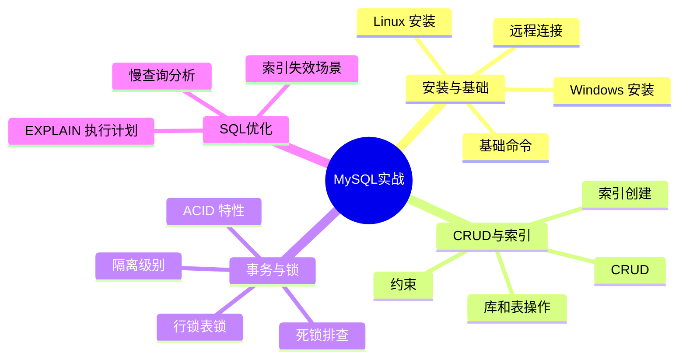
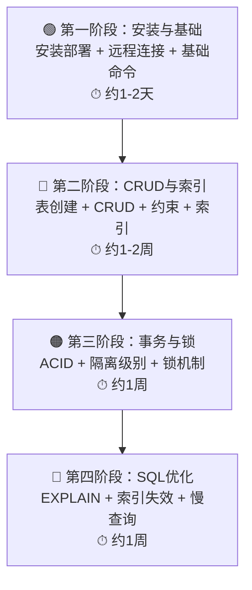

# MySQL实战

> MySQL 是后端开发最常用的关系型数据库，性能调优、事务控制、锁机制是每个后端必须掌握的硬技能。

## 为什么学 MySQL？

作为 Java 后端开发者，这些场景你一定遇到过：

| 场景 | 为什么绕不开 MySQL |
|------|-------------------|
| 用户登录查了 3 秒才出结果？ | 数据库慢查询，需要分析 SQL 和索引 |
| 并发更新同一条数据，结果不对？ | 需要理解事务隔离级别和锁机制 |
| 表数据量到了千万级，查询开始变慢？ | 需要索引优化、分库分表 |
| 删数据时卡死了整个系统？ | 需要理解锁粒度，避免长事务 |
| 明明有索引，SQL 还是全表扫描？ | 需要理解索引失效场景 |

**一句话总结**：MySQL 用得广，但调优是手艺——CURD 谁都会，谁调得好谁才值钱。

---

## MySQL 在架构中的位置


> MySQL 作为数据持久化层，负责存储和检索业务数据，是几乎所有 Java 应用的底层依赖。

---

## 知识体系总览



---

## 学习路径



---

## 模块导航

| 阶段 | 模块 | 核心内容 | 适用场景 |
|:----:|------|----------|----------|
| 1 | [安装与基础](01-mysql-install/) | Windows/Linux安装、远程连接、基础命令 | 零基础入门 |
| 2 | [CRUD与索引](02-crud-index/) | 表创建、CRUD、约束、索引 | 日常增删改查 |
| 3 | [事务与锁](03-transaction-lock/) | ACID、隔离级别、行锁表锁、死锁 | 并发编程、数据一致性 |
| 4 | [SQL优化](04-sql-optimize/) | EXPLAIN、索引失效、慢查询 | 线上调优、性能提升 |

---

## 常用命令速查

```bash
# 登录
mysql -u root -p

# 查看所有数据库
SHOW DATABASES;

# 切换数据库
USE 数据库名;

# 查看所有表
SHOW TABLES;

# 查看表结构
DESC 表名;

# 查看建表语句
SHOW CREATE TABLE 表名\G

# 查看当前连接数
SHOW STATUS LIKE 'Threads_connected';

# 查看满查询日志配置
SHOW VARIABLES LIKE 'slow_query%';
```

---

## 典型配置速览

```sql
-- 创建数据库
CREATE DATABASE mydb DEFAULT CHARSET utf8mb4;

-- 创建用户并授权
CREATE USER 'app'@'%' IDENTIFIED BY 'password';
GRANT ALL PRIVILEGES ON mydb.* TO 'app'@'%';
FLUSH PRIVILEGES;

-- 创建带索引的表
CREATE TABLE `user` (
    `id` BIGINT NOT NULL AUTO_INCREMENT,
    `username` VARCHAR(64) NOT NULL,
    `email` VARCHAR(128),
    `status` TINYINT DEFAULT 1,
    `created_at` DATETIME DEFAULT CURRENT_TIMESTAMP,
    PRIMARY KEY (`id`),
    UNIQUE KEY `uk_username` (`username`),
    KEY `idx_status` (`status`),
    KEY `idx_email` (`email`)
) ENGINE=InnoDB DEFAULT CHARSET=utf8mb4;
```

---

> 📖 按顺序学习效果最佳，也可根据实际需要跳转到对应模块。