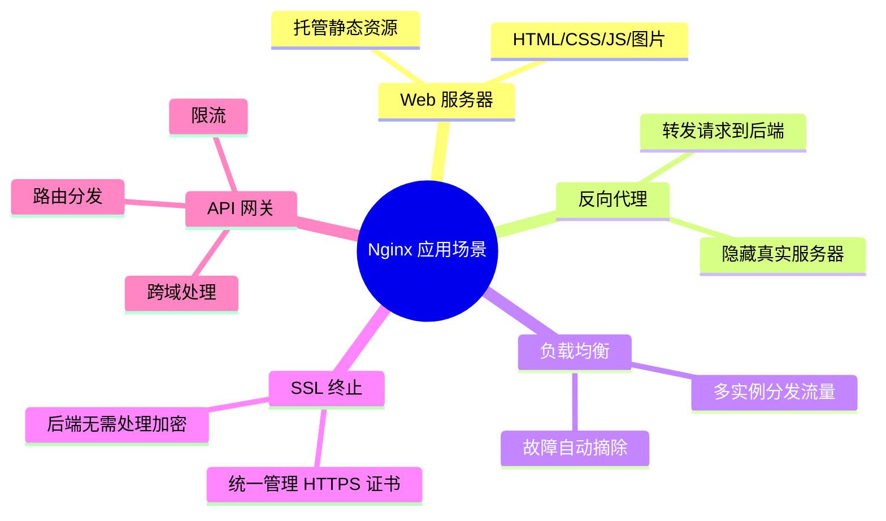
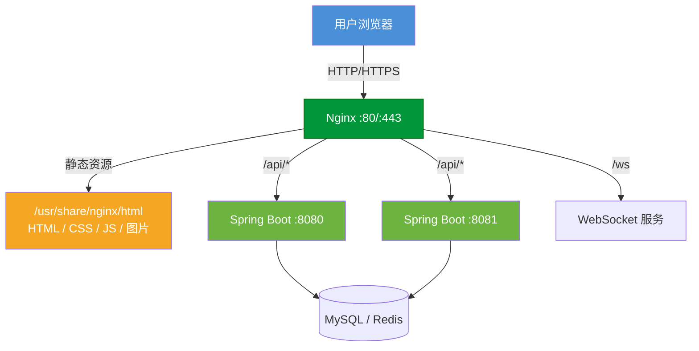
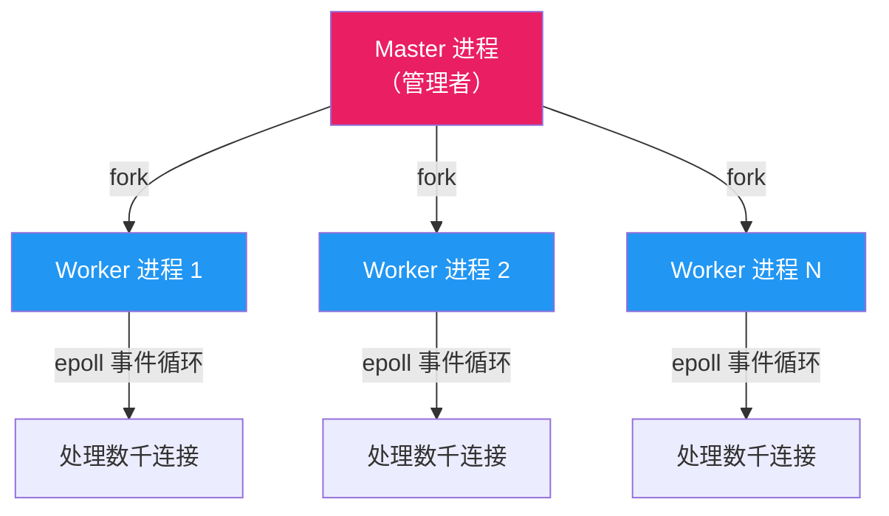
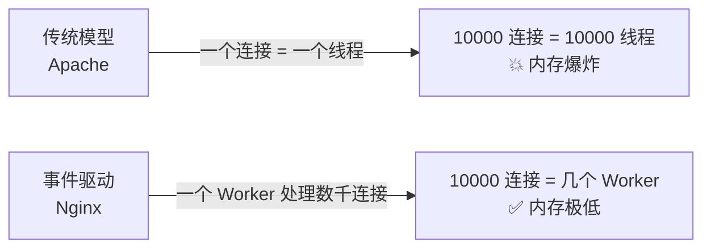
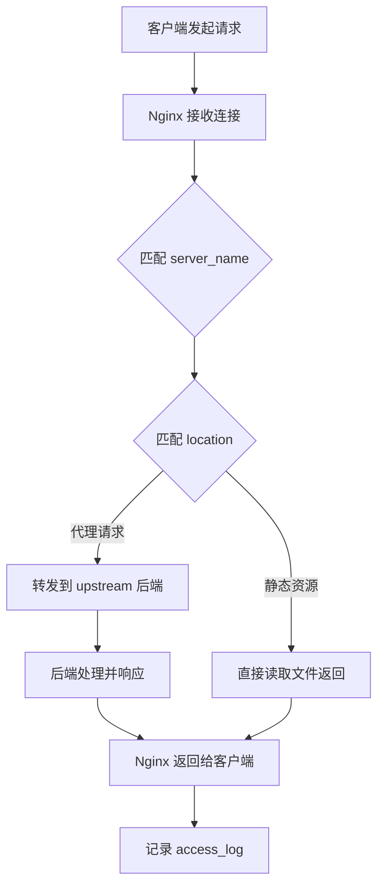

# Nginx 是什么

## 一句话介绍

**Nginx**（发音：engine-x）是一款高性能的 HTTP 服务器、反向代理服务器和通用 TCP/UDP 代理服务器，由俄罗斯人 Igor Sysoev 于 2004 年发布。

> 目前全球超过 30% 的网站使用 Nginx，包括淘宝、京东、GitHub、Netflix 等。

---

## Nginx 能做什么？

---

## Nginx vs Apache vs Tomcat

开发中经常分不清这三者的关系，看这张对比：

| 对比项 | Nginx | Apache | Tomcat |
|--------|-------|--------|--------|
| 定位 | Web 服务器 + 反向代理 | Web 服务器 | Java 应用服务器 |
| 并发模型 | 事件驱动（异步非阻塞） | 进程/线程（同步阻塞） | 线程池 |
| 并发能力 | 轻松支撑数万并发 | 数千并发 | 数百并发 |
| 静态资源 | ⭐ 极快 | 快 | 慢（不擅长） |
| 动态请求 | 需要代理给后端 | 通过模块处理 | 直接运行 Java |
| 内存占用 | 极低（几 MB） | 较高 | 高（JVM） |
| 典型用途 | 前置代理、静态托管 | 传统 PHP 站点 | 运行 Spring Boot |

**一句话总结**：

> Nginx 擅长接客（处理连接），Tomcat 擅长干活（执行 Java）。生产环境中通常 **Nginx + Tomcat/Spring Boot** 搭配使用。

---

## 典型架构：Nginx 在哪里？

**在这个架构中 Nginx 承担的角色**：
- 用户所有请求的**统一入口**
- 静态资源**直接返回**，不经过后端
- API 请求**代理转发**到 Spring Boot
- 多个后端实例之间做**负载均衡**
- 统一处理 **HTTPS 证书**

---

## Nginx 架构模型

Nginx 为什么能支撑高并发？核心在于 **master-worker 多进程 + 事件驱动** 模型。

### 工作流程

| 角色 | 职责 |
|------|------|
| **Master 进程** | 读取配置、管理 Worker、处理信号（reload/stop） |
| **Worker 进程** | 实际处理请求，每个 Worker 独立运行事件循环 |

### 为什么高性能？

- **非阻塞**：Worker 不会等待后端响应，而是注册回调后去处理其他连接
- **多路复用**：使用 epoll（Linux）同时监听数千个 socket
- **少线程切换**：Worker 数量通常 = CPU 核数，几乎没有上下文切换开销

---

## 请求处理流程

一个 HTTP 请求到达 Nginx 后经历的完整过程：

---

## 总结

| 核心知识点 | 要记住的 |
|-----------|---------|
| Nginx 是什么 | 高性能 Web 服务器 + 反向代理 |
| 和 Tomcat 的关系 | Nginx 接客，Tomcat 干活，搭配使用 |
| 为什么性能高 | master-worker + 事件驱动 + epoll |
| 核心应用场景 | 反向代理、负载均衡、静态托管、SSL 终止 |

---

> 下一篇：[安装与部署](02-install-nginx.md) —— 在 Linux、Windows、Docker 三种环境中安装 Nginx。
