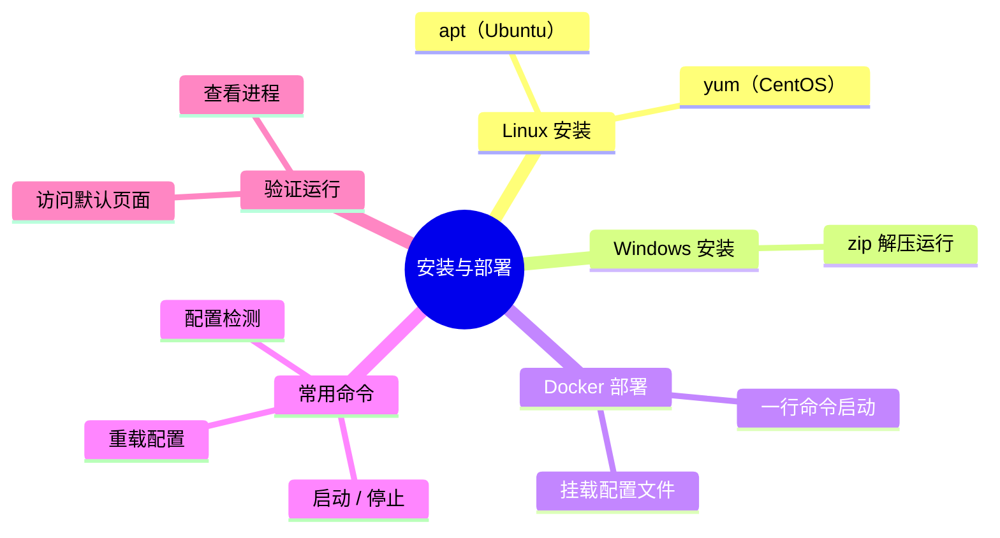
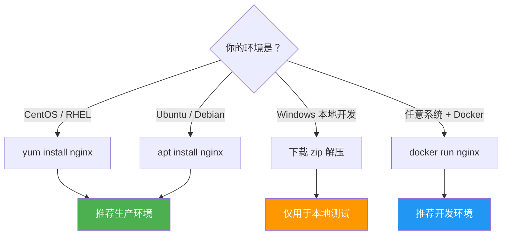
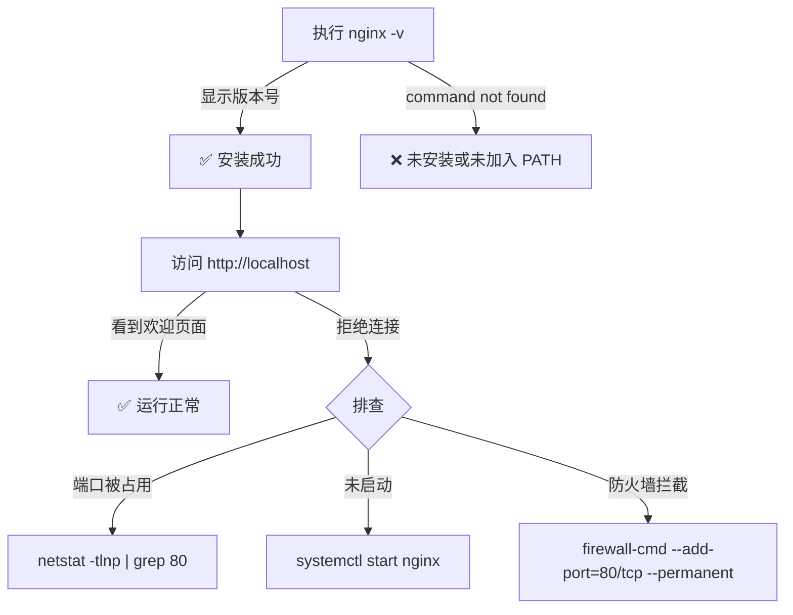

# 安装与部署

## 本篇目标



---

## 安装方式选择



---

## Linux 安装

### CentOS / RHEL

```bash
# 1. 添加 Nginx 官方 yum 源
sudo tee /etc/yum.repos.d/nginx.repo << 'EOF'
[nginx-stable]
name=nginx stable repo
baseurl=https://nginx.org/packages/centos/$releasever/$basearch/
gpgcheck=1
enabled=1
gpgkey=https://nginx.org/keys/nginx_signing.key
module_hotfixes=true
EOF

# 2. 安装
sudo yum install -y nginx

# 3. 启动并设置开机自启
sudo systemctl start nginx
sudo systemctl enable nginx

# 4. 验证
nginx -v
curl http://localhost
```

### Ubuntu / Debian

```bash
# 1. 更新包索引
sudo apt update

# 2. 安装
sudo apt install -y nginx

# 3. 启动并设置开机自启
sudo systemctl start nginx
sudo systemctl enable nginx

# 4. 验证
nginx -v
curl http://localhost
```

### 安装后目录结构

```
/etc/nginx/                 ← 配置文件目录
├── nginx.conf              ← 主配置文件
├── conf.d/                 ← 自定义配置（推荐放这里）
│   └── default.conf        ← 默认站点配置
├── mime.types              ← MIME 类型映射
/var/log/nginx/             ← 日志目录
├── access.log              ← 访问日志
├── error.log               ← 错误日志
/usr/share/nginx/html/      ← 默认静态资源目录
├── index.html              ← 欢迎页面
```

---

## Windows 安装

适合本地开发调试，不推荐用于生产。

### 步骤

```bash
# 1. 下载（访问 https://nginx.org/en/download.html 选择 Windows 版本）
# 下载 nginx-x.x.x.zip

# 2. 解压到任意目录（路径不要有中文和空格）
# 例如：D:\nginx

# 3. 进入目录，双击 nginx.exe 或命令行启动
cd D:\nginx
start nginx

# 4. 验证：浏览器访问 http://localhost
```

### Windows 常用命令

```bash
# 启动
start nginx

# 停止
nginx -s stop

# 平滑重载配置
nginx -s reload

# 检测配置文件
nginx -t
```

::: warning 注意事项
- Windows 版 Nginx 性能远低于 Linux，仅用于本地测试
- 路径中不要包含中文或空格
- 修改配置后必须 `nginx -s reload`，不能直接关闭窗口重开
:::

---

## Docker 部署

开发环境推荐使用 Docker，一行命令即可启动，环境干净且可复现。

### 快速启动

```bash
# 拉取官方镜像并运行
docker run -d \
  --name nginx \
  -p 80:80 \
  nginx

# 验证
curl http://localhost
```

### 挂载自定义配置（推荐）

```bash
# 1. 先把默认配置复制出来
docker run --rm nginx cat /etc/nginx/nginx.conf > nginx.conf
docker run --rm nginx cat /etc/nginx/conf.d/default.conf > default.conf

# 2. 启动时挂载配置和静态文件
docker run -d \
  --name nginx \
  -p 80:80 \
  -v $(pwd)/nginx.conf:/etc/nginx/nginx.conf \
  -v $(pwd)/conf.d:/etc/nginx/conf.d \
  -v $(pwd)/html:/usr/share/nginx/html \
  nginx
```

### Docker Compose 方式

```yaml
# docker-compose.yml
version: '3.8'
services:
  nginx:
    image: nginx:latest
    ports:
      - "80:80"
      - "443:443"
    volumes:
      - ./nginx.conf:/etc/nginx/nginx.conf
      - ./conf.d:/etc/nginx/conf.d
      - ./html:/usr/share/nginx/html
      - ./logs:/var/log/nginx
    restart: unless-stopped
```

```bash
# 启动
docker compose up -d

# 重载配置（不重启容器）
docker exec nginx nginx -s reload
```

---

## 常用命令速查

| 命令 | 作用 | 说明 |
|------|------|------|
| `nginx` | 启动 | 首次启动 |
| `nginx -s stop` | 立即停止 | 强制关闭 |
| `nginx -s quit` | 优雅停止 | 等待请求处理完再关闭 |
| `nginx -s reload` | 重载配置 | 不中断服务，平滑生效 |
| `nginx -t` | 检测配置 | 上线前必做 |
| `nginx -T` | 检测并打印配置 | 调试时查看完整配置 |
| `nginx -v` | 查看版本 | 简洁版本号 |
| `nginx -V` | 查看编译信息 | 版本号 + 编译参数 + 模块 |
| `nginx -c /path/to/nginx.conf` | 指定配置启动 | 多配置切换 |

---

## 验证安装成功



### 常见问题

| 问题 | 原因 | 解决 |
|------|------|------|
| 端口 80 被占用 | 其他服务占用（如 Apache、httpd） | `lsof -i:80` 查看并停掉占用进程 |
| 权限不足 | 非 root 用户绑定 80 端口 | 使用 `sudo` 或改为高位端口（如 8080） |
| 配置错误无法启动 | nginx.conf 语法错误 | `nginx -t` 检查具体报错行 |
| Windows 闪退 | 配置有误或端口冲突 | 命令行启动查看报错信息 |

---

## 配置修改流程（日常操作）

每次修改 Nginx 配置后的标准流程：


::: tip 黄金法则
**改配置永远先 `nginx -t`，再 `nginx -s reload`**。直接 reload 不检测的话，配置语法错误会导致 reload 失败（但旧配置仍然生效，不会宕机）。
:::

---

## 总结

| 环境 | 推荐方式 | 一句话 |
|------|---------|--------|
| CentOS 生产 | yum install | 稳定可靠，官方源维护 |
| Ubuntu 生产 | apt install | 同上 |
| 本地开发 | Docker | 环境隔离，一键启停 |
| Windows 临时测试 | zip 解压 | 能用就行，别上生产 |

---

> 下一篇：[静态资源托管](03-static-hosting.md) —— 用 Nginx 托管前端项目，理解 root 与 alias 的区别。
