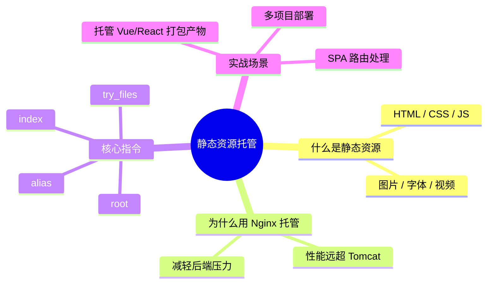
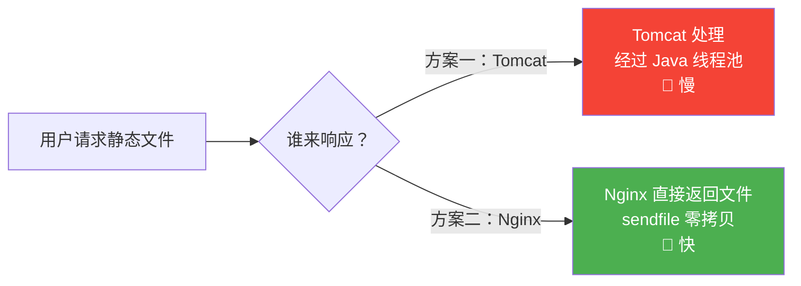
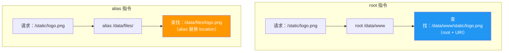
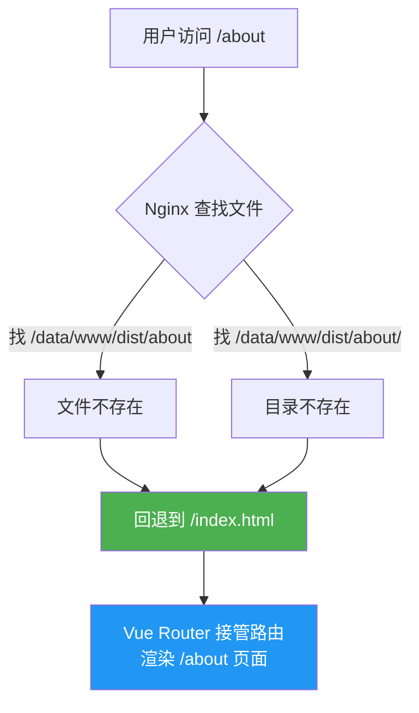

# 静态资源托管

## 本篇目标



---

## 为什么用 Nginx 托管静态资源？



| 对比 | Nginx 托管 | Tomcat/Spring Boot 托管 |
|------|-----------|------------------------|
| 性能 | 数万并发，内存极低 | 数百并发，占用 JVM 内存 |
| 原理 | sendfile 系统调用，零拷贝 | 经过 Java IO 层层处理 |
| 适合 | HTML/CSS/JS/图片/字体 | 动态接口 |
| 配置 | 几行配置即可 | 需要写代码或配置 ResourceHandler |

**结论**：静态资源交给 Nginx，后端只处理 API。

---

## 最简配置：托管一个目录

```nginx
server {
    listen 80;
    server_name www.example.com;

    # 站点根目录
    root /usr/share/nginx/html;

    # 默认首页
    index index.html;
}
```

将前端打包文件（`dist/` 目录）放到 `/usr/share/nginx/html/` 下，访问 `http://www.example.com` 即可看到页面。

---

## 核心指令详解

### root —— 设置根目录

`root` 将 location 路径**拼接**到指定目录后面：

```nginx
location /static/ {
    root /data/www;
}
```

请求 `/static/logo.png` → 实际找文件 `/data/www/static/logo.png`

> **公式**：实际路径 = root + location路径 + 文件名

---

### alias —— 路径替换

`alias` 将 location 路径**替换**为指定目录：

```nginx
location /static/ {
    alias /data/files/;
}
```

请求 `/static/logo.png` → 实际找文件 `/data/files/logo.png`

> **公式**：实际路径 = alias + 文件名（location 被替换掉了）

---

### root 与 alias 对比



::: tip 何时用哪个？
- **root**：location 路径和文件系统路径一致时使用（大部分情况）
- **alias**：location 路径和实际目录名不一样时使用

注意：`alias` 结尾必须加 `/`，否则路径拼接会出错。
:::

---

### index —— 默认首页

访问目录时自动查找的文件名：

```nginx
location / {
    root /usr/share/nginx/html;
    index index.html index.htm;
}
```

访问 `http://example.com/` → 依次查找 `index.html`、`index.htm`。

---

### try_files —— 按顺序尝试

```nginx
location / {
    root /usr/share/nginx/html;
    try_files $uri $uri/ /index.html;
}
```

按顺序尝试：
1. `$uri` —— 直接找请求的文件
2. `$uri/` —— 当作目录找 index
3. `/index.html` —— 都找不到就回退到 index.html

> 这是 **Vue/React SPA 项目的必备配置**，解决刷新 404 问题。

---

## 实战：托管 Vue/React 项目

### 场景描述

前端执行 `npm run build` 后生成 `dist/` 目录：

```
dist/
├── index.html
├── assets/
│   ├── index-abc123.js
│   ├── index-def456.css
│   └── logo.png
└── favicon.ico
```

### 完整配置

```nginx
server {
    listen 80;
    server_name www.example.com;

    root /data/www/dist;
    index index.html;

    # SPA 路由回退（解决刷新 404）
    location / {
        try_files $uri $uri/ /index.html;
    }

    # 静态资源缓存（带 hash 的文件可以长期缓存）
    location /assets/ {
        expires 30d;
        add_header Cache-Control "public, immutable";
    }

    # 禁止访问隐藏文件
    location ~ /\. {
        deny all;
    }
}
```

### SPA 路由为什么需要 try_files？



> 没有 `try_files`，直接访问或刷新 `/about` 会返回 404，因为服务器上并不存在 `about` 这个文件。

---

## 实战：同一服务器部署多个项目

```nginx
# 项目 A —— 官网
server {
    listen 80;
    server_name www.example.com;
    root /data/www/website/dist;
    index index.html;

    location / {
        try_files $uri $uri/ /index.html;
    }
}

# 项目 B —— 管理后台
server {
    listen 80;
    server_name admin.example.com;
    root /data/www/admin/dist;
    index index.html;

    location / {
        try_files $uri $uri/ /index.html;
    }
}
```

也可以通过**路径区分**（共用域名）：

```nginx
server {
    listen 80;
    server_name www.example.com;

    # 官网 —— 根路径
    location / {
        root /data/www/website/dist;
        try_files $uri $uri/ /index.html;
    }

    # 后台 —— /admin 路径
    location /admin/ {
        alias /data/www/admin/dist/;
        try_files $uri $uri/ /admin/index.html;
    }
}
```

---

## 静态资源优化技巧

| 技巧 | 配置 | 作用 |
|------|------|------|
| 开启 gzip 压缩 | `gzip on;` | JS/CSS 体积减少 60-80% |
| 长期缓存 | `expires 30d;` | 带 hash 的资源无需重复下载 |
| 禁用不需要的日志 | `access_log off;` | 图片请求不记日志，减少 IO |

```nginx
# 推荐添加到 http 块
gzip on;
gzip_types text/css application/javascript application/json image/svg+xml;
gzip_min_length 1024;
```

---

## 总结

| 知识点 | 要记住的 |
|--------|---------|
| root | 实际路径 = root + URI |
| alias | 实际路径 = alias + 文件名（替换 location） |
| index | 访问目录时的默认文件 |
| try_files | SPA 必备，解决刷新 404 |
| 最佳实践 | 静态资源给 Nginx，API 给后端 |

---

> 第一阶段完成！下一阶段：[配置文件结构](../02-config/01-config-structure.md) —— 深入理解 Nginx 配置的层级关系。
