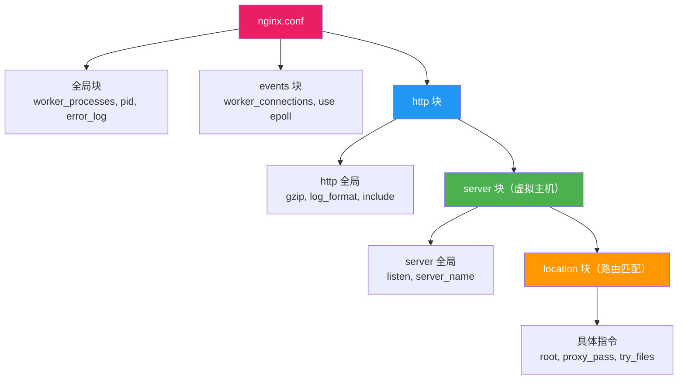

# 配置文件结构

## 本篇目标


---

## 配置文件在哪里？

| 安装方式 | 主配置文件路径 | 站点配置目录 |
|---------|--------------|-------------|
| yum / apt | `/etc/nginx/nginx.conf` | `/etc/nginx/conf.d/` |
| 编译安装 | `/usr/local/nginx/conf/nginx.conf` | 自定义 |
| Docker | `/etc/nginx/nginx.conf` | `/etc/nginx/conf.d/` |
| Windows zip | `nginx安装目录/conf/nginx.conf` | 同目录下 |

查看当前使用的配置文件：

```bash
nginx -t
# 输出：nginx: the configuration file /etc/nginx/nginx.conf syntax is ok
```

---

## 整体层级结构

Nginx 配置是**嵌套的块结构**，从外到内层级关系如下：



---

## 完整配置文件示例（带注释）

```nginx
# ==================== 全局块 ====================
# 工作进程数，通常设置为 CPU 核数
worker_processes auto;

# 错误日志路径和级别
error_log /var/log/nginx/error.log warn;

# 进程 PID 文件
pid /run/nginx.pid;

# ==================== events 块 ====================
events {
    # 每个 worker 进程的最大连接数
    worker_connections 1024;

    # Linux 下使用 epoll 高性能事件模型
    use epoll;
}

# ==================== http 块 ====================
http {
    # --- http 全局配置 ---
    include       /etc/nginx/mime.types;
    default_type  application/octet-stream;

    # 日志格式定义
    log_format main '$remote_addr - $remote_user [$time_local] '
                    '"$request" $status $body_bytes_sent '
                    '"$http_referer" "$http_user_agent"';

    access_log /var/log/nginx/access.log main;

    # 性能优化
    sendfile    on;
    tcp_nopush  on;
    keepalive_timeout 65;
    gzip on;

    # 引入站点配置文件
    include /etc/nginx/conf.d/*.conf;

    # --- server 块（虚拟主机） ---
    server {
        listen 80;
        server_name www.example.com;

        root /usr/share/nginx/html;
        index index.html;

        # --- location 块（路由） ---
        location / {
            try_files $uri $uri/ /index.html;
        }

        location /api/ {
            proxy_pass http://127.0.0.1:8080;
        }
    }
}
```

---

## 各层级详解

### 全局块

影响 Nginx 整体运行的参数，写在最外层：

| 指令 | 作用 | 常用值 |
|------|------|--------|
| `worker_processes` | Worker 进程数 | `auto`（等于 CPU 核数） |
| `error_log` | 错误日志路径 | `/var/log/nginx/error.log warn` |
| `pid` | PID 文件路径 | `/run/nginx.pid` |
| `worker_rlimit_nofile` | Worker 可打开的最大文件数 | `65535` |

---

### events 块

连接处理相关配置：

```nginx
events {
    worker_connections 1024;   # 每个 Worker 最大连接数
    use epoll;                 # 事件驱动模型（Linux 用 epoll）
    multi_accept on;           # 一次接受多个新连接
}
```

::: tip 最大并发数计算
最大并发连接数 = `worker_processes` × `worker_connections`

例如：4 核 × 1024 = 4096 并发连接
:::

---

### http 块

HTTP 服务的全局配置，**所有 server 共享**：

```nginx
http {
    # MIME 类型（让浏览器识别文件类型）
    include       mime.types;
    default_type  application/octet-stream;

    # 文件传输优化
    sendfile on;

    # 压缩
    gzip on;
    gzip_types text/css application/javascript application/json;

    # 包含所有站点配置
    include /etc/nginx/conf.d/*.conf;
}
```

---

### server 块（虚拟主机）

一个 `server` = 一个站点，通过 `listen` + `server_name` 区分：

```nginx
# 站点 A
server {
    listen 80;
    server_name www.example.com;
    root /data/www/site-a;
}

# 站点 B
server {
    listen 80;
    server_name admin.example.com;
    root /data/www/site-b;
}
```


---

### location 块（路由匹配）

一个 `server` 内可以有多个 `location`，按 URL 路径分发：

```nginx
server {
    listen 80;
    server_name www.example.com;

    # 静态资源
    location / {
        root /data/www/dist;
        try_files $uri $uri/ /index.html;
    }

    # API 代理
    location /api/ {
        proxy_pass http://127.0.0.1:8080;
    }

    # 图片缓存
    location /images/ {
        root /data/static;
        expires 30d;
    }
}
```

> location 的详细匹配规则在下一篇 [server 与 location 匹配](02-server-location.md) 中展开。

---

## 指令继承规则

Nginx 配置遵循**从外到内继承，内层可覆盖**的规则：


| 规则 | 说明 |
|------|------|
| 外层定义 | 所有内层自动继承 |
| 内层定义 | 覆盖外层的同名指令 |
| 仅限同类指令 | 不同指令不存在覆盖关系 |

---

## include 拆分配置（推荐做法）

生产环境不要把所有配置写在一个 `nginx.conf` 里，用 `include` 按站点拆分：

```
/etc/nginx/
├── nginx.conf              ← 主配置（全局 + events + http 框架）
└── conf.d/
    ├── www.example.conf    ← 官网站点
    ├── admin.example.conf  ← 管理后台
    └── api.example.conf    ← API 服务
```

**nginx.conf** 中只写框架：

```nginx
http {
    include mime.types;
    sendfile on;
    gzip on;

    # 引入所有站点配置
    include /etc/nginx/conf.d/*.conf;
}
```

**conf.d/www.example.conf** 写具体站点：

```nginx
server {
    listen 80;
    server_name www.example.com;
    root /data/www/dist;

    location / {
        try_files $uri $uri/ /index.html;
    }
}
```

::: tip 好处
- 每个站点独立一个文件，互不影响
- 新增站点只需添加文件，`nginx -s reload` 即可生效
- 禁用站点只需重命名文件后缀（如改为 `.conf.bak`）
:::

---

## 总结

| 层级 | 作用 | 关键指令 |
|------|------|----------|
| 全局块 | 进程级配置 | worker_processes, error_log, pid |
| events | 连接处理 | worker_connections, use epoll |
| http | HTTP 服务全局 | gzip, log_format, include |
| server | 虚拟主机（站点） | listen, server_name |
| location | URL 路由匹配 | root, proxy_pass, try_files |


---

> 下一篇：[server 与 location 匹配](02-server-location.md) —— 掌握 location 修饰符和匹配优先级。
