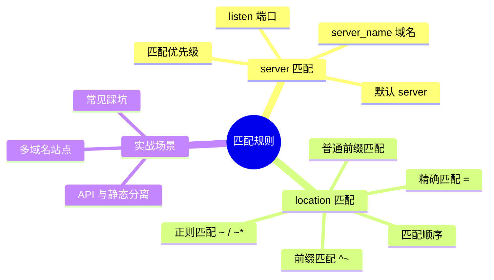
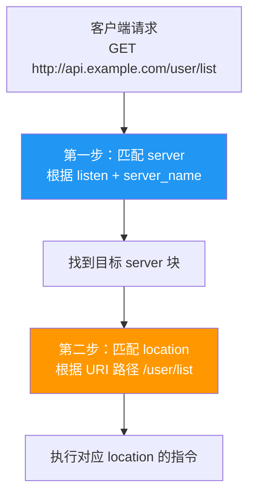
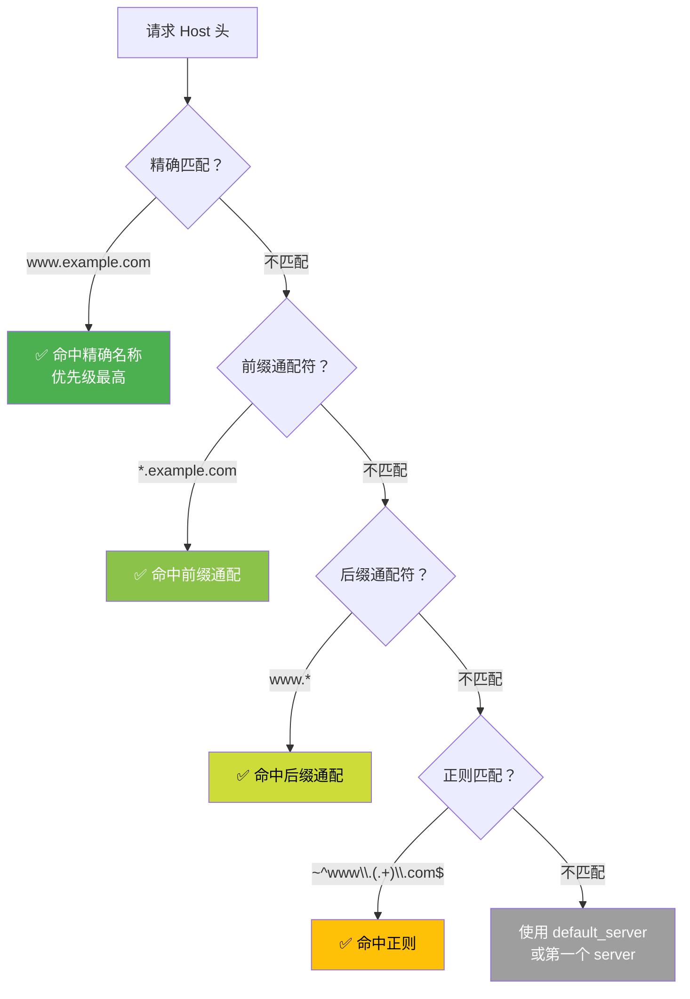
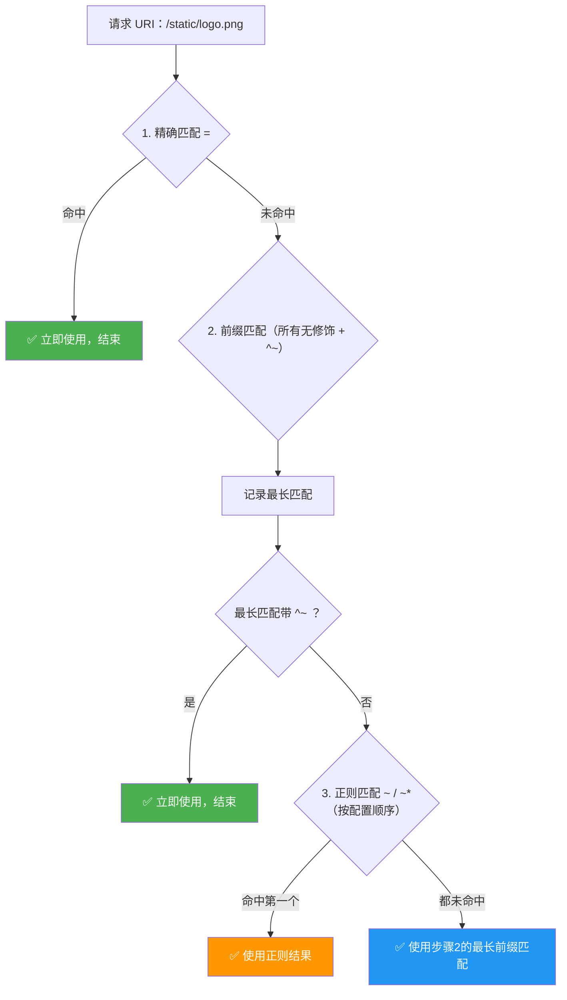

# server 与 location 匹配

## 本篇目标



---

## 请求匹配全流程

一个请求到达 Nginx 后，先匹配 server，再匹配 location：



---

## server 匹配规则

### 匹配依据

Nginx 根据请求的 **端口** + **Host 头** 来决定使用哪个 server 块：

```nginx
# 站点 A
server {
    listen 80;
    server_name www.example.com;
    # ...
}

# 站点 B
server {
    listen 80;
    server_name api.example.com;
    # ...
}

# 站点 C（HTTPS）
server {
    listen 443 ssl;
    server_name www.example.com;
    # ...
}
```

### server_name 匹配优先级

当多个 server 的 listen 端口相同时，按以下优先级匹配 `server_name`：



| 优先级 | 类型 | 示例 | 说明 |
|:------:|------|------|------|
| 1 | 精确名称 | `server_name www.example.com;` | 完全一致 |
| 2 | 前缀通配 | `server_name *.example.com;` | 以通配符开头 |
| 3 | 后缀通配 | `server_name www.*;` | 以通配符结尾 |
| 4 | 正则表达式 | `server_name ~^www\.(.+)\.com$;` | 按配置顺序匹配 |
| 5 | 默认 server | `listen 80 default_server;` | 都不匹配时兜底 |

### default_server

当所有 server_name 都不匹配时，使用标记为 `default_server` 的 server：

```nginx
# 兜底 server —— 返回 444（直接关闭连接）
server {
    listen 80 default_server;
    server_name _;
    return 444;
}
```

::: tip 实践建议
生产环境建议配置一个 `default_server` 拒绝未知域名的请求，避免被恶意解析。
:::

---

## location 匹配规则

### 修饰符一览

| 修饰符 | 含义 | 示例 |
|:------:|------|------|
| `=` | 精确匹配 | `location = /favicon.ico` |
| `^~` | 前缀匹配（命中后不再检查正则） | `location ^~ /static/` |
| `~` | 正则匹配（区分大小写） | `location ~ \.php$` |
| `~*` | 正则匹配（不区分大小写） | `location ~* \.(jpg|png)$` |
| 无 | 普通前缀匹配 | `location /api/` |

---

### 匹配优先级顺序



**总结一句话**：

> **精确 = → 最长前缀（^~ 直接命中） → 正则（按顺序第一个） → 最长前缀兜底**

---

### 匹配实例演示

配置如下：

```nginx
server {
    listen 80;
    server_name www.example.com;

    location = / {                    # ① 精确匹配
        return 200 "exact root";
    }

    location ^~ /static/ {            # ② 前缀匹配（优先于正则）
        return 200 "static prefix";
    }

    location ~ \.(jpg|png|gif)$ {     # ③ 正则匹配
        return 200 "image regex";
    }

    location /api/ {                  # ④ 普通前缀匹配
        return 200 "api prefix";
    }

    location / {                      # ⑤ 通用前缀匹配（兜底）
        return 200 "general";
    }
}
```

各请求的匹配结果：

| 请求 URI | 命中 | 原因 |
|----------|------|------|
| `/` | ① 精确匹配 | `=` 完全一致，立即返回 |
| `/index.html` | ⑤ 通用前缀 | 无精确，无 ^~，无正则命中，最长前缀是 `/` |
| `/static/logo.png` | ② ^~ 前缀 | `^~` 命中后不再检查正则 |
| `/images/photo.jpg` | ③ 正则 | 前缀最长匹配是 `/`（无 ^~），正则 `\.(jpg)$` 命中 |
| `/api/user/list` | ④ 普通前缀 | 前缀最长是 `/api/`（无 ^~），无正则命中，用最长前缀 |
| `/api/avatar.png` | ③ 正则 | 前缀最长是 `/api/`（无 ^~），正则 `\.(png)$` 命中，正则优先 |

::: warning 重要
`/api/avatar.png` 命中的是**正则**而不是 `/api/` 前缀！这是最常见的踩坑点。

如果希望 `/api/` 下的所有请求都走代理，不被正则抢走，应该用 `^~`：
```nginx
location ^~ /api/ {
    proxy_pass http://127.0.0.1:8080;
}
```
:::

---

## 常见实战配置

### 前后端分离：静态 + API 分发

```nginx
server {
    listen 80;
    server_name www.example.com;

    # 前端静态资源
    location / {
        root /data/www/dist;
        try_files $uri $uri/ /index.html;
    }

    # 后端 API（^~ 防止被正则抢走）
    location ^~ /api/ {
        proxy_pass http://127.0.0.1:8080;
        proxy_set_header Host $host;
        proxy_set_header X-Real-IP $remote_addr;
    }
}
```

### 图片等静态文件单独配置缓存

```nginx
server {
    listen 80;
    server_name www.example.com;

    location / {
        root /data/www/dist;
        try_files $uri $uri/ /index.html;
    }

    # 图片/字体等长期缓存
    location ~* \.(jpg|jpeg|png|gif|ico|svg|woff2?|ttf)$ {
        root /data/www/dist;
        expires 30d;
        add_header Cache-Control "public, immutable";
        access_log off;
    }
}
```

### 禁止访问敏感文件

```nginx
# 禁止访问 .开头的隐藏文件（如 .git .env）
location ~ /\. {
    deny all;
    return 404;
}

# 禁止访问 .sql .bak 备份文件
location ~* \.(sql|bak|swp|log)$ {
    deny all;
    return 404;
}
```

---

## 常见踩坑

| 坑 | 原因 | 解决 |
|----|------|------|
| `/api/` 下的 `.json` 文件走了静态缓存正则 | 正则优先于普通前缀 | `/api/` 改为 `^~ /api/` |
| `location /app` 匹配了 `/application` | 前缀匹配不要求完整路径段 | 改为 `location /app/`（加斜杠） |
| 多个正则都能匹配，结果不符合预期 | 正则按**配置文件顺序**第一个命中 | 把更具体的正则放前面 |
| `= /` 只匹配首页，其他页面 404 | 精确匹配只匹配 `/` 一个 URI | SPA 不要用 `=`，用 `try_files` |

---

## 总结

| 知识点 | 核心规则 |
|--------|---------|
| server 匹配 | listen 端口 + server_name（精确 > 前缀通配 > 后缀通配 > 正则 > 默认） |
| location 匹配 | `=` > `^~` > `~ / ~*` > 普通前缀 |
| 正则 vs 前缀 | 正则命中会覆盖普通前缀，但不会覆盖 `^~` |
| 实战建议 | API 代理用 `^~`，静态缓存用 `~*`，兜底用 `/` |

---

> 下一篇：[Rewrite 与重定向](03-rewrite-redirect.md) —— 掌握 URL 重写和 301/302 跳转配置。
