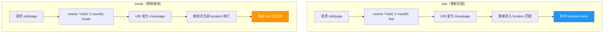
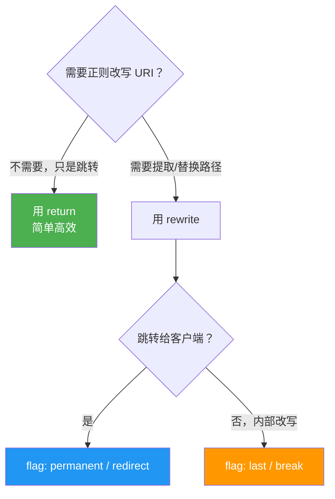

# Rewrite 与重定向

## return 指令 —— 最简单的重定向

`return` 直接返回状态码和跳转地址，简单高效：

```nginx
# HTTP 跳转 HTTPS（301 永久重定向）
server {
    listen 80;
    server_name www.example.com;
    return 301 https://$host$request_uri;
}

# 旧域名跳转新域名
server {
    listen 80;
    server_name old.example.com;
    return 301 https://new.example.com$request_uri;
}

# 直接返回状态码
location /health {
    return 200 "ok";
}

location /gone {
    return 410;
}
```

### 301 vs 302

| 状态码 | 含义 | 浏览器行为 | 适用场景 |
|:------:|------|-----------|---------|
| 301 | 永久重定向 | 缓存跳转地址，下次不再请求原地址 | 域名迁移、HTTP→HTTPS |
| 302 | 临时重定向 | 每次仍请求原地址 | 临时维护、A/B 测试 |

::: warning 注意
301 会被浏览器强缓存，配错后改回来用户也看不到效果（除非清缓存）。不确定的情况下先用 302 测试。
:::

---

## rewrite 指令 —— URL 重写

`rewrite` 使用正则匹配 URI 并改写，语法：

```
rewrite 正则 替换内容 [flag];
```

### flag 参数

| flag | 作用 |
|------|------|
| `last` | 停止当前 location 的 rewrite，用新 URI **重新匹配** location |
| `break` | 停止 rewrite，**在当前 location** 继续执行后续指令 |
| `redirect` | 返回 302 临时重定向 |
| `permanent` | 返回 301 永久重定向 |

### last vs break 流程对比



---

## 常用实战场景

### 去掉 URL 末尾斜杠

```nginx
rewrite ^(.+)/$ $1 permanent;
```

请求 `/about/` → 301 跳转到 `/about`

### 强制添加末尾斜杠

```nginx
# 目录类 URL 强制加斜杠
if (-d $request_filename) {
    rewrite [^/]$ $uri/ permanent;
}
```

### 旧路径迁移到新路径

```nginx
location /blog {
    rewrite ^/blog/(.*)$ /articles/$1 permanent;
}
```

请求 `/blog/hello-world` → 301 跳转到 `/articles/hello-world`

### 隐藏真实文件路径

```nginx
# /user/123 → 实际访问 /index.php?module=user&id=123
rewrite ^/user/(\d+)$ /index.php?module=user&id=$1 last;
```

### 移动端跳转

```nginx
server {
    listen 80;
    server_name www.example.com;

    if ($http_user_agent ~* "(mobile|android|iphone)") {
        rewrite ^(.*)$ https://m.example.com$1 redirect;
    }
}
```

---

## 常用内置变量

rewrite 和 return 中经常用到这些变量：

| 变量 | 含义 | 示例值 |
|------|------|--------|
| `$host` | 请求的域名 | `www.example.com` |
| `$request_uri` | 完整 URI（含参数） | `/api/user?id=1` |
| `$uri` | 当前 URI（不含参数，rewrite 后会变） | `/api/user` |
| `$args` | 查询参数 | `id=1&name=test` |
| `$scheme` | 协议 | `http` 或 `https` |
| `$remote_addr` | 客户端 IP | `192.168.1.100` |
| `$http_user_agent` | 浏览器 UA | `Mozilla/5.0 ...` |
| `$http_referer` | 来源页面 | `https://google.com/` |

---

## return vs rewrite 怎么选？



| 场景 | 推荐 | 原因 |
|------|------|------|
| HTTP → HTTPS | `return 301` | 无需正则，return 性能更好 |
| 旧域名 → 新域名 | `return 301` | 同上 |
| `/blog/123` → `/article/123` | `rewrite ... permanent` | 需要正则提取路径参数 |
| URL 美化（隐藏 .php） | `rewrite ... last` | 内部改写，用户无感知 |

---

## 调试技巧

rewrite 规则不生效或跳转错误时的排查方法：

### 1. 开启 rewrite 日志

```nginx
# 在 http 块中添加
error_log /var/log/nginx/error.log notice;
rewrite_log on;
```

重载后查看日志：

```bash
tail -f /var/log/nginx/error.log | grep rewrite
```

输出示例：
```
*1 "^/old/(.*)" matches "/old/page", client: 127.0.0.1
*1 rewritten data: "/new/page", args: ""
```

### 2. 临时返回变量值

```nginx
location /debug {
    return 200 "uri=$uri\nargs=$args\nhost=$host";
}
```

访问 `/debug?foo=bar` 可以看到变量实际值。

---

## 常见踩坑

| 坑 | 原因 | 解决 |
|----|------|------|
| rewrite 循环导致 500 | `last` 改写后又匹配到同一个 location | 改用 `break` 或调整 location |
| 参数丢失 | rewrite 默认会带上原参数，但替换中写了 `?` | 末尾加 `?` 清除原参数：`rewrite ^/old /new? permanent;` |
| 想保留参数却丢了 | 替换路径中写了 `?xxx` | 不要在替换中写 `?`，原参数自动追加 |
| if 中 rewrite 行为异诡 | Nginx 的 if 不是真正的条件块 | 尽量避免 if + rewrite，用 `map` + `return` 替代 |

::: danger if is evil
Nginx 官方文档明确说明 `if` 指令在 location 中使用可能产生不可预期行为。能用 `map` + `return` 解决的就不要用 `if` + `rewrite`。
:::

---

## 总结

| 指令 | 用途 | 推荐场景 |
|------|------|---------|
| `return 301/302 URL` | 直接跳转 | HTTP→HTTPS、域名迁移 |
| `rewrite regex replacement permanent` | 正则跳转 | 路径改写 + 301 |
| `rewrite regex replacement last` | 正则内部改写 | URL 美化、路由映射 |
| `rewrite regex replacement break` | 当前 location 内改写 | 文件路径映射 |

---

> 下一篇：[日志配置](04-log-config.md) —— 自定义日志格式，掌握日志切割方法。
