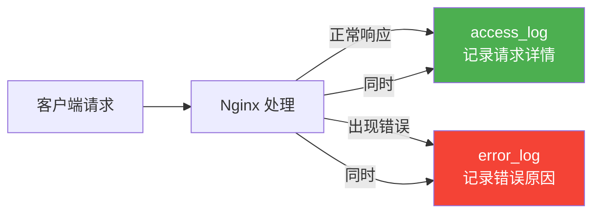

# 日志配置

## Nginx 日志分类

Nginx 有两种日志：

| 日志 | 作用 | 默认路径 |
|------|------|---------|
| `access_log` | 记录每一次请求 | `/var/log/nginx/access.log` |
| `error_log` | 记录错误和调试信息 | `/var/log/nginx/error.log` |



---

## access_log 配置

### 默认日志格式

Nginx 自带的 `combined` 格式：

```
192.168.1.100 - - [31/May/2026:10:30:00 +0800] "GET /api/user HTTP/1.1" 200 1234 "https://www.example.com/" "Mozilla/5.0 ..."
```

各字段含义：

```
客户端IP - 用户名 [时间] "请求方法 URI 协议" 状态码 响应体大小 "来源页" "UA"
```

### 自定义 log_format

在 `http` 块中定义格式，在 `server` 或 `location` 中引用：

```nginx
http {
    # 定义格式（名称为 main）
    log_format main '$remote_addr - $remote_user [$time_local] '
                    '"$request" $status $body_bytes_sent '
                    '"$http_referer" "$http_user_agent"';

    # 使用格式
    access_log /var/log/nginx/access.log main;
}
```

### 推荐：JSON 格式日志

方便 ELK、Loki 等日志系统采集解析：

```nginx
log_format json_log escape=json
    '{'
        '"time": "$time_iso8601",'
        '"remote_addr": "$remote_addr",'
        '"method": "$request_method",'
        '"uri": "$uri",'
        '"args": "$args",'
        '"status": $status,'
        '"body_bytes_sent": $body_bytes_sent,'
        '"request_time": $request_time,'
        '"upstream_response_time": "$upstream_response_time",'
        '"http_referer": "$http_referer",'
        '"http_user_agent": "$http_user_agent"'
    '}';

access_log /var/log/nginx/access.json json_log;
```

输出示例：

```json
{
  "time": "2026-05-31T10:30:00+08:00",
  "remote_addr": "192.168.1.100",
  "method": "GET",
  "uri": "/api/user",
  "args": "id=1",
  "status": 200,
  "body_bytes_sent": 1234,
  "request_time": 0.032,
  "upstream_response_time": "0.028",
  "http_referer": "https://www.example.com/",
  "http_user_agent": "Mozilla/5.0 ..."
}
```

### 常用日志变量

| 变量 | 含义 | 用途 |
|------|------|------|
| `$remote_addr` | 客户端 IP | 定位用户 |
| `$time_local` | 本地时间 | 时间线分析 |
| `$request` | 完整请求行 | 看请求方法+URI |
| `$status` | HTTP 状态码 | 监控异常 |
| `$body_bytes_sent` | 响应体大小 | 带宽统计 |
| `$request_time` | 请求处理耗时（秒） | 慢请求排查 |
| `$upstream_response_time` | 后端响应耗时 | 后端性能分析 |
| `$http_x_forwarded_for` | 代理链中的原始 IP | 多层代理时获取真实 IP |

---

## error_log 配置

### 语法

```nginx
error_log 路径 级别;
```

### 日志级别

从低到高，级别越高记录越少：

| 级别 | 说明 | 适用场景 |
|------|------|---------|
| `debug` | 调试信息（最详细） | 开发调试（需编译时开启） |
| `info` | 一般信息 | 开发环境 |
| `notice` | 正常但值得注意 | 开发环境 |
| `warn` | 警告（推荐生产使用） | 生产环境 |
| `error` | 错误（默认级别） | 生产环境 |
| `crit` | 严重错误 | 只关注致命问题 |
| `alert` | 需要立即处理 | 监控告警 |
| `emerg` | 系统不可用 | 极端情况 |

```nginx
# 生产环境推荐
error_log /var/log/nginx/error.log warn;

# 排查问题时临时改为
error_log /var/log/nginx/error.log info;
```

::: tip
设置某个级别后，该级别及以上的日志都会记录。设置 `warn` 会记录 warn + error + crit + alert + emerg。
:::

---

## 按站点分离日志

每个站点独立日志文件，便于排查：

```nginx
# 站点 A
server {
    listen 80;
    server_name www.example.com;

    access_log /var/log/nginx/www-access.log main;
    error_log  /var/log/nginx/www-error.log warn;
}

# 站点 B
server {
    listen 80;
    server_name api.example.com;

    access_log /var/log/nginx/api-access.log main;
    error_log  /var/log/nginx/api-error.log warn;
}
```

### 关闭特定路径的日志

静态资源、健康检查等不需要记录日志：

```nginx
# 健康检查不记日志
location = /health {
    access_log off;
    return 200 "ok";
}

# 静态资源不记日志（减少 IO）
location ~* \.(js|css|png|jpg|gif|ico|woff2?)$ {
    access_log off;
    expires 30d;
}
```

---

## 日志切割

Nginx 不会自动切割日志，长时间运行日志文件会越来越大。需要手动或定时切割。

### 方案一：logrotate（Linux 推荐）

大多数 Linux 系统自带 logrotate，yum/apt 安装 Nginx 后会自动配置。

查看或修改配置：

```bash
cat /etc/logrotate.d/nginx
```

```
/var/log/nginx/*.log {
    daily              # 每天切割
    missingok          # 日志不存在不报错
    rotate 30          # 保留 30 天
    compress           # gzip 压缩旧日志
    delaycompress      # 延迟一天再压缩
    notifempty         # 空文件不切割
    create 0640 nginx adm   # 新文件权限
    sharedscripts
    postrotate
        [ -f /run/nginx.pid ] && kill -USR1 $(cat /run/nginx.pid)
    endscript
}
```

::: tip 关键点
`kill -USR1` 信号让 Nginx 重新打开日志文件。不发这个信号的话，Nginx 会继续写入已被重命名的旧文件。
:::

### 方案二：Shell 脚本手动切割

```bash
#!/bin/bash
# /opt/scripts/nginx-log-rotate.sh

LOG_DIR="/var/log/nginx"
DATE=$(date +%Y%m%d)

# 重命名当前日志
mv $LOG_DIR/access.log $LOG_DIR/access_$DATE.log
mv $LOG_DIR/error.log $LOG_DIR/error_$DATE.log

# 通知 Nginx 重新打开日志
kill -USR1 $(cat /run/nginx.pid)

# 删除 30 天前的日志
find $LOG_DIR -name "*.log" -mtime +30 -delete
```

添加定时任务：

```bash
# 每天凌晨 0 点执行
crontab -e
0 0 * * * /opt/scripts/nginx-log-rotate.sh
```

---

## 日志分析常用命令

开发和排查时最常用的几个命令：

```bash
# 实时查看访问日志
tail -f /var/log/nginx/access.log

# 查看最近 50 行错误日志
tail -50 /var/log/nginx/error.log

# 统计 HTTP 状态码分布
awk '{print $9}' access.log | sort | uniq -c | sort -rn
#  15234 200
#    892 304
#    156 404
#     23 502

# 查找所有 5xx 错误请求
awk '$9 >= 500' access.log

# 统计访问量前 10 的 URI
awk '{print $7}' access.log | sort | uniq -c | sort -rn | head -10

# 统计访问量前 10 的 IP
awk '{print $1}' access.log | sort | uniq -c | sort -rn | head -10

# 查找慢请求（request_time > 1s，需要日志中包含该字段）
awk '$NF > 1' access.log
```

---

## 实战：完整的日志配置模板

```nginx
http {
    # JSON 格式日志（便于采集）
    log_format json_log escape=json
        '{'
            '"time": "$time_iso8601",'
            '"client": "$remote_addr",'
            '"method": "$request_method",'
            '"uri": "$uri",'
            '"status": $status,'
            '"size": $body_bytes_sent,'
            '"rt": $request_time,'
            '"upstream_rt": "$upstream_response_time",'
            '"referer": "$http_referer",'
            '"ua": "$http_user_agent"'
        '}';

    # 默认访问日志
    access_log /var/log/nginx/access.log json_log;
    error_log  /var/log/nginx/error.log warn;

    server {
        listen 80;
        server_name www.example.com;

        # 站点独立日志
        access_log /var/log/nginx/www-access.log json_log;
        error_log  /var/log/nginx/www-error.log warn;

        # 静态资源不记日志
        location ~* \.(js|css|png|jpg|ico|woff2?)$ {
            access_log off;
        }

        # 健康检查不记日志
        location = /health {
            access_log off;
            return 200 "ok";
        }
    }
}
```

---

## 总结

| 知识点 | 要记住的 |
|--------|---------|
| access_log | 记录每个请求，用于统计和排查 |
| error_log | 记录错误，生产用 warn 级别 |
| log_format | 自定义格式，推荐 JSON |
| 关闭日志 | 静态资源 + 健康检查设 `access_log off` |
| 日志切割 | logrotate 或 cron 脚本 + `kill -USR1` |
| 快速排查 | `tail -f` + `awk` 组合 |

---

> 第二阶段完成！下一阶段：[反向代理基础](../03-reverse-proxy/01-reverse-proxy-basics.md) —— 掌握 proxy_pass 核心用法。
