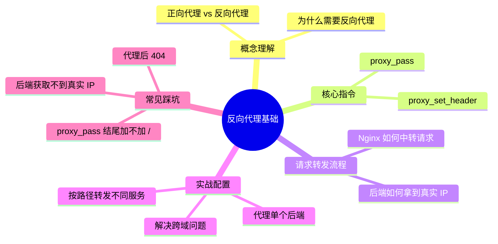
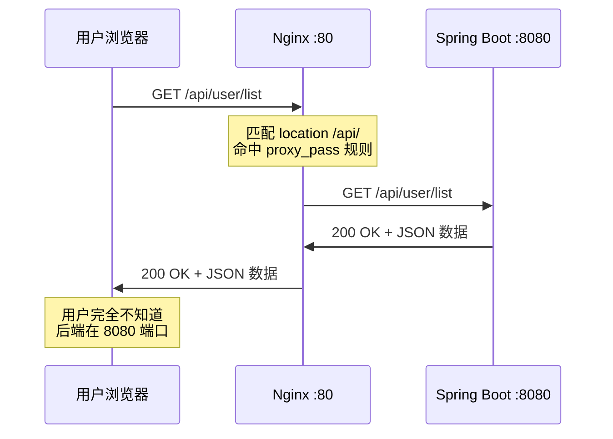
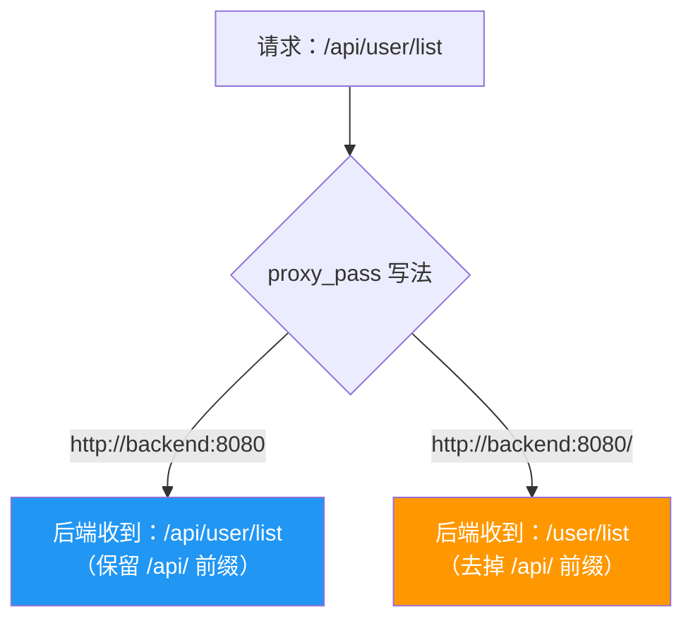
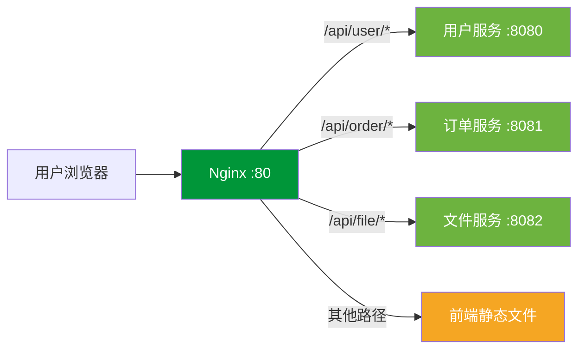
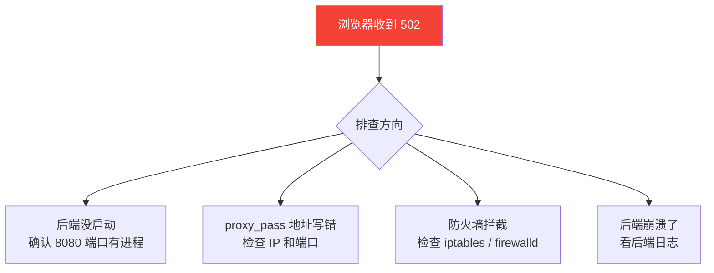

# 反向代理基础

## 本篇目标



---

## 什么是反向代理？

先搞明白一件事：代理分两种方向。

### 正向代理 vs 反向代理

```mermaid
flowchart LR
    subgraph 正向代理（代理客户端）
        A1[你的电脑] --> B1[代理服务器<br/>如 VPN / 梯子]
        B1 --> C1[目标网站]
    end

    subgraph 反向代理（代理服务端）
        A2[用户浏览器] --> B2[Nginx<br/>反向代理]
        B2 --> C2[后端服务<br/>Spring Boot]
    end

    style B1 fill:#FF9800,color:#fff
    style B2 fill:#009639,color:#fff
```

| 对比 | 正向代理 | 反向代理 |
|------|---------|---------|
| 代理谁 | 代理**客户端**（你） | 代理**服务端**（后端） |
| 谁知道真实目标 | 代理知道，目标不知道你是谁 | 用户不知道后端是谁 |
| 典型场景 | 翻墙、公司上网审计 | Nginx 转发请求到 Tomcat |
| 对用户透明？ | 用户主动配置 | 用户完全无感知 |

**通俗理解**：

> 正向代理是你找了个中间人帮你办事，对方不知道真正要办事的是你。
>
> 反向代理是饭店的前台接待，你只跟前台打交道，不需要知道后厨是谁在炒菜。

---

## 为什么要用反向代理？

你可能会问：用户直接访问后端服务不行吗？当然可以，但会有这些麻烦：

| 问题 | 不用 Nginx 直接暴露后端 | 用 Nginx 反向代理 |
|------|------------------------|------------------|
| 端口暴露 | 用户要记 `http://xx.com:8080` | 统一走 80/443 端口 |
| 跨域 | 前端 `localhost:5173` 调后端 `:8080` 跨域 | Nginx 同源转发，根治跨域 |
| 安全 | 后端端口直接暴露在公网 | 只暴露 Nginx，后端藏在内网 |
| 多服务路由 | 每个服务占一个端口，管理混乱 | Nginx 按路径分发到不同服务 |
| 扩展性 | 单实例扛不住就完了 | 加实例 + 负载均衡即可 |

---

## 请求转发流程

用户访问 `http://www.example.com/api/user/list` 时发生了什么：



整个过程对用户来说是透明的，浏览器以为响应是 Nginx 返回的。

---

## 核心指令：proxy_pass

`proxy_pass` 是反向代理的灵魂，一行配置完成请求转发：

```nginx
server {
    listen 80;
    server_name www.example.com;

    # 前端静态资源
    location / {
        root /data/www/dist;
        index index.html;
        try_files $uri $uri/ /index.html;
    }

    # API 请求代理到后端
    location /api/ {
        proxy_pass http://127.0.0.1:8080;
    }
}
```

这段配置干了什么：
- 访问 `/` 开头的请求 → 返回前端静态文件
- 访问 `/api/` 开头的请求 → 转发给本机 8080 端口的 Spring Boot

---

### 重点：proxy_pass 结尾加不加 `/`

这是 Nginx 反向代理**最经典的坑**，必须搞清楚。

```nginx
# 情况一：不加 /（转发完整 URI）
location /api/ {
    proxy_pass http://127.0.0.1:8080;
}
# 请求 /api/user/list → 后端收到 /api/user/list

# 情况二：加 /（去掉匹配的前缀）
location /api/ {
    proxy_pass http://127.0.0.1:8080/;
}
# 请求 /api/user/list → 后端收到 /user/list
```



::: tip 怎么选？
- 后端接口本身就带 `/api` 前缀（如 `@RequestMapping("/api/user")`）→ **不加 /**
- 后端接口没有 `/api` 前缀，前端统一加了 `/api` 来区分 → **加 /**

大部分 Spring Boot 项目接口路径已经包含 `/api`，所以**不加 `/` 是更常见的写法**。
:::

---

## 核心指令：proxy_set_header

请求经过 Nginx 中转后，后端拿到的信息会变。最典型的问题：**后端获取不到用户真实 IP**。

为什么？因为对后端来说，请求是从 Nginx 发过来的，`remoteAddr` 拿到的是 Nginx 的地址（`127.0.0.1`）。

解决办法：让 Nginx 把原始信息塞到请求头里传给后端。

```nginx
location /api/ {
    proxy_pass http://127.0.0.1:8080;

    # 传递真实 IP
    proxy_set_header X-Real-IP $remote_addr;
    proxy_set_header X-Forwarded-For $proxy_add_x_forwarded_for;

    # 传递原始 Host（有些后端框架需要）
    proxy_set_header Host $host;

    # 传递协议（让后端知道原始请求是 HTTP 还是 HTTPS）
    proxy_set_header X-Forwarded-Proto $scheme;
}
```

### 各 header 的含义

| Header | 值 | 用途 |
|--------|------|------|
| `X-Real-IP` | 用户真实 IP | 后端获取客户端 IP |
| `X-Forwarded-For` | 请求经过的所有代理 IP 链 | 多级代理时追踪来源 |
| `Host` | 原始请求的域名 | 后端根据域名做不同逻辑 |
| `X-Forwarded-Proto` | `http` 或 `https` | 后端判断是否需要重定向到 HTTPS |

::: warning 后端怎么取？
Spring Boot 中获取真实 IP：
```java
String ip = request.getHeader("X-Real-IP");
if (ip == null) {
    ip = request.getHeader("X-Forwarded-For");
}
if (ip == null) {
    ip = request.getRemoteAddr();
}
```
:::

---

## 实战：按路径代理多个服务

真实项目中，后端往往不止一个服务。比如：

- 用户服务跑在 8080
- 订单服务跑在 8081
- 文件服务跑在 8082

```nginx
server {
    listen 80;
    server_name www.example.com;

    # 前端
    location / {
        root /data/www/dist;
        try_files $uri $uri/ /index.html;
    }

    # 用户服务
    location /api/user/ {
        proxy_pass http://127.0.0.1:8080;
        proxy_set_header X-Real-IP $remote_addr;
        proxy_set_header X-Forwarded-For $proxy_add_x_forwarded_for;
        proxy_set_header Host $host;
    }

    # 订单服务
    location /api/order/ {
        proxy_pass http://127.0.0.1:8081;
        proxy_set_header X-Real-IP $remote_addr;
        proxy_set_header X-Forwarded-For $proxy_add_x_forwarded_for;
        proxy_set_header Host $host;
    }

    # 文件上传服务（大文件要调大 body 限制）
    location /api/file/ {
        proxy_pass http://127.0.0.1:8082;
        proxy_set_header X-Real-IP $remote_addr;
        proxy_set_header Host $host;
        client_max_body_size 100m;
    }
}
```



---

## 实战：Nginx 解决跨域问题

前后端分离开发时，前端 `localhost:5173`（Vite）请求后端 `localhost:8080`，浏览器直接报跨域。

### 方案一：开发环境用 Vite/Webpack 代理（临时）

这个不是 Nginx 的事，但提一下——开发时在 `vite.config.js` 里配 proxy 就行，上线后用不了。

### 方案二：Nginx 同源代理（生产推荐）

把前端和后端都放在 Nginx 的同一个域名下，不存在跨域：

```nginx
server {
    listen 80;
    server_name www.example.com;

    # 前端 → 同域
    location / {
        root /data/www/dist;
        try_files $uri $uri/ /index.html;
    }

    # 后端 → 同域的 /api 路径
    location /api/ {
        proxy_pass http://127.0.0.1:8080;
        proxy_set_header Host $host;
        proxy_set_header X-Real-IP $remote_addr;
    }
}
```

浏览器看到的：所有请求都是 `www.example.com`，前端页面和 API 同源，跨域问题自然消失。

### 方案三：Nginx 添加 CORS 头（不改后端代码）

有时候前后端确实不在同一个域名下（比如前端 `web.example.com`，后端 `api.example.com`），可以让 Nginx 帮后端加上跨域响应头：

```nginx
location /api/ {
    proxy_pass http://127.0.0.1:8080;

    # 允许跨域
    add_header Access-Control-Allow-Origin $http_origin always;
    add_header Access-Control-Allow-Methods "GET, POST, PUT, DELETE, OPTIONS" always;
    add_header Access-Control-Allow-Headers "Content-Type, Authorization" always;
    add_header Access-Control-Allow-Credentials true always;

    # 预检请求直接返回
    if ($request_method = OPTIONS) {
        return 204;
    }
}
```

::: warning 注意
不要写 `Access-Control-Allow-Origin: *` 的同时又写 `Allow-Credentials: true`，浏览器会拒绝。用 `$http_origin` 动态匹配来源即可。
:::

---

## 代理超时配置

后端处理慢的接口（如导出报表、大文件上传），默认 60 秒超时会导致 Nginx 返回 504。

```nginx
location /api/ {
    proxy_pass http://127.0.0.1:8080;

    # 连接超时（Nginx 连接后端的等待时间）
    proxy_connect_timeout 10s;

    # 读取超时（后端处理请求的最大等待时间）
    proxy_read_timeout 120s;

    # 发送超时（Nginx 向后端发送数据的超时）
    proxy_send_timeout 30s;
}
```

| 参数 | 默认值 | 说明 | 调大场景 |
|------|--------|------|----------|
| `proxy_connect_timeout` | 60s | 与后端建立连接的超时 | 后端启动慢、网络抖动 |
| `proxy_read_timeout` | 60s | 等待后端响应的超时 | 导出报表、复杂查询 |
| `proxy_send_timeout` | 60s | 向后端发请求体的超时 | 大文件上传 |

---

## 常见问题排查

### 代理后返回 502 Bad Gateway



快速排查命令：

```bash
# 确认后端端口在监听
ss -tlnp | grep 8080

# 从 Nginx 机器手动请求后端
curl http://127.0.0.1:8080/api/health

# 看 Nginx 错误日志
tail -f /var/log/nginx/error.log
```

### 代理后返回 404

常见原因：

1. **proxy_pass 多了或少了 `/`** —— 回头看上面那个坑
2. **后端的 context-path 没对上** —— 比如 Spring Boot 配了 `server.servlet.context-path=/app`，那后端实际路径是 `/app/api/user`
3. **location 匹配不到** —— 用 `nginx -T` 打印完整配置确认

### 代理后后端拿不到真实 IP

忘了加 `proxy_set_header`，回到上面「proxy_set_header」章节补上。

---

## 完整模板：前后端分离项目

最后给一个可以直接抄的生产配置模板：

```nginx
server {
    listen 80;
    server_name www.example.com;

    # ===== 前端静态资源 =====
    location / {
        root /data/www/dist;
        index index.html;
        try_files $uri $uri/ /index.html;
    }

    # 静态资源缓存
    location /assets/ {
        root /data/www/dist;
        expires 7d;
        add_header Cache-Control "public";
    }

    # ===== 后端 API 代理 =====
    location /api/ {
        proxy_pass http://127.0.0.1:8080;

        proxy_set_header Host $host;
        proxy_set_header X-Real-IP $remote_addr;
        proxy_set_header X-Forwarded-For $proxy_add_x_forwarded_for;
        proxy_set_header X-Forwarded-Proto $scheme;

        proxy_connect_timeout 10s;
        proxy_read_timeout 60s;
        proxy_send_timeout 30s;

        client_max_body_size 20m;
    }

    # ===== 错误页 =====
    error_page 502 503 504 /50x.html;
    location = /50x.html {
        root /usr/share/nginx/html;
    }
}
```

---

## 本篇小结

| 知识点 | 掌握程度 |
|--------|---------|
| 正向代理和反向代理的区别 | 能用自己的话解释 |
| `proxy_pass` 基本用法 | 能写出转发配置 |
| 结尾加 `/` 和不加的区别 | 不再踩坑 |
| `proxy_set_header` 传递真实信息 | 每次代理必配 |
| Nginx 解决跨域的两种方式 | 按场景选择 |
| 502/404 问题排查 | 知道从哪下手 |

下一篇我们会做更贴近实际的代理场景：代理多个后端服务、配合 Docker 使用等。
