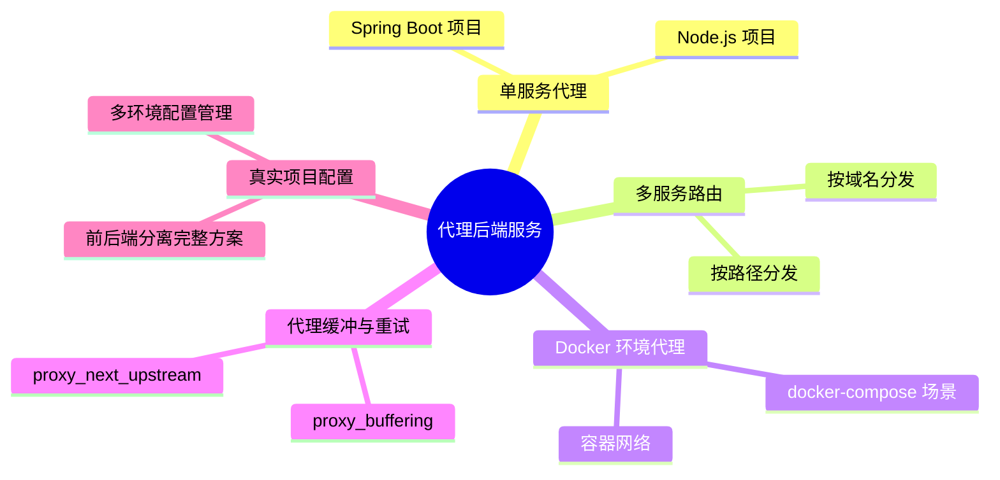
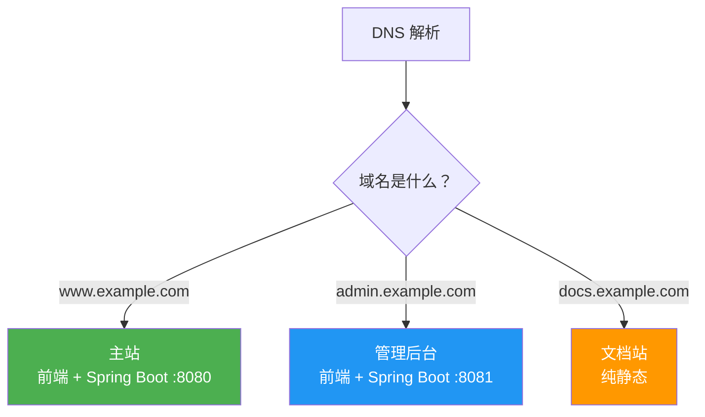
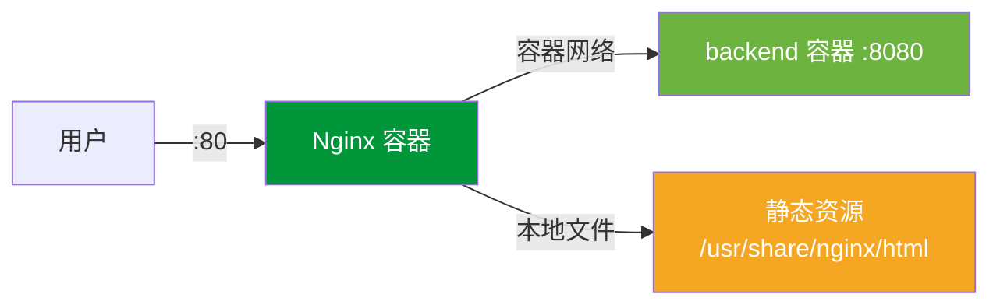
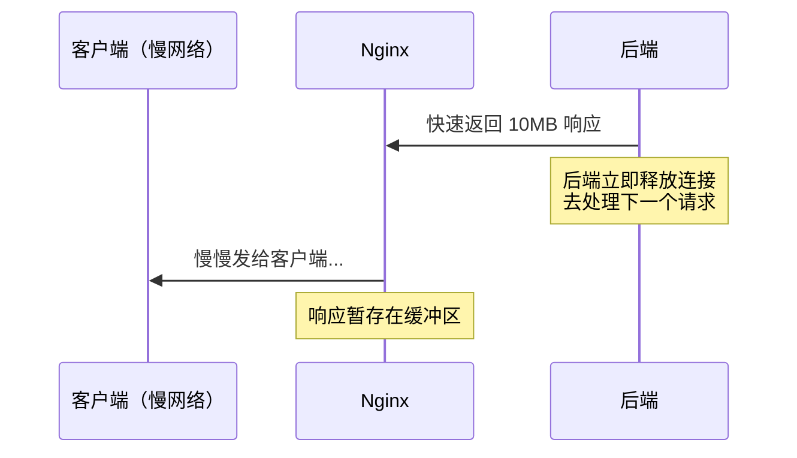
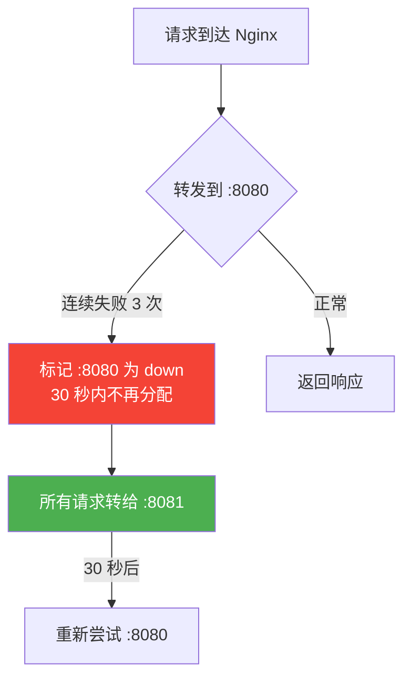

# 代理后端服务

## 本篇目标



---

## 代理 Spring Boot 服务

这是最常见的场景：Spring Boot 跑在 8080 端口，Nginx 把 `/api` 开头的请求转过去。

### 最小配置

```nginx
server {
    listen 80;
    server_name www.example.com;

    location /api/ {
        proxy_pass http://127.0.0.1:8080;
        proxy_set_header Host $host;
        proxy_set_header X-Real-IP $remote_addr;
        proxy_set_header X-Forwarded-For $proxy_add_x_forwarded_for;
        proxy_set_header X-Forwarded-Proto $scheme;
    }
}
```

### Spring Boot 那边要注意什么？

如果你的 `application.yml` 里配了 context-path：

```yaml
server:
  port: 8080
  servlet:
    context-path: /app
```

那实际接口路径是 `/app/api/user/list`，Nginx 这边要对应改：

```nginx
# 方式一：location 也加 /app 前缀
location /app/ {
    proxy_pass http://127.0.0.1:8080;
}

# 方式二：前端只用 /api，Nginx 帮忙拼上 /app
location /api/ {
    proxy_pass http://127.0.0.1:8080/app/api/;
}
```

::: tip 建议
生产环境尽量**不要配 context-path**，直接让接口路径以 `/api` 开头，Nginx 配置最简单，也不容易出错。
:::

---

## 代理 Node.js 服务

Node.js 应用（Express / Koa / NestJS）通常跑在 3000 或 3001 端口，配置方式一样：

```nginx
server {
    listen 80;
    server_name admin.example.com;

    location / {
        proxy_pass http://127.0.0.1:3000;
        proxy_set_header Host $host;
        proxy_set_header X-Real-IP $remote_addr;
        proxy_set_header X-Forwarded-For $proxy_add_x_forwarded_for;

        # Node.js 长连接优化
        proxy_http_version 1.1;
        proxy_set_header Connection "";
    }
}
```

::: warning 为什么要设置 proxy_http_version 1.1？
Nginx 代理默认用 HTTP/1.0 连接后端，每次请求都会重新建立 TCP 连接。设置为 1.1 后可以复用连接（keepalive），减少连接开销，Node.js 这种单线程服务收益明显。
:::

---

## 按路径代理多个后端

一个域名下挂多个微服务，按 URL 路径做分发：

```nginx
server {
    listen 80;
    server_name www.example.com;

    # 前端静态资源
    location / {
        root /data/www/dist;
        try_files $uri $uri/ /index.html;
    }

    # 用户中心 → Java 服务
    location /api/user/ {
        proxy_pass http://127.0.0.1:8080;
        include /etc/nginx/proxy_params;
    }

    # 商品服务 → Java 服务
    location /api/product/ {
        proxy_pass http://127.0.0.1:8081;
        include /etc/nginx/proxy_params;
    }

    # 管理后台 API → Node.js 服务
    location /admin-api/ {
        proxy_pass http://127.0.0.1:3000;
        include /etc/nginx/proxy_params;
    }
}
```

每个 location 都要写一堆 `proxy_set_header` 太重复了，抽成公共文件：

```nginx
# /etc/nginx/proxy_params（公共代理参数）
proxy_set_header Host $host;
proxy_set_header X-Real-IP $remote_addr;
proxy_set_header X-Forwarded-For $proxy_add_x_forwarded_for;
proxy_set_header X-Forwarded-Proto $scheme;
proxy_connect_timeout 10s;
proxy_read_timeout 60s;
proxy_send_timeout 30s;
```

然后在 location 里一行 `include` 搞定，配置清爽很多。

---

## 按域名代理不同服务

另一种思路：不同服务用不同子域名，每个域名对应一个 server 块。

```nginx
# 主站 → 前端 + 后端 API
server {
    listen 80;
    server_name www.example.com;

    location / {
        root /data/www/dist;
        try_files $uri $uri/ /index.html;
    }

    location /api/ {
        proxy_pass http://127.0.0.1:8080;
        include /etc/nginx/proxy_params;
    }
}

# 管理后台 → 独立前端 + 独立后端
server {
    listen 80;
    server_name admin.example.com;

    location / {
        root /data/admin/dist;
        try_files $uri $uri/ /index.html;
    }

    location /api/ {
        proxy_pass http://127.0.0.1:8081;
        include /etc/nginx/proxy_params;
    }
}

# 文档站 → VuePress / VitePress
server {
    listen 80;
    server_name docs.example.com;

    location / {
        root /data/docs/dist;
        index index.html;
    }
}
```



::: tip 路径分发 vs 域名分发怎么选？
- **路径分发**（`/api/user`、`/api/order`）：适合同一产品的多个微服务，前端只需要配一个域名
- **域名分发**（`www`、`admin`、`docs`）：适合独立的子系统，各自独立部署互不影响

两种可以组合使用，不冲突。
:::

---

## Docker 环境下的代理

现在大多数项目都用 Docker 部署，Nginx 代理容器内的服务有几种玩法。

### 场景一：Nginx 在宿主机，后端在容器里

后端容器映射了端口到宿主机：

```bash
docker run -d -p 8080:8080 my-spring-boot-app
```

Nginx 配置和非 Docker 环境一样，代理 `127.0.0.1:8080` 即可。

### 场景二：Nginx 和后端都在 Docker 里（推荐）

用 `docker-compose` 统一管理，通过容器名直接通信：

```yaml
# docker-compose.yml
version: '3.8'
services:
  nginx:
    image: nginx:latest
    ports:
      - "80:80"
    volumes:
      - ./nginx.conf:/etc/nginx/conf.d/default.conf
      - ./dist:/usr/share/nginx/html
    depends_on:
      - backend

  backend:
    image: my-spring-boot-app:latest
    expose:
      - "8080"
    # 不需要 ports 映射，Nginx 通过容器网络直连
```

对应的 Nginx 配置：

```nginx
server {
    listen 80;

    location / {
        root /usr/share/nginx/html;
        try_files $uri $uri/ /index.html;
    }

    location /api/ {
        # 直接用服务名 "backend" 做域名，Docker 内部 DNS 自动解析
        proxy_pass http://backend:8080;
        proxy_set_header Host $host;
        proxy_set_header X-Real-IP $remote_addr;
        proxy_set_header X-Forwarded-For $proxy_add_x_forwarded_for;
    }
}
```



::: warning Docker 代理常见问题
1. **用了 `localhost` 或 `127.0.0.1`** → 在容器里这指向的是 Nginx 容器自己，不是后端容器。要用**服务名**（如 `backend`）
2. **DNS 解析失败** → 确保两个容器在同一个 docker network 里，`docker-compose` 默认会创建同一网络
3. **容器启动顺序** → 用 `depends_on` 保证后端先启动，或者在 Nginx 配置里加 `resolver`
:::

---

## 代理缓冲机制

Nginx 代理后端时，默认会先把后端的响应**完整读到内存/磁盘缓冲区**，然后再发给客户端。这样做的好处是：后端能尽快释放连接，不用等客户端慢慢下载。



### 缓冲相关配置

```nginx
location /api/ {
    proxy_pass http://127.0.0.1:8080;

    # 开启缓冲（默认就是 on）
    proxy_buffering on;

    # 缓冲区大小（一般不用改）
    proxy_buffer_size 4k;        # 响应头缓冲
    proxy_buffers 8 4k;          # 响应体缓冲（8个 4k 块）
    proxy_busy_buffers_size 8k;  # 忙时可用缓冲大小
}
```

### 什么时候关掉缓冲？

需要**实时推送**的场景，比如 SSE（Server-Sent Events）：

```nginx
location /api/stream/ {
    proxy_pass http://127.0.0.1:8080;
    proxy_buffering off;  # 关闭缓冲，数据来一点发一点
    proxy_cache off;
}
```

---

## 代理重试：proxy_next_upstream

后端偶尔会抽风（比如某个实例正在重启），Nginx 可以自动把请求转给下一个实例重试：

```nginx
upstream backend {
    server 127.0.0.1:8080;
    server 127.0.0.1:8081;
}

server {
    listen 80;

    location /api/ {
        proxy_pass http://backend;

        # 这些情况自动换下一个后端重试
        proxy_next_upstream error timeout http_502 http_503;

        # 最多重试几次（0 = 不限制）
        proxy_next_upstream_tries 2;

        # 重试的总超时时间
        proxy_next_upstream_timeout 10s;
    }
}
```

| 参数值 | 触发重试的条件 |
|--------|--------------|
| `error` | 与后端建立连接失败 |
| `timeout` | 连接/读取超时 |
| `http_502` | 后端返回 502 |
| `http_503` | 后端返回 503（通常是服务重启中） |
| `http_504` | 后端返回 504 |
| `non_idempotent` | 允许对 POST 等非幂等请求也重试（慎用） |

::: warning 注意
POST 请求默认**不会重试**（因为可能导致重复提交）。只有 GET、HEAD 等幂等请求会自动重试。如果你的 POST 接口做了幂等处理，可以加 `non_idempotent`。
:::

---

## 健康检查（被动模式）

Nginx 开源版不支持主动健康检查，但可以通过被动方式标记不健康的后端：

```nginx
upstream backend {
    server 127.0.0.1:8080 max_fails=3 fail_timeout=30s;
    server 127.0.0.1:8081 max_fails=3 fail_timeout=30s;
}
```

| 参数 | 含义 |
|------|------|
| `max_fails=3` | 连续失败 3 次后标记为不可用 |
| `fail_timeout=30s` | 标记不可用后 30 秒内不再转发请求，30 秒后重新尝试 |



---

## 生产环境完整配置示例

综合前面所有知识点，给一个真实项目的配置：

```nginx
# /etc/nginx/conf.d/example.conf

upstream api_backend {
    server 127.0.0.1:8080 max_fails=3 fail_timeout=30s;
    keepalive 32;  # 保持与后端的长连接池
}

server {
    listen 80;
    server_name www.example.com;

    # 日志
    access_log /var/log/nginx/example.access.log main;
    error_log /var/log/nginx/example.error.log warn;

    # ===== 前端 =====
    location / {
        root /data/www/dist;
        index index.html;
        try_files $uri $uri/ /index.html;

        # 入口文件不缓存（确保更新后能拿到新版本）
        location = /index.html {
            add_header Cache-Control "no-cache";
        }
    }

    # 带 hash 的静态资源长期缓存
    location /assets/ {
        root /data/www/dist;
        expires 30d;
        add_header Cache-Control "public, immutable";
    }

    # ===== 后端 API =====
    location /api/ {
        proxy_pass http://api_backend;

        # 使用 HTTP/1.1 + keepalive
        proxy_http_version 1.1;
        proxy_set_header Connection "";

        # 传递客户端信息
        proxy_set_header Host $host;
        proxy_set_header X-Real-IP $remote_addr;
        proxy_set_header X-Forwarded-For $proxy_add_x_forwarded_for;
        proxy_set_header X-Forwarded-Proto $scheme;

        # 超时
        proxy_connect_timeout 5s;
        proxy_read_timeout 60s;
        proxy_send_timeout 30s;

        # 请求体大小限制
        client_max_body_size 20m;

        # 失败重试
        proxy_next_upstream error timeout http_502;
        proxy_next_upstream_tries 2;
    }

    # ===== 文件上传（单独放宽限制） =====
    location /api/upload/ {
        proxy_pass http://api_backend;
        proxy_set_header Host $host;
        proxy_set_header X-Real-IP $remote_addr;

        client_max_body_size 200m;
        proxy_read_timeout 300s;
    }

    # ===== 错误页 =====
    error_page 502 503 504 /50x.html;
    location = /50x.html {
        root /usr/share/nginx/html;
    }
}
```

---

## 本篇小结

| 知识点 | 要点 |
|--------|------|
| 代理 Spring Boot | 注意 context-path 对路径的影响 |
| 代理 Node.js | 加 `proxy_http_version 1.1` 启用长连接 |
| 按路径分发 | 公共参数用 `include` 抽离 |
| 按域名分发 | 一个 server 块对应一个子域名 |
| Docker 环境 | 用服务名代替 IP，不要写 `127.0.0.1` |
| 代理缓冲 | 默认开启，SSE/流式场景关闭 |
| 重试机制 | `proxy_next_upstream` 实现故障自动转移 |
| 被动健康检查 | `max_fails` + `fail_timeout` 标记故障节点 |

下一篇我们来搞 WebSocket 代理——前后端实时通信的场景越来越多，Nginx 配置稍有不同。
