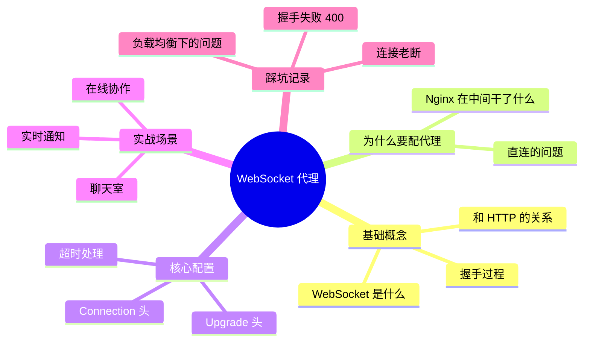
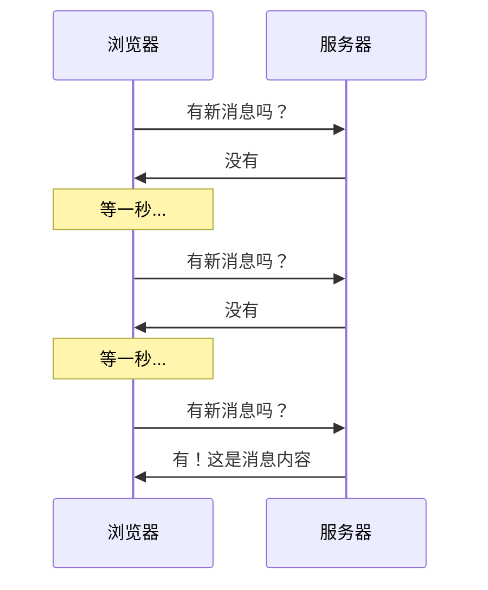
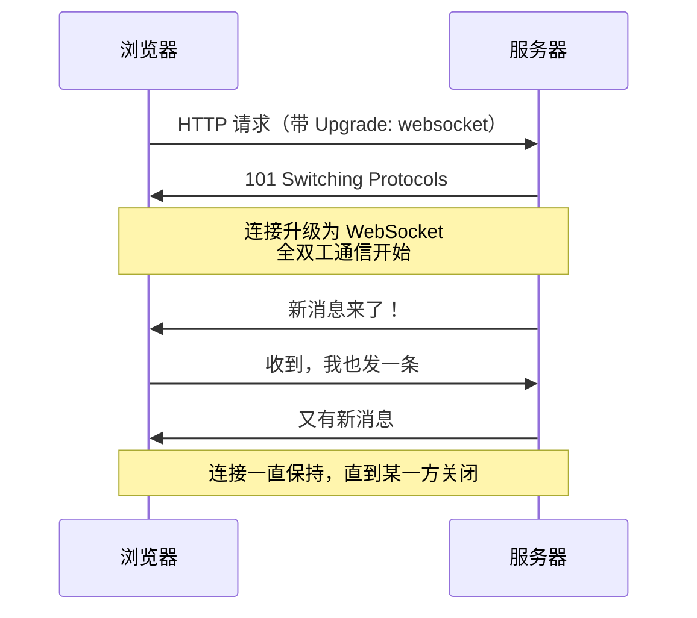
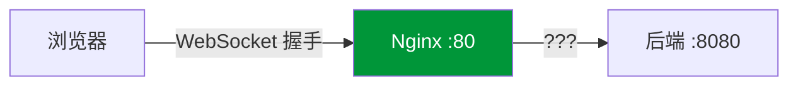
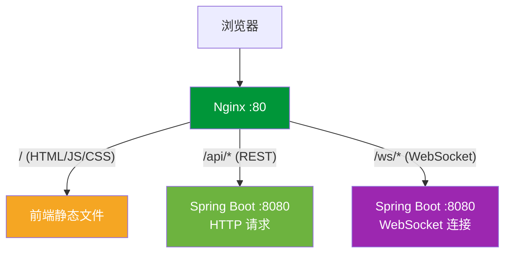
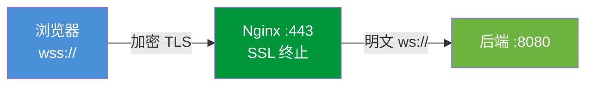

# WebSocket 代理

## 本篇目标



---

## WebSocket 到底是什么？

先回忆一下普通 HTTP 请求的模式：



这就是轮询——浏览器不停地问服务器"有没有新数据"，服务器大部分时间回答"没有"。浪费带宽，也有延迟。

**WebSocket 不一样**：连接建好之后，双方随时可以互发消息，不需要一问一答。



### 一句话理解

> HTTP 像发短信——你发一条我回一条，每次都要重新拨号。
> WebSocket 像打电话——接通之后双方随便说，不挂电话就一直通着。

### 常见使用场景

| 场景 | 为什么用 WebSocket |
|------|------------------|
| 聊天消息 | 对方发消息要实时显示 |
| 消息通知 | 后台有新审批要立刻推送给前端 |
| 在线文档协作 | 多人同时编辑要实时同步 |
| 股票行情 | 价格变化要毫秒级推送 |
| 游戏对战 | 玩家操作要实时同步到所有人 |

---

## WebSocket 连接的握手过程

WebSocket 不是凭空建立的，它的第一步还是走 HTTP，然后"升级"为 WebSocket 协议。

浏览器发出的握手请求长这样：

```http
GET /ws/chat HTTP/1.1
Host: www.example.com
Upgrade: websocket
Connection: Upgrade
Sec-WebSocket-Key: dGhlIHNhbXBsZSBub25jZQ==
Sec-WebSocket-Version: 13
```

服务器同意升级，回复：

```http
HTTP/1.1 101 Switching Protocols
Upgrade: websocket
Connection: Upgrade
Sec-WebSocket-Accept: s3pPLMBiTxaQ9kYGzzhZRbK+xOo=
```

关键的两个头：
- **`Upgrade: websocket`** —— 告诉对方我要升级协议
- **`Connection: Upgrade`** —— 告诉对方这个连接要升级

记住这两个头，等下配 Nginx 要用到。

---

## 问题来了：Nginx 挡在中间怎么办？

没有 Nginx 的时候，浏览器直接和后端建立 WebSocket 连接，没什么问题。

但生产环境中间有 Nginx 代理：



问题在于：Nginx 默认按 HTTP/1.0 代理请求，它看到 `Upgrade` 头**不会自动转发**给后端。后端收不到升级请求，握手就失败了，浏览器端直接报错。

所以我们要**显式告诉 Nginx：把这两个升级头原样转发给后端**。

---

## 核心配置

直接上配置，就这么几行：

```nginx
server {
    listen 80;
    server_name www.example.com;

    # WebSocket 代理
    location /ws/ {
        proxy_pass http://127.0.0.1:8080;

        # 关键！使用 HTTP/1.1（WebSocket 必须 1.1）
        proxy_http_version 1.1;

        # 关键！转发升级头
        proxy_set_header Upgrade $http_upgrade;
        proxy_set_header Connection "upgrade";

        # 透传客户端信息
        proxy_set_header Host $host;
        proxy_set_header X-Real-IP $remote_addr;
        proxy_set_header X-Forwarded-For $proxy_add_x_forwarded_for;
    }
}
```

就这三行是 WebSocket 代理的灵魂：

```nginx
proxy_http_version 1.1;
proxy_set_header Upgrade $http_upgrade;
proxy_set_header Connection "upgrade";
```

缺任何一行，WebSocket 握手都会失败。

### 为什么要设 proxy_http_version 1.1？

HTTP/1.0 不支持 `Upgrade` 机制，也不支持长连接。WebSocket 握手要求 HTTP/1.1，所以必须指定。

### $http_upgrade 是什么？

这是 Nginx 的内置变量，代表客户端请求中 `Upgrade` 头的值。如果客户端发了 `Upgrade: websocket`，那 `$http_upgrade` 的值就是 `websocket`。

---

## 解决连接超时断开

WebSocket 是长连接，但 Nginx 有个默认行为：**60 秒内没有数据传输就断开连接**。

聊天场景下，用户可能几分钟不说话，然后突然连接就断了。

### 方案一：调大超时时间

```nginx
location /ws/ {
    proxy_pass http://127.0.0.1:8080;
    proxy_http_version 1.1;
    proxy_set_header Upgrade $http_upgrade;
    proxy_set_header Connection "upgrade";

    # 读取超时改为 300 秒（5 分钟没数据才断）
    proxy_read_timeout 300s;

    # 发送超时也调大
    proxy_send_timeout 300s;
}
```

### 方案二：心跳保活（推荐）

与其无限调大超时，不如让客户端和服务端**定期互发心跳**，告诉 Nginx "我们还活着"。

前端代码：

```javascript
const ws = new WebSocket('ws://www.example.com/ws/chat');

// 每 30 秒发一次心跳
const heartbeat = setInterval(() => {
    if (ws.readyState === WebSocket.OPEN) {
        ws.send(JSON.stringify({ type: 'ping' }));
    }
}, 30000);

ws.onclose = () => {
    clearInterval(heartbeat);
};
```

后端收到 `ping` 回一个 `pong`，这样 Nginx 每 30 秒都能看到数据流过，就不会超时断开。

Nginx 这边把超时设为比心跳间隔大一点就行：

```nginx
proxy_read_timeout 60s;  # 比心跳间隔（30s）大即可
```

::: tip 生产建议
心跳间隔 30 秒 + Nginx 超时 60 秒，是比较常见的搭配。不要把超时设太大（比如 3600s），否则真正掉线了也发现不了。
:::

---

## 实战：前后端分离 + WebSocket

典型的场景：一个项目既有 REST API，又有 WebSocket 实时通信。

```nginx
server {
    listen 80;
    server_name www.example.com;

    # 前端静态资源
    location / {
        root /data/www/dist;
        try_files $uri $uri/ /index.html;
    }

    # REST API
    location /api/ {
        proxy_pass http://127.0.0.1:8080;
        proxy_set_header Host $host;
        proxy_set_header X-Real-IP $remote_addr;
        proxy_set_header X-Forwarded-For $proxy_add_x_forwarded_for;
    }

    # WebSocket
    location /ws/ {
        proxy_pass http://127.0.0.1:8080;
        proxy_http_version 1.1;
        proxy_set_header Upgrade $http_upgrade;
        proxy_set_header Connection "upgrade";
        proxy_set_header Host $host;
        proxy_set_header X-Real-IP $remote_addr;
        proxy_read_timeout 60s;
    }
}
```



前端连接 WebSocket 时，URL 这样写：

```javascript
// 不要写端口号，走 Nginx 的 80 端口
const ws = new WebSocket('ws://www.example.com/ws/chat');

// 如果已经配了 HTTPS，用 wss://
const ws = new WebSocket('wss://www.example.com/ws/chat');
```

---

## 实战：Spring Boot WebSocket 配合 Nginx

后端用 Spring Boot 的 WebSocket 或 STOMP 的话，需要注意路径匹配。

Spring Boot 端配置（以 STOMP 为例）：

```java
@Configuration
@EnableWebSocketMessageBroker
public class WebSocketConfig implements WebSocketMessageBrokerConfigurer {

    @Override
    public void registerStompEndpoints(StompEndpointRegistry registry) {
        registry.addEndpoint("/ws/stomp")
                .setAllowedOrigins("*")
                .withSockJS();  // 兼容不支持 WebSocket 的浏览器
    }

    @Override
    public void configureMessageBroker(MessageBrokerRegistry registry) {
        registry.enableSimpleBroker("/topic", "/queue");
        registry.setApplicationDestinationPrefixes("/app");
    }
}
```

Nginx 配置：

```nginx
# STOMP WebSocket 端点
location /ws/stomp {
    proxy_pass http://127.0.0.1:8080;
    proxy_http_version 1.1;
    proxy_set_header Upgrade $http_upgrade;
    proxy_set_header Connection "upgrade";
    proxy_set_header Host $host;
    proxy_set_header X-Real-IP $remote_addr;
    proxy_read_timeout 60s;
}

# SockJS 降级用到的 HTTP 请求（轮询、xhr-streaming 等）
location /ws/stomp/info {
    proxy_pass http://127.0.0.1:8080;
    proxy_set_header Host $host;
    proxy_set_header X-Real-IP $remote_addr;
}
```

::: warning SockJS 的坑
如果用了 SockJS，它会在端点路径后面拼一堆东西，比如 `/ws/stomp/123/abc/websocket`。所以 location 匹配不能太严格，用前缀匹配就行：
```nginx
location /ws/stomp {
    # 能匹配 /ws/stomp、/ws/stomp/info、/ws/stomp/123/abc/websocket
}
```
:::

---

## HTTPS 下的 WebSocket（wss://）

如果你的站点用了 HTTPS，WebSocket 也必须走加密通道，也就是 `wss://` 协议。

好消息是：**Nginx 配了 SSL 之后，WebSocket 代理不需要额外改动**。SSL 终止在 Nginx 这一层完成，Nginx 到后端还是普通的 `ws://`。

```nginx
server {
    listen 443 ssl;
    server_name www.example.com;

    ssl_certificate /etc/nginx/ssl/example.crt;
    ssl_certificate_key /etc/nginx/ssl/example.key;

    location /ws/ {
        # 后端还是 http，不是 https
        proxy_pass http://127.0.0.1:8080;
        proxy_http_version 1.1;
        proxy_set_header Upgrade $http_upgrade;
        proxy_set_header Connection "upgrade";
        proxy_set_header Host $host;
        proxy_read_timeout 60s;
    }
}
```



前端只需要把连接地址改成 `wss://`：

```javascript
const ws = new WebSocket('wss://www.example.com/ws/chat');
```

后端完全不用管 SSL，证书的事 Nginx 已经处理了。

---

## 负载均衡下的 WebSocket

如果后端有多个实例，WebSocket 连接要注意一个问题：**连接是有状态的**。

用户 A 和服务器实例 1 建立了 WebSocket 连接，后续的所有消息都必须走实例 1。如果 Nginx 把下一个请求转给了实例 2，那就找不到这个连接了。

### 解决方案：ip_hash

让同一个 IP 的用户始终连到同一个后端实例：

```nginx
upstream ws_backend {
    ip_hash;  # 同一 IP 绑定到固定后端
    server 127.0.0.1:8080;
    server 127.0.0.1:8081;
}

server {
    listen 80;

    location /ws/ {
        proxy_pass http://ws_backend;
        proxy_http_version 1.1;
        proxy_set_header Upgrade $http_upgrade;
        proxy_set_header Connection "upgrade";
        proxy_set_header Host $host;
        proxy_read_timeout 60s;
    }
}
```

::: tip 更好的方案
`ip_hash` 能解决问题，但不够灵活（同一公司出口 IP 相同的情况下会导致倾斜）。更好的做法是后端用 Redis 做消息广播——任何一个实例收到消息都通过 Redis Pub/Sub 广播给其他实例，这样就不依赖连接绑定了。
:::

---

## 常见问题排查

### WebSocket 连接返回 400 Bad Request

90% 的原因：**Nginx 没有转发 Upgrade 头**。

检查你的配置里是否有这三行：

```nginx
proxy_http_version 1.1;
proxy_set_header Upgrade $http_upgrade;
proxy_set_header Connection "upgrade";
```

### 连接建立成功但几十秒后自动断开

原因：`proxy_read_timeout` 到期了。

解决：要么调大超时，要么加心跳（推荐心跳）。

### 浏览器控制台报 Mixed Content 错误

你的页面是 HTTPS 加载的，但 WebSocket 用了 `ws://`（非加密）。浏览器不允许混合内容。

解决：换成 `wss://`。

### 连接偶尔成功偶尔失败（有负载均衡的情况）

如果用了 upstream 轮询，WebSocket 握手的 HTTP 请求可能被分到一个实例，后续的连接又被分到另一个实例。

解决：WebSocket 的 upstream 用 `ip_hash` 或 `hash $request_uri consistent`。

---

## 调试技巧

不确定 Nginx 有没有正确转发 WebSocket？用这几招排查：

```bash
# 1. 用 curl 模拟 WebSocket 握手，看后端能不能收到
curl -i -N \
  -H "Connection: Upgrade" \
  -H "Upgrade: websocket" \
  -H "Sec-WebSocket-Key: dGhlIHNhbXBsZSBub25jZQ==" \
  -H "Sec-WebSocket-Version: 13" \
  http://www.example.com/ws/chat

# 正常应该返回 101 Switching Protocols
# 如果返回 400 说明升级头没传过去
# 如果返回 502 说明后端没启动或路径不对

# 2. 查看 Nginx 错误日志
tail -f /var/log/nginx/error.log

# 3. 确认后端 WebSocket 端口在监听
ss -tlnp | grep 8080
```

---

## 完整配置模板

可以直接拿去用的配置，覆盖了 REST + WebSocket + 静态资源：

```nginx
upstream api_backend {
    server 127.0.0.1:8080;
    keepalive 32;
}

upstream ws_backend {
    ip_hash;
    server 127.0.0.1:8080;
    server 127.0.0.1:8081;
}

server {
    listen 80;
    server_name www.example.com;

    # 前端
    location / {
        root /data/www/dist;
        try_files $uri $uri/ /index.html;
    }

    # REST API
    location /api/ {
        proxy_pass http://api_backend;
        proxy_http_version 1.1;
        proxy_set_header Connection "";
        proxy_set_header Host $host;
        proxy_set_header X-Real-IP $remote_addr;
        proxy_set_header X-Forwarded-For $proxy_add_x_forwarded_for;
        proxy_set_header X-Forwarded-Proto $scheme;
        proxy_read_timeout 60s;
    }

    # WebSocket
    location /ws/ {
        proxy_pass http://ws_backend;
        proxy_http_version 1.1;
        proxy_set_header Upgrade $http_upgrade;
        proxy_set_header Connection "upgrade";
        proxy_set_header Host $host;
        proxy_set_header X-Real-IP $remote_addr;
        proxy_read_timeout 60s;
    }
}
```

---

## 本篇小结

| 知识点 | 关键记忆 |
|--------|---------|
| WebSocket 本质 | HTTP 握手升级为全双工长连接 |
| Nginx 代理必备三行 | `proxy_http_version 1.1` + `Upgrade` 头 + `Connection` 头 |
| 超时断连 | 调 `proxy_read_timeout` 或加心跳 |
| HTTPS 场景 | 前端用 `wss://`，Nginx 到后端还是 `ws://` |
| 负载均衡 | WebSocket 必须用 `ip_hash` 保证会话绑定 |
| 握手 400 | 检查三行核心配置是否完整 |

到这里反向代理这一章就结束了——从基础概念到代理后端服务再到 WebSocket，日常开发中最常用的代理场景都覆盖到了。下一章我们来聊负载均衡。
