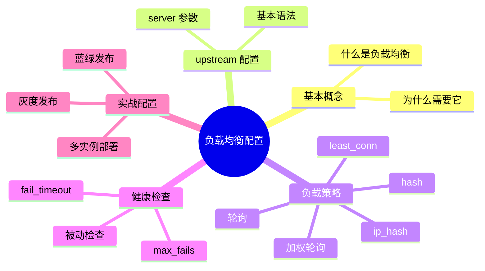
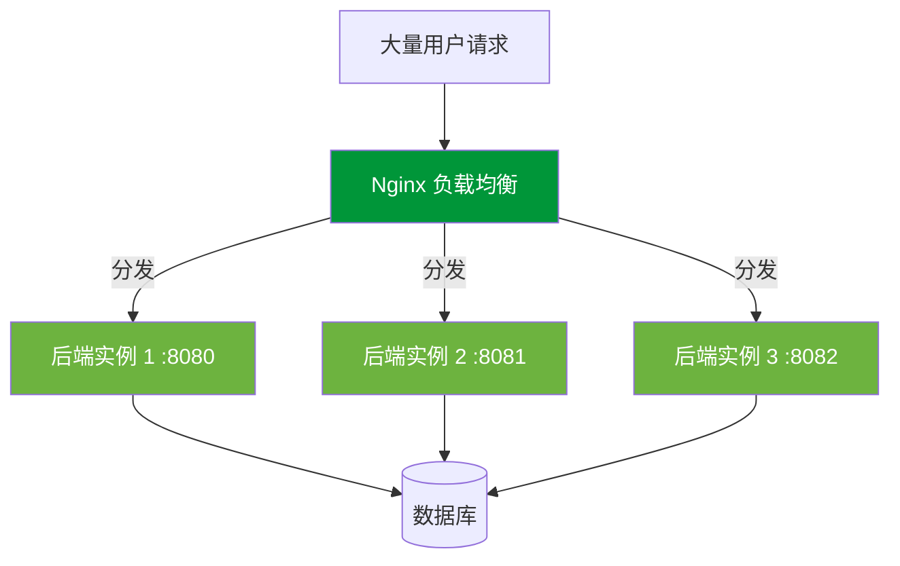
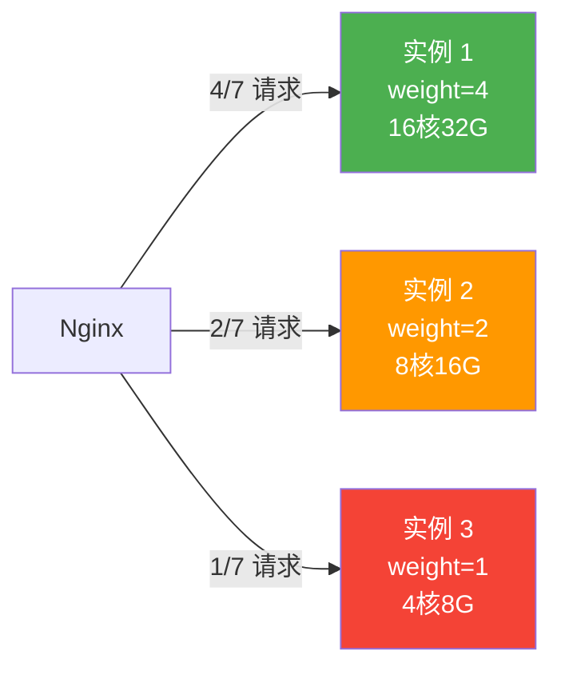
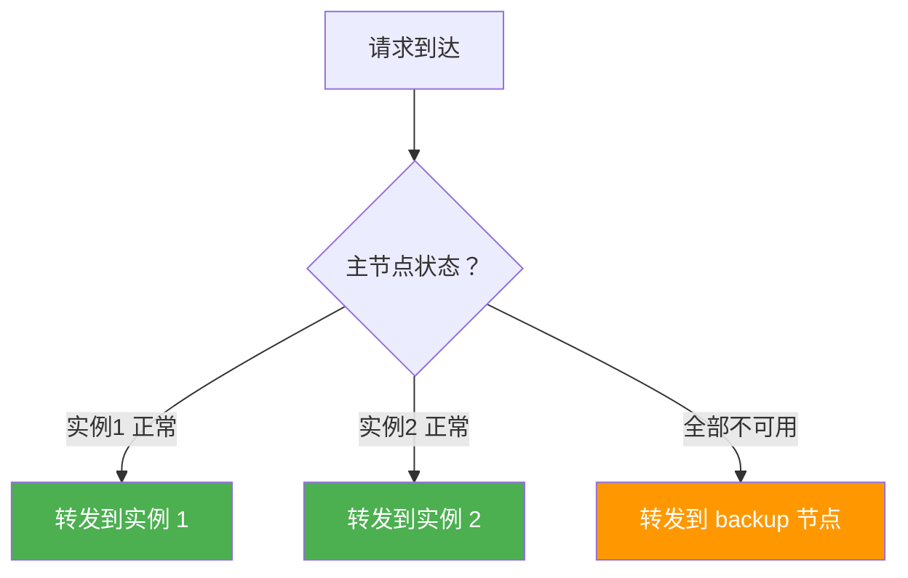
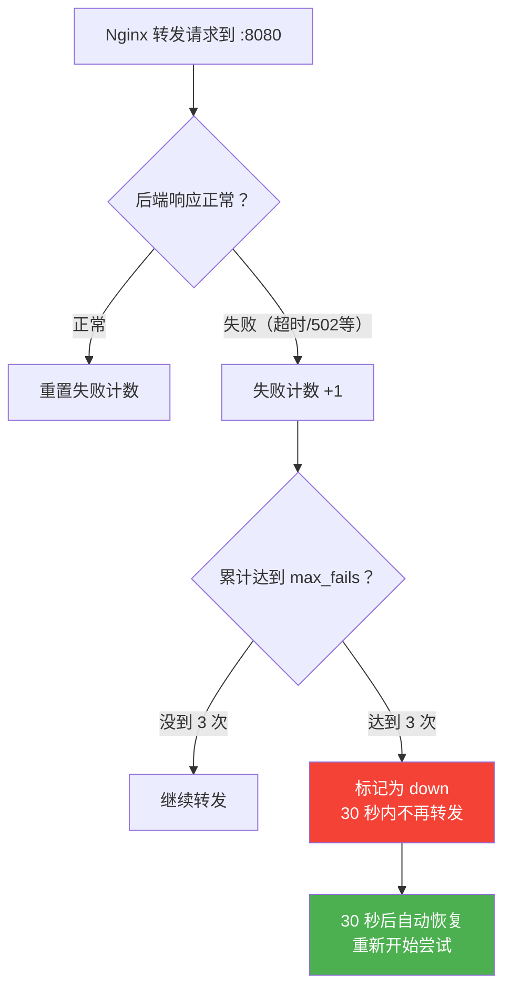
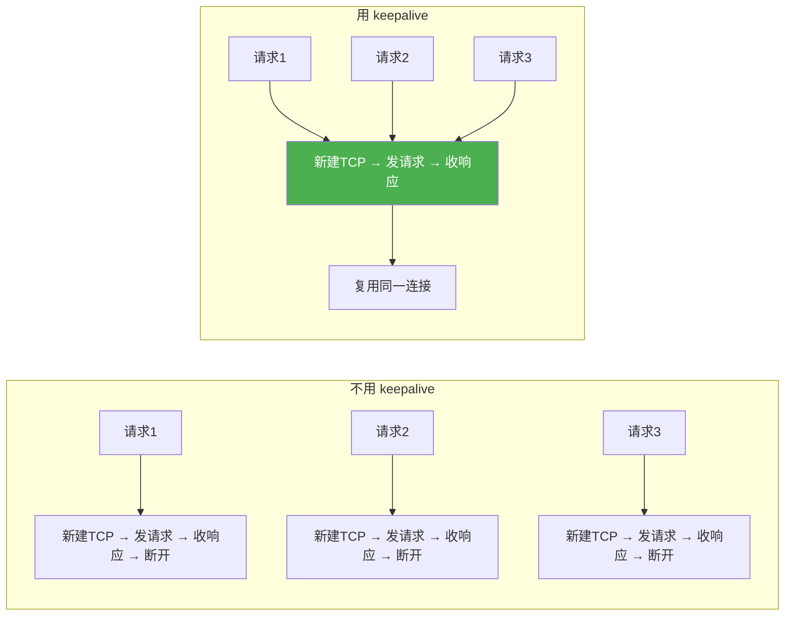

# 负载均衡配置

## 本篇目标



---

## 什么是负载均衡？

你开了一家奶茶店，生意火爆，一个店员忙不过来。怎么办？再招几个店员，客人来了分配给空闲的人做。

Nginx 负载均衡干的就是这事——把大量请求**分散到多个后端服务器**去处理，不让某一台服务器累死。



### 为什么不单机硬扛？

| 单机 | 多实例 + 负载均衡 |
|------|------------------|
| 一台扛所有请求，CPU 拉满 | 请求分散，每台都很轻松 |
| 服务挂了就全挂了 | 一台挂了，其他继续服务 |
| 想扩容得换更贵的机器（纵向扩展） | 加一台普通机器就行（横向扩展） |
| 部署新版本必须停服 | 滚动更新，不停服 |

---

## upstream 基本配置

在 Nginx 里，负载均衡用 `upstream` 块来定义一组后端服务器：

```nginx
# 定义一组后端（名字随便起，后面要引用）
upstream api_servers {
    server 127.0.0.1:8080;
    server 127.0.0.1:8081;
    server 127.0.0.1:8082;
}

server {
    listen 80;
    server_name www.example.com;

    location /api/ {
        # proxy_pass 指向 upstream 名字
        proxy_pass http://api_servers;
        proxy_set_header Host $host;
        proxy_set_header X-Real-IP $remote_addr;
        proxy_set_header X-Forwarded-For $proxy_add_x_forwarded_for;
    }
}
```

就这么简单：定义 upstream → proxy_pass 指向它。Nginx 会自动把请求在三个实例之间轮流分发。

---

## 负载策略详解

Nginx 怎么决定"这个请求分给谁"？这就是负载策略。

### 策略一：轮询（默认）

一人一次，轮着来。第一个请求给 8080，第二个给 8081，第三个给 8082，第四个又回到 8080……

```nginx
upstream api_servers {
    server 127.0.0.1:8080;
    server 127.0.0.1:8081;
    server 127.0.0.1:8082;
}
```

不加任何参数就是轮询，适合后端服务器配置相同的情况。

---

### 策略二：加权轮询（weight）

如果服务器配置不一样——一台 16 核 32G，另一台 4 核 8G，平均分配就浪费了好机器。

给性能好的多分配点：

```nginx
upstream api_servers {
    server 192.168.1.10:8080 weight=4;  # 性能好，多扛点
    server 192.168.1.11:8080 weight=2;  # 一般
    server 192.168.1.12:8080 weight=1;  # 配置最低
}
```

权重 4:2:1 意味着大概每 7 个请求，第一台处理 4 个，第二台 2 个，第三台 1 个。



---

### 策略三：ip_hash（客户端绑定）

同一个客户端 IP 的所有请求，始终发给同一台后端。

```nginx
upstream api_servers {
    ip_hash;
    server 127.0.0.1:8080;
    server 127.0.0.1:8081;
    server 127.0.0.1:8082;
}
```

**什么时候用？**

后端有 Session 的时候。比如用户在实例 1 登录了，Session 存在实例 1 的内存里。下次请求如果跑到实例 2 去了，Session 找不到，用户就被踢出去了。

`ip_hash` 保证同一用户的请求一直打到同一台机器。

::: warning ip_hash 的缺点
1. 同一公司/学校的用户出口 IP 相同，会导致某台服务器负载偏高
2. 某台服务器挂了后重新上线，绑定关系会变，用户 Session 还是丢

**更好的方案**：用 Redis 集中存 Session（后面"会话保持"那篇详细讲），彻底不依赖某台机器。
:::

---

### 策略四：least_conn（最少连接）

把请求分给当前连接数最少的那台服务器——谁闲着就给谁干活。

```nginx
upstream api_servers {
    least_conn;
    server 127.0.0.1:8080;
    server 127.0.0.1:8081;
    server 127.0.0.1:8082;
}
```

**适合场景**：请求处理时间差异大的情况。比如有些接口 10ms 就返回了，有些要跑好几秒。轮询可能让某台服务器积压大量慢请求，而 `least_conn` 会自动避让忙碌的实例。

---

### 策略五：hash（一致性哈希）

按请求的某个特征值做哈希，相同特征的请求始终到同一台后端。

```nginx
upstream api_servers {
    hash $request_uri consistent;
    server 127.0.0.1:8080;
    server 127.0.0.1:8081;
    server 127.0.0.1:8082;
}
```

- `$request_uri` —— 相同 URL 的请求走同一台后端（对缓存友好）
- `consistent` —— 一致性哈希，增减节点时只影响少量映射关系

**适合场景**：后端带本地缓存的服务。同一个商品详情请求始终命中同一台机器，缓存命中率高。

---

### 策略对比

| 策略 | 关键词 | 适用场景 | 注意事项 |
|------|--------|---------|---------|
| 轮询 | 默认 | 后端配置相同，无状态服务 | 最简单 |
| 加权轮询 | `weight` | 服务器性能不一样 | 权重比例要合理 |
| ip_hash | `ip_hash` | 需要会话粘连 | 负载可能不均 |
| least_conn | `least_conn` | 请求耗时差异大 | 短连接效果好 |
| hash | `hash $key` | 需要缓存亲和 | 加 `consistent` |

---

## server 参数详解

`upstream` 里的每个 `server` 还能带一堆参数微调行为：

```nginx
upstream api_servers {
    server 192.168.1.10:8080 weight=3 max_fails=3 fail_timeout=30s;
    server 192.168.1.11:8080 weight=2 max_fails=3 fail_timeout=30s;
    server 192.168.1.12:8080 backup;
    server 192.168.1.13:8080 down;
}
```

| 参数 | 含义 | 例子 |
|------|------|------|
| `weight=N` | 权重 | `weight=3` 表示承担 3 倍流量 |
| `max_fails=N` | 最多失败几次标记为不可用 | `max_fails=3` |
| `fail_timeout=Ns` | 标记不可用后多久重新尝试 | `fail_timeout=30s` |
| `backup` | 备用节点，正常节点全挂了才启用 | 容灾兜底 |
| `down` | 标记下线，不再分配请求 | 维护时临时下线 |
| `max_conns=N` | 限制到该节点的最大并发连接 | 防止打满 |

### backup 节点的妙用



backup 节点平时不参与负载均衡，只有主节点全部挂了才会启用，相当于"兜底机器"。适合放一台配置低的服务器做应急保障。

---

## 健康检查（被动模式）

Nginx 开源版支持被动健康检查——通过实际转发请求来判断后端是否健康。

```nginx
upstream api_servers {
    server 127.0.0.1:8080 max_fails=3 fail_timeout=30s;
    server 127.0.0.1:8081 max_fails=3 fail_timeout=30s;
}
```

工作流程：



::: tip 什么算"失败"？
默认情况下，连接超时、读取超时、后端返回错误都算失败。配合 `proxy_next_upstream` 可以自定义哪些情况算失败：
```nginx
proxy_next_upstream error timeout http_502 http_503;
```
:::

---

## 长连接优化：keepalive

Nginx 到后端默认每次都是新建 TCP 连接，请求完就断。高并发下频繁建连接开销不小。

启用连接池，复用连接：

```nginx
upstream api_servers {
    server 127.0.0.1:8080;
    server 127.0.0.1:8081;

    keepalive 32;  # 每个 Worker 保持 32 个空闲长连接
}

server {
    listen 80;

    location /api/ {
        proxy_pass http://api_servers;

        # keepalive 必须配合这两行
        proxy_http_version 1.1;
        proxy_set_header Connection "";
    }
}
```

为什么要加 `proxy_set_header Connection ""`？

默认 Nginx 代理会发 `Connection: close`，告诉后端"用完就断"。设置为空字符串后，HTTP/1.1 默认行为是 keep-alive，连接就能复用了。



::: tip keepalive 设多大？
`keepalive 32` 表示每个 Worker 进程维护最多 32 个空闲连接。一般设为后端实例数 × 2~4 就够了。设太大浪费内存，设太小又用不上。
:::

---

## 实战：多实例部署方案

### 场景一：同一台机器起多个端口

小项目或测试环境，一台机器跑多个 Java 进程：

```bash
# 起 3 个实例
java -jar app.jar --server.port=8080 &
java -jar app.jar --server.port=8081 &
java -jar app.jar --server.port=8082 &
```

```nginx
upstream api_servers {
    server 127.0.0.1:8080;
    server 127.0.0.1:8081;
    server 127.0.0.1:8082;
    keepalive 16;
}
```

### 场景二：多台机器分布式部署

生产环境，不同物理机/云主机上各跑一个实例：

```nginx
upstream api_servers {
    server 192.168.1.10:8080 weight=3 max_fails=3 fail_timeout=30s;
    server 192.168.1.11:8080 weight=3 max_fails=3 fail_timeout=30s;
    server 192.168.1.12:8080 weight=2 max_fails=3 fail_timeout=30s;
    server 192.168.1.13:8080 backup;  # 备用机
    keepalive 32;
}
```

### 场景三：Docker Compose 多容器

```yaml
# docker-compose.yml
version: '3.8'
services:
  nginx:
    image: nginx:latest
    ports:
      - "80:80"
    volumes:
      - ./nginx.conf:/etc/nginx/conf.d/default.conf

  app1:
    image: my-app:latest
    expose:
      - "8080"

  app2:
    image: my-app:latest
    expose:
      - "8080"

  app3:
    image: my-app:latest
    expose:
      - "8080"
```

```nginx
upstream api_servers {
    server app1:8080;
    server app2:8080;
    server app3:8080;
    keepalive 16;
}
```

---

## 实战：滚动更新（不停服发版）

用 `down` 参数和 `nginx -s reload` 实现不停服更新。

思路：一台一台地下线更新，保证始终有实例在服务。

```bash
# 第一步：标记实例 1 下线
# 修改配置：server 127.0.0.1:8080 down;
nginx -s reload

# 第二步：更新实例 1
# 部署新版本到 :8080，启动确认正常

# 第三步：恢复实例 1，下线实例 2
# 修改配置：去掉 :8080 的 down，给 :8081 加 down
nginx -s reload

# 第四步：更新实例 2
# 重复直到所有实例都更新完
```


---

## 实战：灰度发布（部分用户用新版本）

先让一小部分流量跑新版本，没问题再全量切换。

### 方式一：按权重灰度

新版本先给很小的权重：

```nginx
upstream api_servers {
    server 127.0.0.1:8080 weight=9;   # 旧版本，承担 90% 流量
    server 127.0.0.1:8081 weight=1;   # 新版本，只给 10% 流量
}
```

观察没问题后逐步调高新版本权重：`weight=1` → `weight=5` → `weight=9`，最后把旧版本下掉。

### 方式二：按 Cookie/Header 灰度

只让特定用户走新版本（比如内部测试人员）：

```nginx
upstream old_version {
    server 127.0.0.1:8080;
}

upstream new_version {
    server 127.0.0.1:8081;
}

server {
    listen 80;
    server_name www.example.com;

    location /api/ {
        # 请求头带 X-Gray: true 的走新版本
        if ($http_x_gray = "true") {
            proxy_pass http://new_version;
            break;
        }
        proxy_pass http://old_version;
    }
}
```

前端测试时请求头加上 `X-Gray: true` 就能访问新版本，其他用户完全不受影响。

---

## 完整生产配置模板

```nginx
# /etc/nginx/conf.d/example.conf

upstream api_servers {
    least_conn;

    server 192.168.1.10:8080 weight=3 max_fails=3 fail_timeout=30s;
    server 192.168.1.11:8080 weight=3 max_fails=3 fail_timeout=30s;
    server 192.168.1.12:8080 weight=2 max_fails=3 fail_timeout=30s;
    server 192.168.1.13:8080 backup;

    keepalive 32;
}

server {
    listen 80;
    server_name www.example.com;

    access_log /var/log/nginx/example.access.log main;
    error_log /var/log/nginx/example.error.log warn;

    # 前端
    location / {
        root /data/www/dist;
        try_files $uri $uri/ /index.html;
    }

    # 后端 API
    location /api/ {
        proxy_pass http://api_servers;

        proxy_http_version 1.1;
        proxy_set_header Connection "";
        proxy_set_header Host $host;
        proxy_set_header X-Real-IP $remote_addr;
        proxy_set_header X-Forwarded-For $proxy_add_x_forwarded_for;
        proxy_set_header X-Forwarded-Proto $scheme;

        proxy_connect_timeout 5s;
        proxy_read_timeout 60s;
        proxy_send_timeout 30s;

        proxy_next_upstream error timeout http_502 http_503;
        proxy_next_upstream_tries 2;
        proxy_next_upstream_timeout 10s;

        client_max_body_size 20m;
    }

    error_page 502 503 504 /50x.html;
    location = /50x.html {
        root /usr/share/nginx/html;
    }
}
```

---

## 本篇小结

| 知识点 | 核心要记的 |
|--------|-----------|
| upstream 基本用法 | 定义一组 server + proxy_pass 引用 |
| 轮询 | 默认策略，啥都不写就是轮询 |
| weight | 按服务器性能分配不同权重 |
| ip_hash | 同一 IP 绑定同一后端，解决 Session 问题 |
| least_conn | 分给最闲的那台，适合慢接口场景 |
| 健康检查 | `max_fails` + `fail_timeout` 标记故障 |
| keepalive | 连接池复用，减少 TCP 握手开销 |
| backup | 兜底节点，主节点全挂才启用 |
| 滚动更新 | `down` + `reload` 实现不停服发版 |
| 灰度发布 | 权重控制或 Header 匹配做流量切割 |

下一篇我们来聊 Session 会话保持——负载均衡后最头疼的问题。
