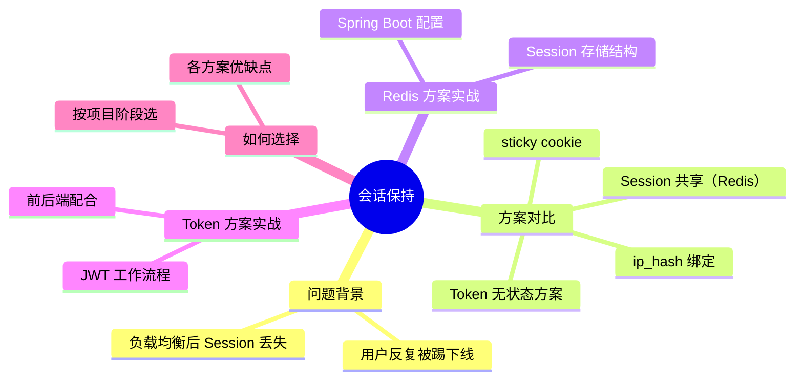
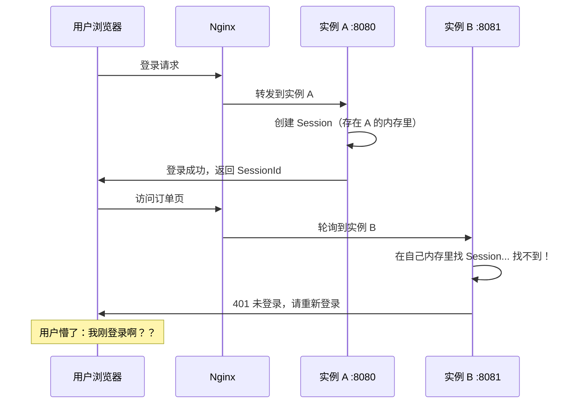
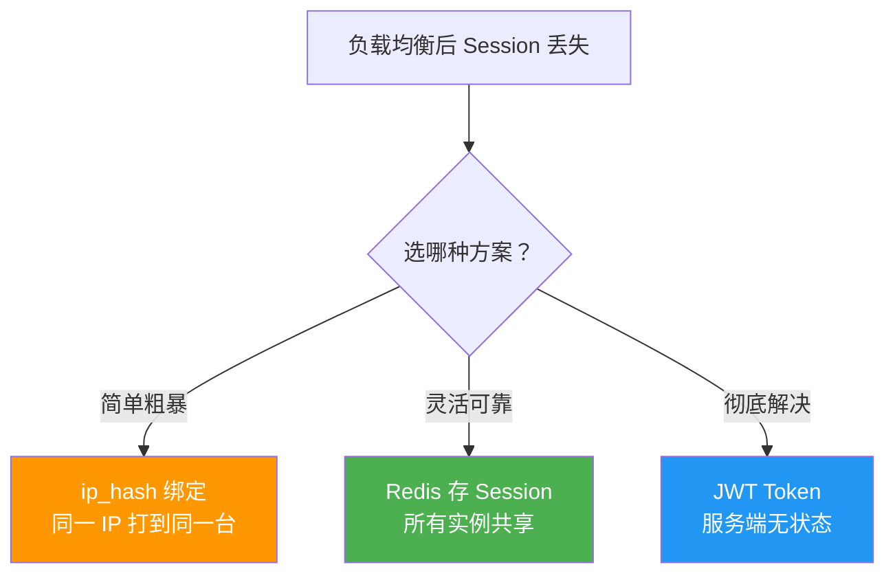
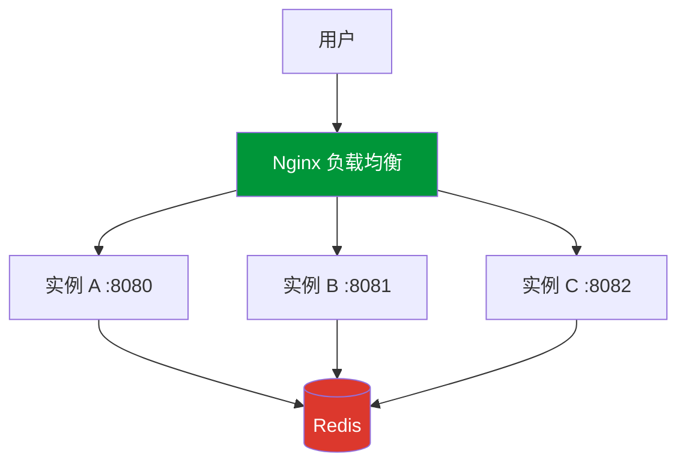
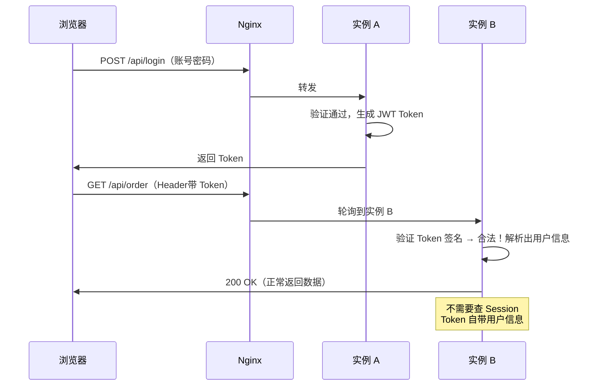
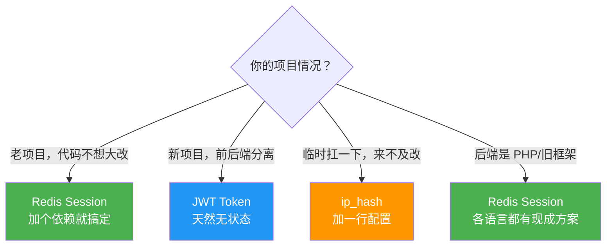

# 会话保持

## 本篇目标



---

## 问题：负载均衡后用户老被踢下线

你上了负载均衡，两台后端实例轮流处理请求。然后用户开始投诉：

> "我明明登录了，点一下页面又让我重新登录！"

原因很好理解：



问题本质：Session 存在服务器内存里，实例 A 的 Session 实例 B 不知道。负载均衡把请求分到不同实例，Session 就丢了。

---

## 方案总览

解决思路无非两条：
1. **让同一个用户始终访问同一台机器**（粘性会话）
2. **让所有机器共享 Session 数据**（集中存储）
3. **干脆不用 Session**（无状态 Token）



---

## 方案一：ip_hash（最快上手）

上一篇已经讲了，同一个客户端 IP 永远打到同一台后端：

```nginx
upstream api_servers {
    ip_hash;
    server 127.0.0.1:8080;
    server 127.0.0.1:8081;
}
```

### 优缺点

| 优点 | 缺点 |
|------|------|
| 配置最简单，加一行搞定 | 同一出口 IP（如公司内网）全打到一台 |
| 不需要改后端代码 | 后端实例挂了，绑定的用户 Session 全丢 |
| 零额外依赖 | 扩缩容后 hash 可能变，部分用户 Session 丢失 |

**适合场景**：快速救急、小项目、用户量不大、后端不方便改代码的情况。

---

## 方案二：Sticky Cookie（Nginx Plus）

::: warning 注意
这是 Nginx 商业版（Nginx Plus）的功能，开源版**不支持**。如果你用的是开源版，跳过这段看 Redis 方案。
:::

原理：Nginx 给客户端种一个 Cookie，标记它应该去哪台后端，下次请求 Nginx 读 Cookie 来路由。

```nginx
# Nginx Plus 配置
upstream api_servers {
    sticky cookie srv_id expires=1h domain=.example.com path=/;
    server 127.0.0.1:8080;
    server 127.0.0.1:8081;
}
```

第一次请求，Nginx 会返回一个 `Set-Cookie: srv_id=xxxx`，后续请求带着这个 Cookie，Nginx 就知道该转给谁。

比 ip_hash 更精准（到浏览器级别，不是 IP 级别），但要掏钱买 Nginx Plus。

---

## 方案三：Redis 集中存储 Session（推荐）

这是目前最主流的方案。思路很简单：不把 Session 存在各自的内存里了，统一存到 Redis。所有实例都去 Redis 读写 Session，谁处理请求都一样。



不管请求落到哪台实例，Session 数据都从 Redis 取，用户体验完全一致。

### Spring Boot 集成 Spring Session + Redis

改动很小，加个依赖 + 配置 Redis 地址就行，一行代码都不用写。

**第一步：加依赖**

```xml
<!-- pom.xml -->
<dependency>
    <groupId>org.springframework.boot</groupId>
    <artifactId>spring-boot-starter-data-redis</artifactId>
</dependency>
<dependency>
    <groupId>org.springframework.session</groupId>
    <artifactId>spring-session-data-redis</artifactId>
</dependency>
```

**第二步：配置 Redis 连接**

```yaml
# application.yml
spring:
  session:
    store-type: redis
    timeout: 30m
  redis:
    host: 127.0.0.1
    port: 6379
    password: your_redis_password
```

**第三步：没有第三步了**

没错，就这么多。Spring Session 会自动把 HttpSession 存到 Redis 里，原来代码里 `session.setAttribute()`、`session.getAttribute()` 照常用，底层存储从内存换成了 Redis，对业务代码完全透明。

### Session 在 Redis 里长什么样？

```bash
# 用 redis-cli 看一下
127.0.0.1:6379> keys spring:session:*
1) "spring:session:sessions:abc123-def456"
2) "spring:session:sessions:expires:abc123-def456"

127.0.0.1:6379> hgetall spring:session:sessions:abc123-def456
1) "sessionAttr:loginUser"
2) "{\"userId\":1001,\"username\":\"zhangsan\"}"
3) "creationTime"
4) "1717142400000"
5) "lastAccessedTime"
6) "1717145000000"
```

就是一个 Redis Hash，key 是 SessionId，value 是你存进去的属性。

### Nginx 这边需要改什么？

**不需要改**。用了 Redis 存 Session 后，Nginx 随便怎么轮询都无所谓了，不用 ip_hash：

```nginx
upstream api_servers {
    # 不需要 ip_hash 了，随便用什么策略
    least_conn;
    server 127.0.0.1:8080;
    server 127.0.0.1:8081;
    server 127.0.0.1:8082;
    keepalive 32;
}
```

### Redis 方案优缺点

| 优点 | 缺点 |
|------|------|
| 所有实例共享，真正解决问题 | 多了个 Redis 依赖 |
| 不影响负载策略选择 | 每次请求多一次 Redis 读写（但 Redis 很快） |
| 后端代码几乎不用改 | Redis 挂了全部 Session 丢失（需要做 Redis 高可用） |
| 扩缩容不影响用户 | - |

::: tip Redis 高可用
生产环境 Redis 别裸奔单节点。最起码搞个 Redis Sentinel（哨兵模式），或者直接用 Redis Cluster。云服务器上直接买托管的 Redis 实例最省心。
:::

---

## 方案四：JWT Token（无状态方案）

还有一个思路更彻底：服务端根本不存 Session。

用户登录后，服务端把用户信息加密打包成一个 Token（JWT），发给前端。前端每次请求带上这个 Token，服务端验证 Token 签名就知道"你是谁"了，不需要查 Session。



### JWT Token 长什么样？

```
eyJhbGciOiJIUzI1NiIsInR5cCI6IkpXVCJ9.
eyJ1c2VySWQiOjEwMDEsInVzZXJuYW1lIjoiemhhbmdzYW4iLCJleHAiOjE3MTcxNDU2MDB9.
K7gNU3sdo-OL0wNhTBGHmZ2U_4LHRzlzGOmM2ycRa0I
```

三段用点号分开：Header（算法信息）+ Payload（用户数据）+ Signature（签名防篡改）

### 前端配合

```javascript
// 登录后保存 Token
const res = await axios.post('/api/login', { username, password });
localStorage.setItem('token', res.data.token);

// 每次请求带上 Token
axios.interceptors.request.use(config => {
    const token = localStorage.getItem('token');
    if (token) {
        config.headers.Authorization = `Bearer ${token}`;
    }
    return config;
});
```

### 后端验证（Spring Boot 伪代码）

```java
@Component
public class JwtFilter extends OncePerRequestFilter {

    @Override
    protected void doFilterInternal(HttpServletRequest request,
                                    HttpServletResponse response,
                                    FilterChain chain) {
        String token = request.getHeader("Authorization");
        if (token != null && token.startsWith("Bearer ")) {
            String jwt = token.substring(7);
            // 验签 + 解析
            Claims claims = Jwts.parser()
                .setSigningKey(secretKey)
                .parseClaimsJws(jwt)
                .getBody();
            // 拿到用户信息，存到请求上下文
            Long userId = claims.get("userId", Long.class);
            // ...
        }
        chain.doFilter(request, response);
    }
}
```

### JWT 方案优缺点

| 优点 | 缺点 |
|------|------|
| 服务端完全无状态，天生适合分布式 | Token 签发后无法主动废除（除非加黑名单） |
| 不依赖 Redis，没有额外中间件 | Token 体积比 SessionId 大（每次请求都带） |
| 横向扩展随便加机器 | 用户信息变更（如改昵称）不能实时反映到 Token |
| 天然支持跨域、移动端 | 续期逻辑要自己实现（Token 快过期时刷新） |

---

## Nginx 配合 Token 方案要改什么？

答：**Nginx 基本不用改**。Token 放在 HTTP Header 里，Nginx 代理时默认就会原样转发所有 Header。

唯一要注意的：如果 Token 很长（有些业务 Token 能到几 KB），确保 Nginx 的 header buffer 够大：

```nginx
# 一般不用改，除非遇到 "upstream sent too big header" 错误
proxy_buffer_size 8k;
proxy_buffers 4 8k;
```

---

## 各方案对比总结

| 方案 | 复杂度 | 可靠性 | 适合场景 |
|------|--------|--------|---------|
| ip_hash | ⭐ | ⭐⭐ | 快速解决、临时方案 |
| Sticky Cookie | ⭐⭐ | ⭐⭐⭐ | 用 Nginx Plus 的企业 |
| Redis Session | ⭐⭐⭐ | ⭐⭐⭐⭐ | 传统 Session 项目升级分布式 |
| JWT Token | ⭐⭐⭐ | ⭐⭐⭐⭐⭐ | 新项目、前后端分离、微服务 |

### 我应该选哪个？



::: tip 实际工程中的做法
很多项目是**组合使用**：用 JWT 做认证（验证"你是谁"），用 Redis 存一些需要服务端主动废除的状态（比如"强制下线"的黑名单、用户权限变更的缓存）。两者不冲突。
:::

---

## 本篇小结

| 知识点 | 记住这些 |
|--------|---------|
| 问题根源 | Session 在内存里，负载均衡导致请求打到没有 Session 的实例 |
| ip_hash | 一行配置搞定，但有负载不均和容灾问题 |
| Redis Session | 对业务代码透明，Spring Boot 加两个依赖就行 |
| JWT Token | 服务端无状态，新项目首选 |
| 选择依据 | 老项目用 Redis，新项目用 JWT，救急用 ip_hash |

负载均衡这一章到此结束。下一章我们来配 HTTPS——上线前的最后一道必办手续。
