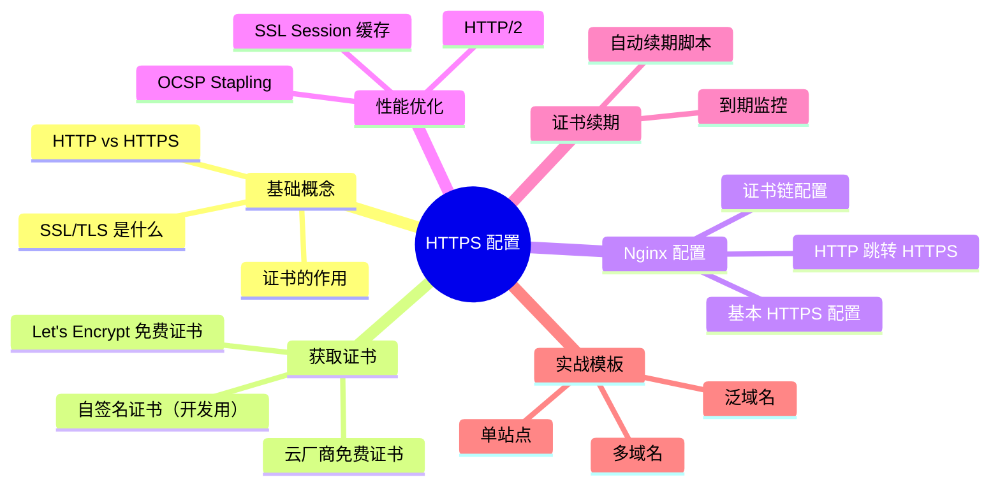
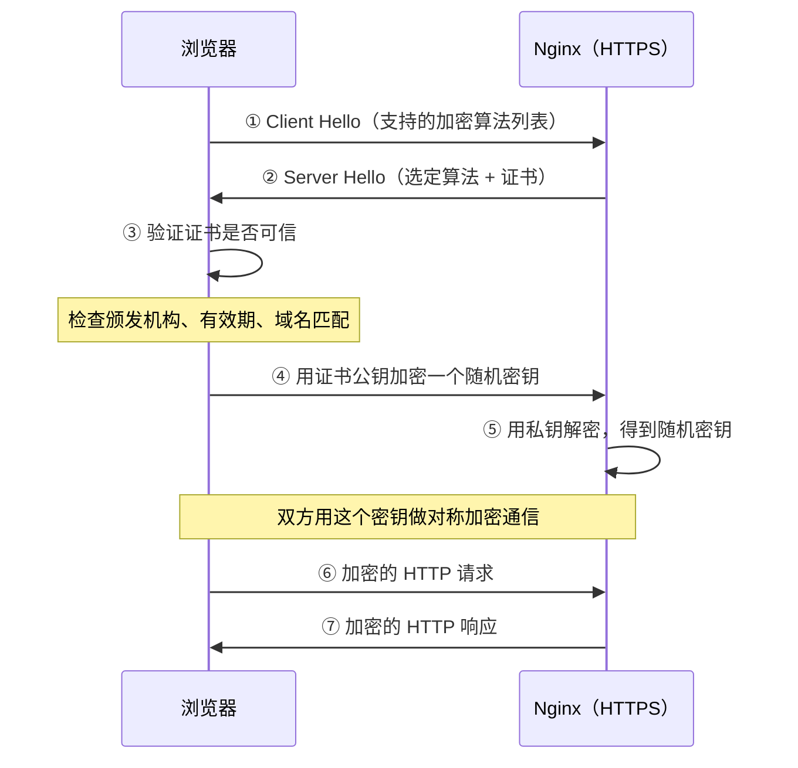
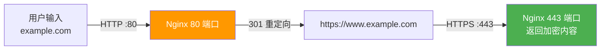
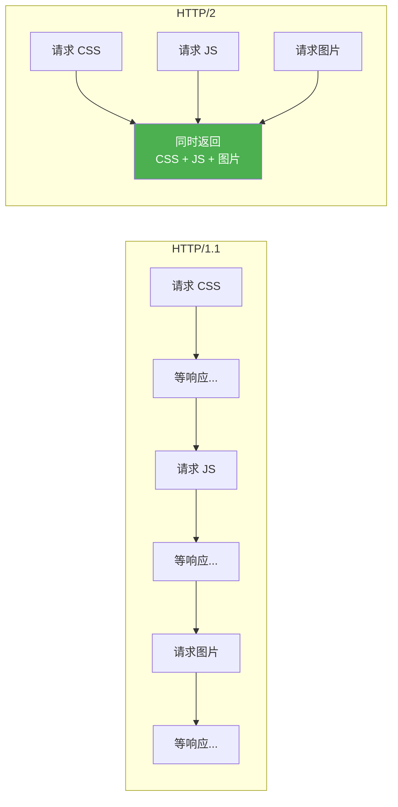

# HTTPS 配置

## 本篇目标



---

## 为什么必须上 HTTPS？

2026 年了，不上 HTTPS 的网站基本等于裸奔：

| 问题 | HTTP | HTTPS |
|------|------|-------|
| 数据安全 | 明文传输，密码被抓包一览无余 | 加密传输，中间人看不到内容 |
| 浏览器标记 | 地址栏显示"不安全" ⚠️ | 显示小锁 🔒 |
| SEO 排名 | 搜索引擎降权 | Google/百度优先收录 |
| 功能限制 | 新 API 不可用（如地理定位、摄像头） | 所有 Web API 正常使用 |
| 用户信任 | 用户看到"不安全"就跑了 | 看起来正规靠谱 |
| 小程序/App | 微信小程序强制要求 HTTPS | 可以正常对接 |

**结论**：不管是企业官网还是个人博客，HTTPS 都是标配。

---

## SSL/TLS 握手流程

浏览器访问 HTTPS 站点时发生了什么：



简单说：先用非对称加密交换一个"暗号"，然后双方用这个暗号做对称加密传数据。

---

## 证书从哪来？

### 方式一：Let's Encrypt 免费证书（推荐）

Let's Encrypt 是免费、自动化的证书颁发机构，全球超过 3 亿网站在用。证书有效期 90 天，但可以自动续期。

使用 `certbot` 工具申请：

```bash
# 安装 certbot（CentOS）
sudo yum install -y certbot python3-certbot-nginx

# 安装 certbot（Ubuntu）
sudo apt install -y certbot python3-certbot-nginx

# 申请证书（会自动修改 Nginx 配置）
sudo certbot --nginx -d www.example.com -d example.com

# 或者只申请证书，不自动改配置（推荐手动配置）
sudo certbot certonly --webroot -w /data/www/dist -d www.example.com
```

申请成功后，证书文件在：

```
/etc/letsencrypt/live/www.example.com/
├── fullchain.pem    # 证书 + 中间证书（Nginx 用这个）
├── privkey.pem      # 私钥
├── cert.pem         # 证书本体
└── chain.pem        # 中间证书链
```

### 方式二：云厂商免费证书

阿里云、腾讯云、华为云都提供免费的 DV 证书（一年有效期），在控制台申请，适合不想折腾命令行的人。

申请流程：控制台 → SSL 证书 → 免费证书 → 填域名 → DNS 验证 → 下载 Nginx 格式证书。

下载下来一般是两个文件：
- `example.com.pem`（证书）
- `example.com.key`（私钥）

### 方式三：自签名证书（仅开发/测试用）

自己给自己颁发，浏览器会报不安全，但内网测试够用：

```bash
# 一行生成自签名证书（有效期 365 天）
openssl req -x509 -nodes -days 365 \
  -newkey rsa:2048 \
  -keyout /etc/nginx/ssl/selfsigned.key \
  -out /etc/nginx/ssl/selfsigned.crt \
  -subj "/CN=localhost"
```

::: warning
自签名证书**绝对不要用在生产环境**，浏览器会弹红色警告页面，用户直接吓跑。
:::

---

## Nginx HTTPS 基本配置

拿到证书后，配置 Nginx：

```nginx
server {
    listen 443 ssl;
    server_name www.example.com;

    # 证书文件路径
    ssl_certificate     /etc/letsencrypt/live/www.example.com/fullchain.pem;
    ssl_certificate_key /etc/letsencrypt/live/www.example.com/privkey.pem;

    # SSL 协议版本（只保留安全的版本）
    ssl_protocols TLSv1.2 TLSv1.3;

    # 加密套件（优先使用服务端配置）
    ssl_prefer_server_ciphers on;
    ssl_ciphers 'ECDHE-ECDSA-AES128-GCM-SHA256:ECDHE-RSA-AES128-GCM-SHA256:ECDHE-ECDSA-AES256-GCM-SHA384:ECDHE-RSA-AES256-GCM-SHA384';

    # 站点配置
    root /data/www/dist;
    index index.html;

    location / {
        try_files $uri $uri/ /index.html;
    }

    location /api/ {
        proxy_pass http://127.0.0.1:8080;
        proxy_set_header Host $host;
        proxy_set_header X-Real-IP $remote_addr;
        proxy_set_header X-Forwarded-For $proxy_add_x_forwarded_for;
        proxy_set_header X-Forwarded-Proto $scheme;
    }
}
```

配完之后测试并重载：

```bash
# 检查配置语法
nginx -t

# 重载配置（不会中断现有连接）
nginx -s reload
```

访问 `https://www.example.com` 看到小锁就成功了。

---

## HTTP 自动跳转 HTTPS

配了 HTTPS 后，用户直接输入 `example.com`（没带 https）还是走 HTTP。要加一个 301 跳转：

```nginx
# HTTP → HTTPS 跳转
server {
    listen 80;
    server_name www.example.com example.com;

    # 所有 HTTP 请求 301 跳转到 HTTPS
    return 301 https://www.example.com$request_uri;
}

# HTTPS 主站点
server {
    listen 443 ssl;
    server_name www.example.com;

    ssl_certificate     /etc/letsencrypt/live/www.example.com/fullchain.pem;
    ssl_certificate_key /etc/letsencrypt/live/www.example.com/privkey.pem;
    ssl_protocols TLSv1.2 TLSv1.3;

    # ... 站点配置 ...
}
```



::: tip 为什么用 301 不用 302？
- 301 是永久重定向，浏览器会缓存，下次直接走 HTTPS（更快）
- 302 是临时重定向，每次都要先请求 HTTP 再跳转（多一次往返）

上线确定走 HTTPS 后用 301。
:::

---

## 开启 HTTP/2

HTTP/2 比 HTTP/1.1 快很多（多路复用、头部压缩、服务器推送），而且配置极其简单——加两个字就行：

```nginx
server {
    listen 443 ssl http2;  # 就加了 "http2" 两个字
    server_name www.example.com;

    ssl_certificate     /etc/letsencrypt/live/www.example.com/fullchain.pem;
    ssl_certificate_key /etc/letsencrypt/live/www.example.com/privkey.pem;
    # ...
}
```

HTTP/2 的好处：



HTTP/1.1 一个连接同时只能处理一个请求（排队），HTTP/2 可以在一个连接里同时传输多个请求和响应（并行）。

::: tip
HTTP/2 **必须基于 HTTPS**（浏览器强制要求）。所以配了 HTTPS 就顺手开 HTTP/2，没有任何额外代价。
:::

---

## SSL 性能优化

HTTPS 的 SSL 握手有性能开销，以下配置可以减少重复握手：

### SSL Session 缓存

让同一个客户端短时间内再次访问时跳过完整握手：

```nginx
http {
    # SSL Session 缓存（1m 内存大约存 4000 个 Session）
    ssl_session_cache shared:SSL:10m;

    # Session 有效期
    ssl_session_timeout 10m;

    # 禁用 Session Tickets（安全考虑，可选）
    ssl_session_tickets off;
}
```

### OCSP Stapling

浏览器验证证书时要去证书颁发机构查"证书有没有被吊销"，这一步可能很慢。开启 OCSP Stapling 后，Nginx 替浏览器提前查好，直接返回结果：

```nginx
server {
    listen 443 ssl http2;

    ssl_stapling on;
    ssl_stapling_verify on;

    # 用于 OCSP 查询的 DNS
    resolver 8.8.8.8 114.114.114.114 valid=300s;
    resolver_timeout 5s;

    # 证书链（OCSP Stapling 需要完整证书链）
    ssl_trusted_certificate /etc/letsencrypt/live/www.example.com/chain.pem;
}
```

---

## 安全加固配置

基本的 HTTPS 跑起来了，再加几行提升安全等级：

```nginx
server {
    listen 443 ssl http2;
    server_name www.example.com;

    # ===== SSL 基础 =====
    ssl_certificate     /etc/letsencrypt/live/www.example.com/fullchain.pem;
    ssl_certificate_key /etc/letsencrypt/live/www.example.com/privkey.pem;
    ssl_protocols TLSv1.2 TLSv1.3;
    ssl_prefer_server_ciphers on;
    ssl_ciphers 'ECDHE-ECDSA-AES128-GCM-SHA256:ECDHE-RSA-AES128-GCM-SHA256:ECDHE-ECDSA-AES256-GCM-SHA384:ECDHE-RSA-AES256-GCM-SHA384';

    # ===== 安全响应头 =====
    # 强制浏览器走 HTTPS（有效期 1 年）
    add_header Strict-Transport-Security "max-age=31536000; includeSubDomains" always;

    # 禁止被 iframe 嵌入（防止点击劫持）
    add_header X-Frame-Options "SAMEORIGIN" always;

    # 禁止浏览器猜测文件类型
    add_header X-Content-Type-Options "nosniff" always;

    # XSS 过滤
    add_header X-XSS-Protection "1; mode=block" always;
}
```

| Header | 防护目标 |
|--------|---------|
| `Strict-Transport-Security` | 防止 SSL 剥离攻击，浏览器记住要用 HTTPS |
| `X-Frame-Options` | 防止你的页面被别人用 iframe 套进去做钓鱼 |
| `X-Content-Type-Options` | 防止浏览器把 JS 当 HTML 执行 |
| `X-XSS-Protection` | 启用浏览器内置 XSS 过滤器 |

---

## 证书自动续期

Let's Encrypt 证书 90 天过期，必须设置自动续期。`certbot` 自带续期命令：

```bash
# 手动测试续期（不会真正续期，只是检查）
sudo certbot renew --dry-run

# 实际续期
sudo certbot renew
```

设置定时任务，每天检查一次：

```bash
# 编辑 crontab
sudo crontab -e

# 添加这行：每天凌晨 3 点检查续期，续期后自动 reload Nginx
0 3 * * * certbot renew --quiet --deploy-hook "nginx -s reload"
```

`certbot renew` 很智能：证书没到期（还剩 30 天以上）就不会操作，快到期了才会真正续期。所以每天跑一次完全没问题。

::: tip 监控证书过期
可以用免费的监控服务（如 UptimeRobot）监控你的 HTTPS 站点，证书快过期时会邮件提醒。也可以写个脚本检查：
```bash
# 查看证书过期时间
echo | openssl s_client -connect www.example.com:443 2>/dev/null | openssl x509 -noout -dates
```
:::

---

## 多域名 HTTPS 配置

一台服务器跑多个站点，各自用不同证书：

```nginx
# 主站
server {
    listen 443 ssl http2;
    server_name www.example.com;
    ssl_certificate     /etc/letsencrypt/live/www.example.com/fullchain.pem;
    ssl_certificate_key /etc/letsencrypt/live/www.example.com/privkey.pem;
    # ...
}

# 管理后台
server {
    listen 443 ssl http2;
    server_name admin.example.com;
    ssl_certificate     /etc/letsencrypt/live/admin.example.com/fullchain.pem;
    ssl_certificate_key /etc/letsencrypt/live/admin.example.com/privkey.pem;
    # ...
}

# API 站点
server {
    listen 443 ssl http2;
    server_name api.example.com;
    ssl_certificate     /etc/letsencrypt/live/api.example.com/fullchain.pem;
    ssl_certificate_key /etc/letsencrypt/live/api.example.com/privkey.pem;
    # ...
}
```

Nginx 通过 SNI（Server Name Indication）来区分不同域名用哪个证书，现代浏览器都支持。

---

## 泛域名证书

如果你的子域名很多（`www`、`admin`、`api`、`docs`……），可以申请一张泛域名证书 `*.example.com`，所有子域名通用：

```bash
# Let's Encrypt 泛域名证书（需要 DNS 验证）
sudo certbot certonly --manual --preferred-challenges dns \
  -d "*.example.com" -d "example.com"
```

DNS 验证需要去域名管理处添加一条 TXT 记录，certbot 会告诉你要加什么值。

配置时所有子域名共用一张证书：

```nginx
# 所有 *.example.com 共用一张证书
ssl_certificate     /etc/letsencrypt/live/example.com/fullchain.pem;
ssl_certificate_key /etc/letsencrypt/live/example.com/privkey.pem;
```

::: tip 泛域名证书续期
泛域名证书的续期也需要 DNS 验证，不能用 webroot 方式。可以结合 DNS 服务商的 API 自动添加验证记录：
```bash
# 以阿里云 DNS 为例，配合 certbot 的 DNS 插件
sudo certbot renew --manual-auth-hook /path/to/aliyun-dns-auth.sh
```
各云厂商都有对应的 certbot 插件或脚本，搜"certbot + 你的 DNS 服务商"就能找到。
:::

---

## 完整生产配置模板

可以直接抄的完整配置，覆盖 HTTP 跳转 + HTTPS + HTTP/2 + 安全头 + 性能优化：

```nginx
# HTTP 跳转
server {
    listen 80;
    server_name www.example.com example.com;
    return 301 https://www.example.com$request_uri;
}

# HTTPS 主站
server {
    listen 443 ssl http2;
    server_name www.example.com;

    # ===== 证书 =====
    ssl_certificate     /etc/letsencrypt/live/www.example.com/fullchain.pem;
    ssl_certificate_key /etc/letsencrypt/live/www.example.com/privkey.pem;

    # ===== SSL 参数 =====
    ssl_protocols TLSv1.2 TLSv1.3;
    ssl_prefer_server_ciphers on;
    ssl_ciphers 'ECDHE-ECDSA-AES128-GCM-SHA256:ECDHE-RSA-AES128-GCM-SHA256:ECDHE-ECDSA-AES256-GCM-SHA384:ECDHE-RSA-AES256-GCM-SHA384';
    ssl_session_cache shared:SSL:10m;
    ssl_session_timeout 10m;

    # ===== OCSP Stapling =====
    ssl_stapling on;
    ssl_stapling_verify on;
    ssl_trusted_certificate /etc/letsencrypt/live/www.example.com/chain.pem;
    resolver 8.8.8.8 114.114.114.114 valid=300s;

    # ===== 安全响应头 =====
    add_header Strict-Transport-Security "max-age=31536000; includeSubDomains" always;
    add_header X-Frame-Options "SAMEORIGIN" always;
    add_header X-Content-Type-Options "nosniff" always;

    # ===== 前端 =====
    location / {
        root /data/www/dist;
        index index.html;
        try_files $uri $uri/ /index.html;

        location = /index.html {
            add_header Cache-Control "no-cache";
        }
    }

    location /assets/ {
        root /data/www/dist;
        expires 30d;
        add_header Cache-Control "public, immutable";
    }

    # ===== 后端 API =====
    location /api/ {
        proxy_pass http://127.0.0.1:8080;
        proxy_http_version 1.1;
        proxy_set_header Connection "";
        proxy_set_header Host $host;
        proxy_set_header X-Real-IP $remote_addr;
        proxy_set_header X-Forwarded-For $proxy_add_x_forwarded_for;
        proxy_set_header X-Forwarded-Proto $scheme;
        proxy_read_timeout 60s;
        client_max_body_size 20m;
    }

    # ===== WebSocket =====
    location /ws/ {
        proxy_pass http://127.0.0.1:8080;
        proxy_http_version 1.1;
        proxy_set_header Upgrade $http_upgrade;
        proxy_set_header Connection "upgrade";
        proxy_set_header Host $host;
        proxy_read_timeout 60s;
    }
}
```

---

## 常见问题

### 配置后浏览器提示"证书不受信任"

| 可能原因 | 解决 |
|---------|------|
| 用了自签名证书 | 换成 Let's Encrypt 或云厂商免费证书 |
| 只放了 cert.pem，没放证书链 | 用 `fullchain.pem`（包含中间证书） |
| 证书域名和访问域名不匹配 | 检查证书覆盖的域名是否包含当前域名 |
| 证书过期了 | `certbot renew` 续期 |

### Mixed Content 警告

HTTPS 页面里加载了 HTTP 的资源（图片、JS、CSS），浏览器会拦截或报警告。

解决：把页面里所有资源的 URL 改成 `https://` 或者用 `//`（协议相对路径）。

### 后端获取到的 scheme 是 http

Nginx 代理到后端是 HTTP（Nginx 做了 SSL 终止），后端的 `request.getScheme()` 返回 http。

解决：加 `proxy_set_header X-Forwarded-Proto $scheme;`，后端读这个头判断。Spring Boot 配置：

```yaml
server:
  forward-headers-strategy: native
```

---

## 本篇小结

| 知识点 | 要记住的 |
|--------|---------|
| 证书来源 | 免费用 Let's Encrypt，生产够用 |
| 核心配置 | `listen 443 ssl` + 证书路径 + 协议版本 |
| HTTP 跳转 | 80 端口 `return 301 https://...` |
| HTTP/2 | `listen 443 ssl http2`，加两个字 |
| 性能优化 | SSL Session 缓存 + OCSP Stapling |
| 安全头 | HSTS + X-Frame-Options + nosniff |
| 证书续期 | crontab + `certbot renew` |
| 多域名 | 各自证书或一张泛域名证书 |

下一篇来讲 Nginx 的基础安全配置——限流、防盗链、隐藏版本号这些。
