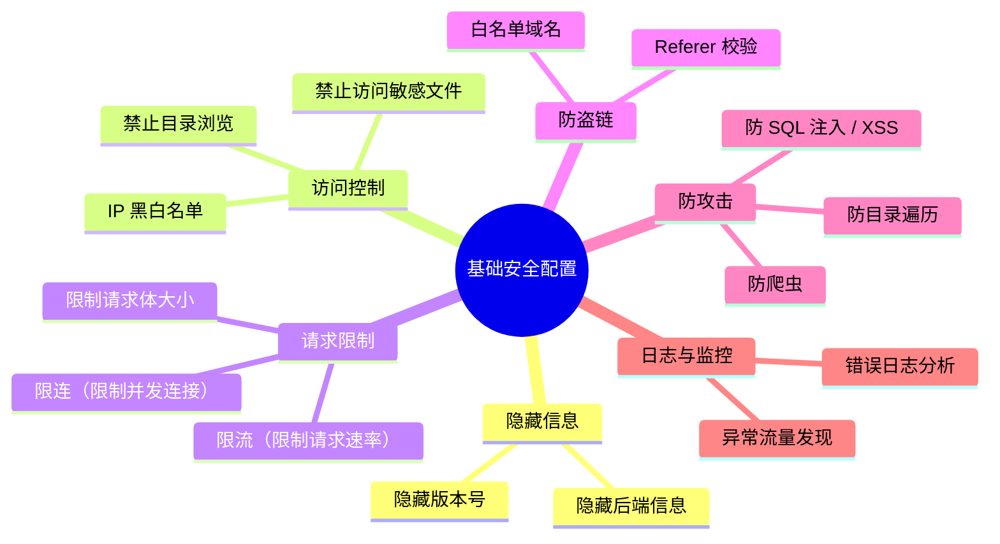
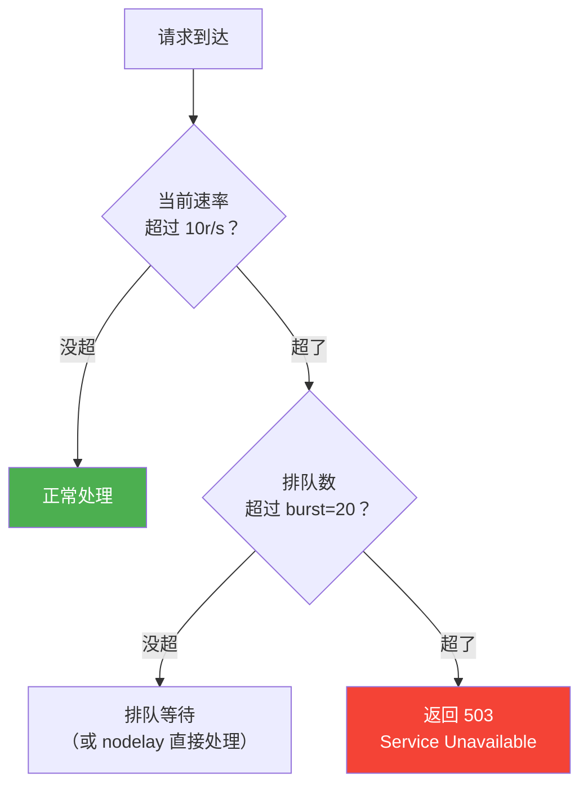

# 基础安全配置

## 本篇目标



---

## 隐藏 Nginx 版本号

默认情况下，Nginx 会在 HTTP 响应头和错误页面里暴露版本号：

```http
Server: nginx/1.24.0
```

这等于告诉攻击者你用的什么版本，他可以直接搜对应版本的已知漏洞。

关掉它：

```nginx
http {
    server_tokens off;
}
```

关掉之后响应头变成：

```http
Server: nginx
```

错误页面也不再显示版本号。一行配置，没有任何副作用。

::: tip 更进一步
如果连 `Server: nginx` 都不想暴露（不想让别人知道你用的是 Nginx），需要编译安装时修改源码，或者用 `headers-more-nginx-module` 模块：
```nginx
more_clear_headers Server;
```
一般隐藏版本号就够了，不需要这么极端。
:::

---

## IP 黑白名单

### 白名单：只允许特定 IP 访问

管理后台只有公司内网能访问：

```nginx
location /admin/ {
    allow 192.168.1.0/24;    # 公司内网网段
    allow 10.0.0.0/8;        # 内部服务器网段
    deny all;                 # 其他全部拒绝
}
```

### 黑名单：封禁恶意 IP

某个 IP 一直在扫你的接口：

```nginx
# 直接在 server 或 http 块里封
deny 1.2.3.4;
deny 5.6.7.0/24;
```

### 用独立文件管理黑名单

IP 多了直接写在配置里太乱，抽成文件：

```nginx
# /etc/nginx/blocklist.conf
deny 1.2.3.4;
deny 5.6.7.8;
deny 9.10.11.0/24;
```

```nginx
# nginx.conf 里引用
http {
    include /etc/nginx/blocklist.conf;
    # ...
}
```

新增要封的 IP 时，改 `blocklist.conf` 然后 `nginx -s reload` 就行。

::: tip 自动封禁
手动维护黑名单太累。可以用 `fail2ban` 自动分析 Nginx 日志，发现异常访问（比如短时间内大量 404）自动加到防火墙规则里。后面排查章节会细说。
:::

---

## 禁止目录浏览

Nginx 默认就是关闭目录浏览的，但如果你或别人曾经打开过 `autoindex on`，某些目录下没有 index.html 时，访问者能看到整个目录列表——包括你不想被看到的文件。

确保关闭：

```nginx
server {
    autoindex off;  # 禁止目录列表
}
```

---

## 禁止访问敏感文件

项目里有些文件绝对不能被外部访问到：

```nginx
# 禁止访问隐藏文件（.git, .env, .htaccess 等）
location ~ /\. {
    deny all;
    return 404;
}

# 禁止访问备份文件
location ~* \.(bak|sql|tar\.gz|zip|log)$ {
    deny all;
    return 404;
}

# 禁止直接访问配置文件
location ~* (\.yml|\.yaml|\.properties|\.xml|\.json)$ {
    deny all;
    return 404;
}
```

为什么这很重要？真实案例：

| 被访问到的文件 | 后果 |
|--------------|------|
| `.git/` 目录 | 攻击者可以还原整个代码仓库 |
| `.env` 文件 | 数据库密码、API Key 全泄露 |
| `dump.sql` | 整个数据库被下载 |
| `application.yml` | 生产环境配置暴露 |

---

## 请求限流（限制请求速率）

防止某个 IP 暴力请求接口（刷接口、撞库、CC 攻击）。

### 基本限流配置

```nginx
http {
    # 定义限流区域：按客户端 IP 限制，10m 内存，每秒 10 个请求
    limit_req_zone $binary_remote_addr zone=api_limit:10m rate=10r/s;

    server {
        location /api/ {
            # 应用限流：突发最多允许 20 个排队，不延迟
            limit_req zone=api_limit burst=20 nodelay;

            proxy_pass http://127.0.0.1:8080;
        }
    }
}
```

### 参数解释

| 参数 | 含义 |
|------|------|
| `$binary_remote_addr` | 按客户端 IP 做限流（二进制格式省内存） |
| `zone=api_limit:10m` | 限流区域名字叫 api_limit，用 10MB 内存存状态 |
| `rate=10r/s` | 每秒最多 10 个请求 |
| `burst=20` | 允许突发 20 个请求排队（应对短时高峰） |
| `nodelay` | 突发请求不等待，直接处理（超出 burst 的才拒绝） |

### 限流的工作流程



### 针对不同接口设不同限流

登录接口被暴力破解的风险最大，限制严一点：

```nginx
http {
    # 通用接口：每秒 20 个
    limit_req_zone $binary_remote_addr zone=general:10m rate=20r/s;

    # 登录接口：每秒 3 个（防撞库）
    limit_req_zone $binary_remote_addr zone=login:10m rate=3r/s;

    server {
        location /api/ {
            limit_req zone=general burst=40 nodelay;
            proxy_pass http://127.0.0.1:8080;
        }

        location /api/login {
            limit_req zone=login burst=5 nodelay;
            proxy_pass http://127.0.0.1:8080;
        }
    }
}
```

### 自定义限流返回

被限流时默认返回 503，可以改成自定义的 JSON 响应，方便前端处理：

```nginx
# 限流返回 429（Too Many Requests）
limit_req_status 429;

# 或者返回自定义错误页
error_page 429 /429.json;
location = /429.json {
    default_type application/json;
    return 429 '{"code":429,"message":"请求太频繁，请稍后再试"}';
}
```

---

## 限制并发连接数

除了限制每秒请求数，还可以限制同一个 IP 同时建立的连接数：

```nginx
http {
    # 按 IP 限制并发连接，10m 内存
    limit_conn_zone $binary_remote_addr zone=conn_limit:10m;

    server {
        # 同一 IP 最多 50 个并发连接
        limit_conn conn_limit 50;

        # 下载接口限制更严（防止一个人占满带宽）
        location /download/ {
            limit_conn conn_limit 5;         # 同一 IP 最多 5 个并发下载
            limit_rate 1m;                   # 每个连接限速 1MB/s
        }
    }
}
```

`limit_rate` 可以限制每个连接的下载速度，防止单用户占满服务器带宽。

---

## 限制请求体大小

防止恶意上传超大文件把磁盘撑爆：

```nginx
http {
    # 全局默认：最大 10MB
    client_max_body_size 10m;

    server {
        # 普通 API：1MB 足够（大部分 JSON 不会超过几 KB）
        location /api/ {
            client_max_body_size 1m;
        }

        # 上传接口：放大到 100MB
        location /api/upload/ {
            client_max_body_size 100m;
        }
    }
}
```

超过限制的请求直接返回 `413 Request Entity Too Large`，后端根本收不到。

---

## 防盗链

你的图片/视频存在自己的服务器上，别人的网站直接引用你的 URL，流量费却是你出。

### 基本防盗链

```nginx
location ~* \.(jpg|jpeg|png|gif|webp|mp4|mp3)$ {
    # 合法来源
    valid_referers none blocked server_names
        *.example.com
        *.example.cn
        ~\.google\.
        ~\.baidu\.;

    # 不合法的来源 → 返回 403 或替换成一张"防盗链提示图"
    if ($invalid_referer) {
        return 403;
        # 或者返回一张提示图
        # rewrite ^/ /images/hotlink-denied.png break;
    }

    # 正常的图片响应
    root /data/www;
    expires 7d;
}
```

### valid_referers 参数说明

| 参数 | 含义 |
|------|------|
| `none` | 允许没有 Referer 的请求（直接在浏览器地址栏输入 URL） |
| `blocked` | 允许 Referer 被防火墙删除的请求 |
| `server_names` | 允许当前 server_name 的请求 |
| `*.example.com` | 允许自己域名的子域名 |
| `~\.google\.` | 正则匹配，允许搜索引擎（图片搜索跳转） |

::: tip
`none` 一般要加上，否则用户直接打开图片链接会被拦。搜索引擎也建议加白名单，否则图片搜索结果里你的图片显示不了，损失流量。
:::

---

## 防爬虫（User-Agent 过滤）

一些恶意爬虫会疯狂抓取你的站点内容，可以按 User-Agent 拦截：

```nginx
# 屏蔽常见恶意爬虫
if ($http_user_agent ~* (SemrushBot|AhrefsBot|MJ12bot|DotBot|BLEXBot)) {
    return 403;
}

# 屏蔽空 User-Agent（通常是脚本请求）
if ($http_user_agent = "") {
    return 403;
}
```

::: warning 不要误封
不要封 `Googlebot`、`Baiduspider`、`bingbot` 这些正规搜索引擎爬虫，否则你的网站不会被搜索引擎收录。
:::

---

## 防止常见攻击

### 拦截 SQL 注入特征

在 URL 里出现明显的 SQL 注入特征，直接拒绝：

```nginx
# 拦截 URL 中的 SQL 注入关键词
if ($query_string ~* "(union|select|insert|delete|drop|update|exec|script|<|>|'|%27)") {
    return 403;
}
```

### 拦截目录遍历

防止通过 `../` 跳出目录：

```nginx
# 拦截路径中的目录遍历尝试
if ($uri ~* "\.\.") {
    return 403;
}
```

### 限制请求方法

大部分站点只需要 GET 和 POST，其他方法（DELETE、TRACE 等）可以关掉：

```nginx
# 只允许 GET、POST、HEAD
if ($request_method !~ ^(GET|POST|HEAD)$) {
    return 405;
}
```

::: warning 注意
如果你的后端是 RESTful API（用了 PUT、DELETE 等方法），**不要加这个限制**，否则接口会挂。这个配置适合纯展示型站点。
:::

---

## 禁止特定路径的外网访问

有些路径只有内部系统调用，不应该对外暴露：

```nginx
# 健康检查接口（只允许内网和负载均衡调用）
location /actuator/ {
    allow 127.0.0.1;
    allow 192.168.0.0/16;
    allow 10.0.0.0/8;
    deny all;
}

# Swagger 文档（只在开发/测试环境暴露）
location /swagger-ui/ {
    allow 192.168.1.0/24;
    deny all;
}

# Druid 监控
location /druid/ {
    allow 192.168.1.0/24;
    deny all;
}
```

Spring Boot 的 `/actuator` 暴露在公网是非常危险的，能看到环境变量、数据库连接信息，甚至可以关停应用。

---

## 安全配置汇总模板

把前面的配置整合在一起：

```nginx
http {
    # ===== 隐藏版本号 =====
    server_tokens off;

    # ===== 限流定义 =====
    limit_req_zone $binary_remote_addr zone=general:10m rate=20r/s;
    limit_req_zone $binary_remote_addr zone=login:10m rate=3r/s;
    limit_conn_zone $binary_remote_addr zone=conn_limit:10m;

    # ===== 全局请求体限制 =====
    client_max_body_size 10m;

    # ===== 引入 IP 黑名单 =====
    include /etc/nginx/blocklist.conf;

    server {
        listen 443 ssl http2;
        server_name www.example.com;

        # ... SSL 配置省略 ...

        # ===== 并发连接限制 =====
        limit_conn conn_limit 50;

        # ===== 安全响应头 =====
        add_header X-Frame-Options "SAMEORIGIN" always;
        add_header X-Content-Type-Options "nosniff" always;
        add_header X-XSS-Protection "1; mode=block" always;
        add_header Strict-Transport-Security "max-age=31536000" always;

        # ===== 禁止访问隐藏文件 =====
        location ~ /\. {
            deny all;
            return 404;
        }

        # ===== 禁止访问备份和配置文件 =====
        location ~* \.(bak|sql|tar\.gz|zip|log|yml|properties)$ {
            deny all;
            return 404;
        }

        # ===== 防爬虫 =====
        if ($http_user_agent ~* (SemrushBot|AhrefsBot|MJ12bot|DotBot)) {
            return 403;
        }

        # ===== 前端 =====
        location / {
            root /data/www/dist;
            try_files $uri $uri/ /index.html;
        }

        # ===== API（通用限流） =====
        location /api/ {
            limit_req zone=general burst=40 nodelay;
            proxy_pass http://127.0.0.1:8080;
            proxy_set_header Host $host;
            proxy_set_header X-Real-IP $remote_addr;
            proxy_set_header X-Forwarded-For $proxy_add_x_forwarded_for;
        }

        # ===== 登录接口（严格限流） =====
        location /api/login {
            limit_req zone=login burst=5 nodelay;
            proxy_pass http://127.0.0.1:8080;
            proxy_set_header Host $host;
            proxy_set_header X-Real-IP $remote_addr;
        }

        # ===== 内部接口（禁止外网） =====
        location /actuator/ {
            allow 127.0.0.1;
            allow 192.168.0.0/16;
            deny all;
        }

        # ===== 防盗链 =====
        location ~* \.(jpg|jpeg|png|gif|webp|mp4)$ {
            valid_referers none blocked server_names *.example.com;
            if ($invalid_referer) {
                return 403;
            }
            root /data/www;
            expires 7d;
        }
    }
}
```

---

## 安全检查清单

上线前过一遍这个清单：

| 检查项 | 配置 | 是否完成 |
|--------|------|:--------:|
| 隐藏版本号 | `server_tokens off` | ☐ |
| HTTPS + HTTP/2 | `listen 443 ssl http2` | ☐ |
| HTTP 跳转 HTTPS | `return 301 https://...` | ☐ |
| HSTS 头 | `Strict-Transport-Security` | ☐ |
| 禁止访问隐藏文件 | `location ~ /\. { deny all; }` | ☐ |
| 禁止目录浏览 | `autoindex off` | ☐ |
| 请求限流 | `limit_req_zone` + `limit_req` | ☐ |
| 登录接口单独限流 | 更严格的 rate | ☐ |
| 请求体大小限制 | `client_max_body_size` | ☐ |
| 内部接口 IP 限制 | `/actuator/` 只允许内网 | ☐ |
| 安全响应头 | X-Frame / nosniff / XSS | ☐ |
| 防盗链 | `valid_referers` | ☐ |

---

## 本篇小结

| 知识点 | 核心配置 |
|--------|---------|
| 隐藏版本号 | `server_tokens off` |
| IP 黑白名单 | `allow` / `deny` + include 文件 |
| 请求限流 | `limit_req_zone` + `burst` + `nodelay` |
| 并发限制 | `limit_conn_zone` + `limit_conn` |
| 防盗链 | `valid_referers` + `$invalid_referer` |
| 禁止敏感文件 | `location ~ /\.` + `deny all` |
| 防爬虫 | `$http_user_agent` 正则匹配 |
| 内部接口保护 | `/actuator/` 白名单 IP |

HTTPS 与安全这一章到这里就结束了。下一章我们进入生产实践——性能调优和常见问题排查。
