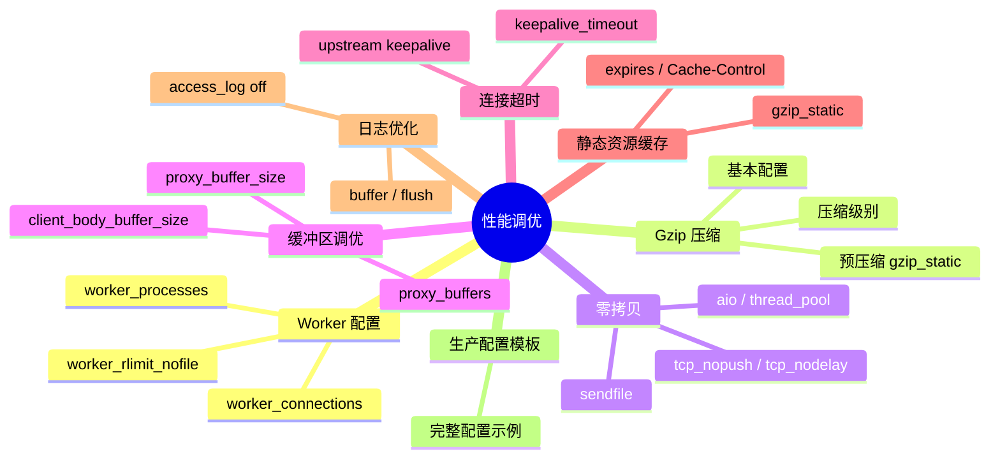
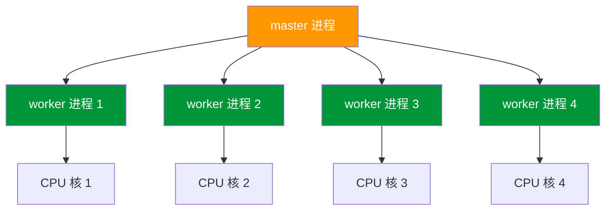
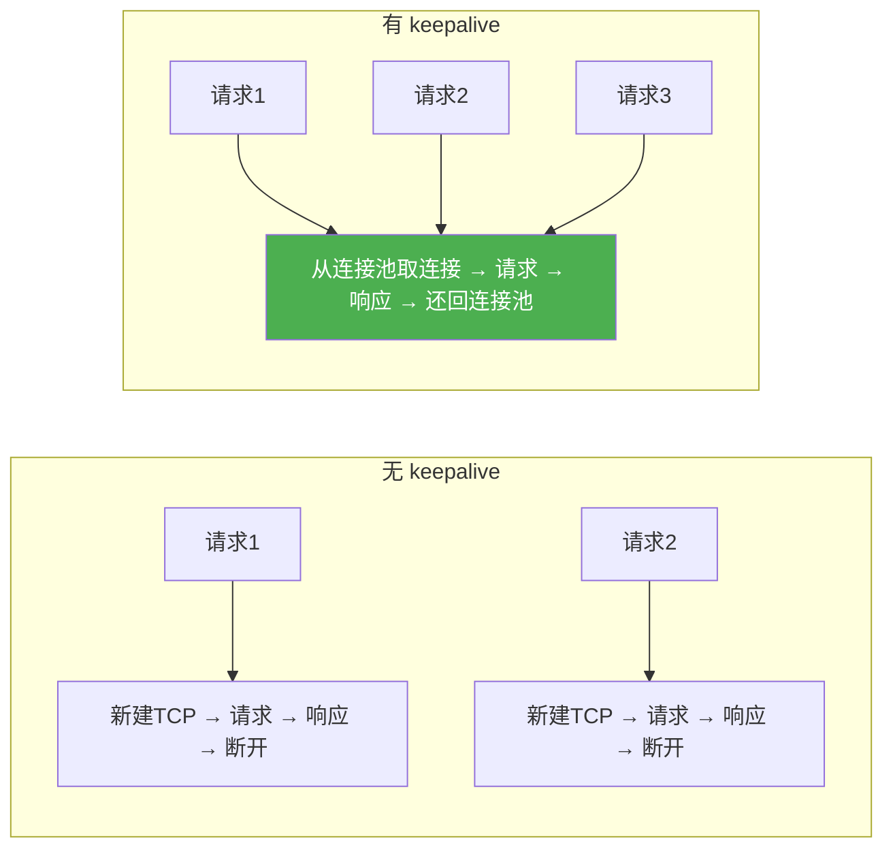

# 性能调优

## 本篇目标



---

## 为什么需要性能调优

Nginx 默认配置是"通用型"，适合所有场景但没有针对性优化。生产环境跑起来后，默认配置往往造成资源浪费——CPU 空转、内存没用满、连接排队。

调优能带来什么？

| 指标 | 默认配置 | 调优后 | 提升幅度 |
|------|----------|--------|----------|
| 并发能力 | 数百 | 数万 | ~10-50× |
| 吞吐量 | 慢 | 快 | ~2-5× |
| 延迟 | 高 | 低 | ~30-50%↓ |
| CPU 利用率 | 低效 | 高效 | 更低 |
| 内存占用 | 固定 | 合理 | 更低 |

以下场景强烈建议调优：
- 单机 QPS 超过 1000
- 静态资源服务（图片/CSS/JS）
- 高并发长连接场景（WebSocket、小程序 API）
- 内存紧张的环境

---

## Worker 进程配置

Nginx 是多进程模型，一个 `master` 进程负责管理，`worker` 进程负责处理请求。Worker 配置是否合理，直接决定 Nginx 能扛多少并发。

### worker_processes：开多少个 Worker

每个 Worker 是一个独立进程，充分利用多核 CPU。`worker_processes` 控制开几个 Worker。

```nginx
# 推荐：auto — 自动等于 CPU 核心数
worker_processes auto;

# 手动指定（4 核 CPU）
worker_processes 4;
```



**为什么推荐 `auto`？**

你可能觉得手动指定更可控，但 `auto` 有个好处：服务器扩缩容（比如迁移到 8 核新机器）时，`worker_processes auto` 自动变成 8 个，不需要改配置。

### worker_connections：每个 Worker 能处理多少连接

单 Worker 能处理的最大并发连接数。这个数字不是 Nginx 性能的天花板，但设得太小会导致连接排队等待。

```nginx
events {
    worker_connections 1024;  # 默认 512，调大到 1024 或更高
}
```

怎么估算？

```
最大并发连接数 = worker_processes × worker_connections
```

以 4 核 CPU、1024 connections 为例：4 × 1024 = 4096 个并发连接，足够大多数场景。

如果还不够，往上调到 2048、4096 都可以。瓶颈往往不在这里，在后面的网络和后端。

### worker_rlimit_nofile：文件描述符上限

每个连接背后都是一个文件描述符（socket 也算文件）。Linux 默认单进程文件描述符上限是 1024，Nginx 开了 1024 connections 但系统上限只有 1024，实际只能跑到一半。

```nginx
worker_rlimit_nofile 65535;

events {
    worker_connections 4096;
}
```

同时需要调整系统limits：

```bash
# /etc/security/limits.conf 添加
root soft nofile 65535
root hard nofile 65535
```

### worker_cpu_affinity：CPU 绑定（可选）

把 Worker 进程绑定到特定 CPU 核，减少进程切换带来的 CPU 缓存失效开销。

```nginx
# 4 个 Worker 绑定到前 4 个核
worker_cpu_affinity 0001 0010 0100 1000;

# 或者更灵活一点
worker_cpu_affinity 0101 1010;
```

::: tip
`auto` 已经够用，`worker_cpu_affinity` 是锦上添花。只有在 CPU-intensive 场景（比如 Nginx 本身在做一些重计算）才值得用。普通场景收益很小，还增加了运维复杂度。
:::

---

## Gzip 压缩

带宽是稀缺资源，压缩能大幅减少传输体积。对文本类文件（JSON、HTML、CSS、JS）效果拔群，压缩后体积通常只有原来的 20-30%。

### 基本配置

```nginx
http {
    gzip on;                    # 开启压缩
    gzip_vary on;               # 加上 Vary: Accept-Encoding，头文件兼容 CDN 和缓存
    gzip_proxied any;           # 代理请求也压缩（不管来源）

    # 压缩哪些类型（只压缩值得压的，太小的压了浪费 CPU）
    gzip_types
        text/plain
        text/css
        text/xml
        application/json
        application/javascript
        application/xml
        application/xml+rss
        application/rss+xml
        application/atom+xml
        image/svg+xml;

    # 压缩级别 1-9，默认 1。9 最慢但压缩率最高
    # 4-6 是平衡点，静态资源建议 5-6
    gzip_comp_level 5;

    # 小于这个字节数不压（压太小文件反而不划算）
    gzip_min_length 256;

    # 压缩缓冲区
    gzip_buffers 16 8k;
}
```

### 各压缩级别对比

| 级别 | 速度 | 压缩率 | 适用场景 |
|------|------|--------|----------|
| 1 | 最快 | 最低 | 高 QPS、CPU 紧张 |
| 5 | 中等 | 中等 | **推荐默认值** |
| 6 | 较慢 | 较高 | 静态资源、CPU 有余量 |
| 9 | 最慢 | 最高 | 低 QPS、极致压缩 |

**实测参考**（一个 500KB 的 JS 文件）：

```
级别 1 → 压缩后 150KB（耗时 5ms）
级别 5 → 压缩后 120KB（耗时 15ms）
级别 9 → 压缩后 110KB（耗时 50ms）
```

大部分时候级别 5 够用，没必要死磕 9。

### 预压缩：gzip_static

压缩挺耗 CPU，尤其大文件每次请求都要重新压一遍。`gzip_static` 直接读已经压好的 `.gz` 文件，省掉压缩那一步。

```bash
# 构建时用 zopfli 或 gzip -n9 预压缩（比 Nginx 压缩更彻底）
zopfli --i1000 dist/app.js
# 或者
gzip -n9 -c dist/app.js > dist/app.js.gz
```

```nginx
http {
    gzip on;
    gzip_vary on;
    gzip_proxied any;
    gzip_types application/javascript text/css application/json;
    gzip_comp_level 5;
    gzip_min_length 256;

    # 优先返回 .gz 版本，不存在则实时压缩
    gzip_static on;
}
```

预压缩的好处：
- **零压缩 CPU 开销**（构建时一次，生产永久使用）
- **TTFB 更短**（直接返回文件，不需要等压缩完成）
- **CDN 友好**（.gz 文件可以直接推给 CDN）

---

## sendfile 与零拷贝

Linux 的 `sendfile()` 系统调用可以在内核态直接完成文件传输，不需要先把文件内容加载到用户态再发出去，省掉两次 CPU 拷贝。

### 默认 vs 开启 sendfile


配置：

```nginx
http {
    sendfile on;

    # 配合 tcp_nopush：等数据包填满了再发，减少网络小包
    tcp_nopush on;

    # 配合 tcp_nodelay：关闭 Nagle 算法，降低延迟
    tcp_nodelay on;
}
```

### tcp_nopush 和 tcp_nodelay 的配合

| 参数 | 作用 | 适用场景 |
|------|------|----------|
| `tcp_nopush on` | 等数据填满一个 MSS 再发，减少 IP 包数量 | 发送大文件 |
| `tcp_nodelay on` | 禁用 Nagle 算法，有数据立即发，降低延迟 | 小数据、实时响应 |

两者配合效果最好：大文件 `tcp_nopush` 减少包开销，小请求 `tcp_nodelay` 保证低延迟。Nginx 默认同时启用两者。

### 异步 I/O：aio 和 thread_pool

大文件下载时，如果文件不在 Page Cache 里，sendfile 会阻塞 Worker 等待磁盘。用 `aio` 异步读取，配合 `thread_pool` 多线程预读，不阻塞 Worker：

```nginx
http {
    sendfile on;
    aio on;                    # 异步 I/O
    thread_pool pool_io async=32 thread_count=4;  # 专用线程池预读文件
}

server {
    listen 80;
    server_name www.example.com;

    location /downloads/ {
        # 大文件下载走异步 I/O，不阻塞 Worker
        aio on;
        sendfile on;

        # 直接写入磁盘，不占内存（适合超大文件）
        directio 4m;
        output_buffers 1 128k;
    }
}
```

::: tip directio 的作用
`directio` 绕过 Page Cache 直接读磁盘，适合大文件（> 1MB）。小文件走 Page Cache 反而更快，没必要开。
:::

---

## 缓冲区调优

缓冲区是 Nginx 处理请求时的临时存储。配置太小 → 数据溢出 → 磁盘 I/O → 性能下降。配置太大 → 浪费内存。

### 请求相关缓冲区

```nginx
http {
    # 请求头缓冲区（通常够用）
    client_header_buffer_size 1k;

    # 请求头过大时的额外缓冲区
    large_client_header_buffers 4 8k;

    # 请求体缓冲区
    client_body_buffer_size 128k;

    # 上传文件大小限制（超过则写磁盘临时文件）
    client_max_body_size 20m;
}
```

### 代理相关缓冲区（反向代理最关键）

```nginx
http {
    # 后端响应头缓冲区（通常 4k-8k 够用）
    proxy_buffer_size 4k;

    # 后端响应体缓冲区（数量 × 大小）
    proxy_buffers 8 32k;

    # 忙碌缓冲区大小（等待数据发完前先存这里）
    proxy_busy_buffer_size 64k;

    # 超时配置
    proxy_connect_timeout 60s;
    proxy_read_timeout 60s;
    proxy_send_timeout 60s;
}
```

### 缓冲区调优思路

原则：**按需调整，先估算再测试**。

```
单请求平均响应体大小 × 预估并发请求数 = 所需 buffer 总大小
```

举例：单次 API 响应约 32KB，预估 100 并发。

```
proxy_buffers 8 32k → 单请求 256KB
100 并发 × 256KB = 25.6MB（合理范围）
```

如果响应体普遍 > 100KB，加大到 `proxy_buffers 16 64k`。

::: tip 内存估算
`proxy_buffers 8 32k` × N 个 Worker 进程，才是实际占用的内存。不是写死的。
:::

### 何时加大缓冲区

| 现象 | 原因 | 解决 |
|------|------|------|
| 后端响应正常但客户端慢 | `proxy_busy_buffer_size` 太小，发不出去 | 调大 |
| 502/504 频繁 | 后端响应体太大，缓冲区溢出写磁盘 | 加大 `proxy_buffers` |
| 上传大文件慢 | `client_body_buffer_size` 太小，写磁盘 | 加大或设 `client_max_body_size` |

---

## 连接超时与 keepalive

每个连接都要占用资源（内存、文件描述符）。timeout 设置决定连接保持多久不用还不释放。

### keepalive：长连接复用

HTTP/1.1 默认是长连接，同一个客户端发多个请求应该复用同一个 TCP 连接，不应该反复建立断开。

```nginx
http {
    # 连接保持多久（秒）
    keepalive_timeout 65;

    # 一个连接最多处理多少请求后断开
    keepalive_requests 100;
}
```

### 各类超时时间

| 参数 | 含义 | 默认值 | 建议值 |
|------|------|--------|--------|
| `keepalive_timeout` | keepalive 超时 | 75s | 65s |
| `keepalive_requests` | 单连接最大请求数 | 100 | 100 |
| `client_header_timeout` | 读取请求头超时 | 60s | 10-20s |
| `client_body_timeout` | 读取请求体超时 | 60s | 10-20s |
| `send_timeout` | 发响应超时 | 60s | 30-60s |

```nginx
http {
    # 读请求头 — 10 秒读不完就断开（防慢客户端攻击）
    client_header_timeout 10s;

    # 读请求体 — 10 秒读不完就断开
    client_body_timeout 10s;

    # 发响应 — 60 秒发不完就断开（不是后端超时，是客户端超时）
    send_timeout 60s;

    keepalive_timeout 65s;
    keepalive_requests 100;
}
```

::: tip 后端超时 vs 客户端超时
- `proxy_read_timeout`：Nginx 等后端的超时（属于后端超时）
- `send_timeout`：Nginx 等客户端的超时（属于客户端超时）
两个都要设，别设错了方向。
:::

### upstream keepalive 连接池

Nginx 到后端默认每次请求都新建 TCP 连接。高频调用下频繁建连开销大。`upstream keepalive` 复用连接：

```nginx
upstream api_servers {
    server 127.0.0.1:8080;
    server 127.0.0.1:8081;

    # 保持多少空闲长连接（建议 = 后端实例数 × 2-4）
    keepalive 32;
}

server {
    location /api/ {
        proxy_pass http://api_servers;

        # 配合 http/1.1 和空 Connection 头，复用连接
        proxy_http_version 1.1;
        proxy_set_header Connection "";
    }
}
```



---

## 静态资源缓存

静态资源（图片/CSS/JS）变化少，适合设置强缓存。减少请求量，显著提升用户感知速度。

### Expires 和 Cache-Control

```nginx
server {
    location ~* \.(js|css|png|jpg|jpeg|gif|ico|svg|woff2?|eot|ttf)$ {
        # 设置过期时间（推荐，CDN/浏览器都认）
        expires 30d;

        # 同时加 Cache-Control（更明确，推荐两者都加）
        add_header Cache-Control "public, immutable";
    }

    location / {
        root /data/www/dist;
        try_files $uri $uri/ /index.html;
    }
}
```

| 值 | 效果 | 适用场景 |
|-----|------|----------|
| `expires -1` | Cache-Control: no-cache（每次都验新鲜度） | 首页、API |
| `expires 0` | 立即过期 | 不推荐 |
| `expires 30d` | 30 天缓存 | 静态资源（hash 命名的那种） |
| `expires 1y` | 1 年缓存 | 带 content hash 的静态资源 |

### 带 content hash 的静态资源

现代前端构建工具会给文件加 hash（`app.a1b2c3d4.js`），相同文件名内容不变，变了文件名就变。这种资源可以直接缓存 1 年：

```nginx
location ~* \.[a-f0-9]{16,}\.(js|css|jpg|png|gif|ico|svg|woff2?)$ {
    expires 1y;
    add_header Cache-Control "public, immutable";
}
```

### 禁止某些路径缓存

```nginx
# HTML 通常不缓存（内容随时可能变）
location ~* \.html$ {
    expires -1;
    add_header Cache-Control "no-cache, no-store, must-revalidate";
}
```

---

## 日志优化

日志写入是有 I/O 开销的。大流量下每秒数千条日志写入可能拖慢 Nginx。

### 关闭静态资源的日志

静态资源的 access_log 记了也没用，还吃 I/O：

```nginx
server {
    # 精确关闭特定扩展名的日志
    location ~* \.(js|css|png|jpg|jpeg|gif|ico|svg|woff2?|eot|ttf)$ {
        access_log off;

        # 仍然可以设 expires
        expires 30d;
        add_header Cache-Control "public, immutable";
    }

    # 健康检查也不记日志
    location = /health {
        access_log off;
        return 200 "ok";
    }
}
```

### 日志缓冲写入

默认每写一条日志都要刷磁盘。开启 buffer 后，Nginx 先写到内存(buffer)，凑够一批再刷盘，减少 I/O 次数：

```nginx
http {
    # 用 buffer + flush 参数开启日志缓冲
    # 缓冲区 16KB，或等 5 秒强制刷盘（哪个先到用哪个）
    access_log /var/log/nginx/access.log main buffer=16k flush=5s;

    error_log /var/log/nginx/error.log warn;
}
```

### 日志格式选择

用 JSON 格式日志方便日志系统采集，同时也方便后续用 `awk` 分析：

```nginx
http {
    log_format json_log escape=json
        '{'
            '"time": "$time_iso8601",'
            '"remote_addr": "$remote_addr",'
            '"method": "$request_method",'
            '"uri": "$uri",'
            '"status": $status,'
            '"body_bytes_sent": $body_bytes_sent,'
            '"request_time": $request_time,'
            '"http_user_agent": "$http_user_agent"'
        '}';

    access_log /var/log/nginx/access.log json_log buffer=16k flush=5s;
}
```

---

## 完整生产配置模板

以下是一个包含所有优化的完整配置，适用于高并发反向代理 + 静态资源服务：

```nginx
# /etc/nginx/nginx.conf

user nginx;
worker_processes auto;
worker_rlimit_nofile 65535;

error_log /var/log/nginx/error.log warn;
pid /run/nginx.pid;

events {
    worker_connections 4096;
    use epoll;          # Linux 高效事件模型
    multi_accept on;   # 一个 accept 尽量接更多连接
}

http {
    # ===== 基础 =====
    include /etc/nginx/mime.types;
    default_type application/octet-stream;

    # ===== 日志 =====
    log_format json_log escape=json
        '{'
            '"time": "$time_iso8601",'
            '"remote_addr": "$remote_addr",'
            '"method": "$request_method",'
            '"uri": "$uri",'
            '"status": $status,'
            '"body_bytes_sent": $body_bytes_sent,'
            '"request_time": $request_time,'
            '"upstream_response_time": "$upstream_response_time",'
            '"http_user_agent": "$http_user_agent"'
        '}';

    access_log /var/log/nginx/access.log json_log buffer=16k flush=5s;
    error_log /var/log/nginx/error.log warn;

    # ===== 性能核心 =====
    sendfile on;
    tcp_nopush on;
    tcp_nodelay on;

    # ===== Gzip =====
    gzip on;
    gzip_vary on;
    gzip_proxied any;
    gzip_comp_level 5;
    gzip_min_length 256;
    gzip_types
        text/plain text/css text/xml application/json
        application/javascript application/xml application/xml+rss
        application/rss+xml application/atom+xml image/svg+xml;

    # 预压缩（构建时生成 .gz 文件）
    gzip_static on;

    # ===== Buffer =====
    client_body_buffer_size 128k;
    client_header_buffer_size 1k;
    large_client_header_buffers 4 8k;
    client_max_body_size 20m;

    # ===== 超时 =====
    keepalive_timeout 65s;
    keepalive_requests 100;
    client_header_timeout 10s;
    client_body_timeout 10s;
    send_timeout 60s;

    # ===== upstream keepalive =====
    upstream api_servers {
        server 127.0.0.1:8080;
        server 127.0.0.1:8081;
        keepalive 32;
    }

    # ===== Server =====
    server {
        listen 80;
        server_name www.example.com;

        # 前端静态资源
        location / {
            root /data/www/dist;
            index index.html;
            try_files $uri $uri/ /index.html;
        }

        # 带 hash 的静态资源，强缓存
        location ~* \.[a-f0-9]{16,}\.(js|css|jpg|png|gif|ico|svg|woff2?)$ {
            expires 1y;
            add_header Cache-Control "public, immutable";
            access_log off;
        }

        # 普通静态资源，缓存 30 天
        location ~* \.(js|css|png|jpg|jpeg|gif|ico|svg|woff2?|eot|ttf)$ {
            expires 30d;
            add_header Cache-Control "public, immutable";
            access_log off;
        }

        # HTML 不缓存
        location ~* \.html$ {
            expires -1;
            add_header Cache-Control "no-cache, no-store, must-revalidate";
        }

        # 健康检查
        location = /health {
            access_log off;
            return 200 "ok";
        }

        # 后端 API
        location /api/ {
            proxy_pass http://api_servers;

            proxy_http_version 1.1;
            proxy_set_header Connection "";

            proxy_set_header Host $host;
            proxy_set_header X-Real-IP $remote_addr;
            proxy_set_header X-Forwarded-For $proxy_add_x_forwarded_for;
            proxy_set_header X-Forwarded-Proto $scheme;

            proxy_connect_timeout 60s;
            proxy_read_timeout 60s;
            proxy_send_timeout 60s;

            proxy_buffer_size 4k;
            proxy_buffers 8 32k;
            proxy_busy_buffer_size 64k;
        }
    }
}
```

---

## 本篇小结

| 优化方向 | 核心参数 | 推荐值 |
|----------|----------|--------|
| Worker 进程 | `worker_processes` / `worker_connections` | `auto` / `1024-4096` |
| 文件描述符 | `worker_rlimit_nofile` | `65535` |
| Gzip 压缩 | `gzip on` / `gzip_comp_level` | `5`，预压缩用 `gzip_static` |
| 零拷贝 | `sendfile` / `tcp_nopush` / `tcp_nodelay` | 全部开启 |
| 异步 I/O | `aio` / `thread_pool` | 大文件下载时开启 |
| Buffer | `proxy_buffers` / `proxy_busy_buffer_size` | 按并发量调整 |
| 超时 | `keepalive_timeout` / `client_*_timeout` | `65s` / `10s` |
| upstream keepalive | `keepalive N` + `proxy_http_version 1.1` | `32` |
| 静态缓存 | `expires` / `add_header Cache-Control` | `30d` 或 `1y` |
| 日志 | `access_log off` / `buffer=` | 静态资源关闭，JSON 格式缓冲写入 |

调优不是一口气全加上。**从实际瓶颈出发**：先用 `ab` 或 `wrk` 压测找到 QPS 上不去的原因，再针对性地调整对应的参数。盲目翻倍所有 buffer 可能适得其反。

---

> 下一篇：[常见问题排查](02-common-issues.md) — 502/504/413 怎么排查，reload 和 stop 的区别。