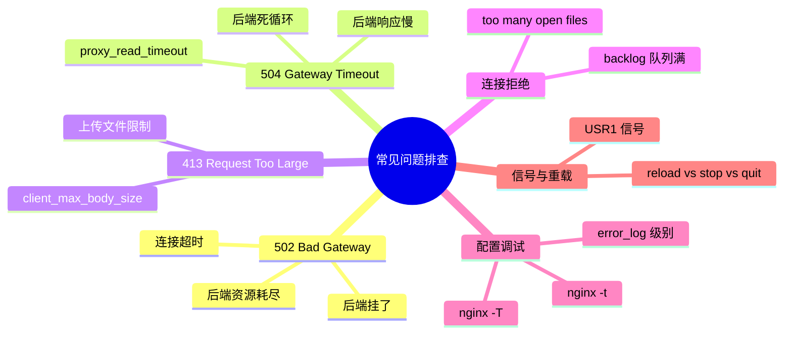
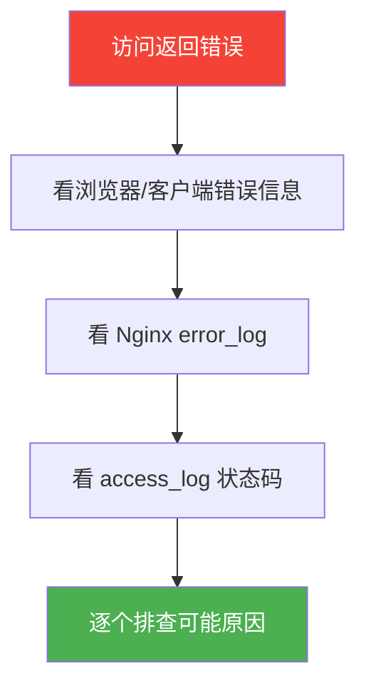
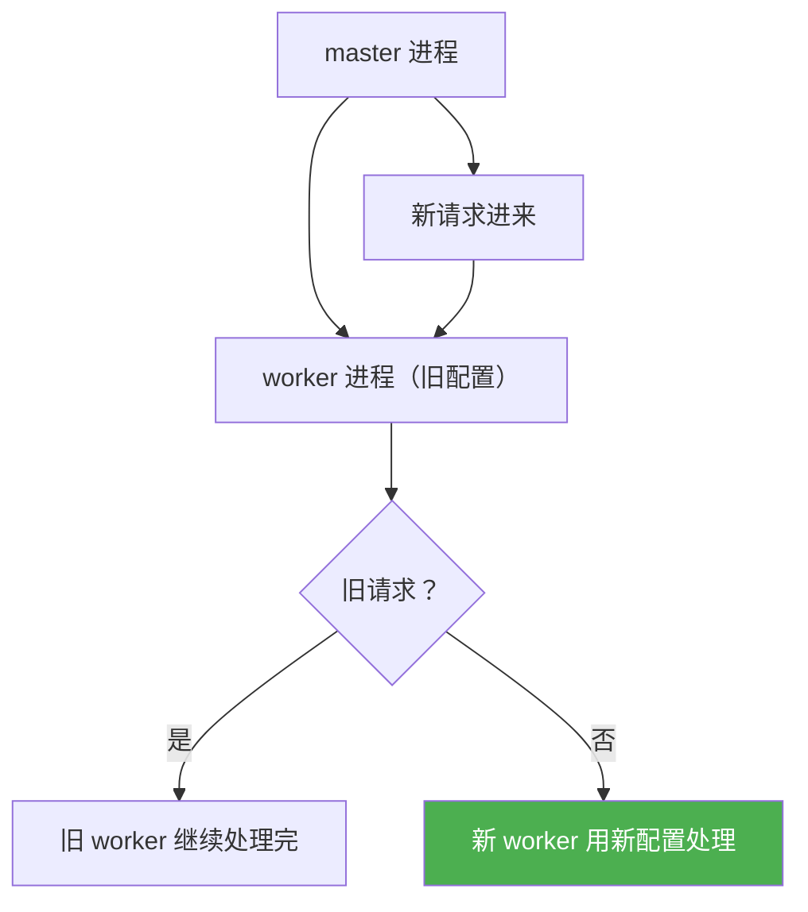

# 常见问题排查

## 本篇目标



---

## 排查前的准备工作

遇到问题先别慌，按顺序确认这几件事：



**必备命令**：

```bash
# 1. 检查 Nginx 配置语法
nginx -t

# 2. 查看错误日志（最重要的排查入口）
tail -50 /var/log/nginx/error.log

# 3. 查看 access_log 状态码分布
awk '{print $9}' /var/log/nginx/access.log | sort | uniq -c | sort -rn | head -20

# 4. 检查 Nginx 进程状态
ps aux | grep nginx

# 5. 查看端口监听
netstat -tlnp | grep nginx
```

---

## 502 Bad Gateway

502 是最常见的 Nginx 错误。字面意思是"Nginx 作为网关，从后端拿到的响应无效"。

### 常见原因一：后端服务挂了

最直接的原因——后端进程没了。Nginx 找不到可以代理的对象，只能返回 502。

```bash
# 检查后端进程是否还在
ps aux | grep java       # Java/Spring Boot
ps aux | grep node        # Node.js
ps aux | grep python      # Python

# 检查端口是否在监听
netstat -tlnp | grep 8080
```

**解决**：把后端服务重新拉起来。

### 常见原因二：后端连接超时

后端能 ping 通但响应太慢，Nginx 等不及就断了：

```nginx
# Nginx 侧：代理超时配置
location /api/ {
    proxy_pass http://127.0.0.1:8080;

    # 等待后端连接超时（建立连接）
    proxy_connect_timeout 5s;

    # 等待后端响应超时（从建立连接到开始发数据）
    proxy_read_timeout 60s;

    # 往后端发数据的超时
    proxy_send_timeout 30s;
}
```

如果后端真的慢，把 `proxy_read_timeout` 加大，或者在代码里做超时控制。

### 常见原因三：后端进程太忙（连接队列满）

后端进程没挂，但连接队列被打满了，新的进来直接被拒：

```bash
# 看后端进程状态
# 如果是 Java，看 GC 有没有问题、线程池是否满
# 如果是 Node.js，看事件循环是否阻塞

# 看系统连接数
ss -s
# 或者
netstat -an | grep 8080 | wc -l
```

**解决**：后端扩容、加机器、或者优化后端代码减少单次响应时间。

### 常见原因四：后端返回异常

后端代码抛异常（如 500 错误），Nginx 收到这个响应认为后端"无效"，返回 502。

```nginx
# 定义哪些情况要切换到下一台后端
proxy_next_upstream error timeout http_502 http_503;
```

::: tip 502 vs 504
- **502**：后端**给了响应但无效**（连接建立后收到错误数据，或直接拒绝连接）
- **504**：后端**根本没来得及给响应**（超时了）

如果你看到日志里后端响应时间很长（好几秒）才 502，基本是超时导致的 504 但被错误记录为 502。
:::

---

## 504 Gateway Timeout

504 = Nginx 等够了时间，后端还是没反应，直接断了。

### 最常见原因：后端响应慢

数据库慢查询、外部 API 超时、代码死循环……Nginx 侧 `proxy_read_timeout` 到了就只能断。

```bash
# 看后端慢在哪
# 如果是 Java：看 GC 日志、慢查询日志
# 如果是 MySQL：看慢查询日志（slow_query_log）

# 看 Nginx 日志里的 request_time
awk '{print $NF}' /var/log/nginx/access.log | sort -rn | head -10
```

### 解决方向

| 原因 | 解决 |
|------|------|
| 数据库慢查询 | 加索引、SQL 优化、读写分离 |
| 外部 API 超时 | 加本地缓存、异步处理 |
| 代码死循环/死锁 | 改代码 |
| Nginx 超时设太短 | 加大 `proxy_read_timeout` |
| 后端负载太高 | 扩容 + 限流 |

```nginx
# 如果是合理的业务慢（比如复杂报表），适当加大超时
location /report/ {
    proxy_pass http://127.0.0.1:8080;
    proxy_read_timeout 300s;  # 5 分钟，特殊情况用
}
```

---

## 413 Request Entity Too Large

上传文件时出现 413 —— 请求体超过了 Nginx 的限制。

### 解决：调整 client_max_body_size

```nginx
http {
    # 全局限制（默认 1m，太小了）
    client_max_body_size 20m;
}

server {
    # 或者只在某个 server 或 location 里调整
    location /upload/ {
        client_max_body_size 100m;
        proxy_pass http://127.0.0.1:8080;
    }
}
```

修改后记得重载配置：

```bash
nginx -s reload
```

::: tip 上传文件的完整链路
上传大文件涉及三层限制：

```
浏览器 → Nginx（client_max_body_size） → 后端（Spring Boot / body size limit）
```

Nginx 调大了，后端那边也可能有限制。
- Spring Boot：`server.tomcat.max-swallow-size` 或 `spring.servlet.multipart.max-file-size`
- 确认后端也调了对应的限制。
:::

---

## too many open files：连接数被打满

Linux 单进程默认文件描述符上限是 1024。高并发下一旦超过这个数，新连接就报 `too many open files`。

### 现象

Nginx error_log 里出现大量：

```
2026/05/31 10:30:00 [crit] 12345#12345: *6789 open() "/proc/xxx/fd/5" failed (24: too many open files)
```

Nginx worker 进程开始拒绝连接，浏览器显示连接被重置。

### 排查

```bash
# 查看当前 Nginx 进程打开了多少文件描述符
ls /proc/$(pgrep -f "nginx: worker" | head -1)/fd | wc -l

# 查看系统级别 limit
ulimit -n

# 查看进程级别 limit
cat /proc/$(pgrep -f "nginx: worker" | head -1)/limits
```

### 解决

分两步走：**Nginx 配置 + 系统 limits**。

**Nginx 侧**：

```nginx
worker_rlimit_nofile 65535;

events {
    worker_connections 4096;
}
```

**系统侧**（`/etc/security/limits.conf`）：

```
* soft nofile 65535
* hard nofile 65535
root soft nofile 65535
root hard nofile 65535
```

改完 `/etc/security/limits.conf` 后需要重新登录 shell 才生效，或者直接执行：

```bash
ulimit -n 65535
```

::: tip 文件描述符估算
一个连接 = 一个文件描述符。`worker_connections 4096` × N 个 worker = 需要的 fd 数量。保守估算：`worker_connections × worker_processes × 1.5`
:::

---

## 连接队列 backlog 满了

Nginx 和后端之间有连接队列。如果后端处理不过来，队列积压，新连接开始被拒绝。

### 现象

Nginx 侧日志出现：

```
connect() to 127.0.0.1:8080 failed (99: Cannot assign address)
```

或者客户端感受到 connection reset / connection refused。

### 解决

```bash
# 看后端端口的连接队列
# netstat 查看 Accept queue
netstat -s | grep -i "overflow"
# 或者
ss -ltn | grep :8080
```

后端侧（以 Java 为例）：

```java
// Tomcat 配置 backlog
server.tomcat.accept-count = 200;  // 积压队列大小
server.tomcat.max-threads = 200;   // 最大线程数

// Jetty
// 在启动参数里加 --acceptors 4 --selectors 16
```

Nginx 侧（`proxy_connect_timeout` 要配合）：

```nginx
upstream api_servers {
    server 127.0.0.1:8080;
    # 限制到这台后端的最大并发连接数，防止打满
    max_conns 200;
}
```

---

## 配置调试技巧

### nginx -t：检查配置语法

改完配置后，第一件事先检查语法是否正确：

```bash
nginx -t

# 输出示例（正确）
nginx: the configuration file /etc/nginx/nginx.conf syntax is ok
nginx: the configuration file /etc/nginx/nginx.conf test is successful

# 输出示例（有错误）
nginx: [emerg] "proxy_pass" cannot have URI part in location
nginx: configuration file /etc/nginx/nginx.conf test failed
```

### nginx -T：热修改后查看完整配置

`sreload` 后不确定配置是否生效，用 `-T` 打印完整配置树到 stderr：

```bash
nginx -T
```

::: tip
`-T` 会把所有 include 的文件内容也打印出来，适合排查"include 的文件有没有被加载"的问题。
:::

### error_log 级别调整

排查问题时临时降低日志级别，看到更多信息：

```nginx
http {
    # 改成 info 或 debug（需要编译时带 --with-debug）
    error_log /var/log/nginx/error.log info;
}
```

```bash
# 实时看错误日志
tail -f /var/log/nginx/error.log
```

排查完记得改回 `warn`，否则日志量太大。

### 用 curl 测试代理是否正常

```bash
# 直接测后端
curl -v http://127.0.0.1:8080/health

# 通过 Nginx 代理测
curl -v http://www.example.com/health

# 看响应头里有没有想要的信息
curl -I http://www.example.com/api/user
```

---

## 信号与重载：reload / stop / quit

### 三个命令的区别

| 命令 | 行为 | 现有连接 | 适用场景 |
|------|------|----------|----------|
| `nginx -s reload` | 平滑重载配置，不中断服务 | 保持现有连接，新连接用新配置 | **日常更新配置（用这个）** |
| `nginx -s stop` | 立即停止，快速关机 | 强制断开 | 紧急停服 |
| `nginx -s quit` | 平滑停止，等现有连接处理完才关机 | 全部处理完再关闭 | 计划停服 |

```bash
# 推荐日常用 reload
nginx -s reload

# 紧急情况用 stop
nginx -s stop

# 计划停服用 quit（等所有请求处理完）
nginx -s quit
```

### reload 不断连原理

Nginx 的 master-worker 模型让重载成为可能：



实际上是：master 收到 `reload` 信号 → 用新配置重新生成新的 worker → 旧的 worker 等所有现有连接处理完自动退出。整个过程客户端无感知。

### USR1 信号：重新打开日志文件

日志切割时需要通知 Nginx 重新打开日志文件：

```bash
# 日志文件被 mv/rename 后，通知 Nginx 重新打开
kill -USR1 $(cat /run/nginx.pid)
```

Nginx 收到 USR1 信号后，会关闭所有日志文件句柄，然后重新打开同名文件（新文件）。这样新日志就写进新文件了，旧文件可以被压缩或删除。

---

## 常见状态码排查速查表

| 状态码 | 含义 | 最常见原因 |
|--------|------|------------|
| 400 | 请求语法错误 | 请求头格式不对，URL 编码问题 |
| 403 | 禁止访问 | 文件权限不够，IP 被 deny，SELinux |
| 404 | 资源不存在 | URL 写错，文件被删，rewrite 规则问题 |
| 413 | 请求体过大 | 上传文件 > `client_max_body_size` |
| 500 | 服务器内部错误 | 后端代码异常，通常看后端日志 |
| 502 | Bad Gateway | 后端挂了 / 后端拒绝连接 / 超时 |
| 503 | Service Unavailable | 后端被标记为 down（健康检查失败） |
| 504 | Gateway Timeout | 后端响应慢，Nginx 等够了时间 |

---

## 本篇小结

| 问题 | 第一排查方向 |
|------|-------------|
| 502 | 后端进程还在吗？连接正常吗？ |
| 504 | 后端响应慢，看 request_time + 后端日志 |
| 413 | `client_max_body_size` 加了吗？后端也加了吗？ |
| too many open files | 系统 `ulimit -n` + `worker_rlimit_nofile` |
| 端口 backlog 满 | 后端 `accept-count` / `max_conns` |
| 不确定配置生效没 | `nginx -t` + `nginx -T` |
| 日志太大/IO高 | `access_log off` + `buffer=` + `logrotate` |
| 日常配置更新 | `nginx -s reload`（不要 stop） |

排查原则：先看 error_log，再看 access_log，顺藤摸瓜找到根因再动手，不要盲目调参。

---

> 生产实践模块到这里就结束了。整个 Nginx 系列从安装部署、反向代理、负载均衡、HTTPS 到生产调优，希望对你有帮助。