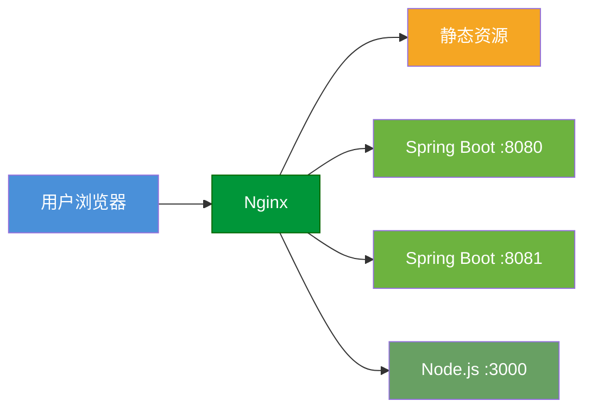
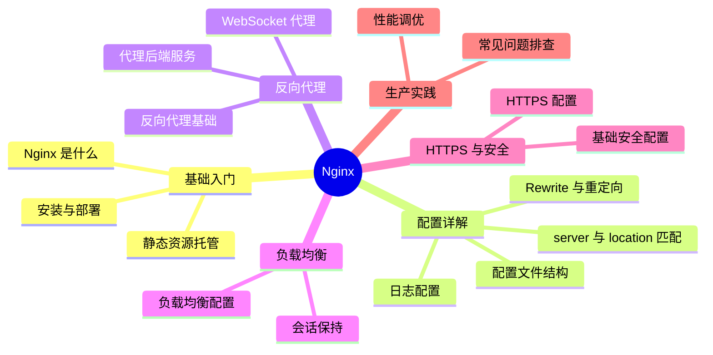
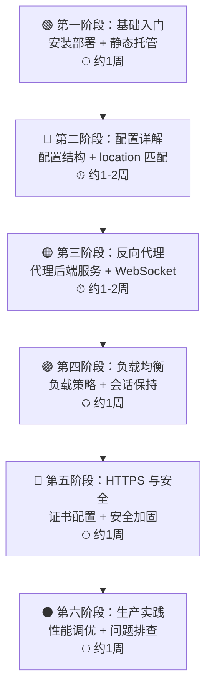

## Nginx

> Nginx 是高性能的 Web 服务器与反向代理，是后端开发必备技能。

### 为什么学 Nginx？

作为开发人员，这些场景你一定遇到过：

| 场景 | 为什么需要 Nginx |
|------|-----------------|
| 前后端分离部署，前端请求怎么转发到后端？ | Nginx 反向代理，一行 `proxy_pass` 搞定 |
| 多个服务都要用 80 端口怎么办？ | Nginx 按域名/路径分发到不同服务 |
| 本地能跑，线上 502 了？ | 看懂 Nginx 配置和日志才能排查 |
| HTTPS 证书挂在哪里？ | Nginx 做 SSL 终止，后端无需改代码 |
| 单台服务扛不住流量？ | Nginx 负载均衡，一键扩展多实例 |
| 前端打包后的静态文件放哪里？ | Nginx 直接托管，性能远超 Tomcat |

**一句话总结**：只要你的项目要上线，就绑定离不开 Nginx。

---

### Nginx 在架构中的位置



> Nginx 作为统一入口，负责请求路由、负载均衡、SSL 终止和静态资源响应。

---

### 知识体系总览



---

### 学习路径



---

### 模块导航

| 阶段 | 模块 | 核心内容 | 适用场景 |
|:----:|------|----------|----------|
| 1 | [Nginx 基础入门](01-nginx-basics/) | 安装部署、命令操作、静态托管 | 零基础入门 |
| 2 | [配置详解](02-config/) | 配置结构、location 匹配、重定向、日志 | 日常配置修改 |
| 3 | [反向代理实战](03-reverse-proxy/) | 代理后端服务、跨域、WebSocket | 前后端联调部署 |
| 4 | [负载均衡实战](04-load-balance/) | 负载策略、健康检查、Session 方案 | 多实例部署 |
| 5 | [HTTPS 与安全](05-https-security/) | SSL 证书、HTTP/2、限流防护 | 上线前安全配置 |
| 6 | [生产实践](06-ha-optimization/) | 性能调优、502/504 排查 | 线上运维排障 |

---

### 常用命令速查

```bash
# 启动
nginx

# 停止
nginx -s stop

# 平滑重载配置（不中断服务）
nginx -s reload

# 检测配置文件语法
nginx -t

# 查看版本与编译参数
nginx -V

# 指定配置文件启动
nginx -c /etc/nginx/nginx.conf
```

---

### 典型配置速览

```nginx
# 反向代理 Spring Boot
server {
    listen 80;
    server_name api.example.com;

    location / {
        proxy_pass http://127.0.0.1:8080;
        proxy_set_header Host $host;
        proxy_set_header X-Real-IP $remote_addr;
        proxy_set_header X-Forwarded-For $proxy_add_x_forwarded_for;
    }
}
```

---

> 📖 按顺序学习效果最佳，也可根据实际需要跳转到对应模块。
