大家好，我是**晓凡**。
### 写在前面

也许现在的你需要用PB完成毕业设计、需要维护远古时代的代码，又或者是你呆的公司就是要求要用PB开发项目。

不管你是出于什么原因还在使用PB，不可否认PB在数据窗口非常优秀，熟练使用之后开发数据库相关的应用非常高效

但由于PB这一框架出现得比较早，而且主要用于传统基于数据库得CS开发。

在网络、系统、数据传输等方面有很多欠缺，需要实现某些功能特别费劲，需要引入各种动态库才能实现

### 一、PB项目开发痛点

- 调用基于`http`协议开发的`webapi`接口实现方式单一
- 数据传输格式`json`数据的封装与解析不方便
- 各种加密解密或者签名算法实现比较困难
- `utf8`、`utf16`、`ansi`等字符集编码相互转换困难
- 没法处理大文件（几百兆的txt文件下载，导入）

### 二、Pbidea来了

既然PB中存在这些问题，但又不得不使用PB时。

你是不是会想PB中有没有类似与Java中`Hutool`、`fastjson`、`Log4j`等等这样的类库呢？

当然是有的，它就是今天要推荐给你的`Pbidea.dll`。

`Pbidea`是大自在大佬开发的，平常大家都喊在叔。并且该项目一直在维护中，就在昨天20230804还发布了一个新版本。

它不仅可以解决上面的痛点，还封装了很多扩展功能，方便PBer们使用。

利用它，你甚至可以使用在PB中使用`redis`、`RibbitMQ`、`kafka` 等这样的高并发组件。

还有你平常觉得在PB中很难实现的`pdf`、图片展现处理等等都能轻松实现。

这些怎么时候，在后面会一一说明

### 三、Pbidea 介绍

#### 3.1 下载

① 通过GitHub下载

https://github.com/lxb320124/pbidea

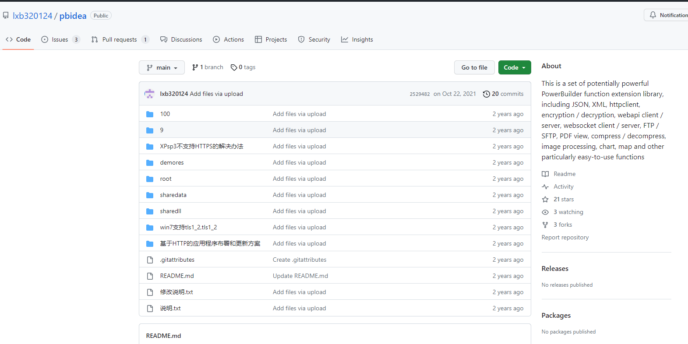

② 通过QQ群下载

> GitHub上面好像没有同步更新，如果你需要最新的需要通过QQ群文件下载。
>
> 由于这里不方便发群，小伙伴们找不到可以私信哦。最新版是昨天（2023年08月04日更新的）

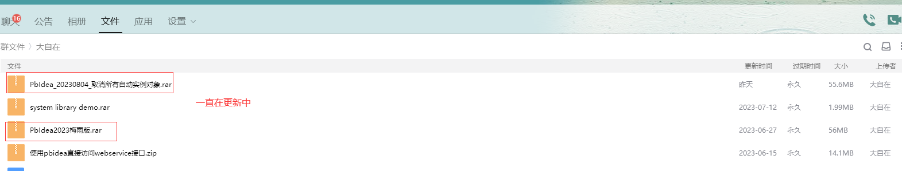

#### 3.2 文件目录简介

从上面渠道下载完项目后解压，目录如下。

你需要关注的主要是两个目录。9-->里面是基于PB9的`demo`。10-->是基于PB9以上版本的demo

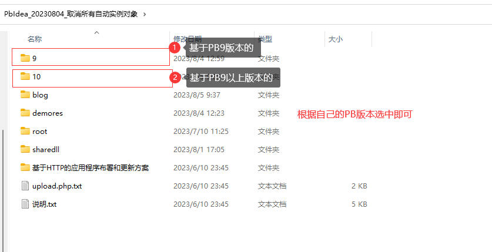

#### 3.4 运行起来

既然demo都下载下来了，那么当然是要跑起来看看了。个人电脑上安装的是PB12.5 ，所以就打开了10目录下的demo

① 打开工作空间

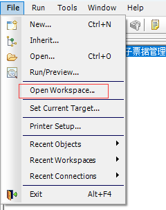

② 选择文件夹10下面的pbjson.pbw

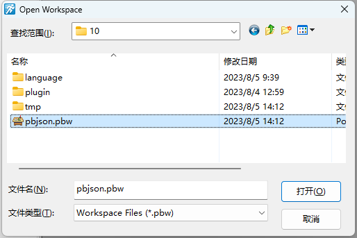

③ 直接运行

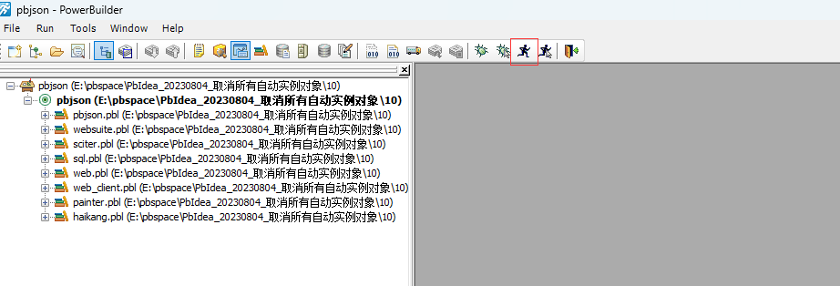

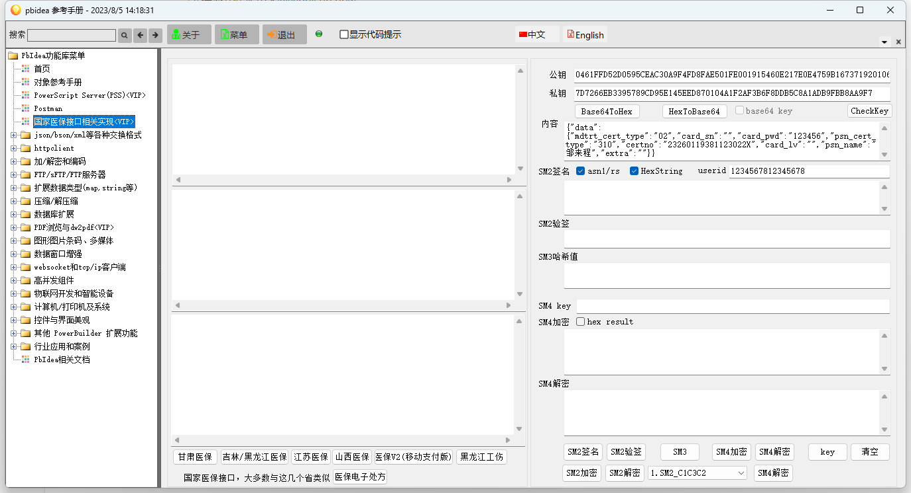

### 四、Pbidea 使用

从上面运行起来的demo中，我们可以看到，`Pbidea`包含了如下功能

- `json/bson/xml`等各种交换格式
- `httpclient`
- 加/解密和编码
- FTP/sFTP/FTP服务器
- 扩展数据类型（map,string等）
- 压缩/解压缩
- 数据库扩展
- `PDF`浏览与`dw2pdf`
- 图形图片条码、多媒体
- 数据窗口增强
- websocket和tcp/ip客户端
- 高并发组件
- 物联网开发和只能设备
- 计算机/打印及系统
- 控件与界面美观
- 其他`PowerBuilder`扩展功能
- 行业应用案例

接下来的小节中，将带大家怎么找对应功能的代码。并对部分功能简单一一说明

#### 4.1 项目代码说明

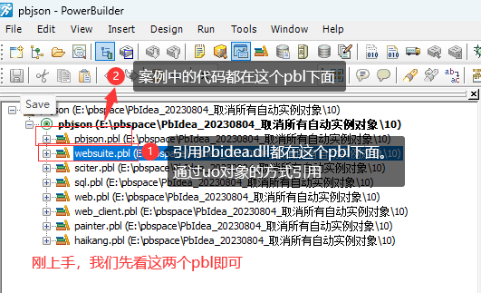

① `websuit.pbl-->uo_json` 中申明动态库

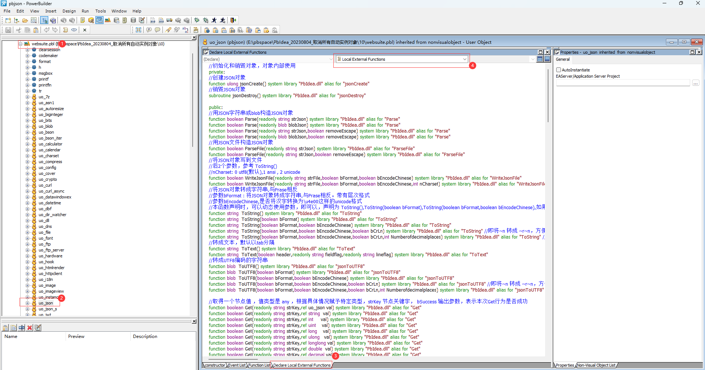

②`pbjons-->uo_tabpage_json` 调用上面申明好的动态库中方法（具体代码实现）

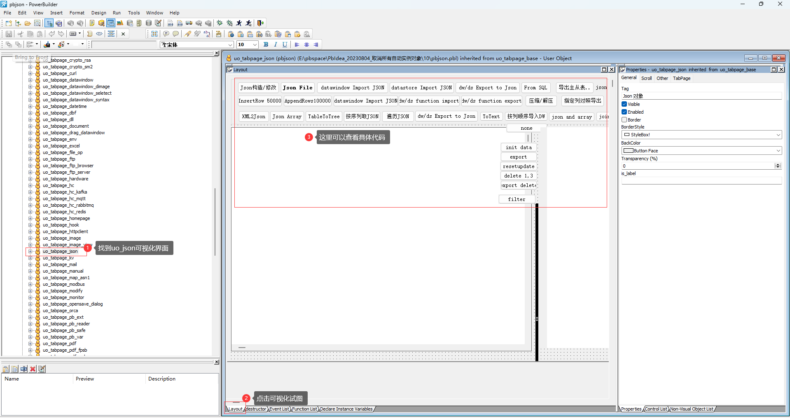

#### 4.2 `json/bson/xm`等各种交换格式 模块

①提供功能

- 快速解析和生成`json`,基于`datawinow` 导入导出
- `bson`数据的解析和生成
- `xml`文件、字符串解析和生成

②涉及uo对象及可视化uo

- `uo_json`、`uo_xml`、`uo_bjson`
- `uo_tabpage_json` 、`uo_tabpage_xml`、`uo_tabpage_bson`

③界面位置

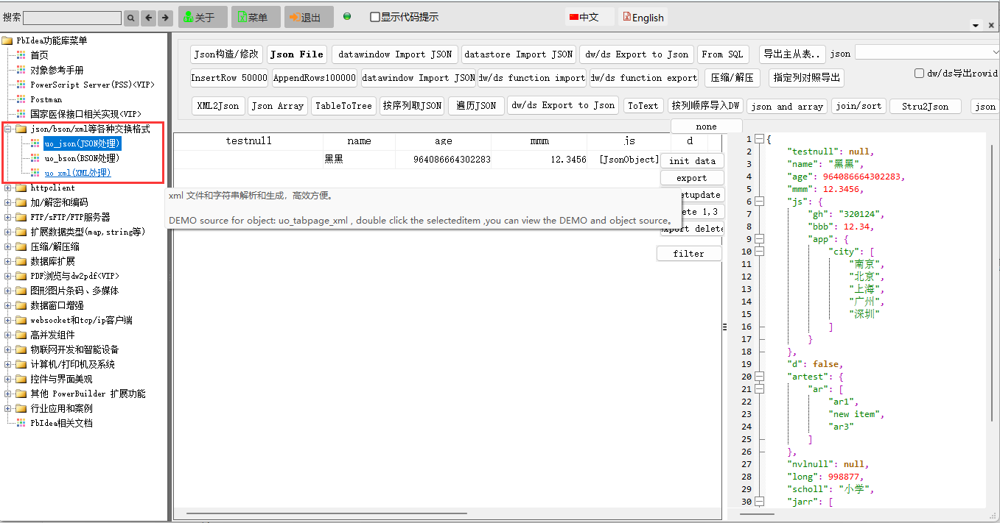

#### 4.3  `httpclient` 模块

① 提供功能

- 提供基于`Winhttp`的`http/https`协议的数据访问，封装由下载和上传功能，可以直接传输`json`对象，自带`utf8`转码
- 提供基于`libcurl`的`http/https`协议的数据访问，封装由下载和上传功能，可以直接传输`json`对象，自带`utf8`转码

②涉及uo对象及可视化uo

- `uo_httpclient`、`uo_curl`
- `uo_tabpage_httpclient` 、`uo_tabpage_curl`

③界面位置

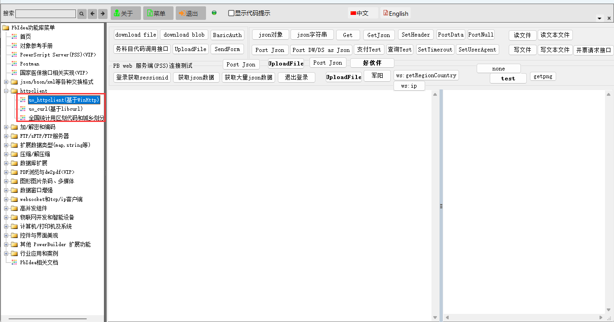

#### 4.4 加/解密和编码

> 基于openssl实现常用功能

① 提供功能

- `RSA`公钥私钥生成，加密、解密、签名和验签

- `CRC32`、`CRＣ16`、`CRC18`校验

- MD5、SHA、SM3、base64、urlencode/urldecode、timestamp等编码解密

- AES、DES、3DES、SM4 等加密解密功能

  

② 涉及uo对象及可视化uo

- `uo_crypto`
- `uo_tabpage_crypto_rsa`、`uo_tabpage_crypto_crc`、`uo_tabpage_crypto_a`、`uo_tabpage_crypto_sm2`、`uo_tabpage_crypto_asn1`

③ 截图

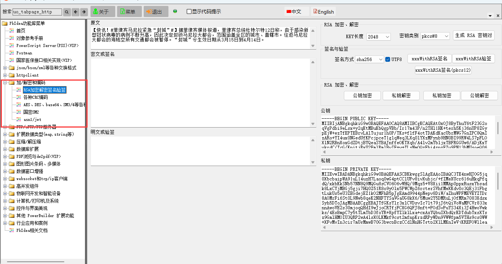

#### 4.5 FTP/sFTP/FTP服务器

① 提供功能

- 提供一个ftp服务器，可以共享本机文件给客户端
- 基于libftp,完全从底层协议实现的ftp客户端
- 基于ssh协议的FTP 客户端，除上传下载以外，还可以在服务端执行操作系统命令，相当于合并了ssh功能

②涉及uo对象及可视化uo

- `uo_ftp_server`、`uo_ftp`
- `uo_tabpage_ftp_server`、`uo_tabpage_ftp`、`uo_tabpage_ftp_browser`、`uo_tabpage_sftp`

③ 截图

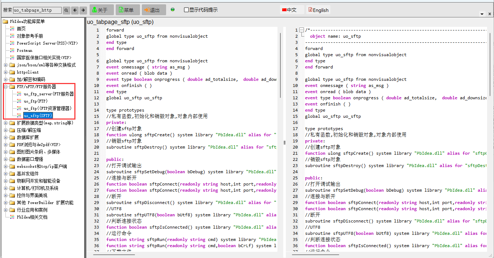

#### 4.6  扩展数据类型（map、string等）

①提供功能

- 扩展实现了map容器
- 扩展了二进制数据处理功能
- 扩展了字符串处理功能 
  - 正则表达式搜索、匹配、替换
  - 大文本按行处理
  - 字符集转换
  - 直接读写文本文件
  - 字符串分割
  - 控制台输出调试功能
- 位操作与进制转换
- 大整数`biginteger`处理功能
- 日期事件处理与计算

②涉及uo对象及可视化uo

- `uo_map`、`uo_blob`、`uo_string`、`uo_bits`、`uo_biginteger`、`uo_datatime`
- `uo_tabpage_map_asn1`、`uo_tabpage_blob`、`uo_tabpage_string`、`uo_tabpage_bits`、`uo_tabpage_biginteger`、`uo_tabpage_datatime`

③ 截图

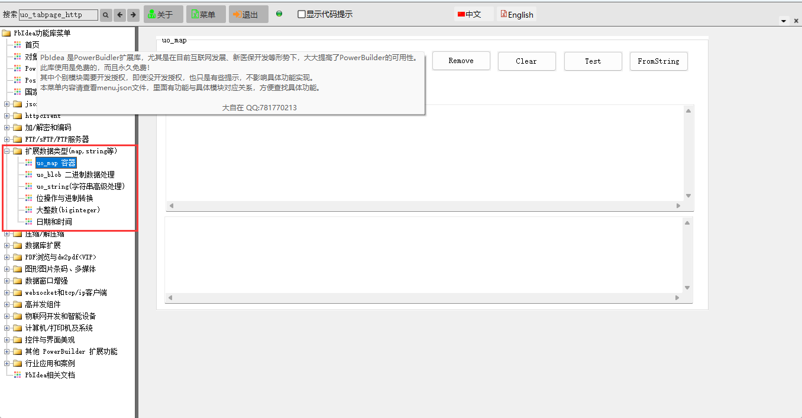

#### 4.7  压缩/解压缩

①提供功能

- 提供zip格式的压缩和解压缩功能（还可以将BLOB数据添加进压缩包，或者将压缩包内容读取到BLOB变量）
- 提供数据流压缩和解压缩功能。支持压缩、解压缩.gz格式文件

②涉及uo对象及可视化uo

- `uo_zip`、`uo_compress`
- `uo_tabpage_zip`、`uo_tabpage_compress`

③ 截图

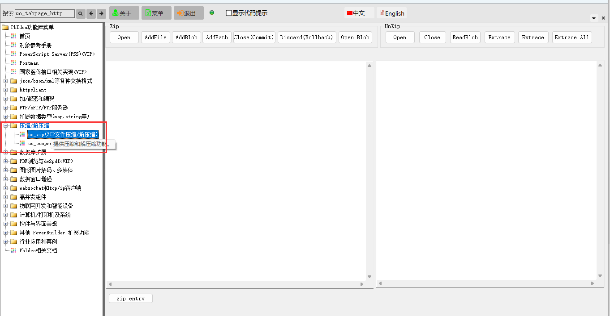

#### 4.8 数据库扩展

① 提供功能

- 提供众多数据库连接支持，快速高效范围数据库和结果集
- 自身数据库改进，支持断线检测功能
- dbf文件的导入与导出
- 解析Oracle的TNS文件为json格式
- 提供非关系型数据库的支持

②涉及uo对象及可视化uo

- `uo_database`、 `uo_transation`、`uo_dbf`、`uo_json`、`uo_kv``
- `uo_tabpage_sql`、`uo_tabpage_transation`、`uo_tabpage_dbf`、`uo_tabpage_kv`

③ 截图

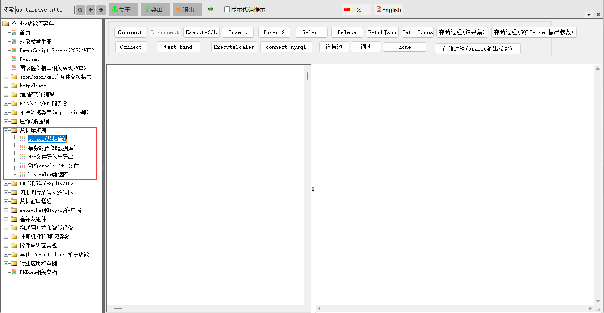

#### 4.9 PDF浏览与dw2dbf

① 提供功能

- 加载pdf文件，可打印和另存
- 将pdf文件转换成图片
- 将pdf转换为纯文本内容，可取到每个单词
- 在指定位置添加图片
- 添加手写签名
- dw生成pdf文件和图片

②涉及uo对象及可视化uo

- `uo_pdfmaker`、`uo_pdfview`
- `uo_tabpage_pdf_maker`、`uo_tabpage_pdf_view`、`uo_tabpage_pdf_fpsb`、`uo_tabpage_pdf_merge`

③ 截图

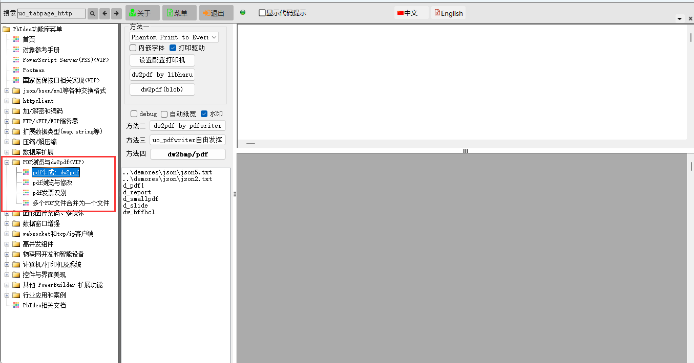

#### 4.10 图形图形条形码、多媒体

① 提供功能

- 支持bmp、jpg、png、emf、wmf、gif、tif等格式图片加载、显示转换
- 支持条码、二维码生成
- 支持条码、二维码识别
- 图片浏览控件
- 图形处理工具，类似于windows自带的绘图工具
- 音频文件合并阅读

② 涉及uo对象及可视化uo

- `uo_image`、`uo_imageview`、`uo_painter`、`uo_wavfile`、`uo_speak`、`uo_speak_recognize`

- `uo_tabpage_image`、`uo_tabpage_code`、`uo_tabpage_symbol`、`uo_tabpage_image_view`、`uo_tabpage_painter_chart_arc`、`uo_tabpage_painter_chart_area`、`uo_tabpage_painter_chart_bar`、`uo_tabpage_painter_chart_bar3d`、

  `uo_tabpage_painter_chart_barline`、`uo_tabpage_painter_chart_guage`、`uo_tabpage_painter_chart_hbar`、

  `uo_tabpage_painter_chart_line`、`uo_tabpage_painter_chart_npie`、`uo_tabpage_painter_chart_percent`、

  `uo_tabpage_painter_chart_pie`、`uo_tabpage_painter_chart_radar`、`uo_tabpage_painter_chart_scatter`、

  `uo_tabpage_painter_clip、uo_tabpage_painter_image`、`uo_tabpage_painter_re`、`uo_tabpage_wav`、

      ` uo_tabpage_speak`、`uo_tabpage_recognize`

③ 截图

#### 4.11 数据窗口增强

① 提供功能

- datawindow与excel导入与导出
- 拖拽功能，可用于排班、排房间等业务
- 超大文本文件导入（几百兆txt文件导入）
- 鼠标拖拽选取获取datawindow数据
- 数据窗口解析为json数据
- 实时生成图片

②涉及uo对象及可视化uo

- `uo_datawindowex`、`uo_drag_datawindow`、`vuo_selected_datawindow`、`uo_json`
- `uo_tabpage_excel`、`uo_tabpage_drag_datawindow`、`uo_tabpage_datawindow`、`uo_tabpage_datawindow_seletect`、

		`uo_tabpage_datawindow_syntax`、`uo_tabpage_datawindow_dimage`

③ 截图

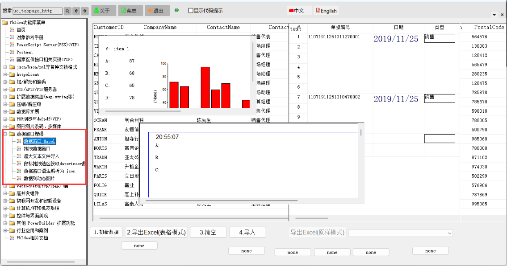

#### 4.12 websocket和tcp/ip客户端

① 提供功能

- websocket客户端
- socket客户端
- ping、支持带端口的ping
- 基于smtp协议发送邮件
- 基于pop协议接收邮件，并将接收到的邮件解析为json结构方便使用

② 涉及uo对象及可视化uo

- `uo_websocket_client`、`uo_socket_client`、`uo_mail`
- `uo_tabpage_ws_client`、`uo_tabpage_socket_client`、`uo_tabpage_ping`、`uo_tabpage_mail`

③ 截图

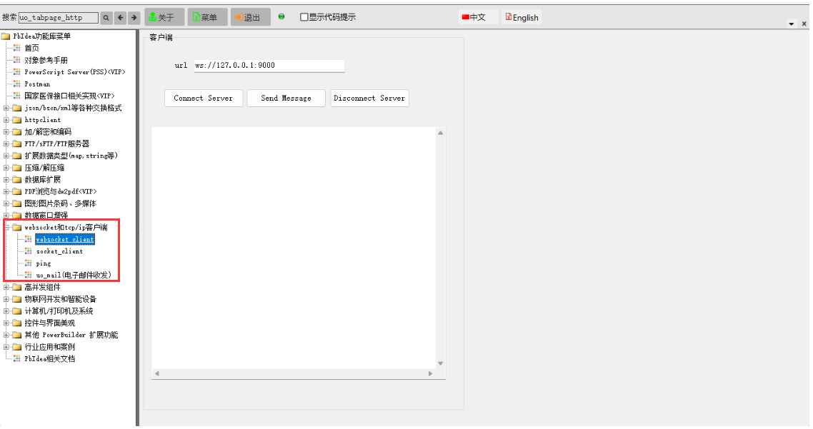

#### 4.13 高并发组件

① 提供功能

- 提供`RibbitMQ `功能
- 提供`kafka`功能
- 提供`mqtt`功能
- 提供`redis`缓存共功能

② 涉及uo对象及可视化uo

- `uo_rabbitmq`、`uo_rabbitmq_exchange`、`uo_rabbitmq_queue`、`uo_kafka_consumer`、`uo_kafka_producer`

	   `uo_mqtt`、`uo_redis`

- `uo_tabpage_hc_rabbitmq`、`uo_tabpage_hc_kafka`、`uo_tabpage_hc_mqtt`、`uo_tabpage_hc_redis`

③ 截图

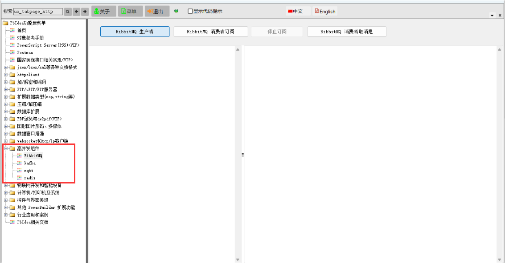

#### 4.14 物联网开发和只能设备

① 提供功能

- 提供modbus-tcp功能
- 海康指纹仪
- 串口通讯
- 读取身份证信息

②  涉及uo对象及可视化uo

- `uo_modbus_tcp`、`uo_fingerprint`、`uo_serial`、`uo_sdtapi`
- `uo_tabpage_modbus`、`uo_tabpage_fingerprint`、`uo_tabpage_serial`、`uo_tabpage_sdtapi`

③ 截图

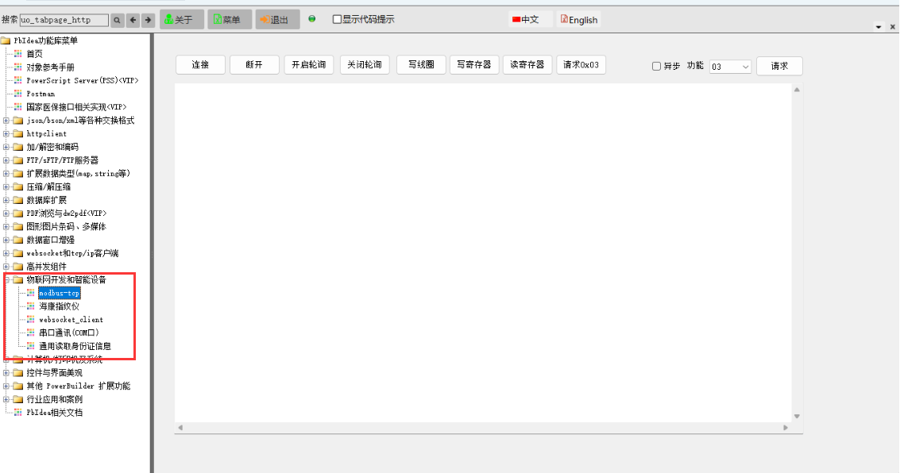

#### 1.15 计算机/打印机及系统

① 提供功能

- 打印机控制相关功能
- 无驱动打印机
- 取ip、cpu序列号等信息
- 多显示器管理
- 窗口子类化处理、拦截窗口信息，自己做出判断处理
- 多线程和进程数据共享
- 系统环境变量管理

②  涉及uo对象及可视化uo

- `uo_printer`、`uo_printer_usb`、`uo_hardware`、`uo_monitor`、`uo_subclass`、`uo_thread_factory`、`uo_thread`、`uo_sysenv`
- `uo_tabpage_printer`、`uo_tabpage_printer_usb`、`uo_tabpage_printer_hardware`、`uo_tabpage_printer_monitor`、

	   `uo_tabpage_system`、`uo_tabpage_subclass`、`uo_tabpage_thread`、`uo_tabpage_env`

③ 截图

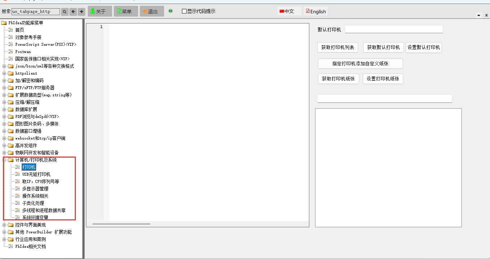

#### 1.16 控件与界面美观

① 提供功能

- 打开和保存对话框美化
- 编辑器语法高亮功能
- 计算器控件
- 漂亮日历控件，支持鼠标、键盘 操作日期可快速跳转
- 不同类型进度条
- 内置字体图标
- 基于微软最新edge webview2的浏览器控件

②  涉及uo对象及可视化uo

- `uo_scintilla`、`uo_calculator`、`uo_calendar`、`uo_wait_box`、`uo_progress`、`uo_messagewidget`、`uo_webview2`

- `uo_tabpage_opensave`、`uo_tabpage_scintilla`、`uo_tabpage_calculator`、`uo_tabpage_calendar`、`uo_tabpage_progress`、

  `uo_tabpage_awesome`、` uo_tabpage_webview2`、`uo_tabpage_webview2_2`

③ 截图

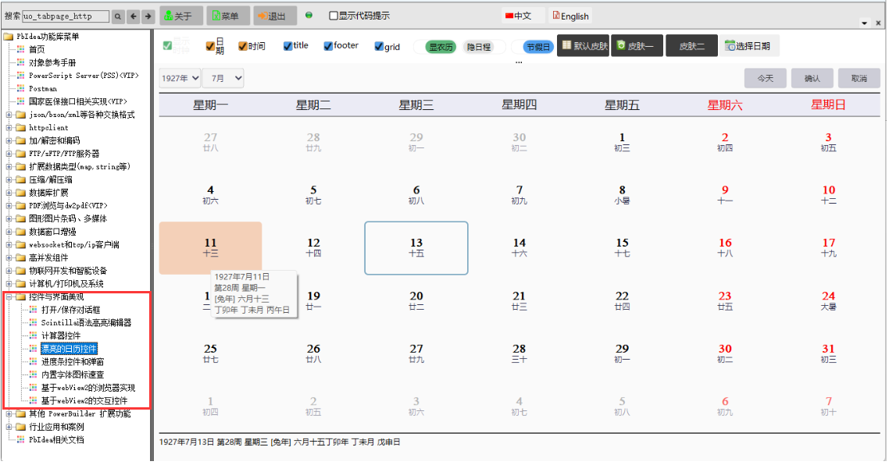

#### 1.17 其他PowerBuilder扩展功能

① 提供功能

- 各种杂项函数和功能集合
- 保护pbd不受反编译
- 文件读写操作增强功能
- dll函数调用
- pb动态编译
- 配置文件及序列化

②涉及uo对象及可视化uo

- `uo_utils`、`uo_file`、`uo_blob`、`uo_string`、`uo_logfile`、`uo_dll`、`uo_orca`、`uo_config`
- `uo_tabpage_pb_reader`、`uo_tabpage_pb_var`、`uo_tabpage_pb_safe`、`uo_tabpage_file_op`

	  `uo_tabpage_dll`、`uo_tabpage_orca`、`uo_tabpage_config`

③ 截图

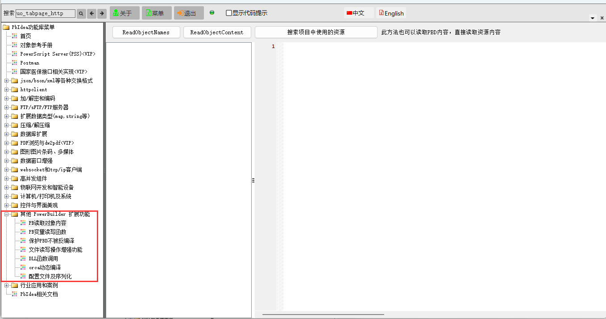

#### 1.18 行业应用和案例

① 提供的功能

- 阿里cbs签名
- 内蒙古预算管理一体化系统接口签名
- 农业银行商户接口签名
- 赣州银行开放接口平台

- 工商银行二维码被扫支付接口
- 建行互联网银企直连请求加密及返回验签方法
- 国家医保目录上传下载接口
- 诺诺企业发票接口加密

②涉及uo对象及可视化uo

- `uo_crypto`、`uo_httpclient`、`uo_curl`
- `uo_tabpage_bussess_csb`、`uo_tabpage_bussess_nmys`、`uo_tabpage_bussess_nyyhsh`、

       `uo_tabpage_bussess_gzbank`、`uo_tabpage_bussess_ghpay`、`uo_tabpage_bussess_yb_ud`、
       
       `uo_tabpage_bussess_nnfp`

③ 截图

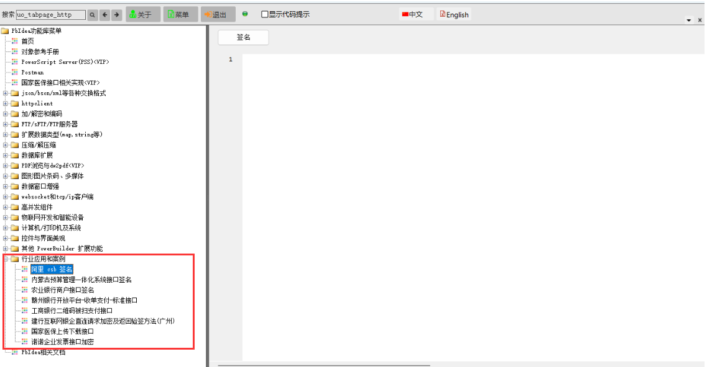

以上对`Pbidea` 提供的18个功能做了简要说明，有什么不清楚的就多看看demo。

### 五、怎么在项目中使用Pbidea

#### 5.1 新项目

如果是新项目，新建项目之后，直接将`Pbidea.dll`放入到指定路径，并将`websuite.pbl`、`sciter.pbl`、`sql.pbl`、`web.pbl`、`web_client.pbl`、`painter.pbl`、`haikang.pbl` 加入到工作空间中即可，当然了如果你只用到其中的部分功能，可以先只加入`websuite.pbl`

① 将`Pbidea.dll`拷贝到项目跟目录

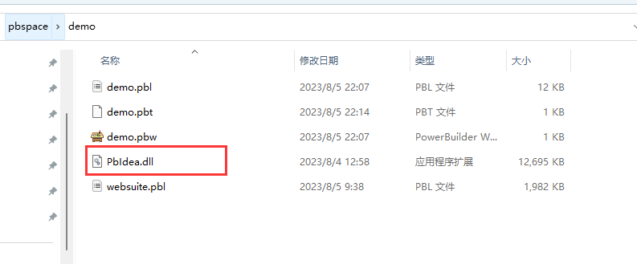

②右键选择Properties...

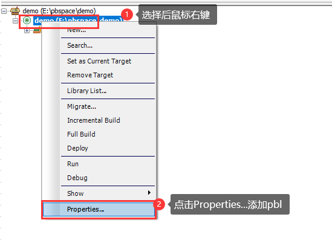

③ 选择需要添加的pbl文件（pbl文件路径和项目路径同一个目录）

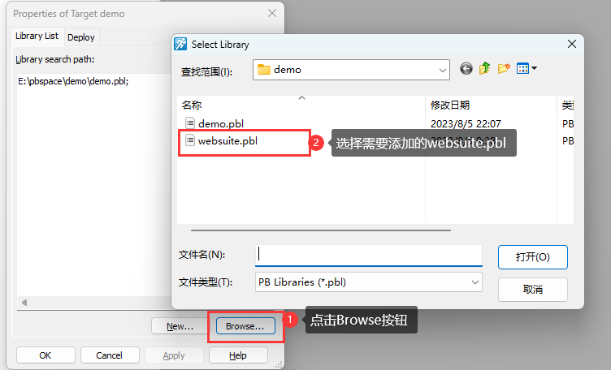

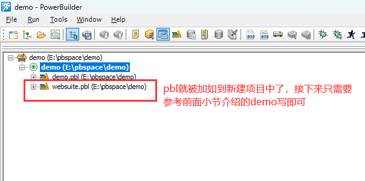

#### 5.2 老项目

如果是老项目，项目中新建的uo可能与Pbidea中的uo冲突，真个引入进去可能会影响原来代码功能

我们只能按需引入，确保引入的uo和之前项目中的uo不冲突

### 六、小结

工欲善其事必先利其器，多花费一点时间研究下`Pbidea`，尽量每个demo都点一点，做到心中有数。

当我们在工作中遇到类似的需求时，就可以参考着demo中实现即可。

用了这么久PB，`Pbidea`最好的扩展功能动态库了,没有之一

本期内容到此就结束了，希望对你有所帮助。

我们下期再见 (●'◡'●) 