---
date: 2025-09-01
title: 35PB连接Access数据库
icon: note
---

### 写在前面

这是PB案例学习笔记系列文章的第35篇，该系列文章适合具有一定PB基础的读者。

通过一个个由浅入深的编程实战案例学习，提高编程技巧，以保证小伙伴们能应付公司的各种开发需求。

文章中设计到的源码，小凡都上传到了gitee代码仓库[https://gitee.com/xiezhr/pb-project-example.git](https://gitee.com/xiezhr/pb-project-example.git)


需要源代码的小伙伴们可以自行下载查看，后续文章涉及到的案例代码也都会提交到这个仓库【**[pb-project-example](https://gitee.com/xiezhr/pb-project-example)**】

如果对小伙伴有所帮助，希望能给一个小星星⭐支持一下小凡。

### 一、小目标

我们日常开发一个应用，不管应用再小，基本上都离不开数据库的支持。

`PB`对一些主流的大型关系型数据库（`Oracle`、`SQLServer`、`MySQL`）提供了专用的数据库接口，对一些小型数据库如

(`Excel`、`Access`)数据库提供了`ODBC`接口支持。

通过本案例，我们使用`ODBC`的方式让`PB`连接`Access`数据库，并且查询数据表中数据显示出来。

最终实现效果如下


### 二、数据库准备

① 创建数据库
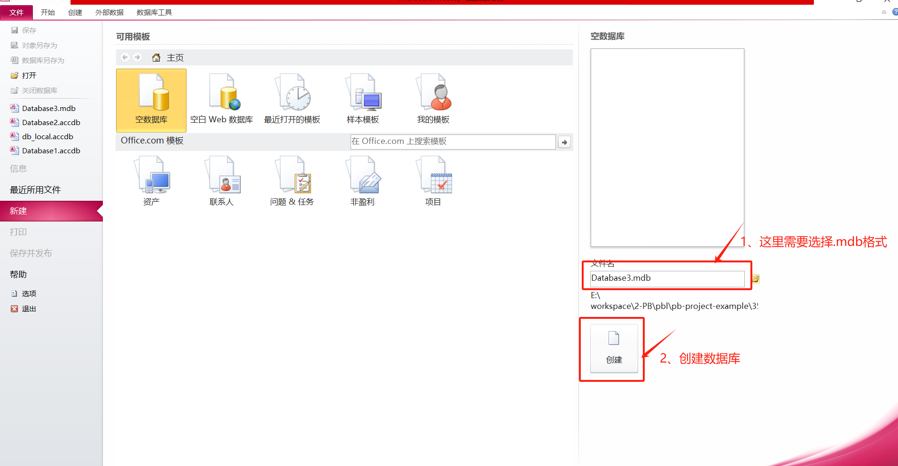

② 创建员工信息表`emp`
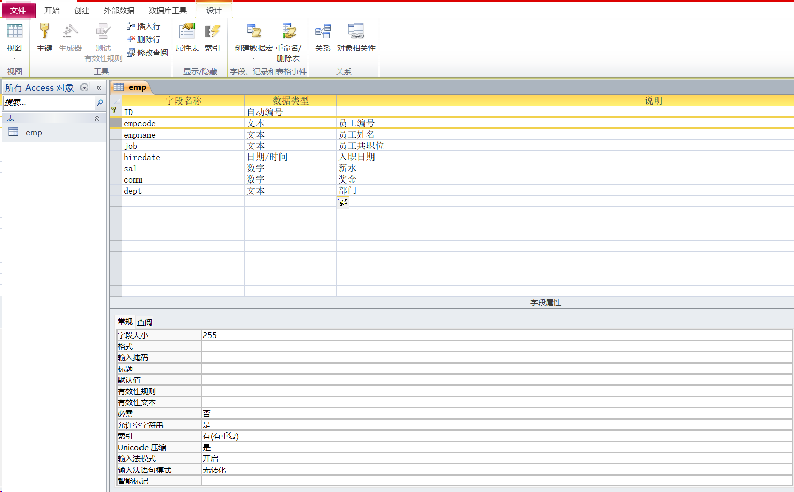

③ 插入数据，最终表数据如下
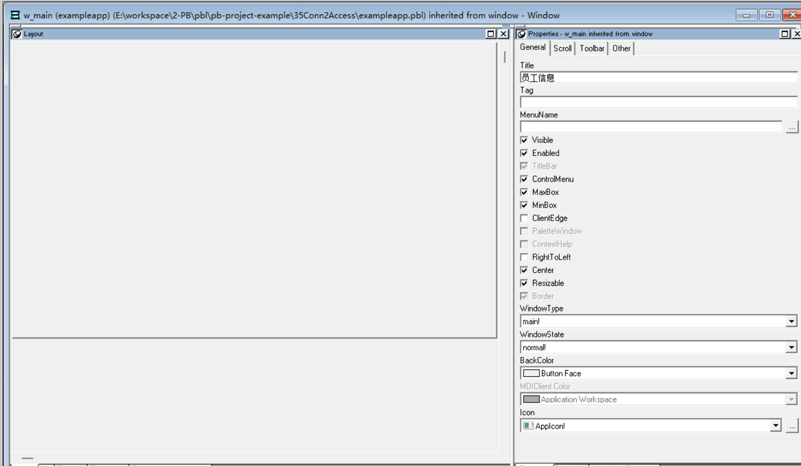


### 三、创建程序基本框架

① 新建`examplework`工作区

② 新建`exampleapp`应用

③ 新建`w_main`窗口，将`title`设置为“员工信息”
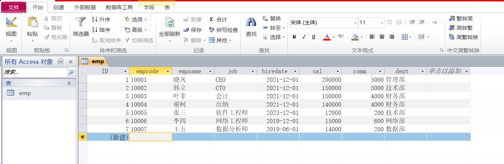


以上步骤，由于篇幅原因，这里不再赘述。忘记了的小伙伴可以翻一翻该系列文章的第一篇复习一下

### 四、配置Access数据库`ODBC`驱动

1. 启动ODBC管理工具
   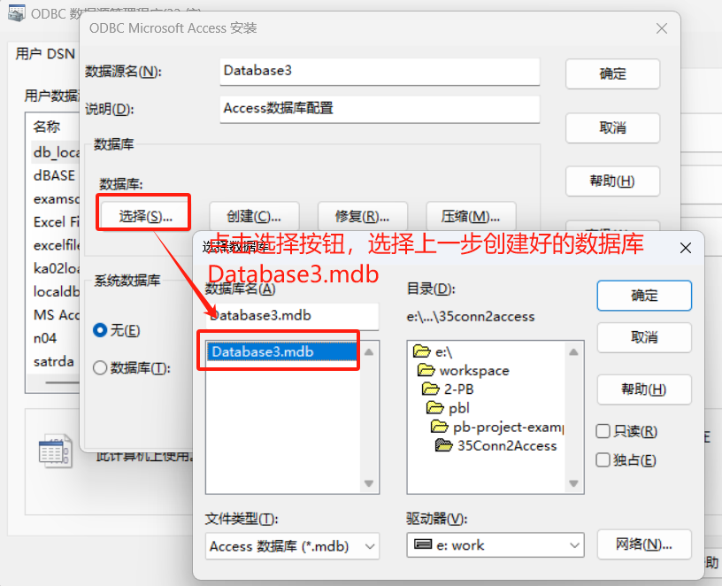
2. 新增DSN，选择Access驱动
   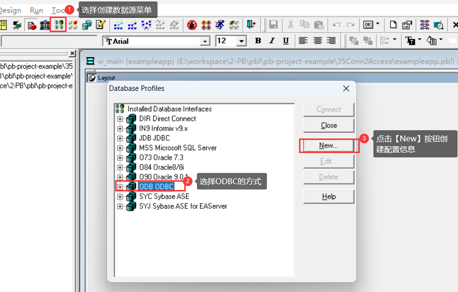
3. 选择创建好的数据库
   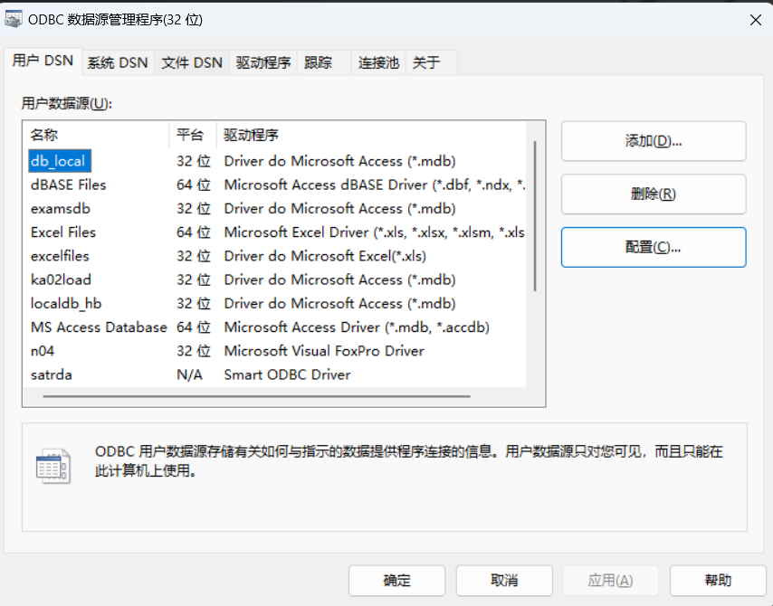
   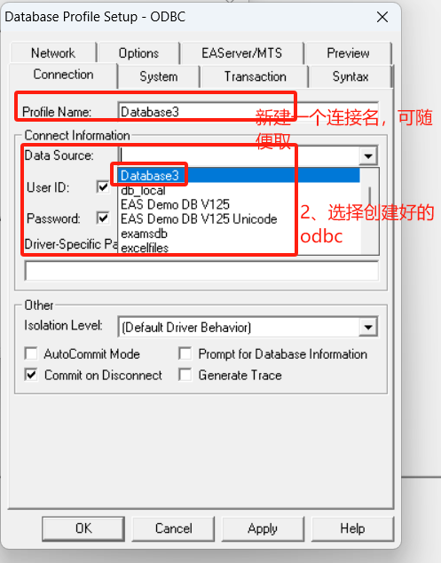

### 五、建立数据源

① 新建`DB Profile`


② 配置数据库连接信息
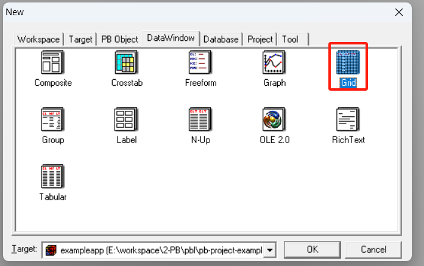


③ 测试是否连接成功

> 点击【Test Connection】按钮，出现下面提示表示连接成功

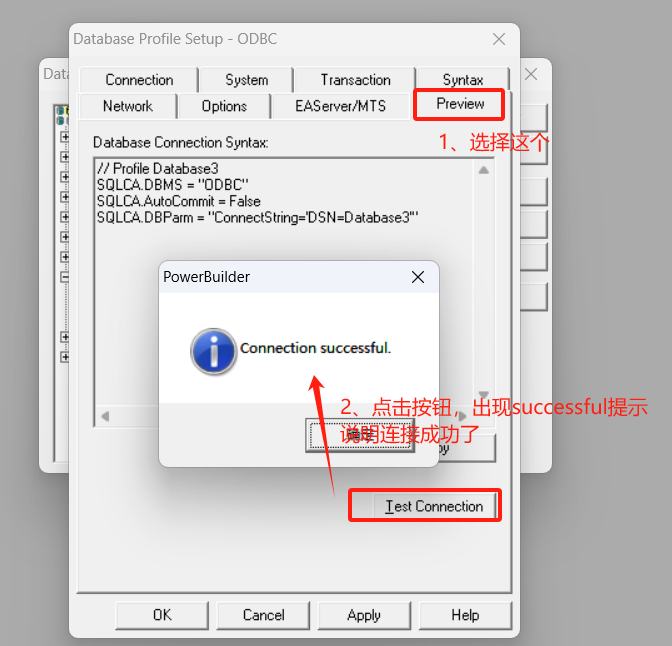

### 六、创建数据窗口

① 单击菜单栏上的`File`-->`New`命令，在弹出的窗口中选择`DataWindow`选项卡中的`Grid`风格的数据窗口
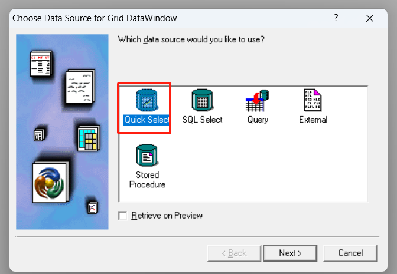


② 选择`Quick Select`
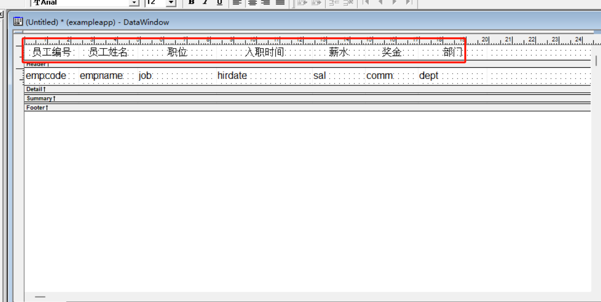

③ 选择`emp`表并选择需要展示的表字段
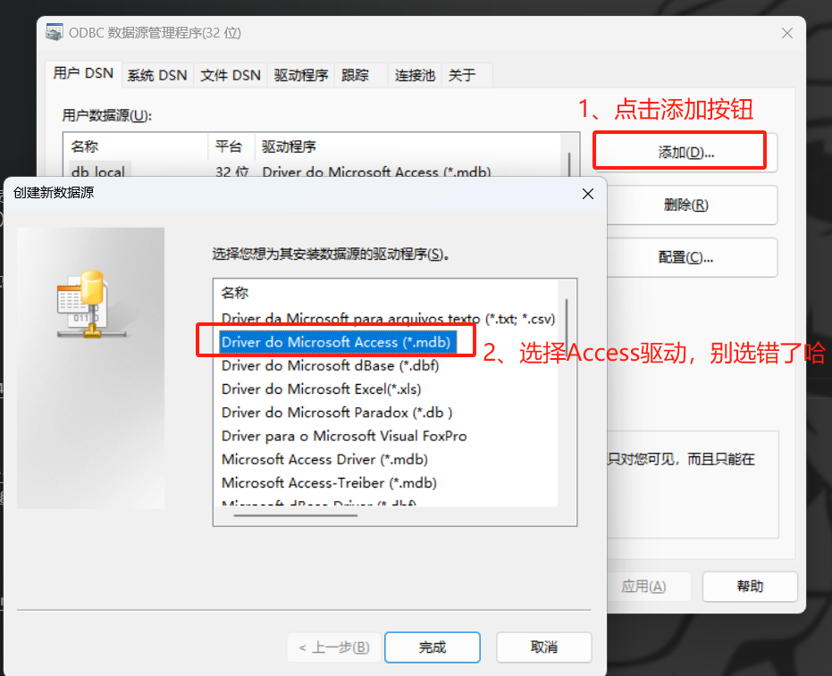

④ 默认下一步，并修改表头
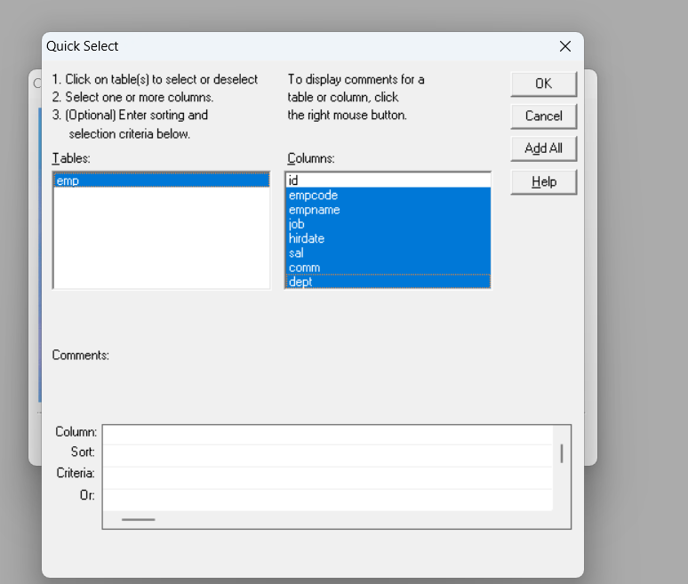

⑤ 设置薪水、奖金显示格式，并设置右对齐

- `Style Type` 选择`EditMask`类型
- `Mask`格式为：###,###.00
  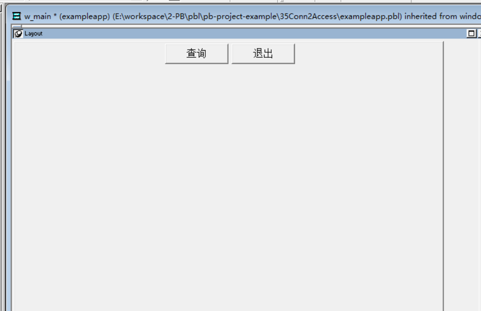

⑥ 将数据窗口保存为`d_emp`


### 七、在窗口中添加控件

① 在`w_main`窗口中添加2个`CommandButton`控件，分别为`cb_1`和`cb_2`,`Text`分别为查询和退出
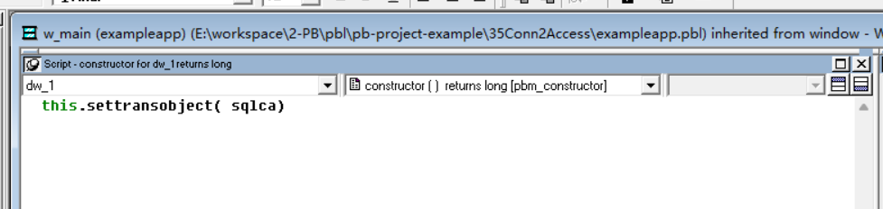


② 在`w_main`窗口上添加`DataWindon` 控件，名称为`dw_1`

- 将`HScrollBar` 框勾选上，横向滚动条（当横向显示不下时，会自动产生滚动条）
- 将`VScrollBar`框勾选上，纵向滚动条（当纵向显示不下时，会自动产生滚动条）

- 将数据窗的`DataObject`设置成`d_emp`
  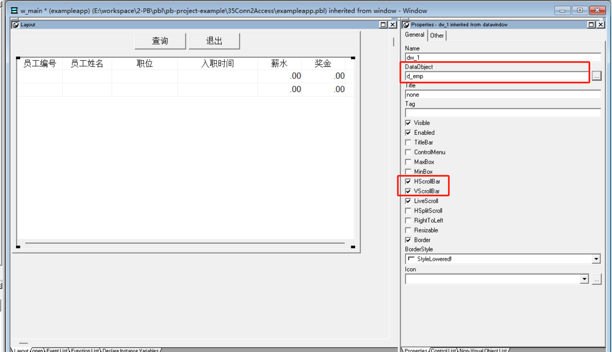

### 八、编写代码

① 单击开发界面左边的`System Tree`中的`exampleapp`对象，并在其`Open`事件中添加如下脚本

```java
SQLCA.DBMS = "ODBC"
SQLCA.AutoCommit = False
SQLCA.DBParm = "ConnectString='DSN=mysql-3308;UID=root;PWD=123456',PBCatalogOwner='db_employee'"

connect;
open(w_main)
```

② 在`dw_1`的`constructor`事件中添加如下代码

```java
this.settransobject( sqlca)
```

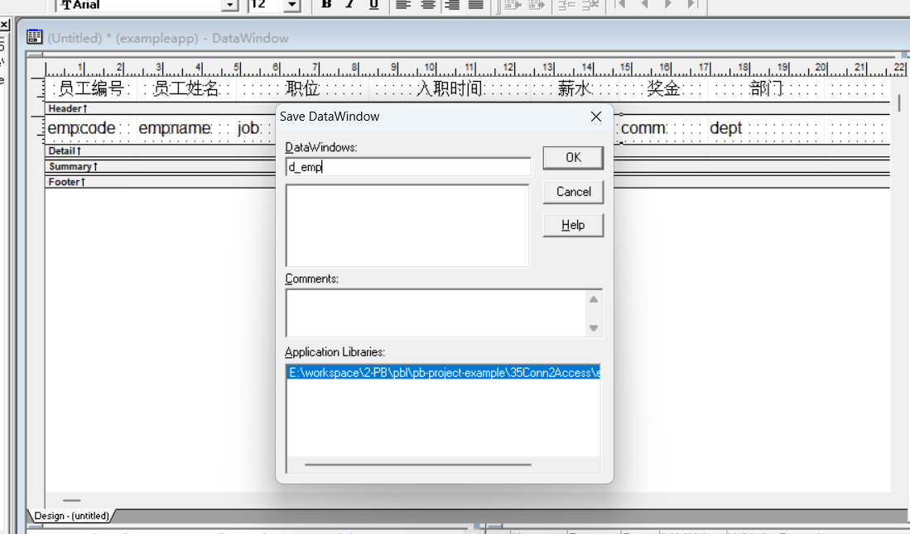


② 在刚才添加的【查询】按钮 `cb_1`的`clicked`中添加如下代码

```java
//使数据窗口与事务对象连接
dw_1.settransobject(sqlca)
//执行检索操作
dw_1.retrieve()
```

③ 在【退出】按钮`cb_2`的`clicked`中添加如下代码

```java
close(parent)
```

④ 单击开发界面左边的`System Tree`中的`exampleapp`对象，并在其`close`事件中添加如下脚本

```java
//关闭程序释放资源
disconnect;
```

### 九、运行程序

最后，允许程序，看看能不能正常查询出Access数据库中的数据

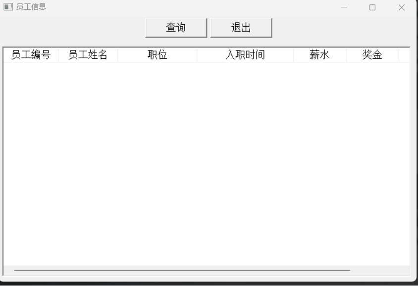


