### 写在前面

这是PB案例学习笔记系列文章的第33篇，该系列文章适合具有一定PB基础的读者。

通过一个个由浅入深的编程实战案例学习，提高编程技巧，以保证小伙伴们能应付公司的各种开发需求。

文章中设计到的源码，小凡都上传到了gitee代码仓库[https://gitee.com/xiezhr/pb-project-example.git](https://gitee.com/xiezhr/pb-project-example.git)


需要源代码的小伙伴们可以自行下载查看，后续文章涉及到的案例代码也都会提交到这个仓库【**[pb-project-example](https://gitee.com/xiezhr/pb-project-example)**】

如果对小伙伴有所帮助，希望能给一个小星星⭐支持一下小凡。

### 一、小目标

我们日常开发一个应用，不管应用再小，基本上都离不开数据库的支持。

`PB`对一些主流的大型关系型数据库（`Oracle`、`SQLServer`、`MySQL`）提供了专用的数据库接口，对一些小型数据库如

(`Excel`、`Access`)数据库提供了`ODBC`接口支持。


通过本案例，我们`PB`连接`SQLite`数据库，并且查询数据表中数据显示出来。

最终实现效果如下

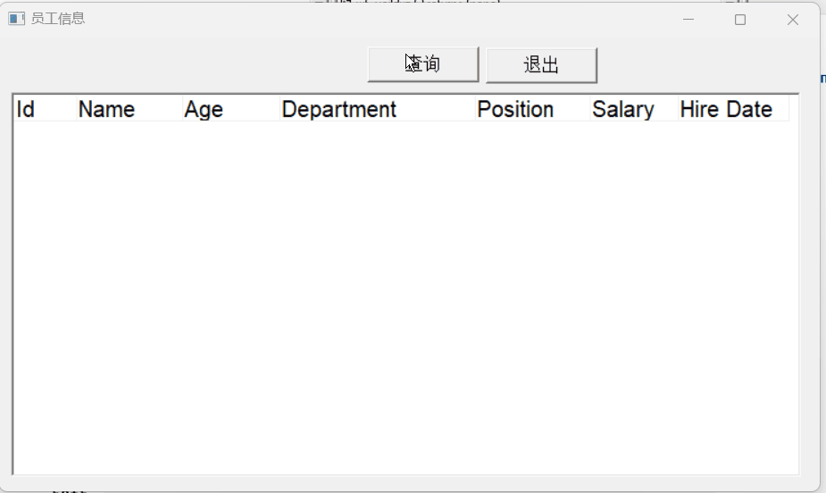

### 二、`SQLite`数据库简介

#### 2.1 什么是 SQLite？

- 轻量级数据库：SQLite 是一个小型、快速、零配置的数据库引擎
- 文件型数据库：整个数据库存储在一个单独的文件中，便于管理和传输
- 无需服务器：不像 MySQL、PostgreSQL 需要独立的服务器进程，SQLite 直接嵌入到应用程序中

#### 2.2 SQLite 主要特点

- 零配置：不需要复杂的安装和配置过程
- 跨平台：支持各种操作系统（Windows、Linux、macOS 等）
- 事务支持：支持 ACID 事务，保证数据一致性
- 标准 SQL：支持大部分标准的 SQL 语法
- 开源免费：完全免费使用，源码开放

#### 2.3 SQLite 适用场景

- 移动应用：Android、iOS 应用常用 SQLite 存储本地数据
- 桌面软件：许多桌面程序用它来保存配置和用户数据
- 小型网站：访问量不大的网站可以使用
- 原型开发：快速开发时的理想选择

#### 2.4 SQLite 局限性

- 并发性有限：不适合高并发的大型应用
- 功能相对简单：缺少一些企业级数据库的高级功能
- 网络访问：不支持远程网络访问（只能本地文件访问）

### 三、`SQLite` 数据库安装

1. 到官网下载SQLite数据库安装包
   官网地址：https://www.sqlite.org/download.html
   需要下载`sqlite-tools-win-x64-*.zip`或者`sqlite-dll-win-x86-*.zip`文件和`sqlite-dll-win-x64-*.zip` 压缩文件

2. 安装SQLite数据库
   创建文件夹 `C:\sqlite`，并在此文件夹下解压上面两个压缩文件，将得到 sqlite3.def、sqlite3.dll 和 sqlite3.exe 文件。 

3. 配置环境变量
   添加 C:\sqlite 到 PATH 环境变量，最后在命令提示符下，使用 sqlite3 命令，将显示如下结果。

   ```cmd
   C:\Users\16663>sqlite3
   SQLite version 3.50.4 2025-07-30 19:33:53
   Enter ".help" for usage hints.
   Connected to a transient in-memory database.
   Use ".open FILENAME" to reopen on a persistent database.
   ```

### 四、数据库表准备

① 创建数据库文件

> 使用脚本`.open db_file_name` 命令，创建数据库文件
> 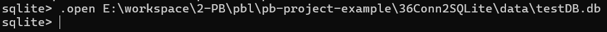

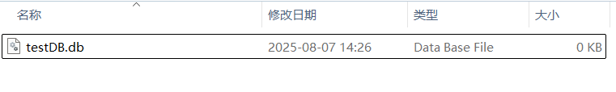


② 创建员工信息表`employees`

>使用create table 语句创建表

```sql
CREATE TABLE employees (
    id INTEGER PRIMARY KEY AUTOINCREMENT,
    name TEXT NOT NULL,
    age INTEGER NOT NULL,
    department TEXT NOT NULL,
    position TEXT NOT NULL,
    salary REAL NOT NULL,
    hire_date TEXT NOT NULL
);
```

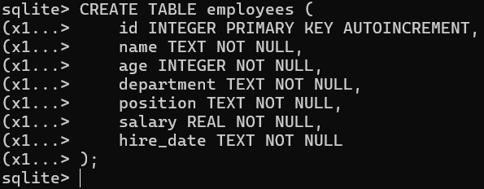


③ 插入数据，最终表数据如下

> 使用yong insert into employees 语句插入10条员工信息

```sql
INSERT INTO employees (name, age, department, position, salary, hire_date) VALUES
('张三', 28, '技术部', '软件工程师', 8000, '2022-01-15'),
('李四', 35, '市场部', '市场经理', 9000, '2021-05-20'),
('王五', 30, '人事部', '人事专员', 6000, '2020-03-10'),
('赵六', 40, '财务部', '财务经理', 12000, '2019-07-25'),
('钱七', 25, '技术部', '前端工程师', 7000, '2023-02-01'),
('孙八', 33, '技术部', '后端工程师', 8500, '2021-11-12'),
('周九', 29, '市场部', '市场专员', 6500, '2022-08-30'),
('吴十', 38, '人事部', '人事经理', 11000, '2018-06-18'),
('郑十一', 27, '财务部', '会计', 7500, '2022-04-22'),
('冯十二', 31, '技术部', '测试工程师', 7200, '2020-09-15');
```

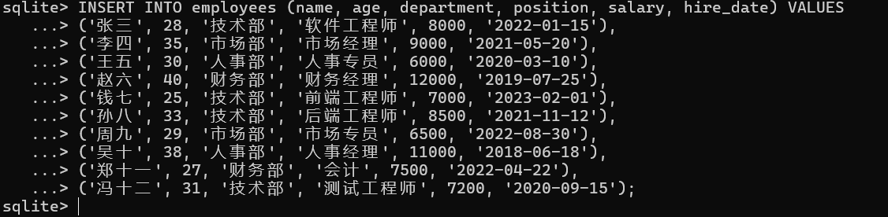

④ 查询数据看是否插入成功

> 使用select 语句查询数据
> 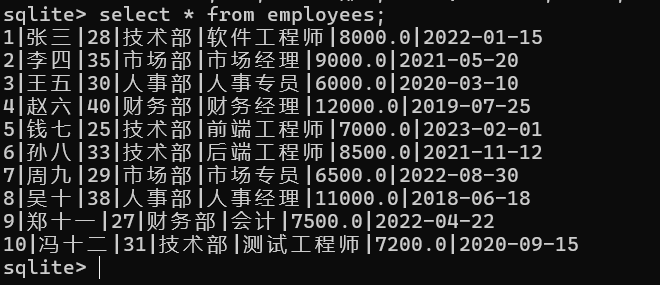

### 五、创建程序基本框架

① 新建`examplework`工作区

② 新建`exampleapp`应用

③ 新建`w_main`窗口，将`title`设置为“员工信息”
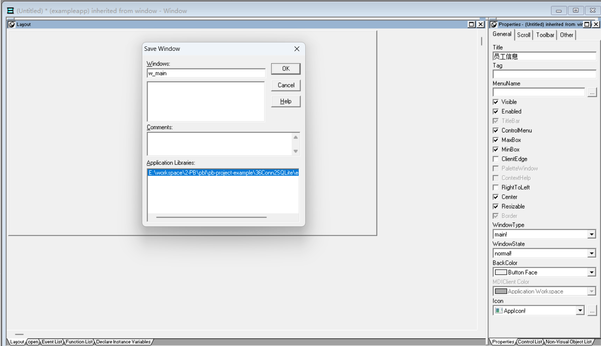

以上步骤，由于篇幅原因，这里不再赘述。忘记了的小伙伴可以翻一翻该系列文章的第一篇复习一下

### 六、配置sqlite数据库`ODBC`驱动

1. 下载SQLite数据库`ODBC`驱动
   小伙伴可以网上搜索下载，或者使用晓凡下载好的
    链接：https://pan.quark.cn/s/4d821d1d9585

2. 启动ODBC管理工具
   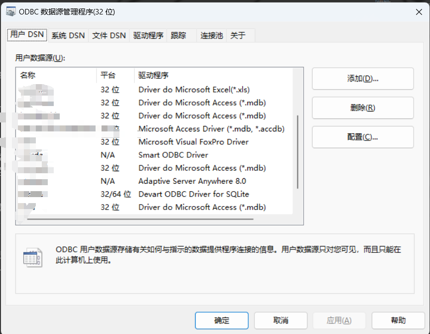
3. 新增DSN，选择`SQLite`驱动
   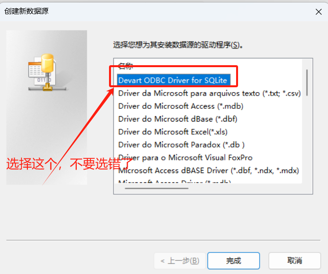
4. 选择创建好的数据库
   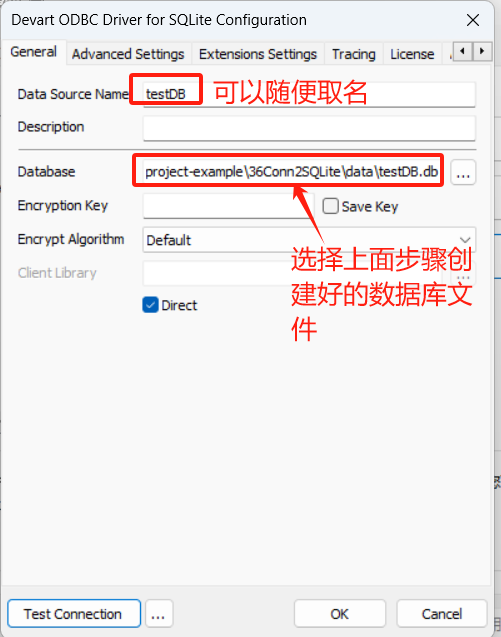
5. 测试是否连接成功
   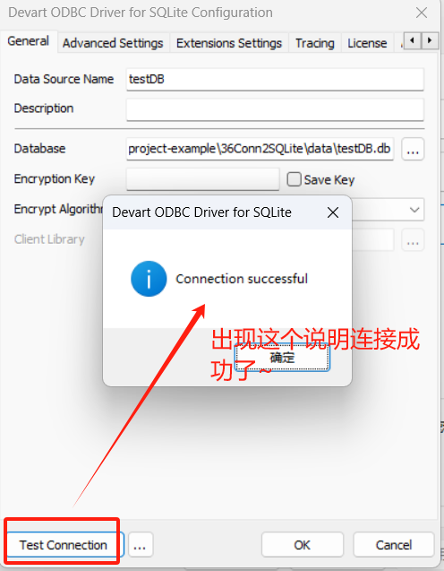

### 七、建立`DB Profile`

① 新建`DB Profile`


② 配置数据库连接信息
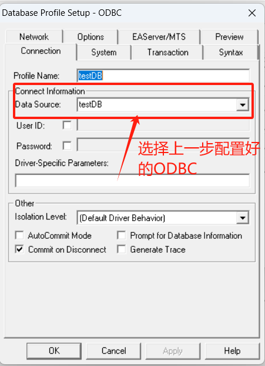


③ 测试是否连接成功

> 点击【Test Connection】按钮，出现下面提示表示连接成功

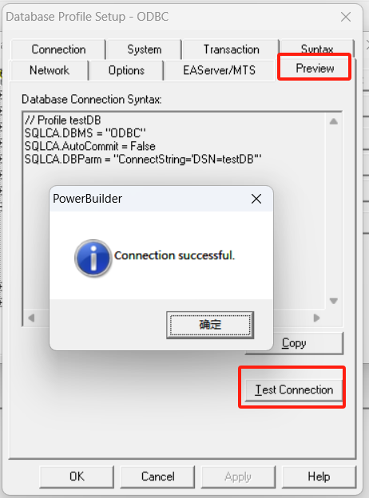

### 八、创建数据窗口

① 单击菜单栏上的`File`-->`New`命令，在弹出的窗口中选择`DataWindow`选项卡中的`Grid`风格的数据窗口


② 选择`Quick Select`


③ 选择`employees`表并选择需要展示的表字段


⑥ 将数据窗口保存为`d_employees`

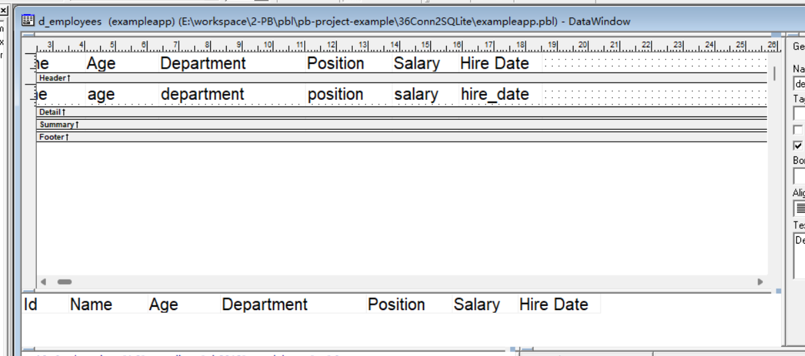

### 七、在窗口中添加控件

① 在`w_main`窗口中添加2个`CommandButton`控件，分别为`cb_1`和`cb_2`,`Text`分别为查询和退出
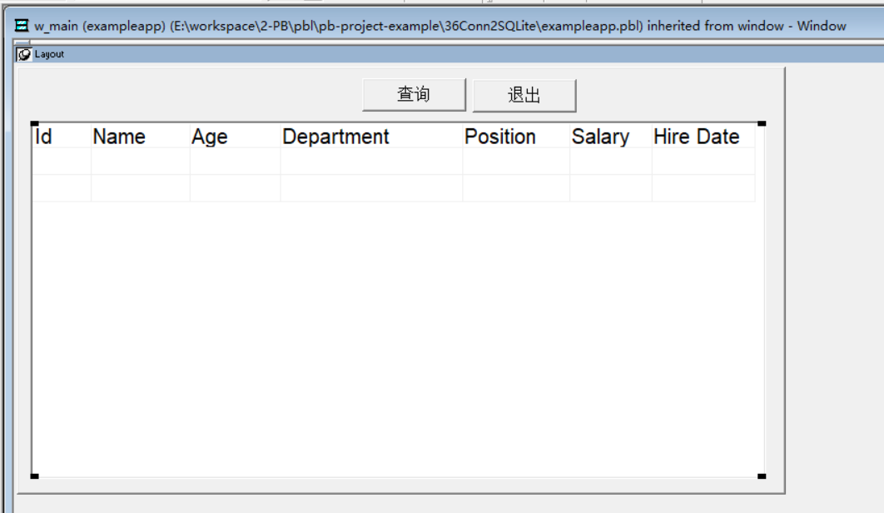


② 在`w_main`窗口上添加`DataWindon` 控件，名称为`dw_1`

- 将`HScrollBar` 框勾选上，横向滚动条（当横向显示不下时，会自动产生滚动条）
- 将`VScrollBar`框勾选上，纵向滚动条（当纵向显示不下时，会自动产生滚动条）

- 将数据窗的`DataObject`设置成`d_employees`
  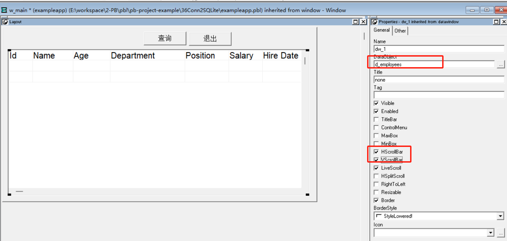

### 八、编写代码

① 单击开发界面左边的`System Tree`中的`exampleapp`对象，并在其`Open`事件中添加如下脚本

```java
SQLCA.DBMS = "ODBC"
SQLCA.AutoCommit = False
SQLCA.DBParm = "ConnectString='DSN=sqlite3DB',MsgTerse='Yes',DelimitIdentifier='Yes'"

connect;
open(w_main)
```

② 在`dw_1`的`constructor`事件中添加如下代码

```java
this.settransobject( sqlca)
```

② 在刚才添加的【查询】按钮 `cb_1`的`clicked`中添加如下代码

```java
//使数据窗口与事务对象连接
dw_1.settransobject(sqlca)
//执行检索操作
dw_1.retrieve()
```

③ 在【退出】按钮`cb_2`的`clicked`中添加如下代码

```java
close(parent)
```

④ 单击开发界面左边的`System Tree`中的`exampleapp`对象，并在其`close`事件中添加如下脚本

```java
//关闭程序释放资源
disconnect;
```

### 九、运行程序

最后，运行程序，看看能不能正常查询出sqlite数据库中的数据

