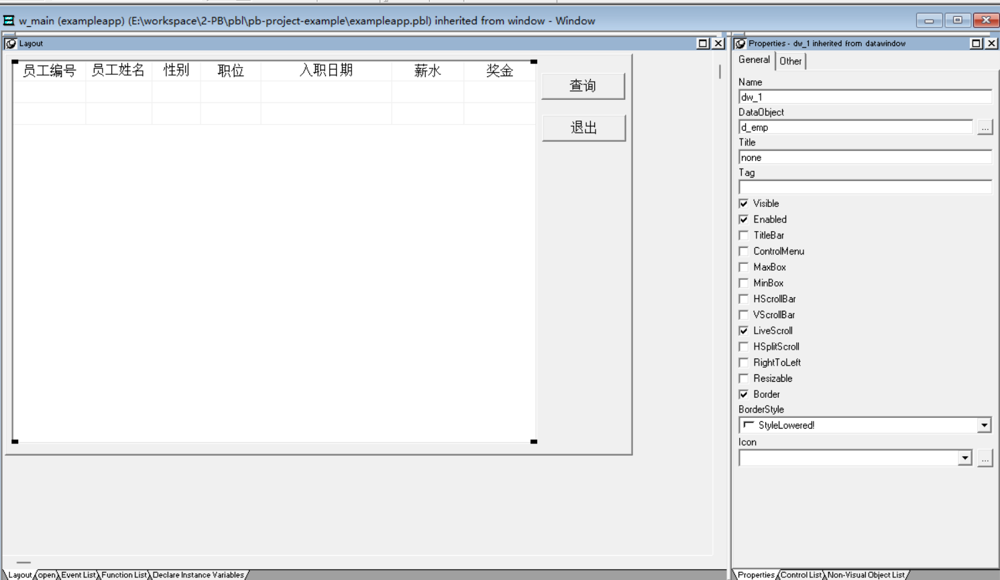
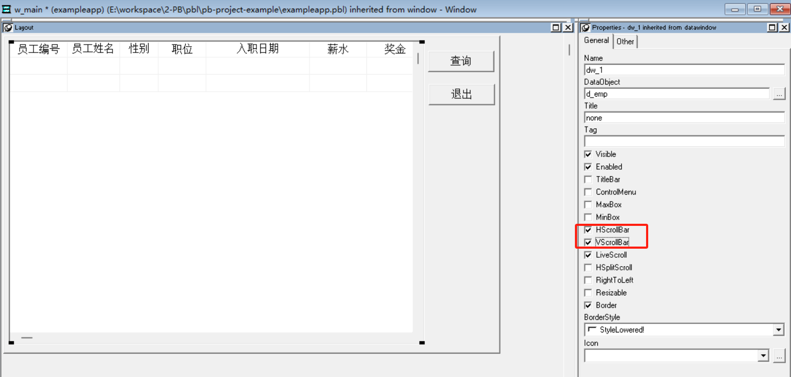
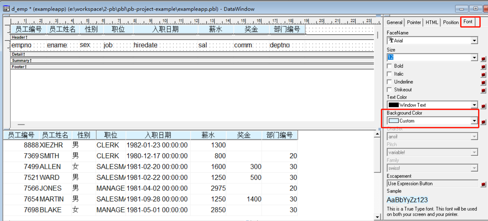
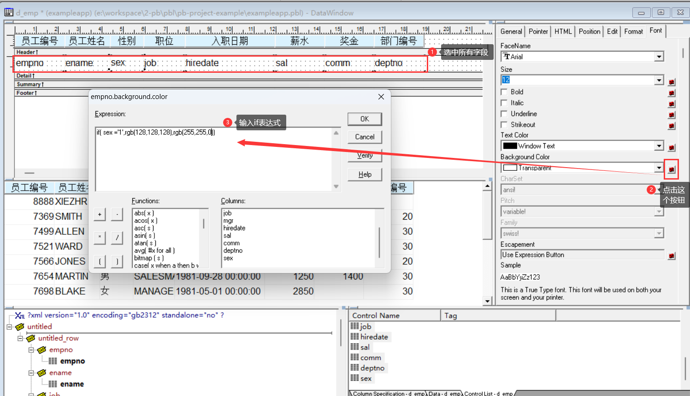
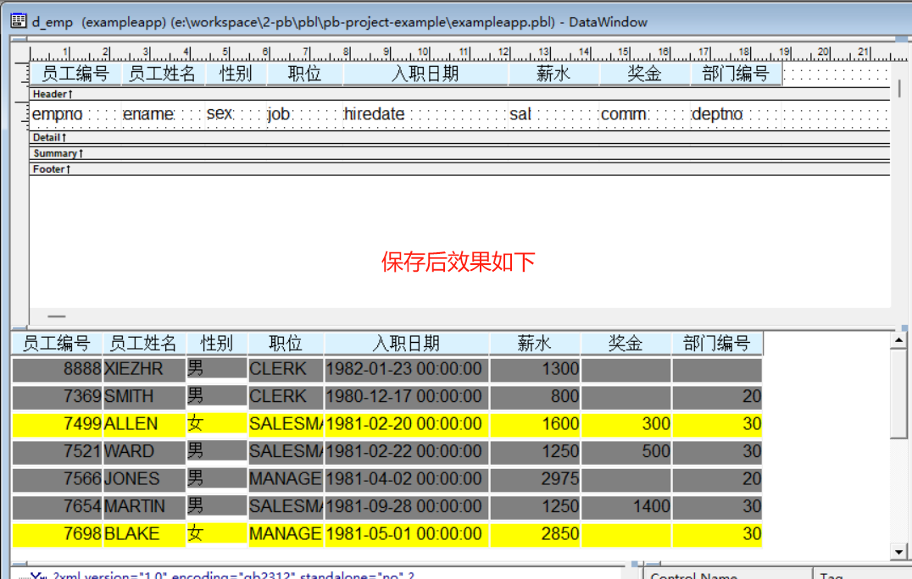
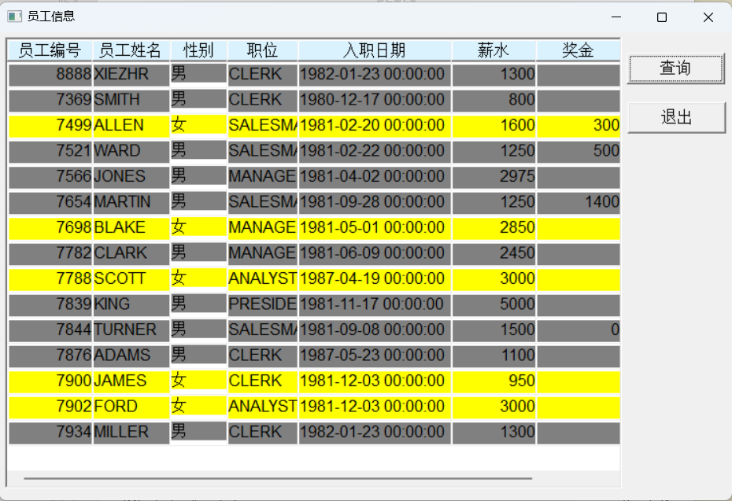

### 写在前面

这是PB案例学习笔记系列文章的第37篇，该系列文章适合具有一定PB基础的读者。

通过一个个由浅入深的编程实战案例学习，提高编程技巧，以保证小伙伴们能应付公司的各种开发需求。

文章中设计到的源码，小凡都上传到了gitee代码仓库[https://gitee.com/xiezhr/pb-project-example.git](https://gitee.com/xiezhr/pb-project-example.git)


需要源代码的小伙伴们可以自行下载查看，后续文章涉及到的案例代码也都会提交到这个仓库【**[pb-project-example](https://gitee.com/xiezhr/pb-project-example)**】

如果对小伙伴有所帮助，希望能给一个小星星⭐支持一下小凡。

### 一、小目标

本案例中我们将制作一个带有颜色的数据窗口。根据性别显示背景颜色，男生显示灰色，女生显示浅黄色，表格头显示蓝色。
通过设置表格颜色，可以是表格更加美观，数据更加醒目。
最终表格显示效果如下


### 二、创作思路

设置表格颜色我们将通过数据窗口的对象属性卡中进行。通过逻辑表达式，将数据分类，设置不同颜色。
设置颜色表达式如下：

```java
if(条件,rgb(?,?,?),regb(?,?,?))
```

当条件满足时，背景颜色按照第一个rgb值显示，否则按照第二个rgb值显示。
其中：
灰色：rgb(128,128,128)
黄色：rgb(255,255,0)

### 三、创建程序基本框架

有了基本思路之后，我们就动起来开始写程序了

① 新建`examplework` 工作区

② 新建`exampleapp`应用

③ 新建`w_main`窗口，并将其`Title`设置为"设置表格背景色"

由于文章篇幅的原因，以上步骤就不再赘述，如果忘记的小伙伴可以翻一翻该系列第一篇文章复习一下

### 四、添加`w_main`窗口布局

> 在前面的文章中我们已经学了怎么连接各种数据库，这里我们采用`Oracle`数据库来进行演示
> ① 创建`grid`风格数据窗口对象。
> 连接Oracle数据库，然后选择员工信息表`emp`及表中需要的字段，然后将数据窗口对象保存为`d_emp`


② 在`w_main`窗口布局中添加`DataWindow`控件和2个`CommandButton`控件.
分别将上面控件命名为`dw_1`、`cb_1`和`cb_2`。
并将`dw_1`的`DataObject`属性设置为`d_emp`。`cb_1`和`cb_2` 的`Text`分别设置成`"查询"`和`"关闭"`


③ 设置数据窗口滚动条


④ 保存窗口

### 五、设置数据窗口背景颜色

① 设置表头背景颜色
在`d_emp`数据窗口中，按住`Ctrl`键，选中`Header`条带上的所有字段，设置背景色。



② 设置数据背景色
在`d_emp`数据窗口中，按住`Ctrl`键，选中`Header`条带和`Detail`两条带之间所有字段，设置背景色。


③ 保存设置
点击`OK`按钮，保存设置。



### 六、编写代码

① 在开发界面左边的`System Tree` 中双击`exampleapp` 应用对象，然后再`open`事件中添加如下代码

```java
SQLCA.DBMS = "O90 Oracle9i (9.0.1)"
SQLCA.LogPass = 'tiger'
SQLCA.ServerName = "127.0.0.1:1521/orcl"
SQLCA.LogId = "scott"
SQLCA.AutoCommit = False
SQLCA.DBParm = "PBCatalogOwner='scott'"

connect;
open(w_main)
```

② 在开发界面左边的`System Tree` 中双击`exampleapp` 应用对象，然后再`close`事件中添加如下代码

```java
disconnect;
```

③ 在`w_main`窗体中查询按钮`cb_1`中添加如下代码

```java
dw_1.settransobject( sqlca)
dw_1.retrieve()
```

⑤ 在在`w_main`窗体中退出按钮`cb_2`中添加如下代码

```java
close(w_main)
```

### 七、运行程序，看看效果

