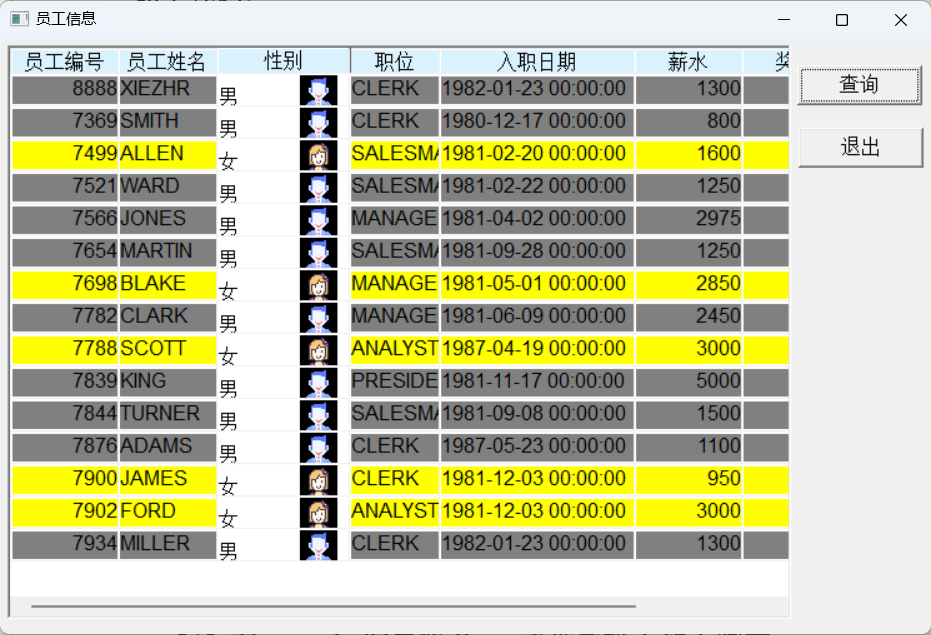
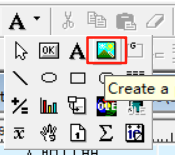
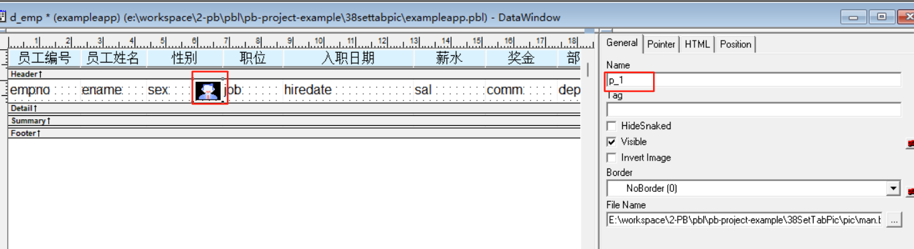
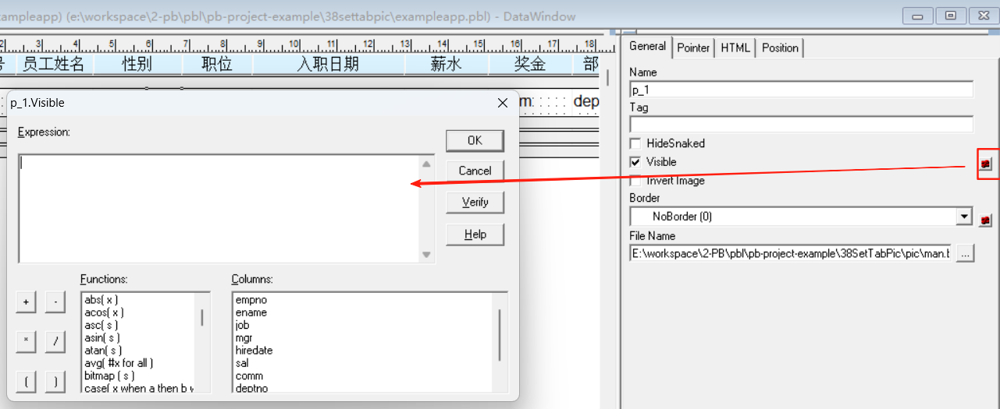

### 写在前面

这是PB案例学习笔记系列文章的第33篇，该系列文章适合具有一定PB基础的读者。

通过一个个由浅入深的编程实战案例学习，提高编程技巧，以保证小伙伴们能应付公司的各种开发需求。

文章中设计到的源码，小凡都上传到了gitee代码仓库[https://gitee.com/xiezhr/pb-project-example.git](https://gitee.com/xiezhr/pb-project-example.git)


需要源代码的小伙伴们可以自行下载查看，后续文章涉及到的案例代码也都会提交到这个仓库【**[pb-project-example](https://gitee.com/xiezhr/pb-project-example)**】

如果对小伙伴有所帮助，希望能给一个小星星⭐支持一下小凡。

### 一、小目标

本案例中我们将在上一案例的基础上，在男生性别栏显示男生头像，女生性别栏显示女生头像。
通过条件位图，可以使得表格更加美观。
最终效果如下：


### 二、实现思路

通过向数据窗口中插入位图，然后有条件的设置位图的`Visible`属性，从而实现条件位图的显示与隐藏的效果。
是指位图的条件表达式为：

```ini
if(条件="?",1,0)
```

在满足`条件="?"` 的情况下，位图的`Visible`属性由中间的一个数字决定，否则位图的`Visible`属性由最后一个数字决定。
其中1表示显示，0表示隐藏。

### 三、创建程序基本框架

有了基本思路之后，我们就动起来开始写程序了

① 新建`examplework` 工作区

② 新建`exampleapp`应用

③ 新建`w_main`窗口，并将其`Title`设置为"设置数据窗条件位图"

由于文章篇幅的原因，以上步骤就不再赘述，如果忘记的小伙伴可以翻一翻该系列第一篇文章复习一下

④ 按照上一个案例设置数据窗背景颜色

### 四、设置条件位图

#### 4.1 添加位图

① 单击选中`picture` 控件

② 单击`Header` 和`Detail`两条带之间的sex字段，在弹出的对话框中选择`man.bmp`，单击“打开”按钮，添加到数据窗口中，
位图名为`p_1`


② 同样的方法，再将`woman.bmp`添加到数据窗口的`sex`字段中，位图名为`p_2`，调整合适的位置

#### 4.2 设置位图`p_1`显示条件

① 选择`p_1`位图，在属性编辑器中，单击`Visible`属性后的小按钮

② 在弹出设置窗口中输入如下代码

```java
if(sex="1",1,0)
```

#### 4.3 设置位图`p_2`显示条件

① 选择`p_2`位图，在属性编辑器中，单击`Visible`属性后的小按钮

② 在弹出设置窗口中输入如下代码

```java
if(sex="2",1,0)
```

### 五、编写代码

① 在开发界面左边的`System Tree` 中双击`exampleapp` 应用对象，然后再`open`事件中添加如下代码

```java
SQLCA.DBMS = "O90 Oracle9i (9.0.1)"
SQLCA.LogPass = 'tiger'
SQLCA.ServerName = "127.0.0.1:1521/orcl"
SQLCA.LogId = "scott"
SQLCA.AutoCommit = False
SQLCA.DBParm = "PBCatalogOwner='scott'"

connect;
open(w_main)
```

② 在开发界面左边的`System Tree` 中双击`exampleapp` 应用对象，然后再`close`事件中添加如下代码

```java
disconnect;
```

③ 在`w_main`窗体中查询按钮`cb_1`中添加如下代码

```java
dw_1.settransobject( sqlca)
dw_1.retrieve()
```

⑤ 在在`w_main`窗体中退出按钮`cb_2`中添加如下代码

```java
close(w_main)
```

### 六、运行程序

>运行程序,看看有没有达到预期效果
>
>