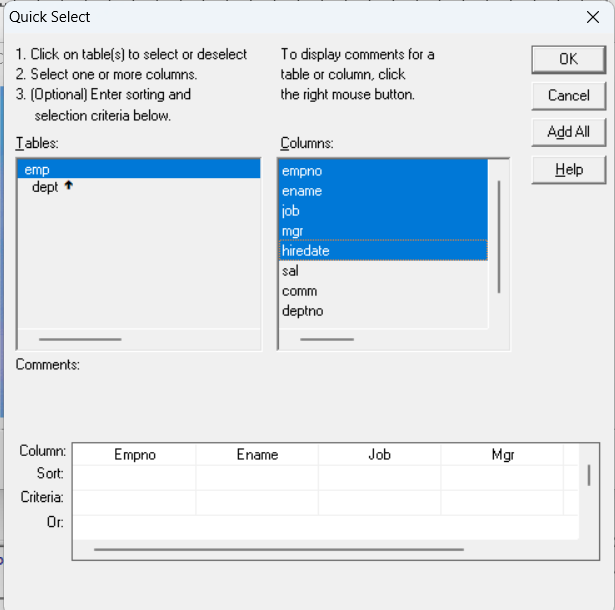
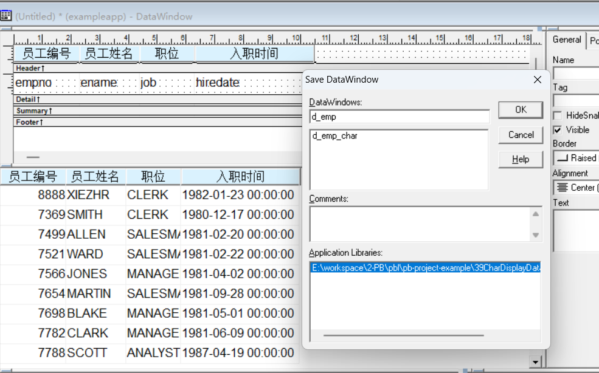
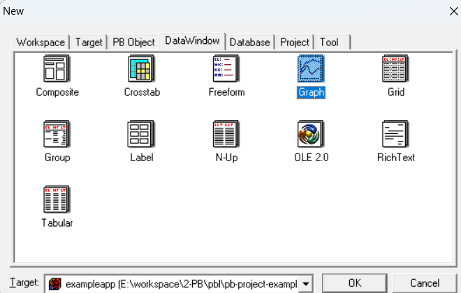
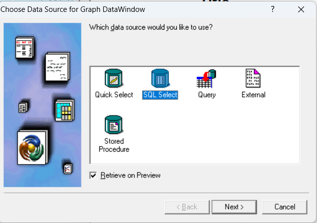
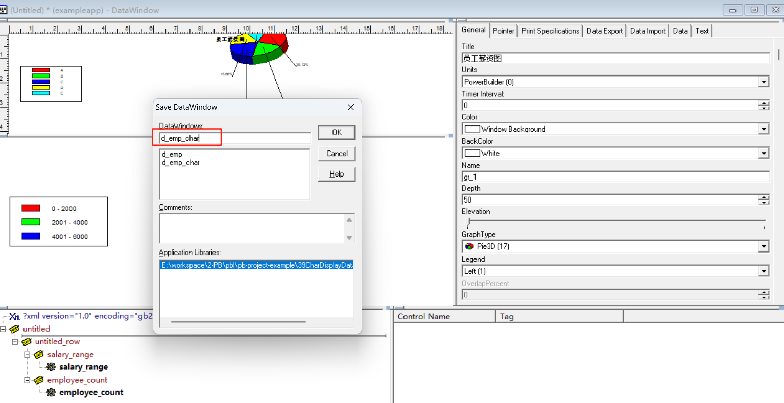
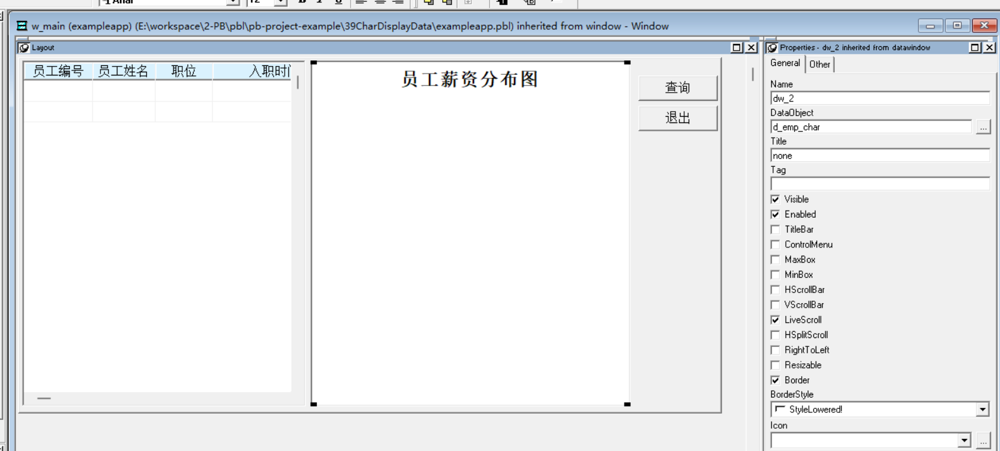
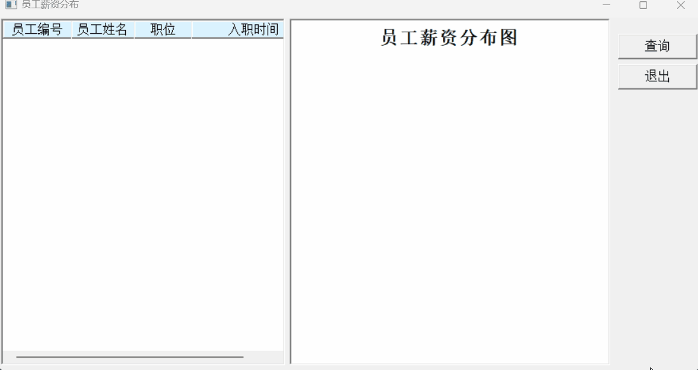

### 写在前面

这是PB案例学习笔记系列文章的第39篇，该系列文章适合具有一定PB基础的读者。

通过一个个由浅入深的编程实战案例学习，提高编程技巧，以保证小伙伴们能应付公司的各种开发需求。

文章中设计到的源码，小凡都上传到了gitee代码仓库[https://gitee.com/xiezhr/pb-project-example.git](https://gitee.com/xiezhr/pb-project-example.git)


需要源代码的小伙伴们可以自行下载查看，后续文章涉及到的案例代码也都会提交到这个仓库【**[pb-project-example](https://gitee.com/xiezhr/pb-project-example)**】

如果对小伙伴有所帮助，希望能给一个小星星⭐支持一下小凡。

### 一、小目标

通过本案例，我们将制作一个3D饼状图图表来显示数据。通过图表可以把复杂的信息用一种简洁明了的方式表达出来。
最终效果如下


### 二、实现思路

`PB`提供了灵活而且完整的对图形的支持。通过创建图形风格的数据窗口对象，然后将它与窗口上的数据窗口关联，
就可以达到图形显示数据的目的了

### 三、创建程序基本框架

有了基本思路之后，我们就动起来开始写程序了

① 新建`examplework` 工作区

② 新建`exampleapp`应用

③ 新建`w_main`窗口，并将其`Title`设置为"员工薪资分布"

由于文章篇幅的原因，以上步骤就不再赘述，如果忘记的小伙伴可以翻一翻该系列第一篇文章复习一下

### 四、创建数据窗口对象

#### 4.1 创建Grid 风格的数据窗口对象

① 跟上一个案例一样连接数据库`scott`
② 单击菜单栏上的`file`->`new`命令，选择`Grid`格式数据窗口，接着选择`Quick Select` 数据源
③ 选择需要的表和字段

④ 建立窗口对象，并将其保存为`d_emp`


#### 4.2 创建Graph风格数据窗口对象

② 单击菜单栏上的`file`->`new`命令，选择`Graph`格式数据窗口，接着选择`SQL Select` 数据源

> 这里我们选择`SQL Select` 数据源，相比`Quick Select` 数据源，更加灵活，可以写复杂的SQL语句
> 
> 
> ② 添加数据窗口SQL语句

```sql
SELECT salary_range, COUNT(*) AS employee_count
FROM (
    SELECT 
        CASE 
            WHEN sal <= 2000 THEN '0 - 2000'
            WHEN sal <= 4000 THEN '2001 - 4000'
            WHEN sal <= 6000 THEN '4001 - 6000'
            WHEN sal <= 8000 THEN '6001 - 8000'
            ELSE '8001 以上'
        END AS salary_range
    FROM emp
)
GROUP BY salary_range
```

③ 设置`Define Graph Data`

④ 选择`3D Pie`即饼状图，并设置标题

⑤ 将数据窗口保存为`d_emp_char`


#### 4.3 创建窗口控件

①
向`w_main`窗口中添加2个`Data Window`控件和2个`CommandButton` 控件，控件依次命名为`dw_1`、`dw_2`、`cb_1`和`cb_2`
② `dw_1`的`DataObject` 选择`d_emp` `dw_2`的`DataObject` 选择`d_emp_char`
`cb_1`的`Text` 选择`查询` `cb_2`的`Text` 选择`退出`


### 五、编写代码

① 在`w_main`窗口的`cb_1`控件的`Clicked`事件中添加如下代码

```java
dw_1.settransobject( sqlca)
dw_1.retrieve()
dw_2.settransobject( sqlca)
dw_2.retrieve()
```

② 在`w_main`窗口的`cb_2`控件的`Clicked`事件中添加如下代码

```java
close(w_main)
```

③ 在开发界面左边的`System Tree`窗口中双击`exampleapp`应用对象，在其`open`事件中添加如下代码

```java
SQLCA.DBMS = "O90 Oracle9i (9.0.1)"
SQLCA.LogPass = "tiger"
SQLCA.ServerName = "127.0.0.1:1521/orcl"
SQLCA.LogId = "scott"
SQLCA.AutoCommit = False
SQLCA.DBParm = "PBCatalogOwner='scott'"

connect;
open(w_main)
```

④  在开发界面左边的`System Tree`窗口中双击`exampleapp`应用对象，在其`close`事件中添加如下代码

```java
disconnect;
```

### 六、运行程序检验效果

