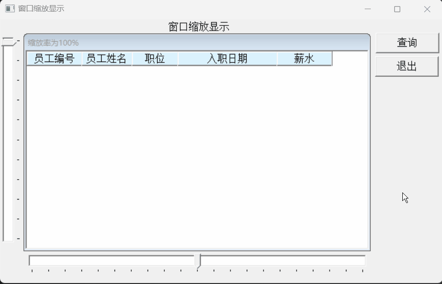
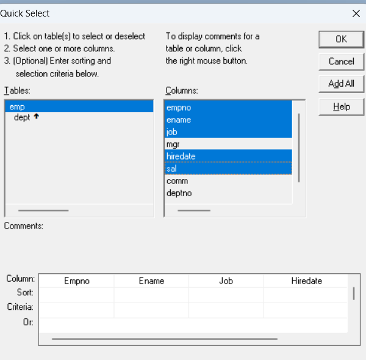
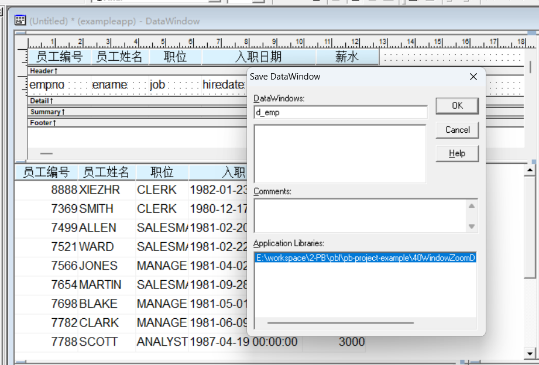
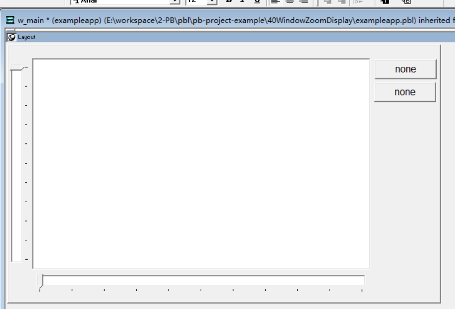
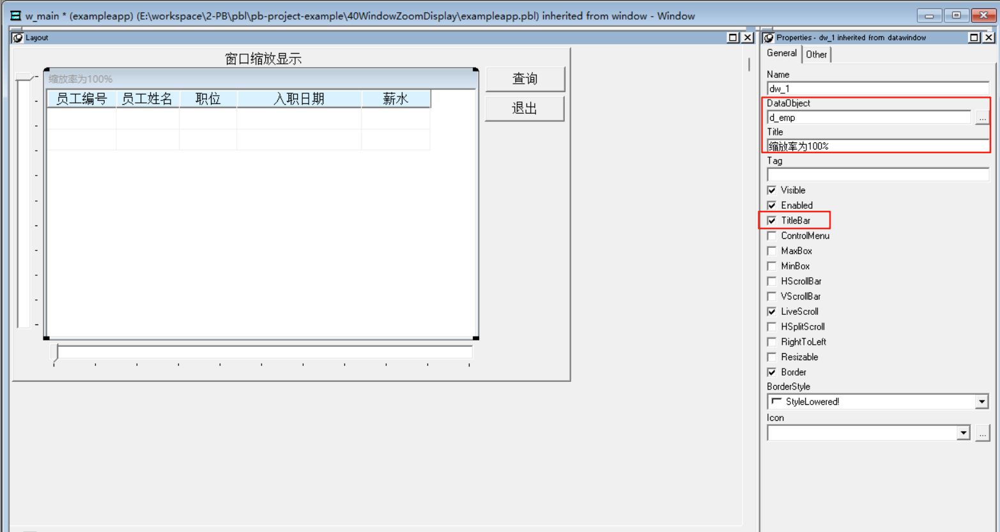
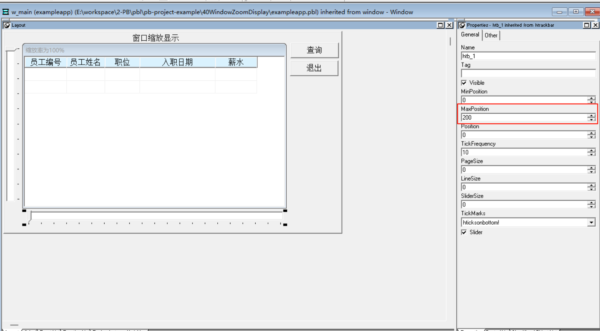

### 写在前面

这是PB案例学习笔记系列文章的第40篇，该系列文章适合具有一定PB基础的读者。

通过一个个由浅入深的编程实战案例学习，提高编程技巧，以保证小伙伴们能应付公司的各种开发需求。

文章中设计到的源码，小凡都上传到了gitee代码仓库[https://gitee.com/xiezhr/pb-project-example.git](https://gitee.com/xiezhr/pb-project-example.git)


需要源代码的小伙伴们可以自行下载查看，后续文章涉及到的案例代码也都会提交到这个仓库【**[pb-project-example](https://gitee.com/xiezhr/pb-project-example)**】

如果对小伙伴有所帮助，希望能给一个小星星⭐支持一下小凡。

### 一、小目标

通过本案例，我们将制作一个可以自由缩放的数据窗口程序。数据窗口左边和底部分别有一个拉条。
拉动垂直拉条上的游标时，数据窗口会翻页；拉动水平方向上的游标时，数据窗口会放大缩小。
最终实现效果如下


### 二、制作思路

在本例中，我们可以通过`HtrackBar`控件来调节窗口的缩放率；通过`VtrackBar`控件来调节窗口的翻页数。

### 三、创建程序基本框架

有了基本思路之后，我们就动起来开始写程序了

① 新建`examplework` 工作区

② 新建`exampleapp`应用

③ 新建`w_main`窗口，并将其`Title`设置为"数据窗口缩放显示"

由于文章篇幅的原因，以上步骤就不再赘述，如果忘记的小伙伴可以翻一翻该系列第一篇文章复习一下

### 四、窗口界面设计

① 创建Grid风格的数据窗口对象
单击菜单栏上的`file`->`new`命令，选择`Grid`格式数据窗口，接着选择`Quick Select` 数据源


② 创建窗口控件
在窗口中添加1个`StaticEdit`控件，2个`CommandButton`控件、1个`Data Window`控件、1个`HtrackBar`控件和
一个`VtrackBar`控件。分别命名为`st_1`、`cb_1`、`cb_2` 、`dw_1`、`htb_1`、`vtb_1`

④ 设置控件属性

- 将`st_1`控件的`Text`属性设置为`数据窗口缩放显示`
- 将`cb_1`控件的`Text`属性设置为`查询`
- 将`cb_2`控件的`Text`属性设置为`退出`
- 将`dw_1`的`DataObject`属性设置为`d_emp`，勾选`TitleBar`复选框，并将`Title`值设置为“缩放比率为100%”
  
- 将`HtrackBar`控件的`MaxPosition`属性设置为200
  
  ⑤ 保存窗口

### 五、编写代码

① 在`w_main`窗口的`open`事件中添加如下代码

```java
htb_1.position=100
vtb_1.position=1
```

② 在`cb_1`控件的`Click`事件中添加以下代码

```java
dw_1.settransobject(sqlca)
dw_1.retrieve()
```

③ 在`w_main`窗口的`close`事件中添加如下代码

```java
close(parent)
```

④ 在`htb_1`控件的`Moved`事件中添加如下代码

```java
dw_1.object.datawindow.zoom=this.position
dw_1.title="缩放率为"+string(position)+"100%"
```

⑤ 在`htb_1`控件的`lineleft`事件中添加如下代码

```java
dw_1.object.datawindow.zoom=this.position
dw_1.title="缩放率为"+string(position)+"100%"
```

⑥ 在`htb_1`控件的`lineright`事件中添加如下代码

```java
dw_1.object.datawindow.zoom=this.position
dw_1.title="缩放率为"+string(position)+"100%"
```

⑦ 在`htb_1`控件的`pageleft`事件中添加如下代码

```java
dw_1.object.datawindow.zoom=this.position
dw_1.title="缩放率为"+string(position)+"100%"
```

⑧ 在`htb_1`控件的`pageright`事件中添加如下代码

```java
dw_1.object.datawindow.zoom=this.position
dw_1.title="缩放率为"+string(position)+"100%"
```

⑨ 在`vbt_1`控件的`Moved`事件中添加如下代码

```java
dw_1.scrolltorow(this.position)
```

⑩ 在`vbt_1`控件的`pageup`事件中添加如下代码

```java
dw_1.scrolltorow(this.position)
```

⑪ 在`vbt_1`控件的`pagedown`事件中添加如下代码

```java
dw_1.scrolltorow(this.position)
```

### 六、运行程序看看效果

