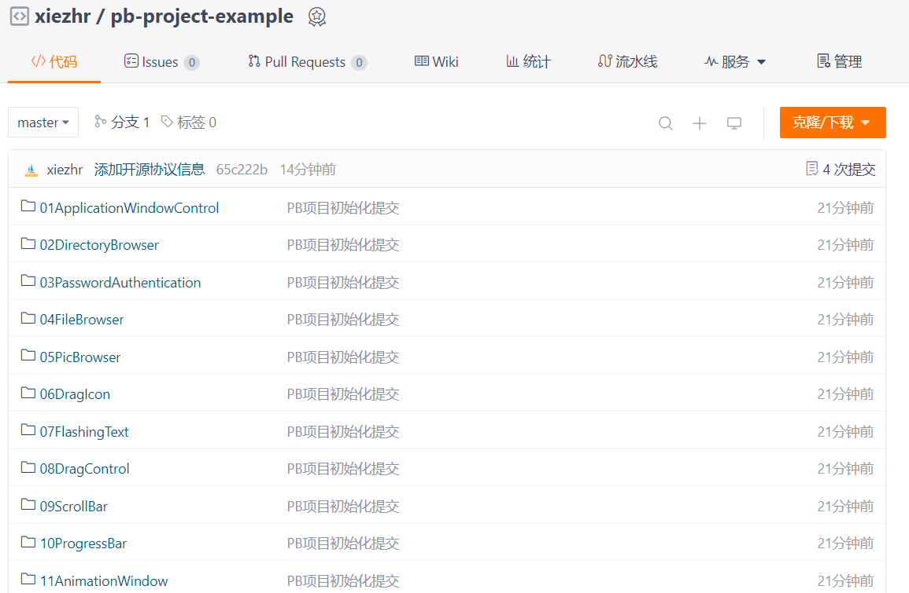
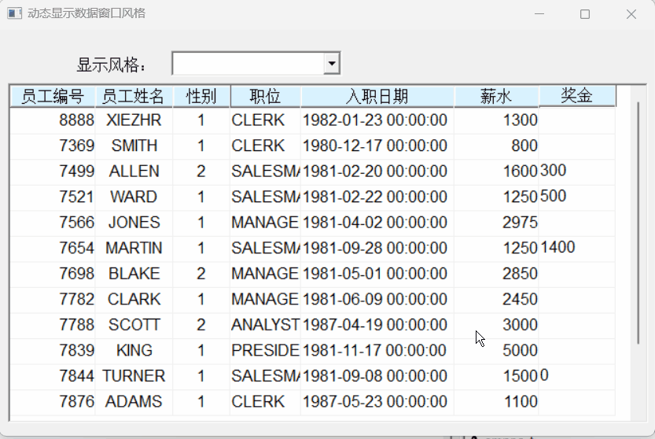
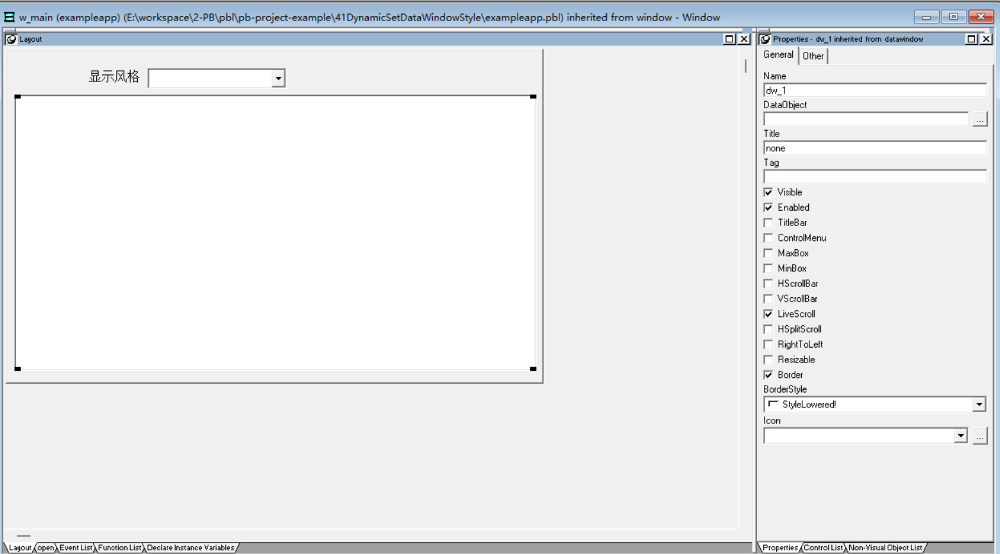

### 写在前面

这是PB案例学习笔记系列文章的第41篇，该系列文章适合具有一定PB基础的读者。

通过一个个由浅入深的编程实战案例学习，提高编程技巧，以保证小伙伴们能应付公司的各种开发需求。

文章中设计到的源码，小凡都上传到了gitee代码仓库[https://gitee.com/xiezhr/pb-project-example.git](https://gitee.com/xiezhr/pb-project-example.git)




需要源代码的小伙伴们可以自行下载查看，后续文章涉及到的案例代码也都会提交到这个仓库【**[pb-project-example](https://gitee.com/xiezhr/pb-project-example)**】

如果对小伙伴有所帮助，希望能给一个小星星⭐支持一下小凡。

### 一、小目标

通过本案例，我们将制作一个动态设置数据窗口风格的程序。运行程序后，通过选择下拉列表提供的4中风格
分别是标签风格、列表风格、网格风格和自由风格，数据就按照所选风格显示。
最终效果如下：


### 二、实现思路

①使用`powerscript`提供的`SyntaxFromSQL` 函数可以生成`Data Window`的源代码。
`SyntaxFromSQL`语法如下：

```java
transaction.SyntaxFromSQL(sqlselect, presentation,err)
```

| 参数         | 类型   | 说明                                         |
| ------------ | ------ | -------------------------------------------- |
| transaction  |        | 事务对象名                                   |
| sqlselect    | String | 一条有效的 SQL SELECT 语句                   |
| presentation | String | 指定数据窗口默认的表现风格                   |
| err          | String | 当生成数据窗口源代码发生错误时，返回错误信息 |

② 使用`powerscript`提供的`Create` 函数可创建`Data Window`对象

> 使用指定的源代码创建数据窗口对象，并用新的数据窗口对象取代数据窗口中原有的数据窗口对象
> `Create`语法如下：

```java
dwcontrol.Create(syntax{,errorbuffer})
```

| 参数        | 说明                                                         |
| ----------- | ------------------------------------------------------------ |
| dwcontrol   | 数据窗口控件名，创建的数据窗口对象将放置在该控件中           |
| syntax      | 数据窗口对象源代码，Create()函数将使用该代码来创建数据窗口对象 |
| errorbuffer | 可选参数，用于保存创建数据窗口对象过程中出错时的出错信息     |

### 三、创建程序基本框架

有了基本思路之后，我们就动起来开始写程序了

① 新建`examplework` 工作区

② 新建`exampleapp`应用

③ 新建`w_main`窗口，并将其`Title`设置为"动态设置数据窗口风格"

由于文章篇幅的原因，以上步骤就不再赘述，如果忘记的小伙伴可以翻一翻该系列第一篇文章复习一下

### 四、窗口界面布局

① 建立Grid风格的数据窗口对象。
连接数据库，单击菜单栏上的`file`->`new`命令，选择`Grid`格式数据窗口，接着选择`Quick Select` 数据源


② 建立窗口控件
在窗口中添加1个`StaticEdit`控件，1个`DropDownLisBox`控件和1个`Data Window`控件。分别命名为`st_1`、`ddlb_style`和`dw_1`

③ 设置控件属性

- 将`dw_1`控件的`dataobject`属性设置为`d_emp`
- 将`st_1`控件的`Text`属性设置为`显示风格：`
  ④ 保存窗口

### 五、编写代码

① 在`w_main`窗口的`open`事件中添加如下代码

```java
//显示数据
dw_1.settransobject(sqlca)
dw_1.retrieve()
//向下拉列表中添加数据窗口的显示风格
ddlb_style.additem("自由格式")
ddlb_style.additem("网格格式")
ddlb_style.additem("列表格式")
ddlb_style.additem("标签格式")
```

② 在`dblb_style`的`SelectionChange`事件中添加如下代码`

```java
//定义变量
string sty,exp,err

//选定显示风格
choose case ddlb_style.text
	case "自由格式"
		sty="form"
	case "网格格式"
		sty="Grid"
	case "列表格式"
		sty="Tabular"
	case "标签格式"
		sty="Label"
end choose

//对Label显示风格做处理
if sty="Label" then
	exp="style(type="+sty+")datawindow(units=2"+&
	    "timer_interval=0 color=16777215 processing=2"+&
		 "label.name='Laser Address 0.50 * 1.755627'"+&
		 "label.width=750 label.height=500 label.rows=5"+&
		 "label.rows.spacing=100 label.columns=4"+&
		 "label.columns.spacing=313 label.topdown=no"+&
		 "label.sheet=yes label.shape=roundrectangle"+&
		 "label.ellipse_height=83 label.ellipse_width=83)"
else
    exp="style(type="+sty+")datawindow(units=2 color=16777215)"
end if
	
//利用函数生成数据窗口的源代码
exp=SyntaxFromSql(sqlca,dw_1.getsqlselect(),exp,err)

//创建数据窗口
dw_1.create(exp,err)

//显示数据
dw_1.settransobject(sqlca)
dw_1.retrieve()
```

③ 在开发界面左边的`System Tree`窗口中双击`exampleapp`应用对象，并在其`open`事件中添加如下代码：

```java
// Profile scott
SQLCA.DBMS = "O90 Oracle9i (9.0.1)"
SQLCA.LogPass = "tiger"
SQLCA.ServerName = "127.0.0.1:1521/orcl"
SQLCA.LogId = "scott"
SQLCA.AutoCommit = False
SQLCA.DBParm = "PBCatalogOwner='scott'"

connect;
open(w_main)
```

④ 在开发界面左边的`System Tree`窗口中双击`exampleapp`应用对象，并在其`close`事件中添加如下代码：

```java
disconnect;
```

### 六、运行程序

>运行程序，看看是否实现我们要的效果
>