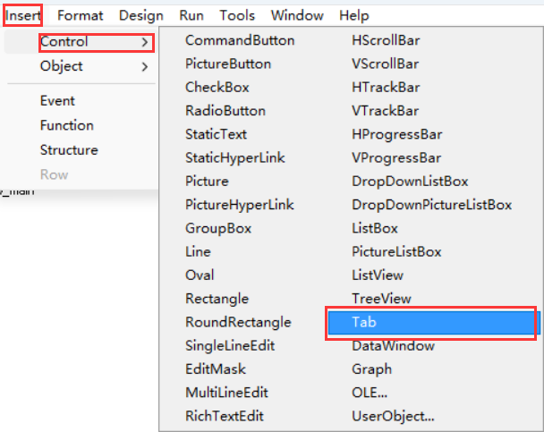
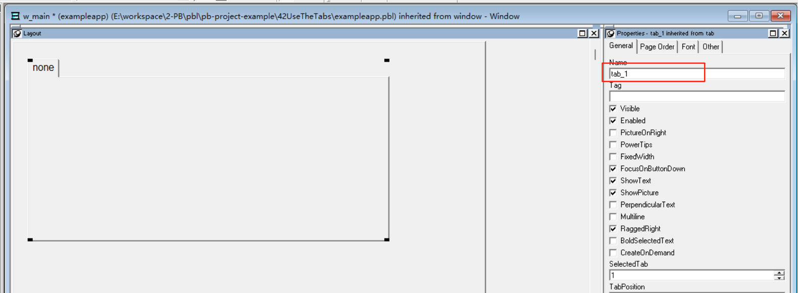
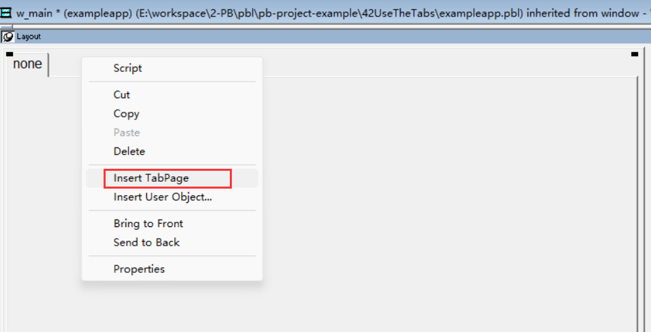
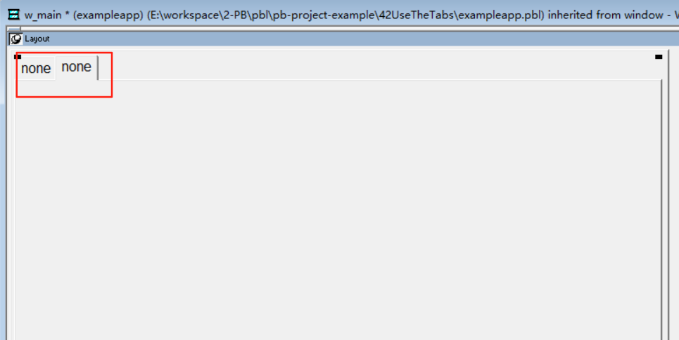
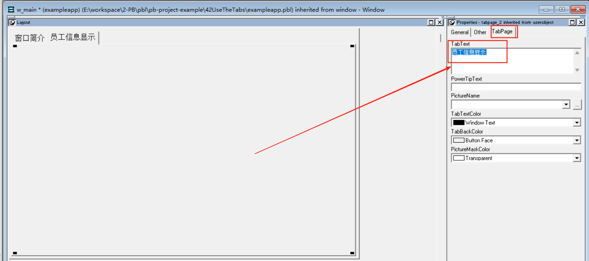
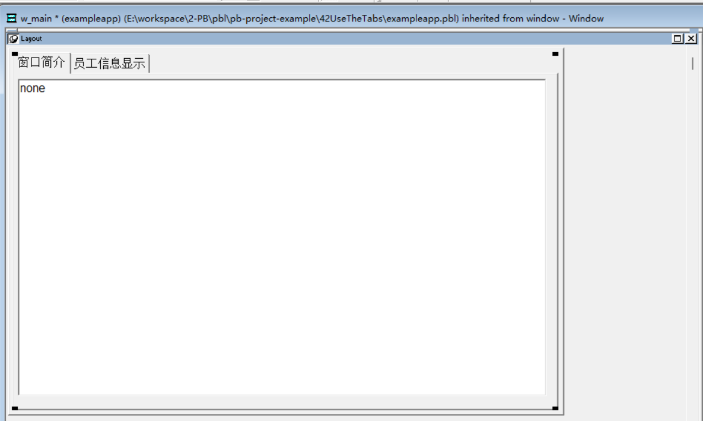
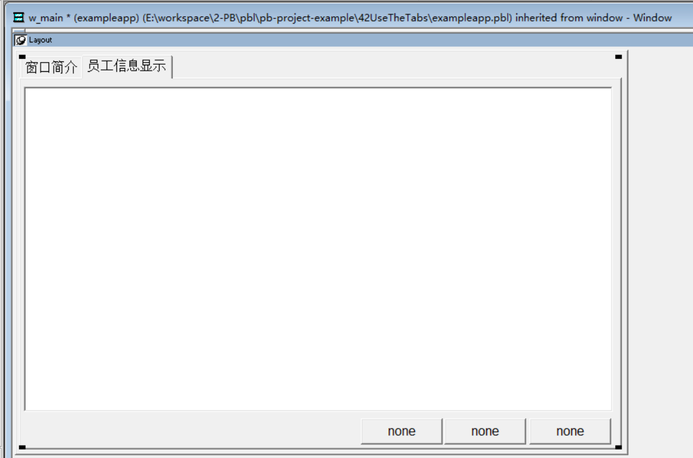
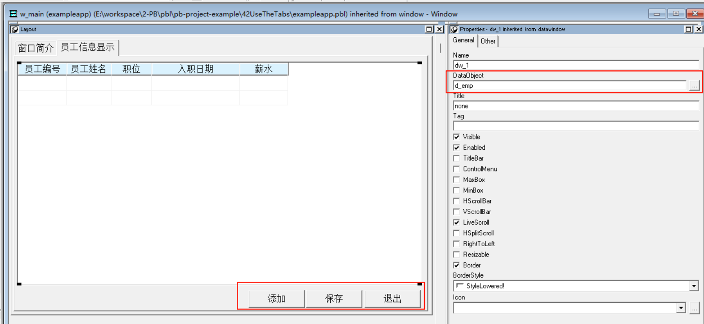
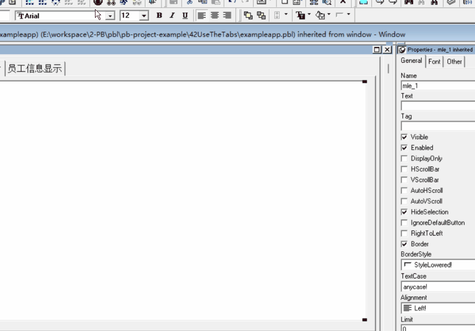

### 写在前面

这是PB案例学习笔记系列文章的第42篇，该系列文章适合具有一定PB基础的读者。

通过一个个由浅入深的编程实战案例学习，提高编程技巧，以保证小伙伴们能应付公司的各种开发需求。

文章中设计到的源码，小凡都上传到了gitee代码仓库[https://gitee.com/xiezhr/pb-project-example.git](https://gitee.com/xiezhr/pb-project-example.git)


需要源代码的小伙伴们可以自行下载查看，后续文章涉及到的案例代码也都会提交到这个仓库【**[pb-project-example](https://gitee.com/xiezhr/pb-project-example)**】

如果对小伙伴有所帮助，希望能给一个小星星⭐支持一下小凡。

### 一、小目标

通过本案例我们将学习选项卡的使用，并制造一个选项卡程序，选项卡在日常开发中也是经常会用到的。

运行程序后，会弹出一个“员工信息管理”选项卡，选项卡包含两个标签，分别是“窗口简介”和“信息显示”。
选择“窗口简介”标签，窗口中会显示此窗口的功能简介;选择“信息显示”标签，窗口中会显示员工信息，并可以对该窗口中的数据进行操作。

最终效果如下：


### 二、创作思路

选项卡是一种通用窗口控件，将其添加到窗口后，可以在此控件上添加其他窗口控件，这样可以将信息有层次的显示出来。

### 三、创建程序基本框架

有了基本思路之后，我们就动起来开始写程序了

① 新建`examplework` 工作区

② 新建`exampleapp`应用

③ 新建`w_main`窗口，并将其`Title`设置为"选项卡使用"

④ 在按照之前案例建立Grid格式数据窗口`d_emp`

由于文章篇幅的原因，以上步骤就不再赘述，如果忘记的小伙伴可以翻一翻该系列第一篇文章复习一下

### 四、建立选项卡

① 添加选项卡控件
在菜单栏选择`Insert`->`Control`->`Tab` 命令，然后单击窗口，将选项卡控件添加到窗口中，控件命名为`tab_1`



② 设置选项卡属性

- 将选项卡拉大，覆盖整个窗口
- 选中控件标签，单击鼠标右键，选中`Insert TabPage`，插入一个新的标签
  
  
- 选择第一个标签，单击选项页面，在`tabpage_1`页面属性编辑选项卡中选中`tabpage`项，在`TabText`框中输入“窗口简介”
- 同样的方法，在`tabpage_2`页面中，将`TabText`中输入“员工信息显示”
  
  ③ 在选项卡中添加控件
- 在`tabpage_1`页面中添加一个`MultiLineEdit`控件，命名为`mle_1`
- 在`tabpage_1`页面中添加1个`Data Window`控件和3个`commandButton`控件，分别命名为`dw_1`、`cb_1`、`cb_2`和`cb_3`。并调整控件位置
  
  

④ 设置控件属性

- 将`mle_1`控件的`Text`设置为“”
- 在`tabpage_2`中，将`dw_1`的`dataobject`属性设置为`d_emp`
- 在`tabpage_2`中，将`cb_1`、`cb_2`和`cb_3` 的`Text`分别设置为“添加”、“保存”和退出
  
  ⑤ 保存窗口

### 五、编写代码

① 在`w_main` 窗口的`open`事件中添加如下脚本

```java
tab_1.tabpage_2.dw_1.settransobject(sqlca)
tab_1.tabpage_2.dw_1.retrieve()
tab_1.tabpage_1.mle_1.text = "本窗口功能如下：~r~n"+&
	"1、查询员工信息；~r~n"+&
	"2、向数据库中添加新的员工信息~r~n"+&
	"3、删除员工信息"
```

② 在`tabpage_2`的`cb_1`的`Clicked`事件中添加如下代码

```java
long	l_row
int	s
//得到当前数据项的列
s = dw_1.RowCount()
//插入新的一列
l_row = dw_1.InsertRow(s+1)
//滚动到s+1列
dw_1.scrolltorow(s+1)
//设置焦点
dw_1.setfocus()
```

③ 在`tabpage_2`的`cb_2`的`Clicked`事件中添加如下代码

```java
dw_1.update()
dw_1.retrieve()
dw_1.enabled=false
```

④ 在`tabpage_2`的`cb_3`的`Clicked`事件中添加如下代码

```java
close(w_main)
```

### 六、运行程序

