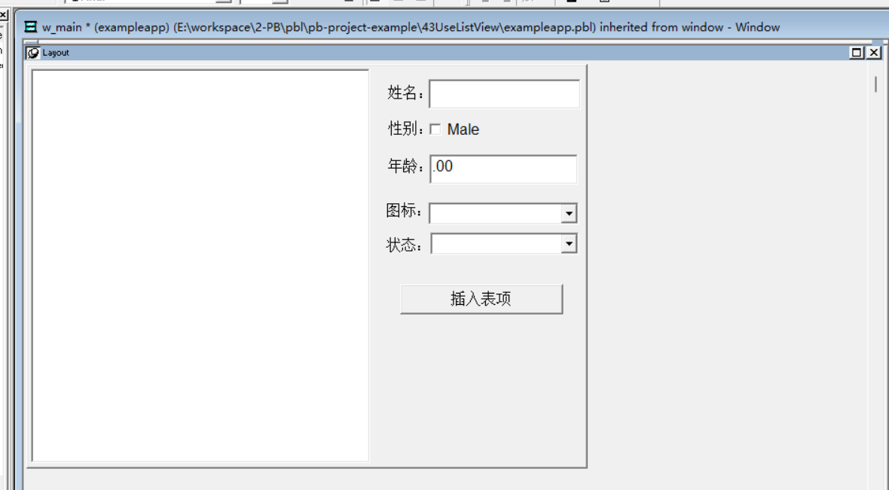
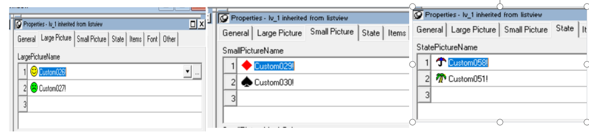
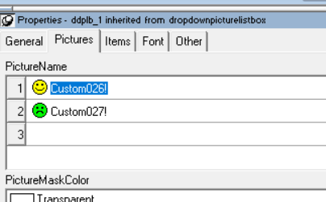
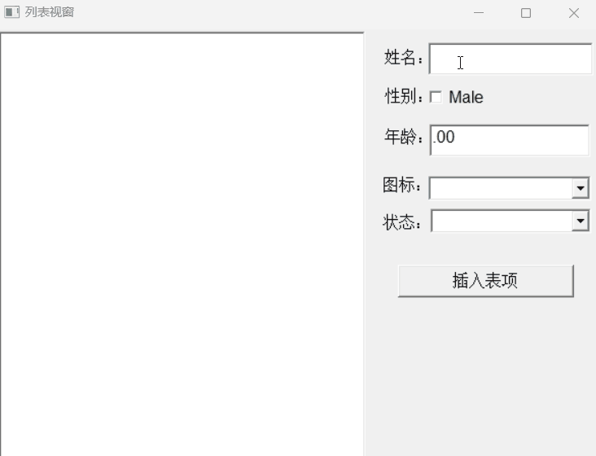

### 写在前面

这是PB案例学习笔记系列文章的第43篇，该系列文章适合具有一定PB基础的读者。

通过一个个由浅入深的编程实战案例学习，提高编程技巧，以保证小伙伴们能应付公司的各种开发需求。

文章中设计到的源码，小凡都上传到了gitee代码仓库[https://gitee.com/xiezhr/pb-project-example.git](https://gitee.com/xiezhr/pb-project-example.git)


需要源代码的小伙伴们可以自行下载查看，后续文章涉及到的案例代码也都会提交到这个仓库【**[pb-project-example](https://gitee.com/xiezhr/pb-project-example)**】

如果对小伙伴有所帮助，希望能给一个小星星⭐支持一下小凡。

### 一、小目标

通过本案例，我们将制作一个列表视窗。列表视窗（ListView）是PB的高级控件，很多数据处理过程中使用该控件
可以使程序操作更加友好和方便。我们平常看到的资源管理器右半边显示文件部分实际上就是一个列表视图控件
最终效果如下：


### 二、创作思路

列表视图控件（ListView）能够以多种不同外观显示列表项。下面是列表的的4种风格

| 风格                 | 说明                                                         |
| -------------------- | ------------------------------------------------------------ |
| 大图标（Large icon） | 每个列表以大图标的形式显示，列表的标题出现在图标下方         |
| 小图标(small icon)   | 每个列表以小图标的形式显示，列表的标题出现在图标右边         |
| 列表(list)           | 每个列表项以小图标的形式显示，列表的标题出现在图标右边，各列表项按列排列并排序 |
| 报告(report)         | 列表项以多列列表的形式显示，最左边的列显示图标和标题，可以自定义多个所需的列并指定要显示的数据 |


### 三、创建程序基本框架

有了基本思路之后，我们就动起来开始写程序了

① 新建`examplework` 工作区

② 新建`exampleapp`应用

③ 新建`w_main`窗口，并将其`Title`设置为"列表视窗"

由于文章篇幅的原因，以上步骤就不再赘述，如果忘记的小伙伴可以翻一翻该系列第一篇文章复习一下

### 四、窗口布局

#### 4.1 添加控件

向窗口种添加1个`ListView`控件、1个`SingleLineEdit`控件`、一个`CheckBox`控件`、1个`EditMask`控件、2个`DropDownPictureListBox`控件、1个`CommandButton`控件和5个`StaticEdit`控件。
并将其分别命名为`lv_1`、`sle_1`、`cbx_1`、`em_1`、`ddplb_1`、`ddplb_2`、`cb_1`、`st_1~st_5`

#### 4.2 设置控件属性

- ①将`cbx_1`、`cb_1`、`st_1~st_5`控件的Text值依次命名为`Male`、`插入表项`、`姓名：`、`性别：`、`年龄：`、`图标：`和`状态：`。
  
- ②将`lv_1`控件的属性如下设置
  
- ③ `ddplb_1` 属性设置
  
- ④ `ddplb_2` 属性设置
  

### 五、编写代码

① 在`w_main`窗口中定义如下实例变量

```java
integer LayNum = 0, Col1, Col2, Col3
```

② 在`w_main`窗口的`Open`事件中添加如下代码

```java
Col1 = lv_1.AddColumn("Name",left!,390)
Col2 = lv_1.AddColumn("Sex",left!,390)
Col3 = lv_1.AddColumn("Age",left!,390)
```

③ 在`sle_1`的`Modified`事件中添加如下代码

```java
cbx_1.Checked = TRUE
em_1.Text = "25"
ddplb_1.SelectItem(1)
ddplb_2.SelectItem(1)
```

④ 在`cb_1`的`Clicked`事件中添加如下代码

```java
IF Len(Trim(sle_1.Text)) > 0 THEN  // 检查 sle_1 文本框是否非空
    ListViewItem Litem  // 声明 ListViewItem 类型的变量 Litem
    Integer Ino  // 声明整数变量 Ino，用于存储新项的索引
    String Se  // 声明字符串变量 Se，用于存储性别信息
    Litem.Label = Trim(sle_1.Text)  // 将文本框中的文本（去掉空格后）赋值给 Litem 的标签属性
    Litem.PictureIndex = ddplb_1.SelectItem(ddplb_1.Text, 1)  // 获取下拉列表 ddplb_1 中选中项的图片索引
    Litem.StatePictureIndex = ddplb_2.SelectItem(ddplb_2.Text, 1)  // 获取下拉列表 ddplb_2 中选中项的状态图片索引
    Ino = lv_1.AddItem(Litem)  // 将 Litem 添加到 ListView lv_1 中，并获取新项的索引
    lv_1.SetItem(Ino, Col1, Trim(sle_1.Text))  // 在 ListView 的第 Ino 项的第一列设置值为 sle_1 的文本
    Se = "Female"  // 初始化性别变量 Se 为 "Female"（女性）
    IF cbx_1.Checked Then Se = "Male"  // 如果复选框 cbx_1 被选中，则将 Se 设置为 "Male"（男性）
    lv_1.SetItem(Ino, Col2, Se)  // 在 ListView 的第 Ino 项的第二列设置值为性别变量 Se 的值
    lv_1.SetItem(Ino, Col3, Trim(em_1.Text))  // 在 ListView 的第 Ino 项的第三列设置值为 em_1 的文本
End if  // 结束 IF 语句块
```

⑤ 在`lv_1`的`Cliceked`事件中添加以下代码

```java
LayNum ++
LayNum = MOD(LayNum, 4)
Choose Case LayNum
	Case 0
		This.View = ListViewReport!
	Case 1
		This.View = ListViewLargeIcon!
	Case 2
		This.View = ListViewSmallIcon!
	Case 3
		This.View = ListViewList!
End Choose
```

⑥ 在左边开发界面的`System Tree`窗口中双击`exampleapp` 应用对象，在其`Open`事件中添加如下代码

```java
open(w_main)
```

### 六、运行程序

> 运行程序，看有没有达到我们预期效果
> 