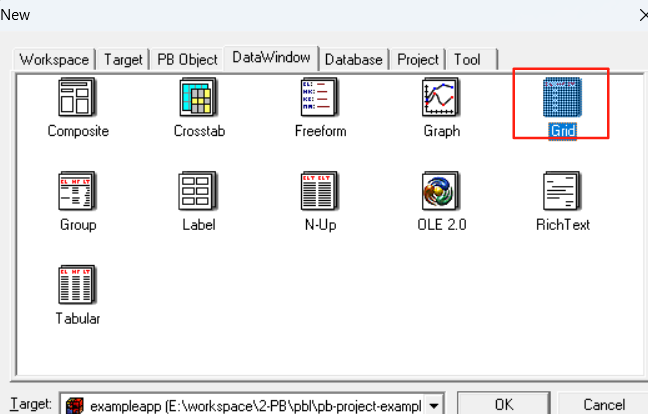
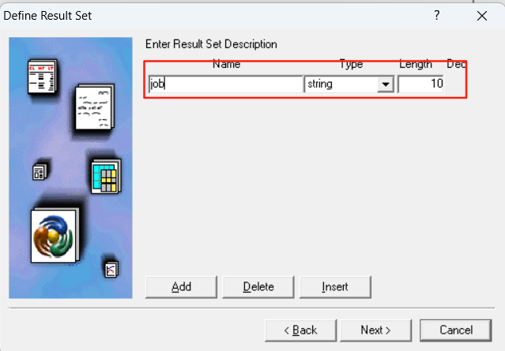
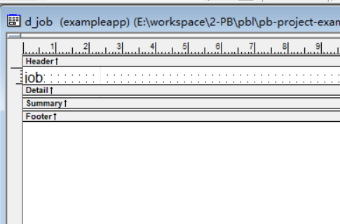
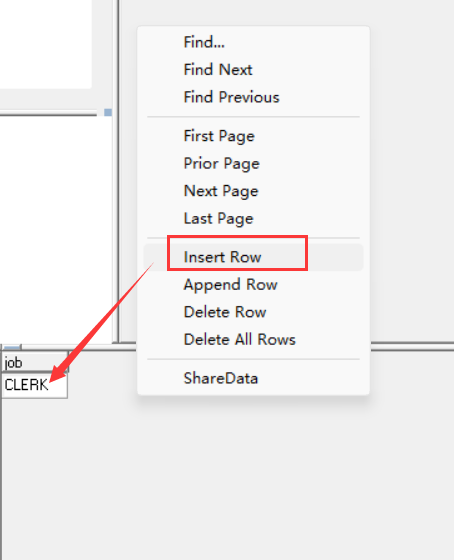
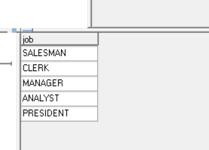
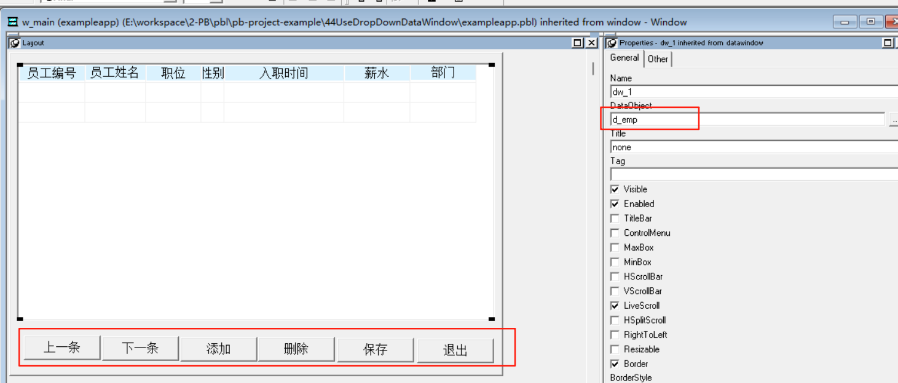
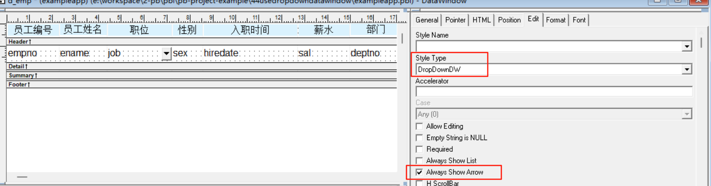
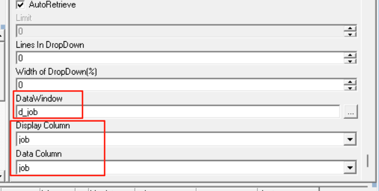
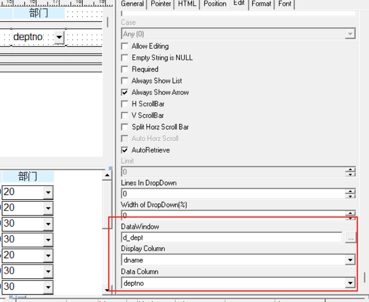
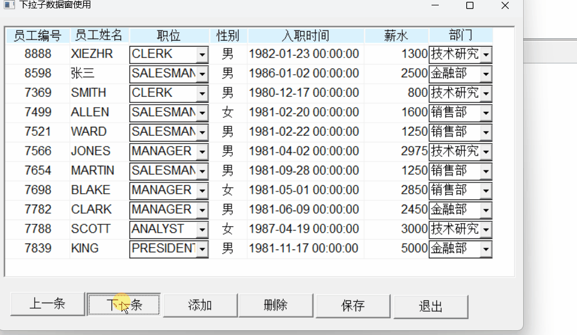

### 写在前面

这是PB案例学习笔记系列文章的第44篇，该系列文章适合具有一定PB基础的读者。

通过一个个由浅入深的编程实战案例学习，提高编程技巧，以保证小伙伴们能应付公司的各种开发需求。

文章中设计到的源码，小凡都上传到了gitee代码仓库[https://gitee.com/xiezhr/pb-project-example.git](https://gitee.com/xiezhr/pb-project-example.git)


需要源代码的小伙伴们可以自行下载查看，后续文章涉及到的案例代码也都会提交到这个仓库【**[pb-project-example](https://gitee.com/xiezhr/pb-project-example)**】

如果对小伙伴有所帮助，希望能给一个小星星⭐支持一下小凡。

### 一、小目标

通过本案例我们将在数据窗口中使用下拉子数据窗口，实现数据项选择。
用户通过下拉框选择数据，而不用自己输入，这样可以避免一些不必要的错误数据产生。
最终效果如下


### 二、创作思路

在数据窗口中，通过将字段设置成下拉子数据窗`Drop Down Data Window`。然后通过数据窗口的方式赋值，
完成我们需要的效果。


### 三、创建程序基本框架

有了基本思路之后，我们就动起来开始写程序了

① 新建`examplework` 工作区

② 新建`exampleapp`应用

③ 新建`w_main`窗口，并将其`Title`设置为"使用下拉子数据窗口"

由于文章篇幅的原因，以上步骤就不再赘述，如果忘记的小伙伴可以翻一翻该系列第一篇文章复习一下

### 四、界面布局

① 建立Grid风格的数据窗口对象
连接`scott`数据库，选择`emp`表，并选择我们需要的字段最总将新建的数据窗口对象保存为`d_emp`.
② 建立Grid风格的外部数据窗口对象`d_job`

- 单击菜单栏上的`File`-`New`命令
- 在弹出的对话框中选择`Grid`
  
- 在弹出的`Choose Data Source` 对话框中hua 中选择`External`
  
- 在弹出的`Define Result Set` 对话框中填写字段名称，选择类型
  
- 将新建的数据窗口对象保存为`d_job`
  
- 向数据窗口`d_job`中添加数据
  
  
  ③ 选择`dept`表,建立`d_dept`数据窗口
  
  ④ 建立窗口控件
  向窗口中添加一个`DataWindow`控件和6个`CommandButton`控件，依次命名为`dw_1`、`cb_1~cb_6`
  ⑤ 设置窗口控件
- `dw_1`控件的`DataObject`设置为`d_emp`
- `cb_1~cb_6` 控件的`Text`依次设置为“上一条”、“下一条”、“添加”、“删除”、“保存”、“退出”。
  

### 五、设置`d_emp`数据窗口

① 设置下拉子数据窗
-在`d_emp`数据窗口中选中职位`job`栏目，在其选项卡`Edit`页面上，将`Style Type`项设置成`DropDownDW`，并勾选
`Always Show Arrow`复选框


- 单击该页面上的`DataWindow`，然后选中之前步骤创建好的`d_job`。并将`Display Column` 和`Data Column`设置为`job`
  

② 通过同样的方式这是`deptno` 栏


### 六、编写代码

① 在`w_main`窗口的`Open`中添加如下代码

```java
dw_1.settransobject(sqlca)
dw_1.retrieve()
```

② 在`w_main`窗口的`cb_1`控件的`Clicked`事件中添加如下代码

```java
dw_1.scrollpriorrow()
```

③ 在`w_main`窗口的`cb_2`控件的`Clicked`事件中添加如下代码

```java
dw_1.scrollnextrow()
```

④ 在`w_main`窗口的`cb_3`控件的`Clicked`事件中添加如下代码

```java
int li_row
li_row = dw_1.insertrow(0)

dw_1.scrolltorow(li_row)
dw_1.setfocus()
```

⑤ 在`w_main`窗口的`cb_4`控件的`Clicked`事件中添加如下代码

```java
int li_row

li_row = dw_1.getrow()
dw_1.deleterow(li_row)

dw_1.update()
commit;
dw_1.retrieve()

```

⑥ 在`w_main`窗口的`cb_5`控件的`Clicked`事件中添加如下代码

```java
dw_1.update()
commit;
dw_1.retrieve()
```

⑦在`w_main`窗口的`cb_6`控件的`Clicked`事件中添加如下代码

```java
close(w_main)
```

⑧ 在开发界面左边的`System Tree`窗口中双击`exampleapp`应用对象，并在其`Open`事件中添加如下代码

```java
SQLCA.DBMS = "O90 Oracle9i (9.0.1)"
SQLCA.LogPass = "tiger"
SQLCA.ServerName = "127.0.0.1:1521/orcl"
SQLCA.LogId = "scott"
SQLCA.AutoCommit = False
SQLCA.DBParm = "PBCatalogOwner='scott'"

connect;
open(w_main)
```

⑨ 在开发界面左边的`System Tree`窗口中双击`exampleapp`应用对象，并在其`close`事件中添加如下代码

```java
disconnect;
```

### 七、运行程序

> 运行程序，看看有没有达到效果
> 