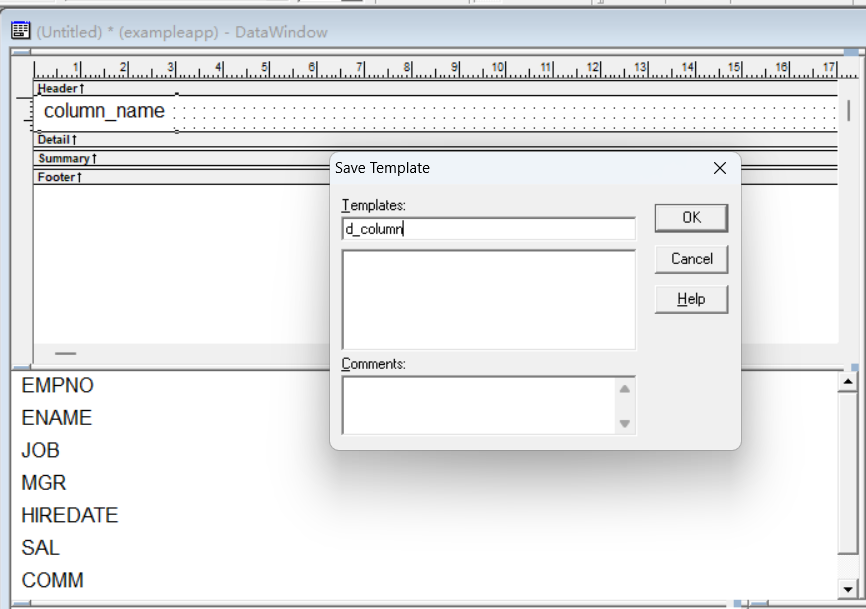
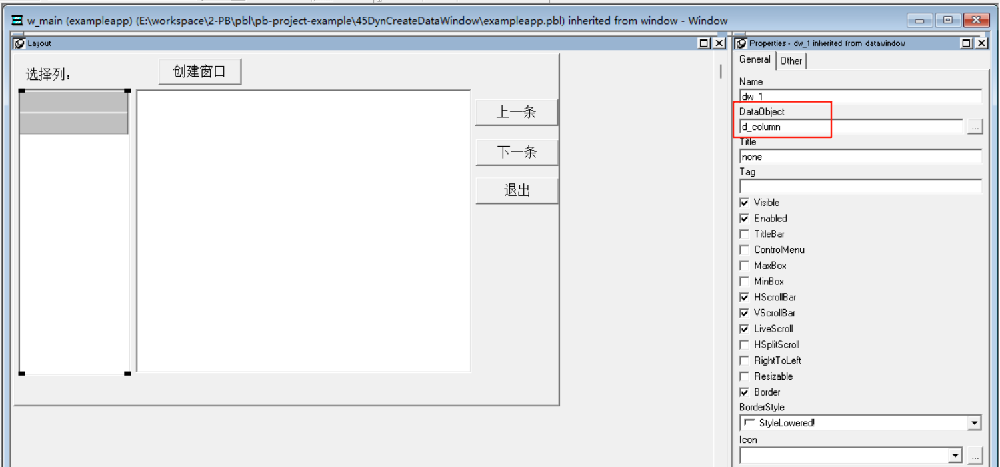
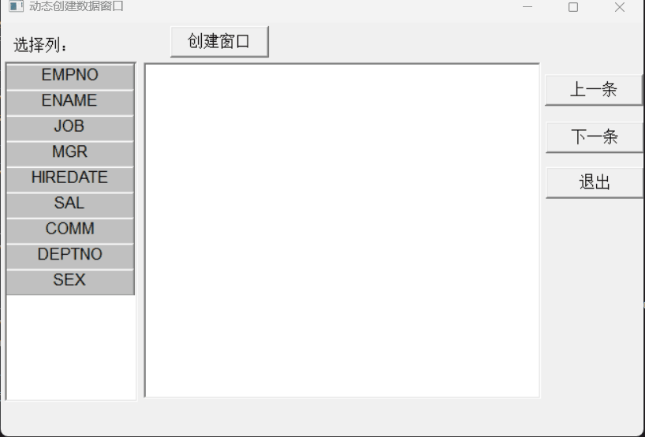

### 写在前面

这是PB案例学习笔记系列文章的第45篇，该系列文章适合具有一定PB基础的读者。

通过一个个由浅入深的编程实战案例学习，提高编程技巧，以保证小伙伴们能应付公司的各种开发需求。

文章中设计到的源码，小凡都上传到了gitee代码仓库[https://gitee.com/xiezhr/pb-project-example.git](https://gitee.com/xiezhr/pb-project-example.git)


需要源代码的小伙伴们可以自行下载查看，后续文章涉及到的案例代码也都会提交到这个仓库【**[pb-project-example](https://gitee.com/xiezhr/pb-project-example)**】

如果对小伙伴有所帮助，希望能给一个小星星⭐支持一下小凡。

### 一、小目标

通过本案例我们将创建一个动态创建数据窗口的程序。我们可以通过选择自己需要的字段，数据窗口风格，动态创建数据窗口。
最终效果如下：


### 二、实现思路

我们通过`SyntaxFromSQL`函数和`Create`函数来创建数据窗口。
① 通过数据窗口控件显示表`emp`中各个列名
② 利用`SyntaxFromSQL`函数，根据`SQL`语句生成`Data Window`的源代码
③ 利用`Create`函数创建`Data Window`对象

`SyntaxFromSQL`函数语法：

```java
transaction.SyntaxFromSQL(sqlselect, presentation,err)
```

参数说明：

| 参数         | 说明                           |
| :----------- | :----------------------------- |
| transaction  | 事务对象名                     |
| sqlselect    | String类型 一条有效的SQL语句   |
| presentation | String类型，指定数据窗口风格   |
| err          | 生成源代码错误时，记录错误信息 |

`Create`函数语法：

```java
dwcontrol.Create(syntax{,errorbuffer})
```

参数说明：

| 参数        | 说明                                                 |
| :---------- | :--------------------------------------------------- |
| dwcontrol   | 数据窗口控件名，创建的数据窗口对象将放置在该控件中   |
| syntax      | 数据窗口对象源代码，函数将使用该代码创建数据窗口对象 |
| errorbuffer | 可选参数，记录创建数据窗口对象过程中出现的错误信息   |


### 三、创建程序基本框架

有了基本思路之后，我们就动起来开始写程序了

① 新建`examplework` 工作区

② 新建`exampleapp`应用

③ 新建`w_main`窗口，并将其`Title`设置为"动态创建数据窗口"

由于文章篇幅的原因，以上步骤就不再赘述，如果忘记的小伙伴可以翻一翻该系列第一篇文章复习一下

### 四、界面布局

① 建立`Freeform`风格的数据窗口对象
连接数据库，选择`user_tab_columns`表，创建`Freeform`风格数据窗口对象。

```sql
SELECT column_name
FROM user_tab_columns
WHERE table_name = 'EMP'
```

保存为`d_columns`备用


② 建立窗口控件
在`w_main`窗口中添加2个`DataWindow`控件、1个`StaticEdit`控件和4个`CommandButton`控件。
控件分别命名为`dw_1`、`dw_2`、`st_1`、`st_2`和`cb_1~cb_4`

③ 设置控件属性

- 将`dw_1`的`DataObject`属性设置为`d_column`，勾选`HSrollBar`和`VScrollBar`复选框
- 将`dw_2`放置在`dw_1`右边
- 将`st_1`控件的`Text`设置为“选择列：”
- 将`cb_1~cb_4`控件的`Text`依次设置为“创建窗口”、“上一条”、“下一条”和退出
  
  ④ 保存窗口

### 五、编写代码

① 在`w_main`窗口的`Open`事件中添加如下代码

```java
dw_1.settransobject(sqlca)
dw_1.retrieve()
```

② 在`dw_1`的`Clicked`事件中添加如下脚本

```java
integer li_row
//获取当前行数
li_row=dw_2.getclickedrow()
if li_row=0 then return 
//如果为选中行，则取消该行的选中状态
if dw_2.isselected(li_row) then
	dw_2.selectrow(li_row,false)
//如果该行为被选中，则选中
else
	dw_2.selectrow(li_row,true)
end if
```

③ 在`cb_1`的`Clicked`事件中添加如下脚本

```java
string ls_sql,exp,err
string ls_select
integer num,i
//获取字段名的个数
num=dw_1.rowcount()
//获取选中的字段名
for i=1 to num
	if dw_1.isselected(i) then
		if ls_select<>"" then ls_select=ls_select+","
		ls_select=ls_select+dw_1.getitemstring(i,"column_name")
	end if
next
//判断用户是否对字段进行选择
if ls_select="" then
	messagebox("错误","用户未选择字段！")
end if
//生成SQL SELECT语句
ls_sql="select "+ls_select+" from emp"
//生成数据窗口的源代码
exp=sqlca.syntaxfromsql(ls_sql,'style(type=Form)',err)
//创建数据窗口
dw_2.create(exp)
//显示数据
dw_2.settransobject(sqlca)
dw_2.retrieve()
```

④ 在`cb_2`的`Clicked`事件中添加如下代码

```java
int m 
m = dw_2.getrow()
if m>1 then
	m=m - 1
	dw_2.scrolltorow(m)
	dw_2.setfocus()
else
	beep(1)
end if
```

⑤ 在`cb_3`的`Clicked`事件中添加如下代码

```java
dw_2.scrollnextrow()
```

⑥ 在`cb_4`的`Clicked`事件中添加如下代码

```java
close(w_main)
```

⑦ 在开发界面左边`System Tree`窗口中双击`exampleapp`应用对象，并在其`Open`事件中添加如下diamond

```java
// Profile scott
SQLCA.DBMS = "O90 Oracle9i (9.0.1)"
SQLCA.LogPass = "tiger"
SQLCA.ServerName = "127.0.0.1:1521/orcl"
SQLCA.LogId = "scott"
SQLCA.AutoCommit = False
SQLCA.DBParm = "PBCatalogOwner='scott'"

connect;

open(w_main)
```

⑦ 在开发界面左边`System Tree`窗口中双击`exampleapp`应用对象，并在其`close`事件中添加如下diamond

```java
disconnect;
```

### 六、运行程序

> 运行程序，看看有没有达到预期效果

