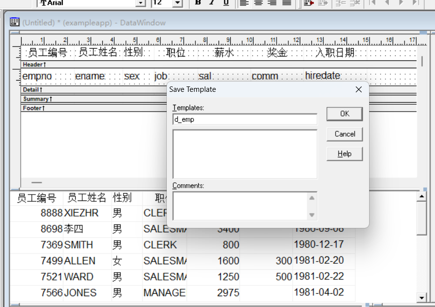
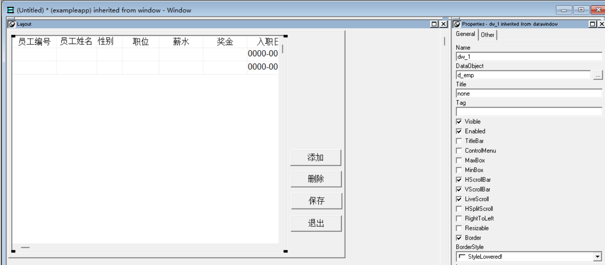
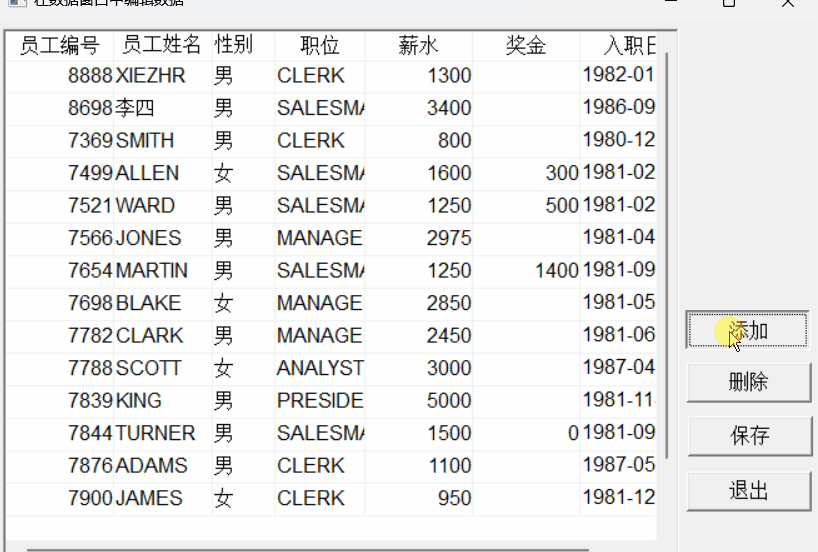

### 写在前面

这是PB案例学习笔记系列文章的第46篇，该系列文章适合具有一定PB基础的读者。

通过一个个由浅入深的编程实战案例学习，提高编程技巧，以保证小伙伴们能应付公司的各种开发需求。

文章中设计到的源码，小凡都上传到了gitee代码仓库[https://gitee.com/xiezhr/pb-project-example.git](https://gitee.com/xiezhr/pb-project-example.git)


需要源代码的小伙伴们可以自行下载查看，后续文章涉及到的案例代码也都会提交到这个仓库【**[pb-project-example](https://gitee.com/xiezhr/pb-project-example)**】

如果对小伙伴有所帮助，希望能给一个小星星⭐支持一下小凡。

### 一、小目标

通过本案例我们将实现在数据窗口中对数据进行增删改查操作。
程序最终效果如下：


### 二、实现思路

在`PB`中，我们可以通过`RowCount`、`InsertRow`、`DeleteRow`、`ScrollToRow`和`update`函数来对数据进行增删改查操作。

#### 2.1 `InsertRow`函数

> 在数据窗口控件指定行前面插入一行
> 语法：

```java
dwcontrol.InsertRow(row)
```

参数说明：

| 参数      | 说明                                                         |
| :-------- | :----------------------------------------------------------- |
| dwcontrol | 需要操作的数据窗口空间名                                     |
| row       | Long类型，指定在哪一行前面插入新行。当row=0时，表示在最后一行后面插入一行 |

#### 2.2 `RowCount`函数

> 返回数据窗口控件当前可用的行数

语法：

```java
dwcontrol.RowCount()
```

#### 2.3 `ScrollToRow`函数

> 滚动数据窗口控件的显示到指定行，行数改变当前行，但不改变当前列

语法：

```java
dwcontrol.ScrollToRow(row)
```

#### 2.4 `Update`函数

> 把数据窗口控件中所有数据修改（增、删、改）传送到数据库，从而更新数据库中数据
> 注：在使用`Update`函数之前需要先调用`AcceptText`函数将“漂浮”在当前行/列上的编辑框中的内容放入到数据窗口的缓冲区中

语法：

```java
dwcontrol.Update({accept{,resetflag}})
```

参数说明：

| 参数      | 参数说明                                                     |
| :-------- | :----------------------------------------------------------- |
| dwcontrol | 数据窗口空间名                                               |
| accept    | 可选项，Boolean类型。指定数据窗口控件在更新数据库之前是否自动执行`AcceptText`的功能呢 |
| resetflag | 可选项，Boolean类型，指定更新数据库后是否自动恢复更新标志    |

### 三、创建程序基本框架

有了基本思路之后，我们就动起来开始写程序了

① 新建`examplework` 工作区

② 新建`exampleapp`应用

③ 新建`w_main`窗口，并将其`Title`设置为"窗口中编辑数据"

由于文章篇幅的原因，以上步骤就不再赘述，如果忘记的小伙伴可以翻一翻该系列第一篇文章复习一下

### 四、界面布局

① 建立数据窗口对象
连接数据库，选择`emp`表，建立Grid风格的数据窗口，选中需要的字段，并保存为`d_emp`

② 建立窗口控件
向`w_main`窗口中添加1个`DataWindow`控件和4个`CommandButton`控件，依次命名为`dw_1`、`cb_1~cb_4`
③ 设置窗口控件

- `dw_1`的`DataObject`属性设置为`d_emp`
- `cb_1`的`Text`属性设置为"添加"
- `cb_2`的`Text`属性设置为"删除"
- `cb_3`的`Text`属性设置为"保存"
- `cb_4`的`Text`属性设置为"退出"
  

### 五、编写代码

① 在`w_main`窗口的`Open`事件中添加如下代码

```java
dw_1.settransobject(sqlca)
dw_1.retrieve()
```

② 在`w_main`窗口的`cb_1`按钮的`Clicked`事件中添加如下代码

```java
int li_row
//在数据窗口的最后一行后面插入一行
li_row = dw_1.insertRow(0)
// 滚动到li_row行
dw_1.scrollToRow(li_row)
//设置焦点
dw_1.setfocus()
```

③ 在`w_main`窗口的`cb_2`按钮的`Clicked`事件中添加如下代码

```java
int li_row
//获取当前行
li_row = dw_1.getRow()
//删除li_row行
dw_1.deleteRow(li_row)
//将数据更新到数据库
dw_1.update()
//提交事务
commit;
//查询数据赋值给dw_1
dw_1.retrieve()
```

④ 在`w_main`窗口的`cb_3`按钮的`Clicked`事件中添加如下代码

```java
//将数据更新到数据库
dw_1.update()
//提交事务
commit;
//查询数据赋值给dw_1
dw_1.retrieve()
```

⑤ 在`w_main`窗口的`cb_4`按钮的`Clicked`事件中添加如下代码

```java
close(parent)
```

⑥ 在开发界面左边的`System Tree`窗口中双击`exampleapp`应用对象，并在其`Open`事件中添加如下代码

```java
SQLCA.DBMS = "O90 Oracle9i (9.0.1)"
SQLCA.LogPass = "tiger"
SQLCA.ServerName = "127.0.0.1:1521/orcl"
SQLCA.LogId = "scott"
SQLCA.AutoCommit = False
SQLCA.DBParm = "PBCatalogOwner='scott'"

connect;
open(w_main)
```

⑦ 在开发界面左边的`System Tree`窗口中双击`exampleapp`应用对象，并在其`close`事件中添加如下代码

```java
disconnect;
```

### 六、运行程序

> 运行程序，看看是否达到预期效果

