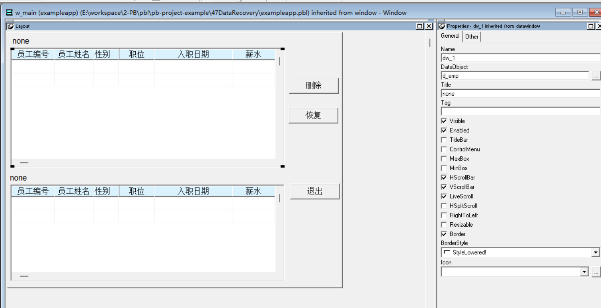
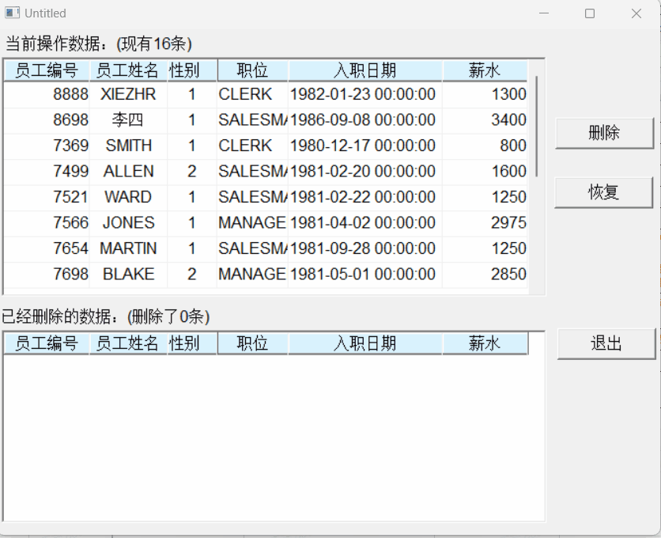

### 写在前面

这是PB案例学习笔记系列文章的第47篇，该系列文章适合具有一定PB基础的读者。

通过一个个由浅入深的编程实战案例学习，提高编程技巧，以保证小伙伴们能应付公司的各种开发需求。

文章中设计到的源码，小凡都上传到了gitee代码仓库[https://gitee.com/xiezhr/pb-project-example.git](https://gitee.com/xiezhr/pb-project-example.git)


需要源代码的小伙伴们可以自行下载查看，后续文章涉及到的案例代码也都会提交到这个仓库【**[pb-project-example](https://gitee.com/xiezhr/pb-project-example)**】

如果对小伙伴有所帮助，希望能给一个小星星⭐支持一下小凡。

### 一、小目标

本案例我们将实现一个删除数据的恢复功能。数据是无价的，这个在日常数据操作中会经常用到。
最终实现效果如下：


### 二、创作思路

当执行数据窗口的删除操作时，在数据库还没更新之前，删除的数据还保存在数据窗口的`Deleted`缓冲区中，
通过使用函数`RowsMove`将该缓冲区移动到`Primary`缓冲区中，就可以实现对删除的数据进行恢复的功能。

`RowsMove` 函数
① 语法：

```java
dwcontrol.RowsMove(startrow,endrow,movebuffer,targetdw,beforerow,targetbuffer)
```

② 参数说明：

| 参数         | 参数说明                 |
| :----------- | :----------------------- |
| dwcontrol    | 源数据窗口控件名称       |
| startrow     | 源数据窗口缓冲区开始行号 |
| endrow       | 源数据窗口缓冲区结束行号 |
| movebuffer   | 源数据窗口缓冲区名称     |
| targetdw     | 目标数据窗口控件名称     |
| beforerow    | 目标缓冲区行号           |
| targetbuffer | 目标缓冲区名称           |

参数`startrow`、`endrow`和`movebuffer`都是对源数据窗口而言的，用来指定要移动的数据是从`movebuffer`缓冲区中的
`startrow`行开始，到`endrow`行结束；`targetdw`是目标窗口控件名称，可以和源数据窗口控件相同；移动的数据放在
`targetdw`窗口`targetbuffer`缓冲区中从`beforerow`行开始的行中。

### 三、创建程序基本框架

有了基本思路之后，我们就动起来开始写程序了

① 新建`examplework` 工作区

② 新建`exampleapp`应用

③ 新建`w_main`窗口，并将其`Title`设置为“恢复删除的数据”

由于文章篇幅的原因，以上步骤就不再赘述，如果忘记的小伙伴可以翻一翻该系列第一篇文章复习一下

### 四、界面布局

① 建立Grid风格的数据窗口对象
连接数据据，以`emp`表为基础，建立数据窗口对象`d_emp`

② 建立窗口控件
在`w_main`窗口中添加2个`DataWindow`控件，2个`StaticEdit`控件和3个`CommandButton`控件.
并将其分别命名为`dw_1`、`dw_2`、`st_1`、`st_2`、`cb_1`、`cb_2`和`cb_3`
③ 设置控件属性
将`dw_1`和`dw_2`控件的`DataObject`属性设置为`d_emp`，并勾选`HscrollBar`和`VscrollBar`复选框
④ 将`cb_1`控件的`Text`设置为"删除"
⑤ 将`cb_2`控件的`Text`设置为"恢复"
⑥ 将`cb_3`控件的`Text`设置为"退出"


### 五、编写代码

① 在`w_main`窗口的`Open`事件中添加如下代码

```java
//使数据窗口与事务对象相连
dw_1.SetTransObject(sqlca)
//执行检索操作
dw_1.retrieve()
st_1.text = "当前操作数据：(现有"+string(dw_1.rowcount())+"条)"
st_2.text = "已经删除的数据：(删除了"+string(dw_2.rowcount())+"条)"
```

② 在按钮`cb_1`的`Clicked`事件中添加如下代码

```java
int s 
s = dw_1.getrow()
if s>0 then
	//如果有数据
	//让用户确认是否真要删除数据
	if MessageBox("删除","是否真要删除员工编号为"+&
	string(dw_1.object.empno[s])+"的数据?",&
		Question!,YesNo!,2) =1 then
	//将数据从一个数据窗口移动到另一个数据窗口
	dw_1.Rowsmove(s,s,primary!, dw_2, dw_2.rowcount()+1, primary!)
	st_1.text = "当前操作数据：(现有"+string(dw_1.rowcount())+"条)"
	st_2.text = "已经删除的数据：(删除了"+string(dw_2.rowcount())+"条)"
end if
else
	Beep(1)
	MessageBox("提示","请选择要删除的数据!")
end if
```

③ 在按钮`cb_2`的`Clicked`事件中添加如下代码

```java
int s
s = dw_2.getrow()
if s>0 then
	if MessageBox("恢复","是否要恢复员工编号为"+&
						string(dw_2.object.empno[s])+"的数据?",&
						Question!,YesNo!,2) = 1 then
		dw_2.Rowsmove(s,s, primary!, dw_1, dw_1.rowcount()+1, Primary!)
		st_1.text = "当前操作数据：(现有"+string(dw_1.rowcount())+"条)"
		st_2.text = "已经删除的数据：(删除了"+string(dw_2.rowcount())+"条)"
	end if
else
	Beep(1)
	MessageBox("提示","请先选择要恢复的数据!")
end if
								
```

④ 在`cb_3`的`Clicked`事件中添加如下代码

```java
close(w_main)
```

⑤ 在`w_main`窗口的`cb_4`按钮的`Clicked`事件中添加如下代码

```java
close(parent)
```

⑥ 在开发界面左边的`System Tree`窗口中双击`exampleapp`应用对象，并在其`Open`事件中添加如下代码

```java
SQLCA.DBMS = "O90 Oracle9i (9.0.1)"
SQLCA.LogPass = "tiger"
SQLCA.ServerName = "127.0.0.1:1521/orcl"
SQLCA.LogId = "scott"
SQLCA.AutoCommit = False
SQLCA.DBParm = "PBCatalogOwner='scott'"

connect;
open(w_main)
```

⑦ 在开发界面左边的`System Tree`窗口中双击`exampleapp`应用对象，并在其`close`事件中添加如下代码

```java
disconnect;
```

### 六、运行程序

> 运行程序，看看有没有达到预期效果
> 