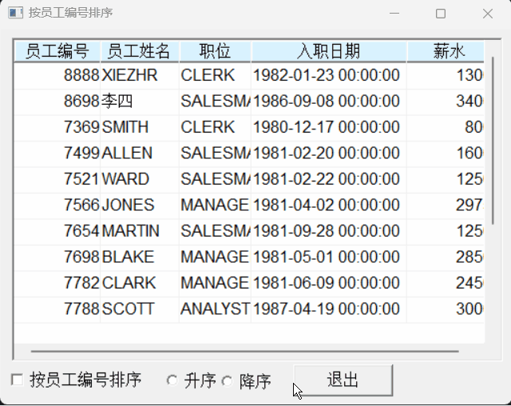
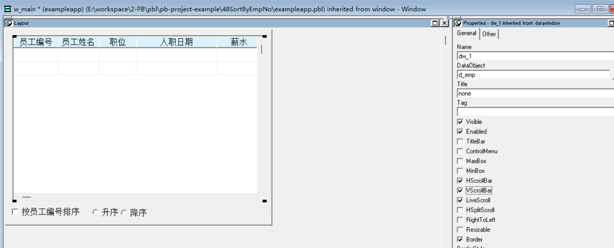

### 写在前面

这是PB案例学习笔记系列文章的第48篇，该系列文章适合具有一定PB基础的读者。

通过一个个由浅入深的编程实战案例学习，提高编程技巧，以保证小伙伴们能应付公司的各种开发需求。

文章中设计到的源码，小凡都上传到了gitee代码仓库[https://gitee.com/xiezhr/pb-project-example.git](https://gitee.com/xiezhr/pb-project-example.git)


需要源代码的小伙伴们可以自行下载查看，后续文章涉及到的案例代码也都会提交到这个仓库【**[pb-project-example](https://gitee.com/xiezhr/pb-project-example)**】

如果对小伙伴有所帮助，希望能给一个小星星⭐支持一下小凡。

### 一、小目标

通过本案例我们将实现列表按员工编号排序的功能。运行程序后，在弹出的界面上选择“按员工编号排序”的复选框，
通过选择“升序”、“降序”按钮，来实现员工信息的排序功能
最终实现效果如下：



### 二、实现思路

PB中提供了`SetSort`和`Sort` 函数来实现指定数据窗口按照指定格式设置排序。

`SetSort`函数
语法：

```java
dwcontrol.SetSort(Format);
```

`Format`参数用来指定要排序的字段和排序方式，可以使用字段名或数字指定排序的字段，使用字母A或D来指明升序或降序

`Sort`函数
语法：

```java
dwcontrol.Sort()
```

根据`SetSort`设置的排序规则对数据窗口进行排序。


### 三、创建程序基本框架

有了基本思路之后，我们就动起来开始写程序了

① 新建`examplework` 工作区

② 新建`exampleapp`应用

③ 新建`w_main`窗口，并将其`Title`设置为"按员工编号排序"

由于文章篇幅的原因，以上步骤就不再赘述，如果忘记的小伙伴可以翻一翻该系列第一篇文章复习一下


### 四、界面布局

① 建立Grid风格数据窗口对象
连接数据据，以`emp`表为基础，建立数据窗口对象`d_emp`

② 建立窗口控件
向`w_main`窗口中添加1个`DataWindow`控件、1个`CommandButton`控件、1个`CheckBox`控件和2个`RadioButton`控件。
依次命名为`dw_1`、`cb_1`、`cbx_1`、`rb_1`和`rb_2`

③ 设置窗口控件属性

- 将`dw_1`控件的`DataObject`属性设置为`d_emp`，并勾选`HScrollBar`和`VScrollBar`复选框
- 将`cb_1`控件的`Text`值设置为“退出”
- 将`cbx_1`控件的`Text`值设置为“按员工编号排序”`
- 将`rb_1`控件的`Text`值设置为“升序”
- 将`rb_2`控件的`Text`值设置为“降序”



### 五、编写代码

① 在`w_main`窗口的`Open`事件中添加如下代码

```java
dw_1.settransobject(sqlca)
dw_1.retrieve()
```

② 在`cbx_1`控件的`Clicked`事件中添加如下代码

```java
if cbx_1.checked = true then
	if rb_1.checked = true then
		dw_1.setsort(" A")
	else
		dw_1.setsort("sno D")
	end if
	dw_1.sort()
end if
```

③ 在`rb_1`控件的`Clicked`事件中添加如下代码

```java
if cbx_1.checked = true then
	dw_1.setsort("empno A")
	dw_1.sort()
end if
```

④ 在`rb_2`控件的`Clicked`事件中添加如下代码

```java
if cbx_1.checked = true then
	dw_1.setsort("empno D")
	dw_1.sort()
end if	
```

⑤ 在`cb_1`控件的`Clicked`事件中添加如下代码

```java
close(w_main)
```

⑥ 在开发界面左边的`System Tree`窗口中双击`exampleapp`应用对象，并在其`Open`事件中添加如下代码

```java
SQLCA.DBMS = "O90 Oracle9i (9.0.1)"
SQLCA.LogPass = "tiger"
SQLCA.ServerName = "127.0.0.1:1521/orcl"
SQLCA.LogId = "scott"
SQLCA.AutoCommit = False
SQLCA.DBParm = "PBCatalogOwner='scott'"

connect;
open(w_main)
```

⑦ 在开发界面左边的`System Tree`窗口中双击`exampleapp`应用对象，并在其`close`事件中添加如下代码

```java
disconnect;
```

### 六、运行程序

> 运行程序，看看是否实现预期效果
> 