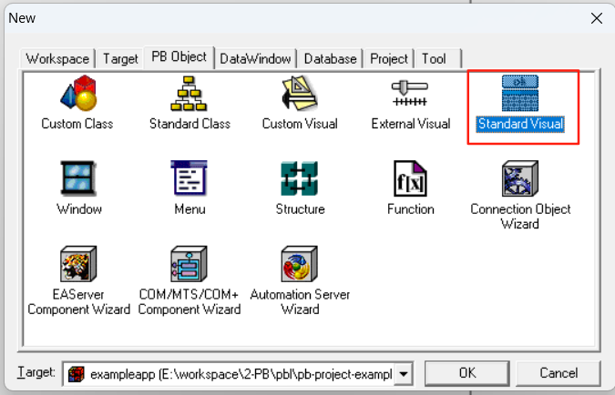
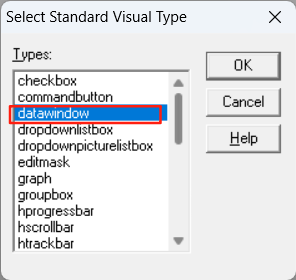
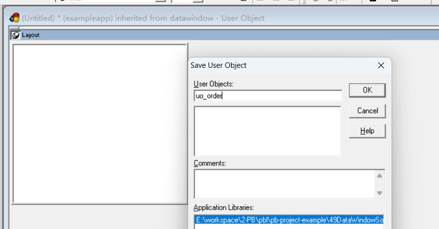
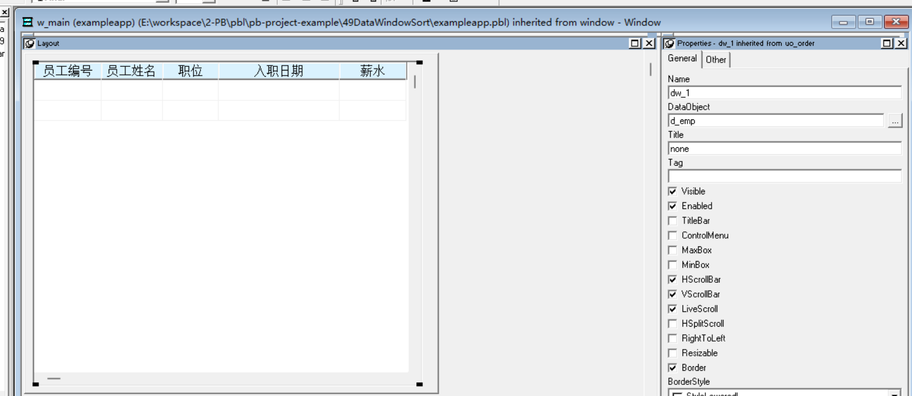
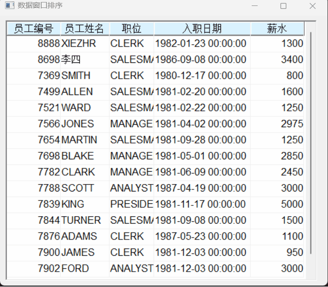

### 写在前面

这是PB案例学习笔记系列文章的第49篇，该系列文章适合具有一定PB基础的读者。

通过一个个由浅入深的编程实战案例学习，提高编程技巧，以保证小伙伴们能应付公司的各种开发需求。

文章中设计到的源码，小凡都上传到了gitee代码仓库[https://gitee.com/xiezhr/pb-project-example.git](https://gitee.com/xiezhr/pb-project-example.git)


需要源代码的小伙伴们可以自行下载查看，后续文章涉及到的案例代码也都会提交到这个仓库【**[pb-project-example](https://gitee.com/xiezhr/pb-project-example)**】

如果对小伙伴有所帮助，希望能给一个小星星⭐支持一下小凡。

### 一、小目标

通过本案例我们将制作一个在数据窗口中排序的程序。运行程序后，单击表格的列标题，该列的数据
会自动排序，不断点击，还会改变排序规则。
最终运行效果如下：


### 二、实现思路

标准的可视化对象是对PB现有控件的扩充，它在现有控件基础功能的基础上增加应用程序需要的功能。
我们将通过标准可视用户对象来实现排序功能

### 三、创建程序基本框架

有了基本思路之后，我们就动起来开始写程序了

① 新建`examplework` 工作区

② 新建`exampleapp`应用

③ 新建`w_main`窗口，并将其`Title`设置为"数据窗口排序"

④ 基于表`emp`建立数据窗口对象`d_emp`

由于文章篇幅的原因，以上步骤就不再赘述，如果忘记的小伙伴可以翻一翻该系列第一篇文章复习一下

### 四、建立标准可视用户对象

① 单击菜单栏上的`File`->`New`在弹出的New对话框中的`PB Object`选项卡中选择`Standard Visual `图标，并单击`OK`

② 在弹出的`Select Standard Visual`对话框中选择`datawindow`，并单击`OK`建立可视化用户对象`uo_order`



③ 在`uo_order`用户对象的`Clicked`事件中添加如下代码

```java
string ls_AddPict, ls_CurObj, ls_Picture, ls_CurCol
integer li_PictPos

ls_CurObj = String(dwo.Name)
If Row = 0 AND This.Describe(ls_CurObj + ".Text") <> "!" AND This.Describe(ls_CurObj + ".Band") = "header" Then // Valid header object?
	ls_CurCol = Left(ls_CurObj,Len(ls_CurObj) - 2)
	If is_OrderCol <> ls_CurCol Then // Different Column
		This.Modify("DESTROY p_" + is_OrderCol)
		is_OrderCol = Left(ls_CurObj,Len(ls_CurObj) - 2)
		ls_Picture = "ORDERUP.BMP"
		is_SortType = "A" // Ascending sort
		li_PictPos = Integer(This.Describe(ls_CurObj + ".X"))+ (Integer(This.Describe(ls_CurObj + ".Width")) - 70)
		ls_AddPict ='create bitmap(band=foreground filename="' + ls_Picture + '" ' + &
						' x="' + String(li_PictPos) + "~tInteger(describe('" + is_OrderCol + & 
						".X')) + (Integer(describe('" + is_OrderCol + ".Width'))" + ' - 70)" y="24" ' + &
						' height="33" width="51" border="0" name=p_' + is_OrderCol + ' visible="1")'
		This.Modify(ls_AddPict)
		This.SetSort(is_OrderCol + " " + is_SortType)
		This.Sort()
	Else
		If is_SortType = "A" Then
			ls_Picture = "ORDERDW.BMP"
			is_SortType = "D"
		Else
			ls_Picture = "ORDERUP.BMP"
			is_SortType = "A"
		End If
		This.Modify('p_' + is_OrderCol + '.filename = "' + ls_Picture + '"')
		This.SetSort(is_OrderCol + " " + is_SortType)
		This.Sort()
	End If
End If
```

④ 关闭标准可视对象`uo_order`，并在`w_main`窗口中添加标准可视对象`uo_order`，在窗口中命名为`dw_1`
并将`DataObject`设置为`d_emp`，勾选`HScrollBar`和`VScrollBar`复选框


### 五、编写代码

① 在`w_main`窗口的`Open`事件中添加以下代码

```java
dw_1.settransobject(sqlca)
dw_1.retrieve()
```

② 在开发界面左边的`System Tree`窗口中双击`exampleapp`应用对象，并在其`Open`事件中添加如下代码

```java
SQLCA.DBMS = "O90 Oracle9i (9.0.1)"
SQLCA.LogPass = "tiger"
SQLCA.ServerName = "127.0.0.1:1521/orcl"
SQLCA.LogId = "scott"
SQLCA.AutoCommit = False
SQLCA.DBParm = "PBCatalogOwner='scott'"

connect;
open(w_main)
```

③ 在开发界面左边的`System Tree`窗口中双击`exampleapp`应用对象，并在其`close`事件中添加如下代码

```java
disconnect;
```

### 六、运行程序

>运行程序,看看是否达到预期效果
>