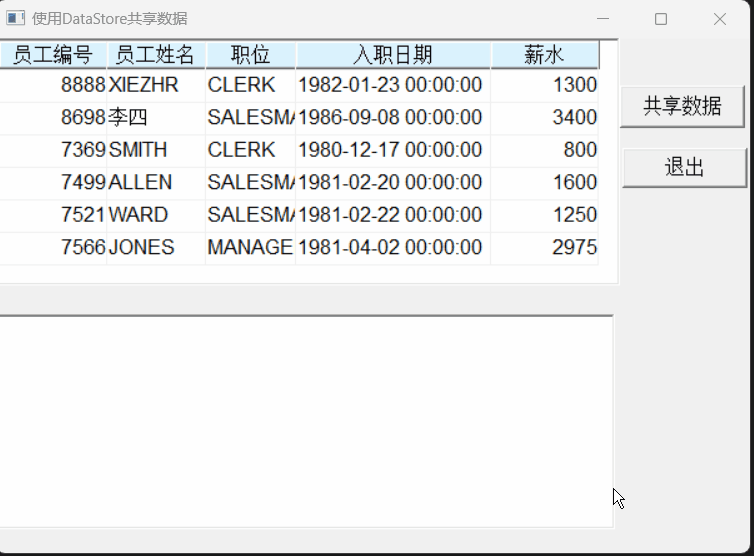
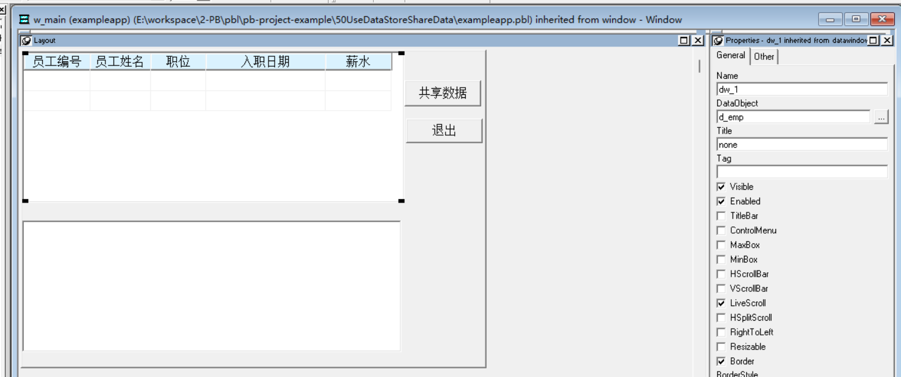

### 写在前面

这是PB案例学习笔记系列文章的第50篇，该系列文章适合具有一定PB基础的读者。

通过一个个由浅入深的编程实战案例学习，提高编程技巧，以保证小伙伴们能应付公司的各种开发需求。

文章中设计到的源码，小凡都上传到了gitee代码仓库[https://gitee.com/xiezhr/pb-project-example.git](https://gitee.com/xiezhr/pb-project-example.git)


需要源代码的小伙伴们可以自行下载查看，后续文章涉及到的案例代码也都会提交到这个仓库【**[pb-project-example](https://gitee.com/xiezhr/pb-project-example)**】

如果对小伙伴有所帮助，希望能给一个小星星⭐支持一下小凡。

### 一、小目标

通过本案例，我们实现通过`DataStore`共享数据。通过点击界面上的“共享数据”按钮，将一个数据窗口
中的数据共享给另一个数据窗口。
最终实现效果如下：


### 二、创作思路

在PB中，数据存储对象`DataStore`实际上就是去掉可视特征的数据窗口控件。
除了可视特征外，`DataStore`与`DataWindow`的功能用法完全相同。

数据存储对象`DataStore`属性很简单，其说明如下

| 属性       | 说明                                                         |
| :--------- | :----------------------------------------------------------- |
| DataObject | String类型，指定数据存储对象相关联的数据窗口对象名称或报表对象名 |
| ObjectDW   | Object类型，用于代码中直接操作数据窗口对象中的对象，包括设置对象的属性，得到数据窗口中的数据 |


### 三、创建程序基本框架

有了基本思路之后，我们就动起来开始写程序了

① 新建`examplework` 工作区

② 新建`exampleapp`应用

③ 新建`w_main`窗口，并将其`Title`设置为“使用DataStore共享数据”

由于文章篇幅的原因，以上步骤就不再赘述，如果忘记的小伙伴可以翻一翻该系列第一篇文章复习一下

### 四、界面布局

① 建立Grid风格数据窗口对象
连接数据库，以`emp`表为数据源，建立数据窗口对象`d_emp`
② 建立窗口控件
向`w_main`窗口中添加2个`DataWindow`控件和2个`CommandButton`控件
依次命名为`dw_1`、`dw_2`、`cb_1`、`cb_2`
③ 设置窗口控件属性

- 将`dw_1`控件的`DataObject`设置为`d_emp`，并勾选`HScrollBar`和`VScrollBar`复选框
- 将`cb_1`按钮的`Text`设置为“共享数据”
- 将`cb_2`按钮的`Text`设置为“退出”
  

### 五、编写代码

① 在`w_main`窗口的`Open`事件中添加如下代码

```java
dw_1.settransobject(sqlca)
dw_1.retrieve()
```

② 在`cb_1`的`Clicked`事件中添加如下代码

```java
datastore ds_emp
ds_emp = create datastore
ds_emp.dataobject = "d_emp"
ds_emp.settransobject(sqlca)
ds_emp.retrieve()
dw_2.dataobject = ds_emp.dataobject
ds_emp.sharedata(dw_2)
```

③ 在`cb_2`的`Clicked`事件中添加如下代码

```java
close(w_main)
```

④ 在开发界面左边的`System Tree`窗口中双击`exampleapp`应用对象，并在其`Open`事件中添加如下代码

```java
SQLCA.DBMS = "O90 Oracle9i (9.0.1)"
SQLCA.LogPass = "tiger"
SQLCA.ServerName = "127.0.0.1:1521/orcl"
SQLCA.LogId = "scott"
SQLCA.AutoCommit = False
SQLCA.DBParm = "PBCatalogOwner='scott'"

connect;
open(w_main)
```

⑤ 在开发界面左边的`System Tree`窗口中双击`exampleapp`应用对象，并在其`close`事件中添加如下代码

```java
disconnect;
```

### 六、运行程序

> 运行程序看看效果

