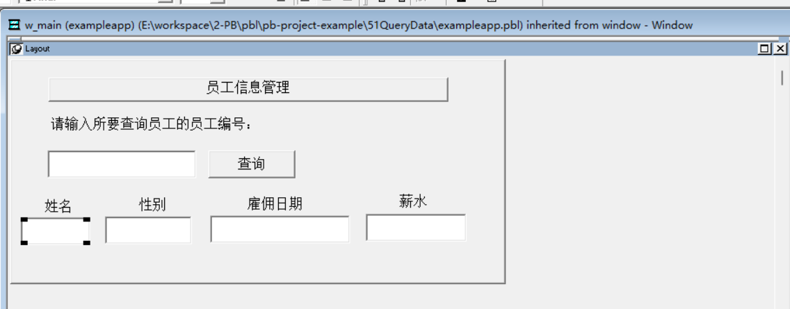
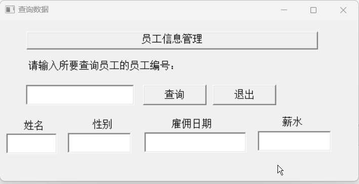

### 写在前面

这是PB案例学习笔记系列文章的第51篇，该系列文章适合具有一定PB基础的读者。

通过一个个由浅入深的编程实战案例学习，提高编程技巧，以保证小伙伴们能应付公司的各种开发需求。

文章中设计到的源码，小凡都上传到了gitee代码仓库[https://gitee.com/xiezhr/pb-project-example.git](https://gitee.com/xiezhr/pb-project-example.git)


需要源代码的小伙伴们可以自行下载查看，后续文章涉及到的案例代码也都会提交到这个仓库【**[pb-project-example](https://gitee.com/xiezhr/pb-project-example)**】

如果对小伙伴有所帮助，希望能给一个小星星⭐支持一下小凡。

### 一、小目标

通过本案例，我们将制作一个根据员工编号查询员工信息的程序。在指定位置输入员工编号，
单击【查询】按钮，在窗口下端会显示该员工的基本信息，如果没有要查询的员工编号，会弹出提示窗，“没有此员工”。
最终效果如下：


### 二、实现思路

在PB开发应用程序中，大多数情况下与数据库交互都是通过数据窗口完成的。但有时候我们也需要在程序中直接使用SQL语句来
操作数据库，例如查询一条员工信息。针对这样的需求，PB 提供了一整套嵌入式SQL语句。利用嵌入SQL语句，我们就可以轻松实现本案例功能。

### 三、创建程序基本框架

有了基本思路之后，我们就动起来开始写程序了

① 新建`examplework` 工作区

② 新建`exampleapp`应用

③ 新建`w_main`窗口，并将其`Title`设置为“查询数据”

由于文章篇幅的原因，以上步骤就不再赘述，如果忘记的小伙伴可以翻一翻该系列第一篇文章复习一下

### 四、界面布局

① 建立窗口控件
在窗口中添加6个`StaticText`控件、5个`SingleLineEdit`控件和2个`CommandButton`控件。分别命名为`st_1~st_6`、
`sle_1~sle_5`和`cb_1`、`cb_2`
② 设置控件属性
`st_1~st_6`、`cb_1`和`cb_2`控件的`Text`值分别设置为“员工信息管理”、“请输入所要查询员工的员工编号：”、“姓名”
、“性别”、“职位”、“雇佣日期”、“薪水” 、“查询”和”退出“


### 五、编写代码

① 在`cb_1`控件的`Clicked`事件中编写代码

```java
sle_2.text = ''
sle_3.text = ''
sle_4.text = ''
sle_5.text = ''

select t.ename,
       decode(t.sex, '1', '男', '2', '女') as sex,
       to_char(t.hiredate, 'yyyy-mm-dd') as hiredate,
       sal
	into :sle_2.text,
		  :sle_3.text,
		  :sle_4.text,
		  :sle_5.text
  from emp t
  where t.empno=:sle_1.text;
  
if sle_2.text = "" then
	messagebox('提示信息',"没有此员工")
	sle_1.text = ""
end if
sle_1.setfocus()
```

② 在`cb_2`控件的`Clicked`事件中编写代码

```java
close(w_main)
```

③ 在开发界面左边的`System Tree`窗口中双击`exampleapp`应用对象，并在其`Open`事件中添加如下代码

```java
SQLCA.DBMS = "O90 Oracle9i (9.0.1)"
SQLCA.LogPass = "tiger"
SQLCA.ServerName = "127.0.0.1:1521/orcl"
SQLCA.LogId = "scott"
SQLCA.AutoCommit = False
SQLCA.DBParm = "PBCatalogOwner='scott'"

connect;
open(w_main)
```

④ 在开发界面左边的`System Tree`窗口中双击`exampleapp`应用对象，并在其`close`事件中添加如下代码

```java
disconnect;
```

### 六、运行程序

> 运行程序，看看有没有达到预期

