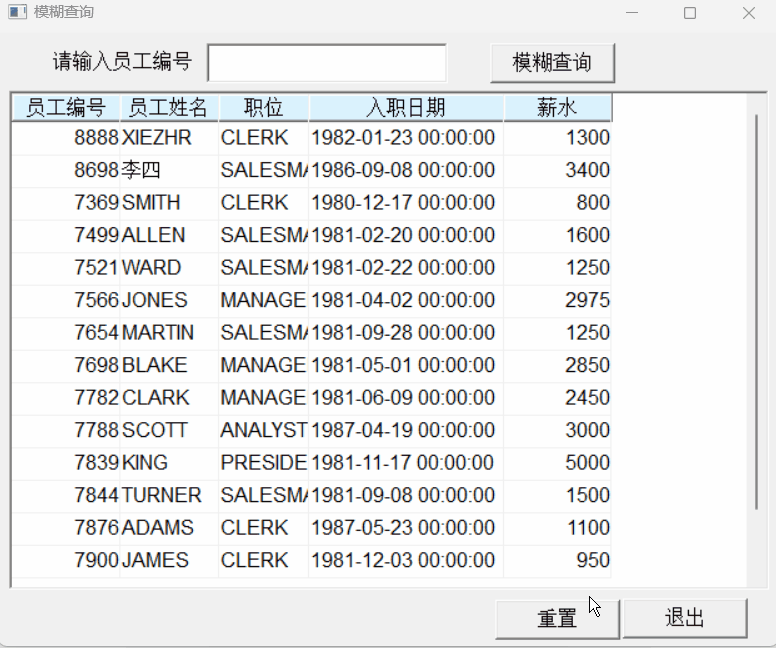
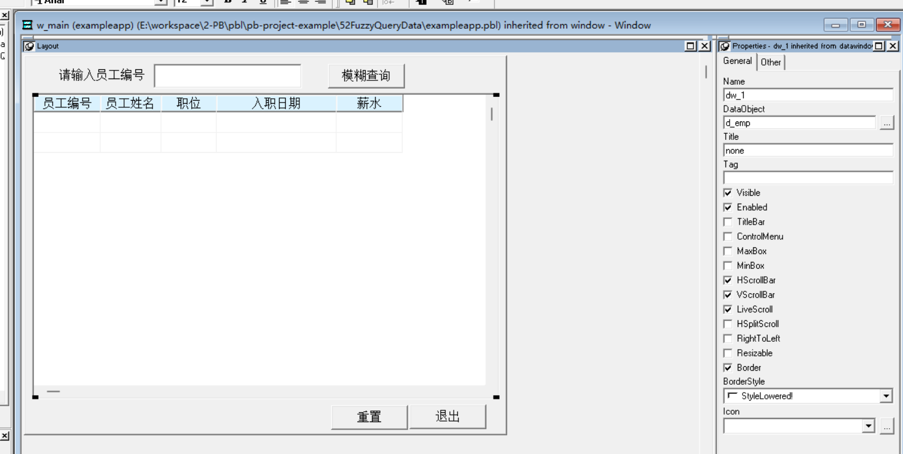

### 写在前面

这是PB案例学习笔记系列文章的第52篇，该系列文章适合具有一定PB基础的读者。

通过一个个由浅入深的编程实战案例学习，提高编程技巧，以保证小伙伴们能应付公司的各种开发需求。

文章中设计到的源码，小凡都上传到了gitee代码仓库[https://gitee.com/xiezhr/pb-project-example.git](https://gitee.com/xiezhr/pb-project-example.git)


需要源代码的小伙伴们可以自行下载查看，后续文章涉及到的案例代码也都会提交到这个仓库【**[pb-project-example](https://gitee.com/xiezhr/pb-project-example)**】

如果对小伙伴有所帮助，希望能给一个小星星⭐支持一下小凡。

###　一、小目标

通过本案例我们将制作一个在数据窗口中进行模糊查询的程序。
在弹出窗口的输入框中输入员工编号，点击查询按钮，将查询到的员工信息显示在数据窗口中。
最终实现效果如下


### 二、实现思路

所谓的模糊查询就是部分条件查询，在进行数据库检索时，只能给出部分条件，通过`SQL`的关键字`like`就能进行模糊查询。

### 三、创建程序基本框架

有了基本思路之后，我们就动起来开始写程序了

① 新建`examplework` 工作区

② 新建`exampleapp`应用

③ 新建`w_main`窗口，并将其`Title`设置为“模糊查询数据”

由于文章篇幅的原因，以上步骤就不再赘述，如果忘记的小伙伴可以翻一翻该系列第一篇文章复习一下

### 四、界面布局

① 建立Grid风格的数据窗口对象
以`emp`表为基础，选择所需要的字段，建立`d_emp`数据窗口对象
② 建立窗口控件
在窗口中添加1个`DataWindow`控件、1个`StaticEdit`控件、1个`SingleLineEdit`控件和3个`CommandButton`控件`
分别命名为`dw_1`、`st_1`、`sle_1`、`cb_1`、`cb_2`、`cb_3`    
③ 设置控件属性

- 将`dw_1`控件的`DataObject`属性设置为`d_emp`,勾选`HScrollBar`属性和`VScrollBar`属性
- 将`st_1`、`cb_1`、`cb_2`、`cb_3`控件的`Text`属性设置为`请输入员工编号`、`模糊查询`、`重置`、`退出`
  

### 五、编写代码

① 在`w_main`窗口中定义实例变量，代码如下

```java
string oldsql
```

② 在`w_main`窗口的`Open`事件中添加如下代码

```java
//使数据窗口与事务对象相连
dw_1.SetTransObject(sqlca)
//执行检索操作
dw_1.retrieve()
//获取数据窗口的sql语句
oldsql = dw_1.getsqlselect()
```

③ 在按钮[模糊查询]`cb_1`的`Clicked`事件中添加如下代码

```java
string wheresql, newsql
wheresql = "where EMP.EMPNO like'"+ sle_1.text+"'"
newsql = oldsql + wheresql
dw_1.setsqlselect(newsql)
dw_1.retrieve()
```

④ 在按钮[重置]`cb_2`的`Clicked`事件中添加如下代码

```java
dw_1.setsqlselect(oldsql)
dw_1.retrieve()
```

⑤ 在按钮[退出]`cb_3`的`Clicked`事件中添加如下代码

```java
close(w_main)
```

⑥ 在开发界面左边的`System Tree`窗口中双击`exampleapp`应用对象，并在其`Open`事件中添加如下代码

```java
SQLCA.DBMS = "O90 Oracle9i (9.0.1)"
SQLCA.LogPass = "tiger"
SQLCA.ServerName = "127.0.0.1:1521/orcl"
SQLCA.LogId = "scott"
SQLCA.AutoCommit = False
SQLCA.DBParm = "PBCatalogOwner='scott'"

connect;
open(w_main)
```

⑦ 在开发界面左边的`System Tree`窗口中双击`exampleapp`应用对象，并在其`close`事件中添加如下代码

```java
disconnect;
```

### 六、运行程序

> 运行程序，看看是否达到预期效果
> 