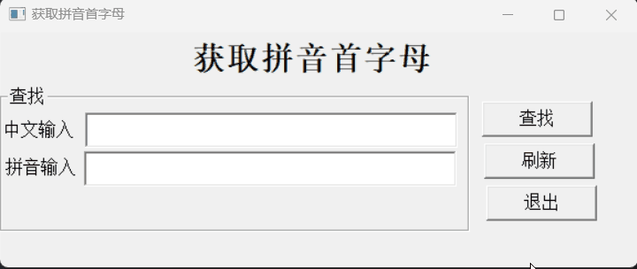
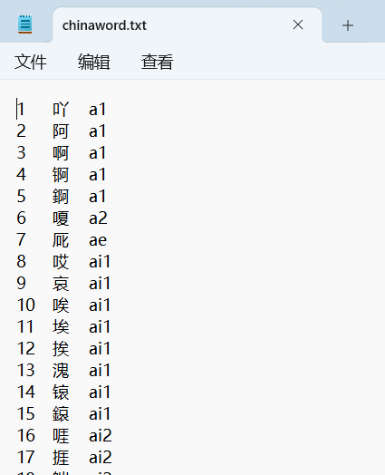
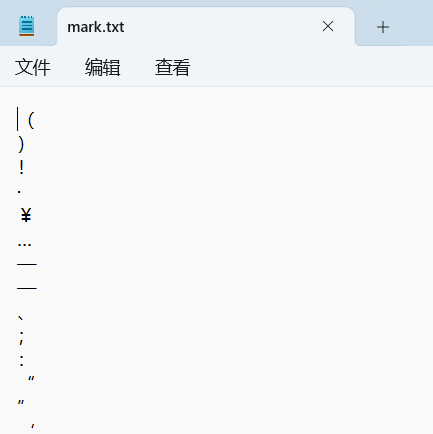
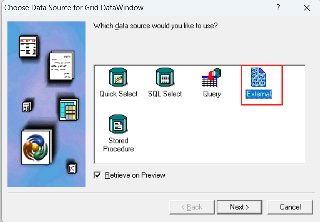
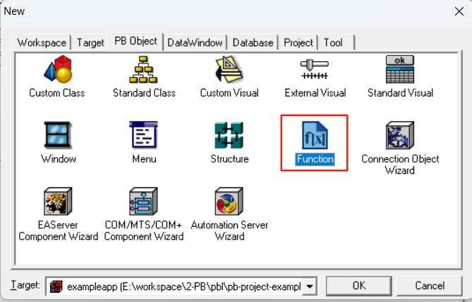
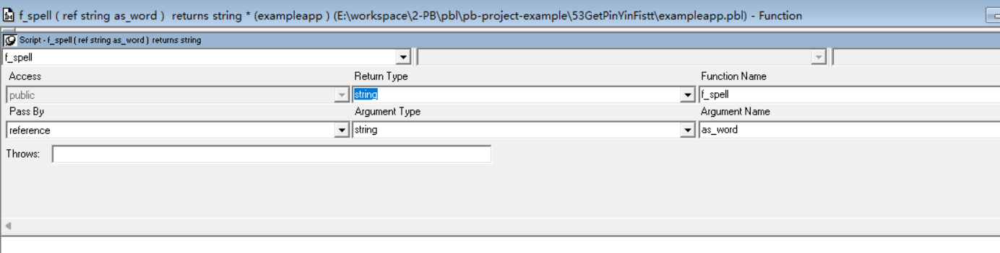
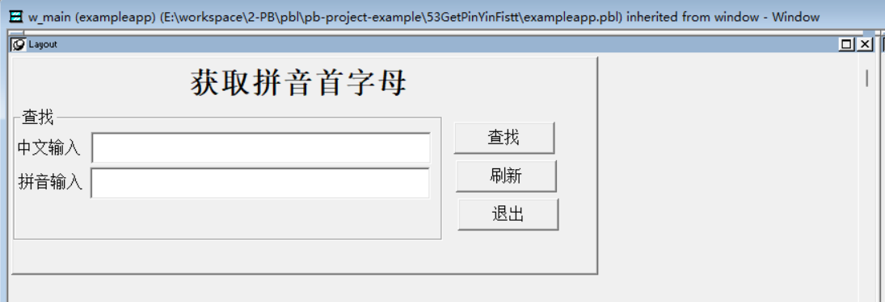

### 写在前面

这是PB案例学习笔记系列文章的第53篇，该系列文章适合具有一定PB基础的读者。

通过一个个由浅入深的编程实战案例学习，提高编程技巧，以保证小伙伴们能应付公司的各种开发需求。

文章中设计到的源码，小凡都上传到了gitee代码仓库[https://gitee.com/xiezhr/pb-project-example.git](https://gitee.com/xiezhr/pb-project-example.git)


需要源代码的小伙伴们可以自行下载查看，后续文章涉及到的案例代码也都会提交到这个仓库【**[pb-project-example](https://gitee.com/xiezhr/pb-project-example)**】

如果对小伙伴有所帮助，希望能给一个小星星⭐支持一下小凡。

### 一、小目标

通过本案例我们将制作一个根据中文获取汉字的拼音首字母的程序。
运行程序后，在中文输入框中输入中文，然后点击获取按钮，在“拼音输入”后的文本框中将显示该中文的拼音首字母。
最终运行效果如下：


### 二、创作思路

我们需要通过外部数据源[External] 来获取中文字符与拼音的映射关系。外部数据源用于让数据窗口访问数据库之外的数据。
例如文本文件、csv等。它是数据窗口唯一不需要连接数据库的数据源，其数据由应用程序生成或用户输入。

### 三、创建程序基本框架

有了基本思路之后，我们就动起来开始写程序了

① 新建`examplework` 工作区

② 新建`exampleapp`应用

③ 新建`w_main`窗口，并将其`Title`设置为“获取拼音首字母”

由于文章篇幅的原因，以上步骤就不再赘述，如果忘记的小伙伴可以翻一翻该系列第一篇文章复习一下

### 四、建立外部数据源及数据窗口

① 建立外部数据源文件

- 将中文字典中中文字带拼音都记录在chinaword.txt文本文件中，数据格式如下：
  
- 将常见字符都记录在mark.txt的文本文件中，数据格式如下
  
  ② 建立外部数据窗口对象

> 选择`External` 分别建立外部数据窗口，`d_chinaword`,`d_mark`
> 
>  

### 五、创建`f_spell`函数对象

① 新建函数对象
单击菜单栏上的`File`->`New`，在弹出的New对话框中选择`Function`图标，建立函数对象

② 设置函数对象

- 函数对象的`Return Type`为`String`
- 函数对象的`Name`设置为`f_spell`
- 函数对象的`Pass By` 设置为`reference`;`Argument Type` 设置为`String`;`Argment Name`设置为`as_word`
  

③ 添加代码

```java
Long		ll_rows,ll_found
Integer	i,li_len
String	ls_word='',ls_result=''
li_len  = len(as_word)
if not li_len > 0 then Return ''
//提取特殊中文
DataStore lds_mark
lds_mark = Create DataStore
lds_mark.DataObject = 'd_mark'
lds_mark.ImportFile('mark.txt')
ll_rows = lds_mark.rowcount()
//过滤特殊中文
for i=1 to li_len
	if asc(mid(as_word,i,1)) > 127 then
		if lds_mark.Find("s_mark = '"+mid(as_word,i,2)+"'",1,ll_rows) > 0 then
			i++
		else
			ls_word+=mid(as_word,i,1)
		end if
	end if
next
Destroy lds_mark
li_len= len(ls_word)
if not li_len > 0 then Return ''
//提取字库
DataStore lds_word
lds_word = Create DataStore
lds_word.dataobject = 'd_chinaword'
lds_word.ImportFile('chinaword.txt')
ll_rows = lds_word.rowcount()
if not ll_rows > 0 then
	Destroy lds_word
	return ''
end if
//开始查找
For i=1 to li_len Step 2
	ll_found = lds_word.Find("c_word = '"+mid(ls_word,i,2)+"'",1,ll_rows)
	if ll_found > 0 then
		ls_result+=left(lds_word.object.c_spell[ll_found],1)
	else
		ls_result+='?'
	end if
Next
Destroy lds_word
Return ls_result
```

### 六、界面布局

在`w_main`窗口上放置控件

- 向窗口添加1个`Group`控件、3个`StaticEdit`控件、3个`CommandButton`控件和1个`MultiLineEdit`控件。`
- 分别将上面控件命名为`gp_1`、`st_1`、`st_2`、`st_3`、`cb_1`、`cb_2`、`cb_3`、`mle_1`。
  

### 七、编写代码

① 在`cb_1`控件的`Clicked`事件中添加如下代码

```java
sle_2.text = f_spell(sle_1.text)
```

② 在`cb_2`控件的`Clicked`事件中添加如下代码

```java
sle_1.text = ''
sle_2.text = ''
sle_1.setfocus()
```

③ 在`cb_3`控件的`Clicked`事件中添加如下代码

```java
close(w_main)
```

④ 在开发界面左边`System Tree`窗口中双击`exampleapp`应用，并在其`Open`事件中添加如下代码

```java
open(w_main)
```

### 八、运行程序

> 运行程序，看看是否达到预期效果

