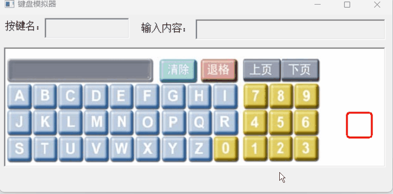
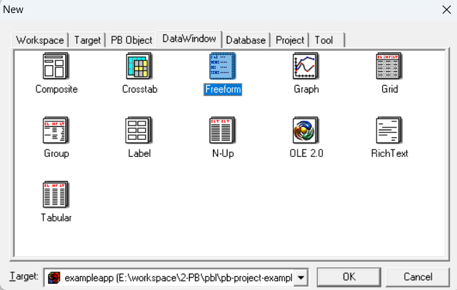
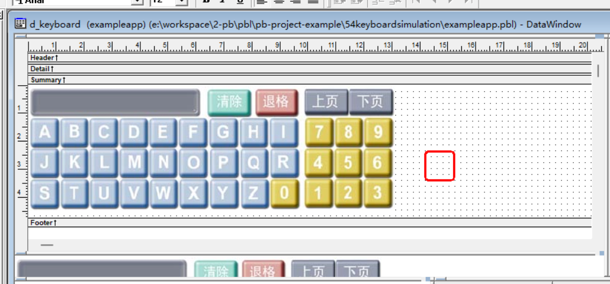
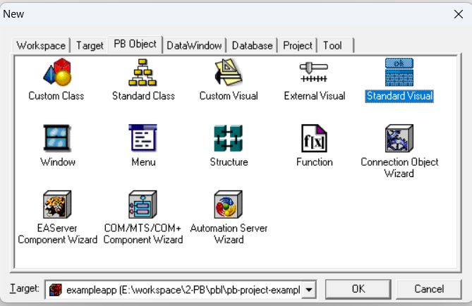
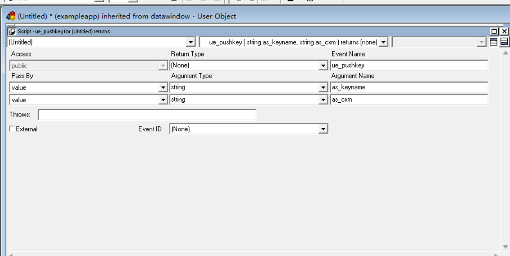
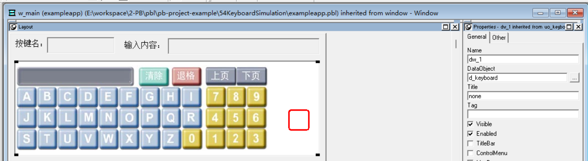

### 写在前面

这是PB案例学习笔记系列文章的第54篇，该系列文章适合具有一定PB基础的读者。

通过一个个由浅入深的编程实战案例学习，提高编程技巧，以保证小伙伴们能应付公司的各种开发需求。

文章中设计到的源码，小凡都上传到了gitee代码仓库[https://gitee.com/xiezhr/pb-project-example.git](https://gitee.com/xiezhr/pb-project-example.git)


需要源代码的小伙伴们可以自行下载查看，后续文章涉及到的案例代码也都会提交到这个仓库【**[pb-project-example](https://gitee.com/xiezhr/pb-project-example)**】

如果对小伙伴有所帮助，希望能给一个小星星⭐支持一下小凡。

### 一、小目标

通过本案例我们将制作一个键盘模拟器。运行程序后，我们每按一个键，在“按键名”文本框中显示所按的按键名称
在“输入内容”文本框中显示用户刚输入的字母。
最终效果如下：


### 二、创作思路

在PB中可以通过设计数据窗口实现在图形界面上设计按钮等控件。
① 在数据窗口中插入所需的界面图片
② 在该图片按钮位置添加数据框，从而用户单击按钮图片时，单击到了该数据框，从而实现对用户输入的内容进行判断

### 三、创建程序基本框架

有了基本思路之后，我们就动起来开始写程序了

① 新建`examplework` 工作区

② 新建`exampleapp`应用

③ 新建`w_main`窗口，并将其`Title`设置为“键盘模拟器”

由于文章篇幅的原因，以上步骤就不再赘述，如果忘记的小伙伴可以翻一翻该系列第一篇文章复习一下

### 四、创建数据窗口

① 建立FreeForm风格的外部数据窗口对象

② 设置数据窗口
建立一个只含有disp一个字段的FreeForm风格的外部数据窗口，在窗口中添加keyboardsmall.jpg键盘图片，
并在图片按钮处相应添加数据框。
③ 命名数据框
将数据框的名称依照依照按钮的键值命名
④ 添加`RoundRectangle`控件
在键盘旁边添加一个`RoundRectangle`控件,并将控件命名为`rr_select`
⑤ 将数据窗口保存为`d_keyboard`


### 五、创建标准可视用户对象

① 建立数据窗口标准可视用户对象
单击菜单栏上的`File`-`New`-`Standard Visual`图标，选择`DataWindow`项，建立数据窗口可视用户对象


② 将上面建立的可视用户对象的`DataObject`属性设置为`d_keyboard`

③ 在可视用户对象中添加`ue_pushkey(string as_keyname,string as_cxm) returns(none)` 事件，代码为空

④ 在可视对象的`Clicked`事件中添加如下代码

```java
if left(string(dwo.name),2) <> 't_' then return
choose case dwo.name
	case 't_disp'
	case 't_clear'
		this.setredraw(false)
		this.object.t_disp.text = '查询码：'
		this.object.rr_select.x = 5000
		this.object.rr_select.y = 5000
		this.setredraw(true)
		
		event ue_pushkey("t_clear",right(string(this.object.t_disp.text),len(string(this.object.t_disp.text)) - 8))
		
	case 't_back'
		if len(string(this.object.t_disp.text)) > 8 then
			this.object.t_disp.text = left(this.object.t_disp.text, &
			                       len(string(this.object.t_disp.text)) - 1 )
			event ue_pushkey("t_back",right(string(this.object.t_disp.text),len(string(this.object.t_disp.text)) - 8))
		end if
	case 't_pageup'
		event ue_pushkey("t_pageup",right(string(this.object.t_disp.text),len(string(this.object.t_disp.text)) - 8))	
	case 't_pagedown'
		event ue_pushkey("t_pagedown",right(string(this.object.t_disp.text),len(string(this.object.t_disp.text)) - 8))
	case else
		this.setredraw(false)
		this.object.t_disp.text = this.object.t_disp.text + upper(right(string(dwo.name),1))

		this.object.rr_select.x = long(Describe(string(dwo.name) + ".X")) - 11
		this.object.rr_select.y = long(Describe(string(dwo.name) + ".Y")) - 11
		this.setredraw(true)
		
		event ue_pushkey("letter",right(string(this.object.t_disp.text),len(string(this.object.t_disp.text)) - 8))

end choose
```

⑤ 将可视用户对象保存为`uo_keyboard`


### 六、设置`w_main`窗口

① 添加窗口控件
在窗口中添加2个`StaticEdit`控件、2个`SingleLineEdit`控件和1个`uo_keyboard`标准可视用户对象
并将其分别命名为`st_1`、`st_2`、`sle_keyname`、`sle_cxm`和`dw_1`
② 设置窗口控件

- 将`st_1`控件的`Text`属性设置为`按键名：`
- 将`st_2`控件的`Text`属性设置为`输入内容：`
- `sle_keyname`、`sle_cxm`控件的`Text`属性设置为空
  

### 七、编写代码

① 在`w_main` 窗口的`dw_1`的`ue_pushkey`事件中添加如下代码

```java
sle_keyname.text = as_keyname
sle_cxm.text = as_cxm
```

② 在开发界面左边的`System Tree`窗口中双击`exampleapp`应用对象，并在其`Open`事件中添加如下代码

```java
open(w_main)
```

### 八、运行程序

> 运行程序，看看是否达到预期效果
> 