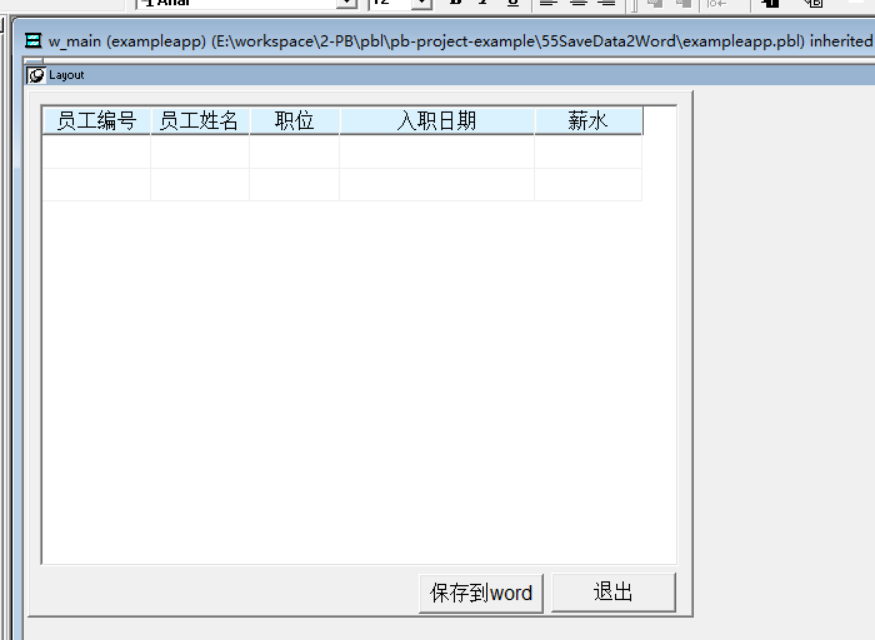
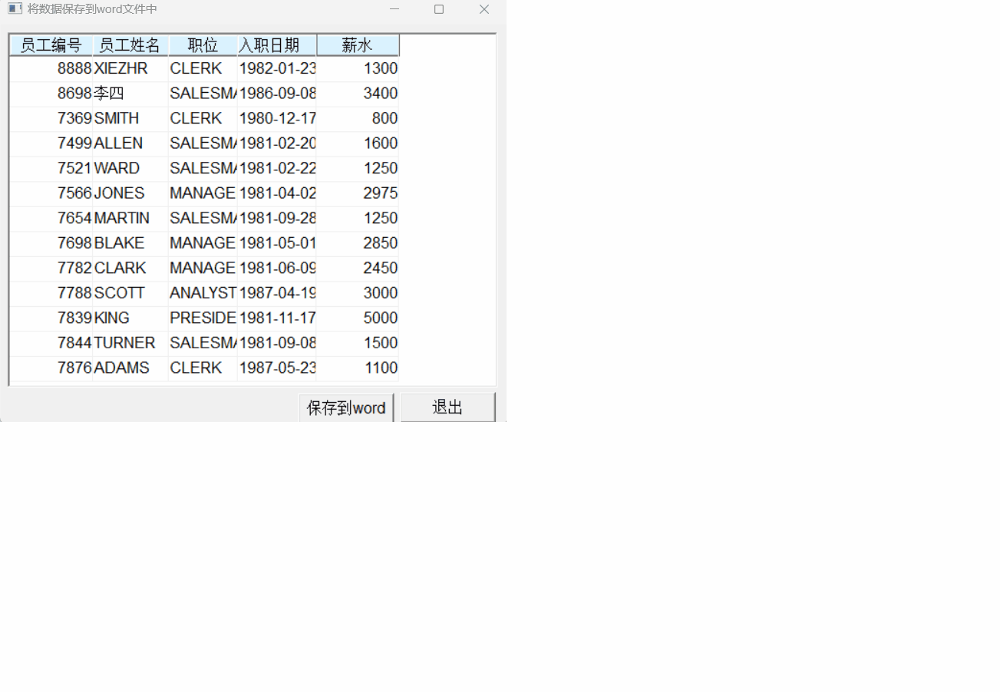

### 写在前面

这是PB案例学习笔记系列文章的第55篇，该系列文章适合具有一定PB基础的读者。

通过一个个由浅入深的编程实战案例学习，提高编程技巧，以保证小伙伴们能应付公司的各种开发需求。

文章中设计到的源码，小凡都上传到了gitee代码仓库[https://gitee.com/xiezhr/pb-project-example.git](https://gitee.com/xiezhr/pb-project-example.git)


需要源代码的小伙伴们可以自行下载查看，后续文章涉及到的案例代码也都会提交到这个仓库【**[pb-project-example](https://gitee.com/xiezhr/pb-project-example)**】

如果对小伙伴有所帮助，希望能给一个小星星⭐支持一下小凡。

### 一、小目标

通过本案例将制作一个将数据窗口中的数据保存到word文件中的程序。
运行程序后在弹出的窗口中，单击“保存”按钮，会将数据窗口中数据保存到word文件中。
通过本程序实现了PB与word程序的同学
最终效果如下：


### 二、实现思路

在PB中建立OLEObect对象，并连接到Word.Application远程对象后，就可以调用Word.Application对象的`Documents`、
ActiveDocument等子对象的属性方法。

### 三、创建程序基本框架

有了基本思路之后，我们就动起来开始写程序了

① 新建`examplework` 工作区

② 新建`exampleapp`应用

③ 新建`w_main`窗口，并将其`Title`设置为“将数据保存到word文件中”

由于文章篇幅的原因，以上步骤就不再赘述，如果忘记的小伙伴可以翻一翻该系列第一篇文章复习一下

### 四、界面布局

① 建立`Grid`风格数据窗口对象。
连接数据库，以`emp`表为基础，建立数据窗口对象`d_emp`
② 建立窗口控件
在窗口中添加1个`DataWindow`控件，2个`CommandButton`控件，并将其分别命名为`dw_1`、`cb_1`和`cb_2`。
③ 设置控件属性

- 将`dw_1`控件的`DataObject`属性设置为`d_emp`，勾选`HScrollBar`和`VScrollBar`复选框
- 将`cb_1`控件的`Text`值设置为“保存到word文件中”
- 将将`cb_2`控件的`Text`值设置为“退出”
  

### 五、编写代码

① 在`w_main`窗口的`Open`事件中添加如下代码

```java
dw_1.settransobject(sqlca)
dw_1.retrieve()
```

② 在`cb_1`控件的`Clicked`事件中添加如下代码

```java
OLEObject ole_object
ole_object = CREATE OLEObject

//连接word
IF ole_object.ConnectToNewObject("Word.Application") <> 0 THEN
	MessageBox('OLE错误','OLE无法连接!')
	return
END IF

ole_object.Visible = True

long ll_colnum,ll_rownum
constant long wdTableBehavior = 1
constant long wdAutoFitFixed = 0
constant long wdCell = 12
string ls_value

//得到数据窗口数据的列数与行数（行数应该是数据行数 + 1）
ll_colnum = Long(dw_1.object.datawindow.column.count)
ll_rownum = dw_1.rowcount() + 1

ole_object.Documents.Add
ole_object.ActiveDocument.Tables.Add(ole_object.Selection.Range, ll_rownum, ll_colnum,wdTableBehavior, wdAutoFitFixed)

string ls_colname
integer i,j,k,l
for i = 1 to ll_colnum
	//得到标题头的名字
	ls_colname = dw_1.describe('#' + string(i) + ".name") + "_t"
   ls_value = dw_1.describe(ls_colname + ".text")
	ole_object.Selection.TypeText(ls_value)
	ole_object.Selection.MoveRight(wdCell)
next

dw_1.setredraw(false)
ole_object.Selection.MoveLeft(wdCell)
for i = 2 to ll_rownum
	for j = 1 to ll_colnum
		dw_1.scrolltorow(i - 1)
		dw_1.setcolumn(j)
		l = i - 1
		ls_value = dw_1.getitemstring(l,j)
		ole_object.Selection.MoveRight(wdCell)
		ole_object.Selection.TypeText(ls_value)
	next
next

//ole_object.Selection.InlineShapes.AddPicture("E:\a.png")
dw_1.setredraw(true)

constant long wdFormatDocument = 0
//保存新建的文档
ole_object.ActiveDocument.SaveAs("d:\sample.doc", 0,False,"",True,"",False,False,False, False,False)

messagebox('提示信息','保存成功！')

//断开OLE连接
Ole_Object.DisConnectObject()
Destroy Ole_Object
```

③ 在`cb_2`控件的`Clicked`事件中添加如下代码

```java
close(w_main)
```

④ 在开发界面左边的`System Tree`窗口中双击`exampleapp`应用对象，并在其`Open`事件中添加如下代码

```java
SQLCA.DBMS = "O90 Oracle9i (9.0.1)"
SQLCA.LogPass = "tiger"
SQLCA.ServerName = "127.0.0.1:1521/orcl"
SQLCA.LogId = "scott"
SQLCA.AutoCommit = False
SQLCA.DBParm = "PBCatalogOwner='scott'"

connect;
open(w_main)
```

⑤ 在开发界面左边的`System Tree`窗口中双击`exampleapp`应用对象，并在其`close`事件中添加如下代码

```java
disconnect;
```

### 六、运行程序

> 运行程序看看是否达到预期效果
> 