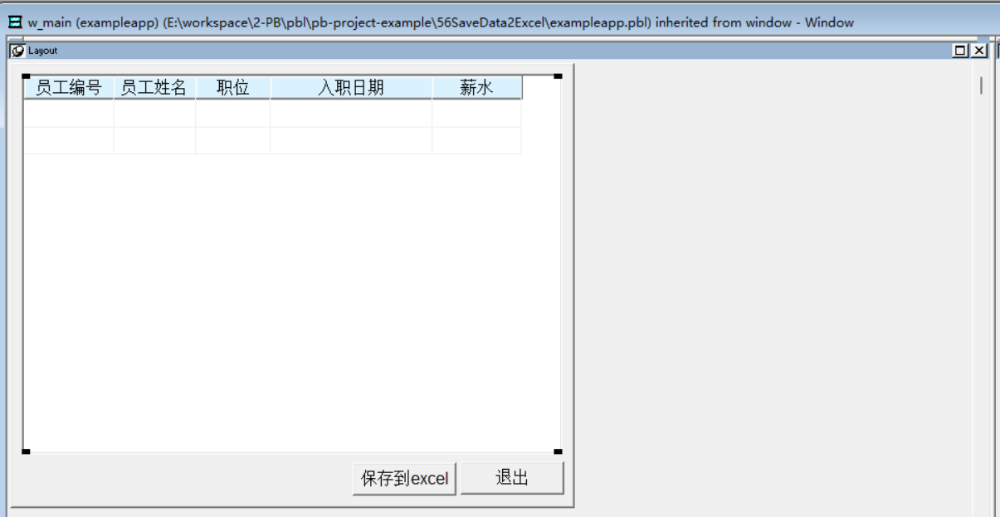
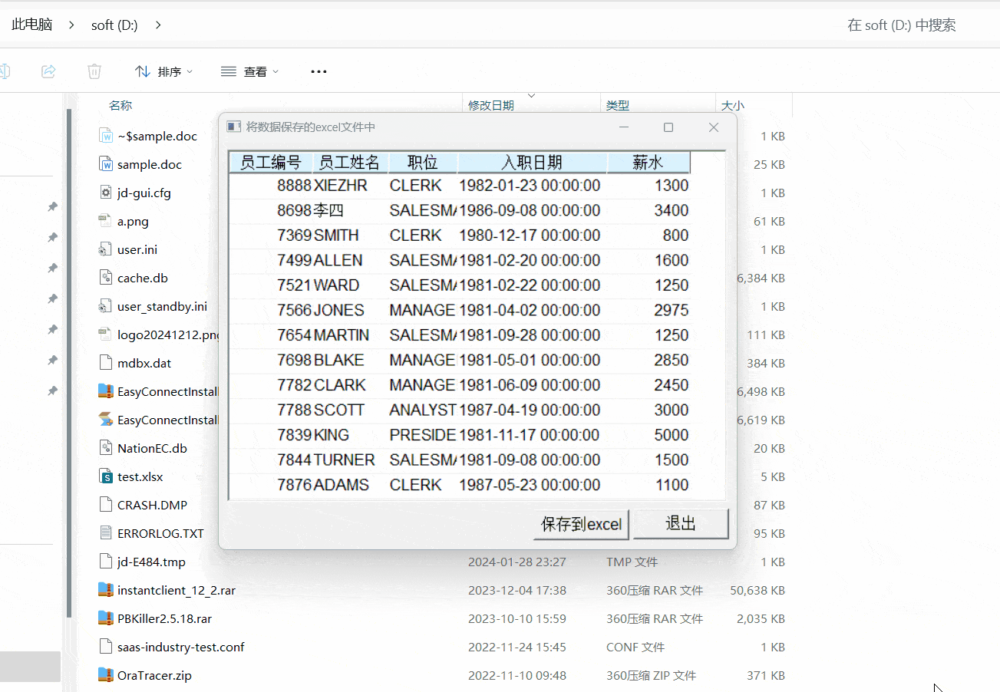

### 写在前面

这是PB案例学习笔记系列文章的第56篇，该系列文章适合具有一定PB基础的读者。

通过一个个由浅入深的编程实战案例学习，提高编程技巧，以保证小伙伴们能应付公司的各种开发需求。

文章中设计到的源码，小凡都上传到了gitee代码仓库[https://gitee.com/xiezhr/pb-project-example.git](https://gitee.com/xiezhr/pb-project-example.git)


需要源代码的小伙伴们可以自行下载查看，后续文章涉及到的案例代码也都会提交到这个仓库【**[pb-project-example](https://gitee.com/xiezhr/pb-project-example)**】

如果对小伙伴有所帮助，希望能给一个小星星⭐支持一下小凡。

### 一、小目标

通过本案例我们制作一个将数据窗口中的数据保存的Excel文件中。
程序运行后，在弹出的窗口中点击【保存到Excel文件中】按钮，数据将保存到“d:\data.xls”文件中。
最终效果如下：


### 二、创作思路

PB提供了`OLEObject`对象，该对象可以用作远程对象的代理，实现对远程对象的操作。
`OLEObject`对象是一个动态对象，当连接远程对象时，远程对象的属性、方法和事件将会添加到`OLEObject`对象中。

远程对象操作分为6个步骤

- 1、创建一个`OLEObject`对象
- 2、使用`Create`方法，建立`OLEObject`对象
- 3、使用`ConnectToNewObject`函数，建立对象连接
- 4、调用远程对象函数和方法，执行用户操作
- 5、使用`DisconnectObject`函数，断开对象连接
- 6、使用`Destroy`方法，销毁对象

### 三、创建程序基本框架

有了基本思路之后，我们就动起来开始写程序了

① 新建`examplework` 工作区

② 新建`exampleapp`应用

③ 新建`w_main`窗口，并将其`Title`设置为“将数据保存到excel文件中”

由于文章篇幅的原因，以上步骤就不再赘述，如果忘记的小伙伴可以翻一翻该系列第一篇文章复习一下

### 四、界面布局

① 建立`Grid`风格数据窗口对象。
连接数据库，以`emp`表为基础，建立数据窗口对象`d_emp`
② 建立窗口控件
在窗口中添加1个`DataWindow`控件，2个`CommandButton`控件，并将其分别命名为`dw_1`、`cb_1`和`cb_2`。
③ 设置控件属性

- 将`dw_1`控件的`DataObject`属性设置为`d_emp`，勾选`HScrollBar`和`VScrollBar`复选框
- 将`cb_1`控件的`Text`值设置为“保存到word文件中”
- 将将`cb_2`控件的`Text`值设置为“退出”
  

### 五、编写代码

① 在`w_main`窗口的`Open`事件中添加如下代码

```java
dw_1.settransobject( sqlca)
dw_1.retrieve( )
```

② 在`w_main`窗口的`cb_1`控件的`Clicked`事件中添加如下代码

```java

```

③ 在`w_main`窗口的`cb_2`控件的`Clicked`事件中添加如下代码

```java
close(w_main)
```

④ 在开发界面左边的`System Tree`窗口中双击`exampleapp`应用对象，并在其`Open`事件中添加如下代码

```java
SQLCA.DBMS = "O90 Oracle9i (9.0.1)"
SQLCA.LogPass = "tiger"
SQLCA.ServerName = "127.0.0.1:1521/orcl"
SQLCA.LogId = "scott"
SQLCA.AutoCommit = False
SQLCA.DBParm = "PBCatalogOwner='scott'"

connect;
open(w_main)
```

⑤ 在开发界面左边的`System Tree`窗口中双击`exampleapp`应用对象，并在其`close`事件中添加如下代码

```java
disconnect;
```

### 六、运行程序

> 运行程序，看看是否达到预期效果
> 