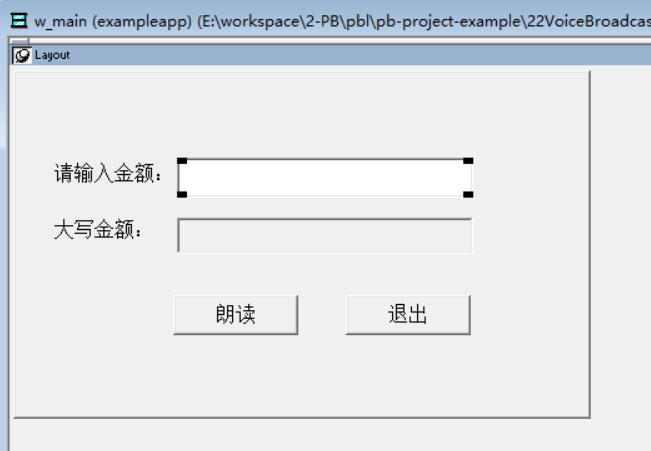
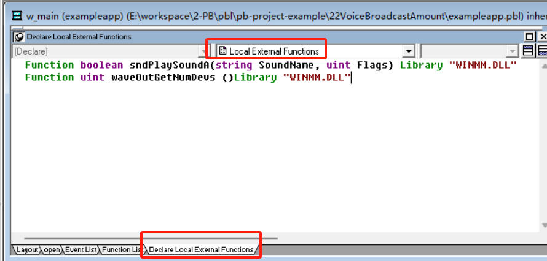
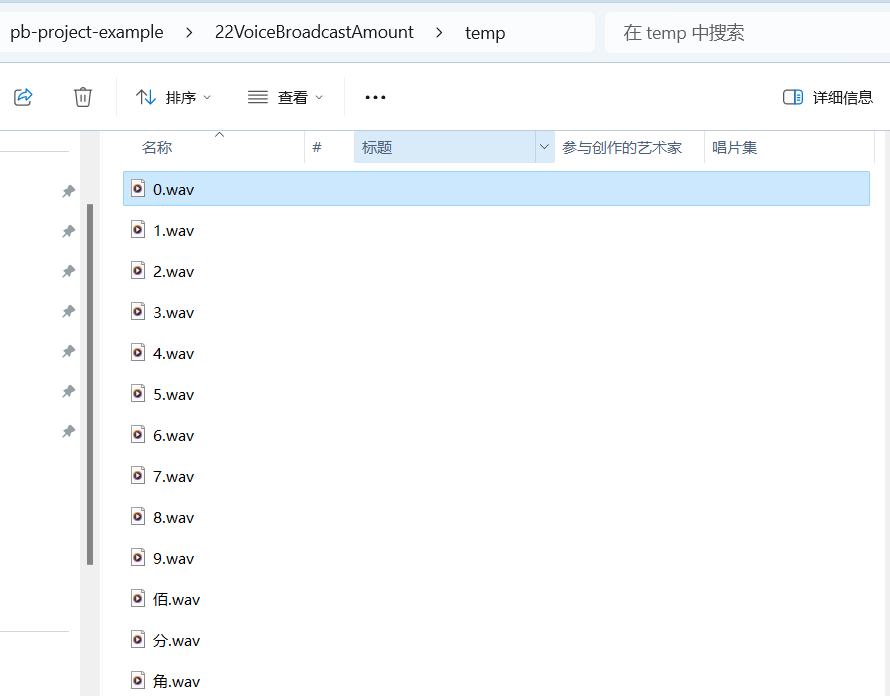

### 写在前面

这是PB案例学习笔记系列文章的第22篇，该系列文章适合具有一定PB基础的读者。

通过一个个由浅入深的编程实战案例学习，提高编程技巧，以保证小伙伴们能应付公司的各种开发需求。

文章中设计到的源码，小凡都上传到了gitee代码仓库[https://gitee.com/xiezhr/pb-project-example.git](https://gitee.com/xiezhr/pb-project-example.git)


需要源代码的小伙伴们可以自行下载查看，后续文章涉及到的案例代码也都会提交到这个仓库【**[pb-project-example](https://gitee.com/xiezhr/pb-project-example)**】

如果对小伙伴有所帮助，希望能给一个小星星⭐支持一下小凡。

### 一、小目标

上一个案例中我们将小写金额转换为大写金额，这一个案例中我们将制作一个语音播报金额的小应用。

这个在日常开发中也很常见，尤其是在收费结算应用中。最终实现效果如下

[video(video-M5eudhWt-1718639292534)(type-csdn)(url-https://live.csdn.net/v/embed/400062)(image-https://i-blog.csdnimg.cn/blog_migrate/ae93ecf89fa69971dc66b1bb60bff17a.jpeg)(title-金额语音播报)]


### 二、实现思路

首先我们需要准备 零、壹、贰、叁、肆、伍、陆、柒、捌、玖、拾、佰、仟、万、亿、元、角、分、整

的.wav格式的语音文件。然后通过`WINMM.dll`外部动态库的`sandPlaySoundA`()和`waveOutGetNumDevs()`

联合起来播放语音文件


### 三、创建程序基本框架

① 新建`examplework`工作区

② 新建`exampleapp`应用

③ 新建`w_main`窗口，将其`Title`属性值设置成“朗读款项金额”

由于篇幅原因，以上步骤这儿就不展开了，忘记了的小伙伴翻一翻该系列文章的第一篇

④ 在`w_main`窗口上放置控件

在窗口上添加3个`StaticEdit`控件，1个`singleLineEdit`控件和2个`CommandButton`。将其分别命名为`st_1`、`st_2`、`st_3`

`sle_1`、`sle_2`、`cb_1`和`cb_2`。 调整各个控件布局后如下



⑤ 保存窗口

### 四、编写代码

① 定义本地外部扩展函数

在`w_main`的`Declare Local External Function` 选项卡中添加如下代码

```java
Function boolean sndPlaySoundA(string SoundName, uint Flags) Library "WINMM.DLL"
Function uint waveOutGetNumDevs ()Library "WINMM.DLL"
```



② 在`W_main`窗口的`Function List` 选项卡中添加`Playsound(string as_filename,integer ai_option) return integer`函数

代码如下

```java
uint lui_numdevs

lui_numdevs = WaveOutGetNumDevs() 
If lui_numdevs > 0 Then 
	sndPlaySoundA(as_filename,ai_option)
	return 1
Else
	return -1
End If
```

③ 在`w_main`窗口的`Function List` 选项卡中添加`xx2dx(decimal ls) return string`函数

代码如下

```java
string dx_sz,dx_dw,str_int,str_dec,dx_str,fu,a,b,b2,c,d,result
long num_int,num_dec,len_int,i,a_int,pp

dx_sz = "零壹贰叁肆伍陆柒捌玖" 
dx_dw = "万仟佰拾亿仟佰拾万仟佰拾元" 

  //处理小于零情况
if ls<0 then
   ls = ls*(-1) 
   fu = "负" 
else 
	fu = "" 
end if 

  //取得整数及整数串
dx_str = string(ls)
if (ls>0) and (ls<1) then dx_str = "0"+dx_str 
pp = pos(dx_str,".") 
if pp>0 then 
	 str_int = mid(dx_str,1,pos(dx_str,".")-1)
else
	str_int = dx_str 
end if 
num_int = long(str_int) 

  //取得小数及小数串
if (ls>0) and (ls<1) then 
	num_dec = ls * 100
else
	num_dec = (ls - num_int) * 100 
end if 
str_dec = string(num_dec) 
len_int = len(str_int) 
dx_str = "" 

  //转换整整部分
for i = 1 to len_int 
    //a为小写数字字符，b为对应的大写字符，c为对应大写单位，d为当前大写字符串的最后一个汉字
   a= mid(str_int,i,1) 
   a_int = long(a) 
   b = mid(dx_sz,(a_int*2)+1,2) 
   c = mid(dx_dw,((13 - len_int +i - 1)*2+1),2) 
   if dx_str<>"" then
      d=mid(dx_str,len(dx_str)-1,2)
   else
		d= "" 
	end if 
	
   if (b="零") and ((d="零") or (b=b2) or (c="元") or (c="万") or (c="亿")) then  b = "" 
   if (a="0") and (c<>"元") and (c<>"万") and (c<>"亿") then c="" 
   if ((c="元") or (c="万") or (c="亿")) and (d="零") and (a="0") then
      dx_str = mid(dx_str,1,len(dx_str)-2) 
      d=mid(dx_str,len(dx_str)-1,2) 
      if ((c="元") and (d="万")) or ((c="万") and (d="亿")) then c = "" 
    end if 
    dx_str = dx_str + b+ c 
    b2 = b 
next

  //处理金额小于1的情况
  if len(dx_str) <= 2 then dx_str= "" 
  //转换小数部分
  if (num_dec<10) and (ls>0) then
    a_int = long(str_dec) 
    b = mid(dx_sz,(a_int*2+1),2) 
    if num_dec = 0 then dx_str = dx_str + "整" 
    if num_dec > 0 then dx_str = dx_str +"零"+b+"分" 
  end if
  
  if num_dec >= 10 then
    a_int = long(mid(str_dec,1,1)) 
    a = mid(dx_sz,(a_int*2+1),2) 
    a_int = long(mid(str_dec,2,1)) 
    b = mid(dx_sz,(a_int*2+1),2) 
    if a<>"零" then a = a+"角" 
    if b <> "零" then
		b = b+"分"
    else 
		b= "" 
    end if
    dx_str = dx_str + a + b 
  end if
  if ls= 0 then dx_str = "零元整" 
  dx_str = fu+dx_str 
  
  result = dx_str 

return result
```

④ 将事先准备好的.wav格式声音放到项目temp目录下



语音包小凡已经上传的百度网盘了，需要的小伙伴自行下载哈

链接：https://pan.baidu.com/s/17sPGYC21fvzw4ebgXll74A?pwd=8888 
提取码：8888

⑤在`w_main`窗口的`cb_1`按钮的`Clicked`事件 中添加如下代码

```java
integer i,count
string ls_current_path
//获取项目当前路径
ls_current_path = GetCurrentDirectory()

st_3.text = xx2dx(dec(sle_1.text))

count = len(st_3.text)

for i= 1 to count step 2
	CHOOSE CASE mid(st_3.text,i,2)
	CASE "零"
		playsound(ls_current_path+"\temp\0.wav",0)				
	CASE "壹"
		playsound(ls_current_path+"\temp\1.wav",0)				
	CASE "贰"
		playsound(ls_current_path+"\temp\2.wav",0)				
	CASE "叁"
		playsound(ls_current_path+"\temp\3.wav",0)				
	CASE "肆"
		playsound(ls_current_path+"\temp\4.wav",0)				
	CASE "伍"
		playsound(ls_current_path+"\temp\5.wav",0)				
	CASE "陆"
		playsound(ls_current_path+"\temp\6.wav",0)				
	CASE "柒"
		playsound(ls_current_path+"\temp\7.wav",0)				
	CASE "捌"
		playsound(ls_current_path+"\temp\8.wav",0)				
	CASE "玖"
		playsound(ls_current_path+"\temp\9.wav",0)				
	CASE "拾"
		playsound(ls_current_path+"\temp\十.wav",0)				
	CASE "佰"
		playsound(ls_current_path+"\temp\佰.wav",0)				
	CASE "仟"
		playsound(ls_current_path+"\temp\仟.wav",0)				
	CASE "万"
		playsound(ls_current_path+"\temp\万.wav",0)				
	CASE "亿"
		playsound(ls_current_path+"\temp\亿.wav",0)				
	CASE "元"
		playsound(ls_current_path+"\temp\元.wav",0)				
	CASE "角"
		playsound(ls_current_path+"\temp\角.wav",0)				
	CASE "分"
		playsound(ls_current_path+"\temp\分.wav",0)				
	CASE "整"
		playsound(ls_current_path+"\temp\整.wav",0)				
  END CHOOSE
next
```

⑥ 在`cb_2`退出按钮的`Clicked`事件中添加如下代码

```java
close(parent)
```

⑦ 在开发界面左边的`System Tree`窗口中双击`exampleapp`应用对象，并在其`Open`事件中添加如下代码

```java
open(w_main)
```

### 五、运行程序

代码写完了，来检验下我们的劳动成果。


[video(video-7oOr2goY-1718639346799)(type-csdn)(url-https://live.csdn.net/v/embed/400062)(image-https://i-blog.csdnimg.cn/blog_migrate/ae93ecf89fa69971dc66b1bb60bff17a.jpeg)(title-金额语音播报)]


本期内容到这儿就结束了 ，*★,°*:.☆(￣▽￣)/$:*.°★* 。希望对您有所帮助 

我们下期再见 ヾ(•ω•`)o (●'◡'●)