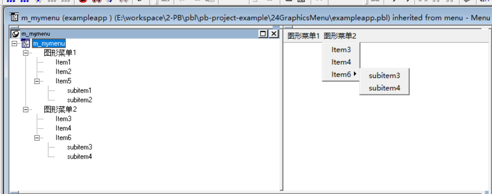
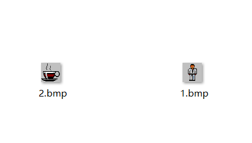
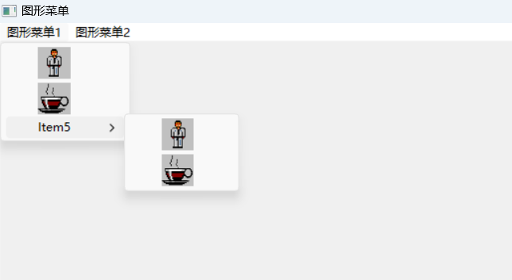

### 写在前面

这是PB案例学习笔记系列文章的第24篇，该系列文章适合具有一定PB基础的读者。

通过一个个由浅入深的编程实战案例学习，提高编程技巧，以保证小伙伴们能应付公司的各种开发需求。

文章中设计到的源码，小凡都上传到了gitee代码仓库[https://gitee.com/xiezhr/pb-project-example.git](https://gitee.com/xiezhr/pb-project-example.git)


需要源代码的小伙伴们可以自行下载查看，后续文章涉及到的案例代码也都会提交到这个仓库【**[pb-project-example](https://gitee.com/xiezhr/pb-project-example)**】

如果对小伙伴有所帮助，希望能给一个小星星⭐支持一下小凡。

### 一、小目标

继上一个案例之后，这个案例我们将制作一个图形菜单。案例中需要用到图形菜单技术，制作图形菜单可以使界面变得

更加友好美观。最终效果如下图所示


### 二、创作思路

要实现图形菜单，我们需要用到`LoadImageA()`、`SetMenuItemBitmaps()`、`GetMenuItemID()`和`ModifyMenu()`等函数。

利用这些函数来加载一个图片，给菜单设置图标。

### 三、创建程序基本框架

① 新建`examplework`工作区

② 新建`exampleapp`应用

③ 新建菜单，保存为`m_mymenu` 

④ 新建`w_main`窗口，将`Title`属性设置为"图形菜单"，将`MenuName`属性设置为`m_mymenu`

由于文章篇幅原因，以上步骤不再赘述。如果忘记怎么操作得小伙伴可以翻一翻该系列之前文章

### 四、设置Menu菜单

① 创建菜单基本框架。如下图所示



② 保存菜单

### 五、编写代码

① 定义扩展函数

在`Declare Local External Functions` 选项卡中添加如下代码

```java
FUNCTION ulong LoadImageA(ulong hintance, string filename,uint utype,int x,int y,uint fload)  LIBRARY "USER32.DLL"
FUNCTION boolean SetMenuItemBitmaps(ulong hmenu,uint upos,uint flags,ulong handle_bm1,ulong handle_bm2)  LIBRARY "USER32.DLL"
FUNCTION int GetSystemMetrics(  int nIndex ) LIBRARY "USER32.DLL"
FUNCTION ulong GetMenuItemID(ulong hMenu,uint uItem) LIBRARY "USER32.DLL"
FUNCTION int GetSubMenu(ulong hMenu,int pos) LIBRARY "USER32.DLL"
FUNCTION ulong GetMenu(ulong hWindow) LIBRARY "USER32.DLL"
FUNCTION boolean ModifyMenu(ulong  hMnu, ulong uPosition, ulong uFlags, ulong uIDNewItem, long lpNewI) alias for ModifyMenuA LIBRARY "USER32.DLL"
```

② 准备图片

在应用根目录下准备好如下两张图片，图片格式为`bmp`。注：这里的图片格式必须是`bmp`格式，否则没法设置




③ 在`w_main`窗口的`Open`事件中输入如下代码

```java
Long		ll_MainHandle
long		ll_SubMenuHandle
integer	li_MenuItemID
long		ll_X
long		ll_Y
long		ll_BitmapHandleA
long		ll_BitmapHandleB
// Win32 常量
Integer IMAGE_BITMAP	   = 0
Integer LR_LOADFROMFILE = 16
Integer SM_CXMENUCHECK  = 71
Integer SM_CYMENUCHECK	= 72
Integer MF_BITMAP			= 4
Integer MF_BYCOMMAND		= 0
Integer MF_BYPOSITION	= 1024
// 获取菜单句柄
ll_MainHandle = GetMenu(Handle(this))
//获取第一个菜单的句柄
ll_SubMenuHandle = GetSubMenu(ll_MainHandle,0)
//以原始大小装入图片
ll_BitmapHandleA = LoadImageA(0,'1.bmp',0,0,0,LR_LOADFROMFILE)
ll_BitmapHandleB = LoadImageA(0,'2.bmp',0,0,0,LR_LOADFROMFILE)
li_MenuItemID = GetMenuItemID(ll_SubMenuHandle,0)
ModifyMenu(ll_SubMenuHandle,li_MenuItemID,MF_BITMAP,li_MenuItemId,ll_BitmapHandleA)
li_MenuItemID = GetMenuItemID(ll_SubMenuHandle,1)
ModifyMenu(ll_SubMenuHandle,li_MenuItemID,MF_BITMAP,li_MenuItemId,ll_BitmapHandleB)
ll_SubMenuHandle = GetSubMenu(ll_SubMenuHandle,2)
li_MenuItemID = GetMenuItemID(ll_SubMenuHandle,0)
ModifyMenu(ll_SubMenuHandle,li_MenuItemID,MF_BITMAP,li_MenuItemId,ll_BitmapHandleA)
li_MenuItemID = GetMenuItemID(ll_SubMenuHandle,1)
ModifyMenu(ll_SubMenuHandle,li_MenuItemID,MF_BITMAP,li_MenuItemId,ll_BitmapHandleB)


// back to the top


//Now get the handle of the second submenu..
ll_SubMenuHandle = GetSubMenu(ll_MainHandle,1)

// Get sizes for the pictures, use winapi for the bitmaps sizes
ll_x = GetSystemMetrics(SM_CXMENUCHECK) 
ll_y = GetSystemMetrics(SM_CYMENUCHECK) 

// Load the images using the dimensions for the checked state
ll_BitmapHandleA = LoadImageA(0,'1.bmp',  IMAGE_BITMAP	,ll_x,ll_y,LR_LOADFROMFILE)
ll_BitmapHandleB = LoadImageA(0,'2.bmp',IMAGE_BITMAP	,ll_x,ll_y,LR_LOADFROMFILE)

SetMenuItemBitmaps(ll_SubMenuHandle,0,MF_BYPOSITION,ll_BitmapHandleA,ll_BitmapHandleB)
SetMenuItemBitmaps(ll_SubMenuHandle,1,MF_BYPOSITION,ll_BitmapHandleB,ll_BitmapHandleA) 
// Get a handle the third submenu menu item
ll_SubMenuHandle = GetSubMenu(ll_SubMenuHandle,2)
SetMenuItemBitmaps(ll_SubMenuHandle,0,MF_BYPOSITION,ll_BitmapHandleA,ll_BitmapHandleB)
SetMenuItemBitmaps(ll_SubMenuHandle,1,MF_BYPOSITION,ll_BitmapHandleB,ll_BitmapHandleA) 

```

以下是代码的详细解释和注释：

1. 定义了一些Win32常量，包括加载位图、菜单项标识、菜单项位置等。
2. 获取主菜单的句柄。
3. 获取主菜单中第一个子菜单的句柄。
4. 使用LoadImageA函数加载两个位图文件（1.bmp和2.bmp）。
5. 获取第一个子菜单中第一个菜单项的标识。
6. 使用ModifyMenu函数将第一个菜单项的位图替换为加载的第一个位图。
7. 获取第一个子菜单中第二个菜单项的标识。
8. 使用ModifyMenu函数将第二个菜单项的位图替换为加载的第二个位图。
9. 获取第一个子菜单中第三个菜单项的句柄。
10. 重复步骤6和7，将第三个菜单项的位图替换为加载的位图。
11. 获取第二个子菜单的句柄。
12. 获取位图的大小。
13. 使用LoadImageA函数再次加载位图，但这次使用了位图的大小。
14. 使用SetMenuItemBitmaps函数将加载的位图设置为第二个子菜单中的菜单项的位图。
15. 重复步骤14，将第二个子菜单中第二个菜单项的位图设置为加载的位图。
16. 获取第二个子菜单中第三个菜单项的句柄。
17. 重复步骤14和15，将第三个菜单项的位图替换为加载的位图。

这段代码的目的是在菜单项中插入位图，以增强用户界面的视觉效果。通过加载并设置位图，可以为菜单项添加图像，使菜单看起来更加生动和吸引人。

④ 在开发界面左边的`System Tree`窗口中双击`exampleapp`,并在其`Open`事件中添加如下代码

```java
open(w_main)
```

### 六、运行程序

代码都添加完了，我们来验证下劳动成果，看看能不能达到预期效果。




本期内容到这儿就结束了，*★,°*:.☆(￣▽￣)/$:*.°★* 。 希望对您有所帮助

我们下期再见 ヾ(•ω•`)o (●'◡'●)