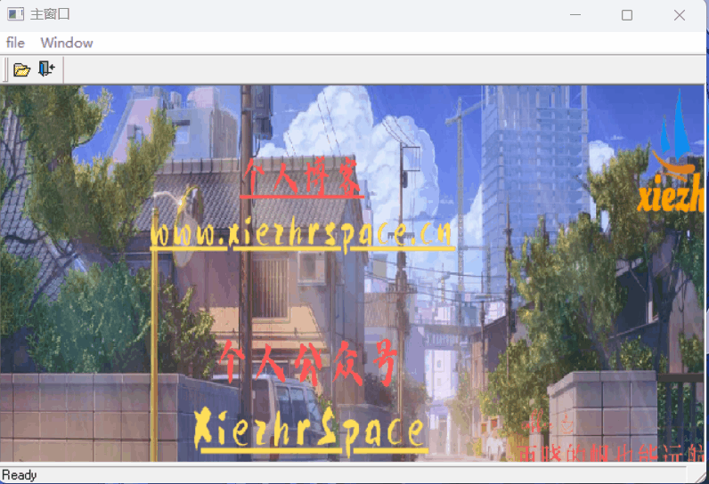
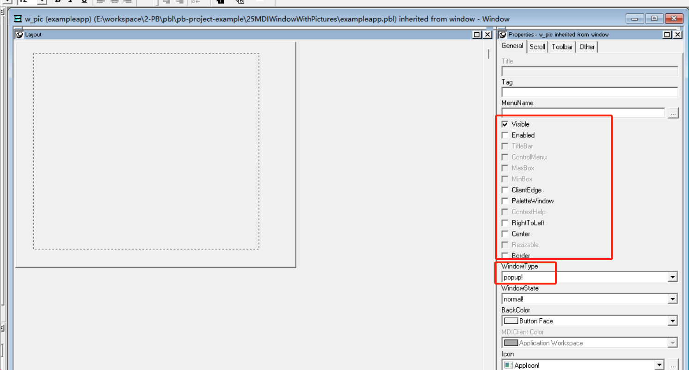
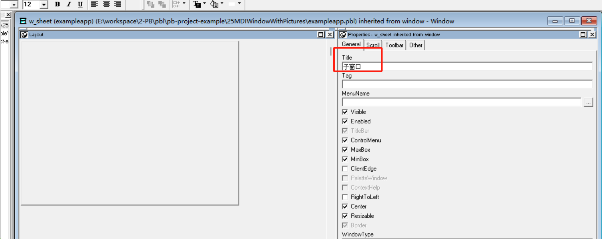
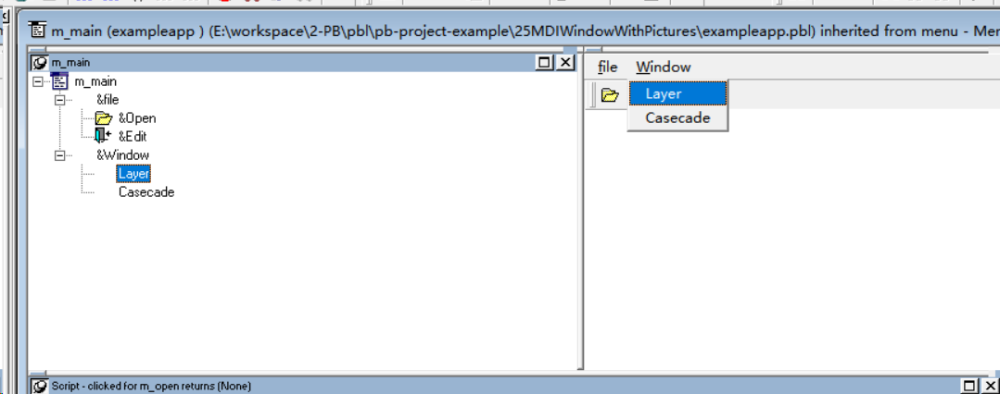
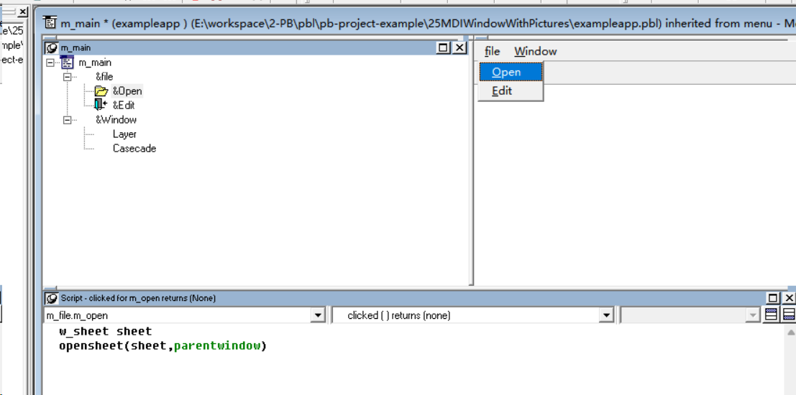
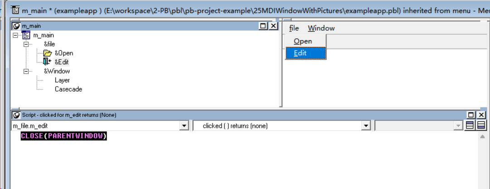
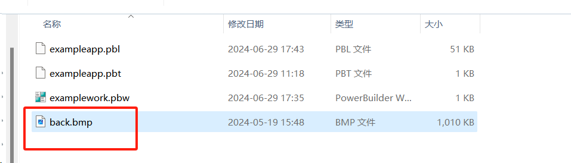
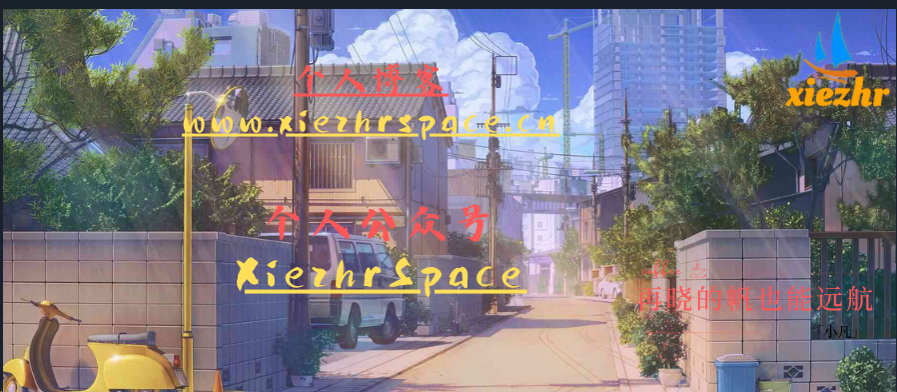

### 写在前面

这是PB案例学习笔记系列文章的第25篇，该系列文章适合具有一定PB基础的读者。

通过一个个由浅入深的编程实战案例学习，提高编程技巧，以保证小伙伴们能应付公司的各种开发需求。

文章中设计到的源码，小凡都上传到了gitee代码仓库[https://gitee.com/xiezhr/pb-project-example.git](https://gitee.com/xiezhr/pb-project-example.git)


需要源代码的小伙伴们可以自行下载查看，后续文章涉及到的案例代码也都会提交到这个仓库【**[pb-project-example](https://gitee.com/xiezhr/pb-project-example)**】

如果对小伙伴有所帮助，希望能给一个小星星⭐支持一下小凡。

### 一、小目标

通过本案例我们将制作一个带有底图的`MDI`窗口。通过这个案例我们可以制作出带底图的窗口，使窗口更加美观


### 二、创作思路

一般来说，在`MDI`窗口中无法放入底图，但通过本案例，我们建立一个标准的窗口来加载图片，`MDI`窗口启动时，打开这个窗口，就如同在`MDI`窗口中加载图片一样。最终效果如下




### 三、创建程序基本框架

① 新建`examplework`工作区

② 新建`exampleapp`应用

③ 新建`w_main`窗口，将其`Title`设置为主窗口

由于文章篇幅原因，以上步骤不再赘述，如果忘记怎么操作的小伙伴可以翻一翻该系列第一篇文章

④ 新建`w_pic`窗口

将窗口的`Visible`属性设置成`True`,其他属性均为`False` `WindowType`属性设置为`popup!`,并在窗口中添加`Picture`

控件，将其命名为`p_1`，如下图所示



⑤ 新建`w_sheet` 窗口

将其`Title`属性设置成“子窗口”



⑥新建`m_main`菜单，如下图所示




### 四、编写`w_pic`代码

① 在`w_pic`窗口中定义实例变量，代码如下

```java
boolean    isFullScreen
integer      oldwidth,oldheight
```


② 在`w_pic`窗口中定义`init`函数`init(string as_picture,boolean as isfullscreen) returns (none)`代码如下

```java
p_1.OriginalSize	= true
p_1.pictureName = as_picture

oldheight = p_1.height
oldwidth = p_1.width

p_1.originalSize = false

this.resize(this.width,this.height)
```

③ 在`w_pic`窗口的`open`事件中添加如下脚本

```java
isfullscreen = true
oldheight = p_1.height
oldwidth = p_1.width
```

④ 在`w_pic`窗口中添的`Resize`事件中添加如下代码

```java
p_1.setredraw(false)

if isFullScreen then
	p_1.x = 0
	p_1.y = 0
	p_1.resize(newwidth,newheight)
else
	p_1.resize(oldwidth,oldheight)
	
	integer ax,ay
	
	ax = (newwidth - oldwidth) / 2
	if ax < 0 then ax = 0
	ay = (newheight - oldheight) / 2
	if ay < 0 then ay = 0
	
	p_1.x = ax
	p_1.y = ay
end if

p_1.setredraw(true)
```


### 五、编写`w_main`窗口代码

① 在`w_main`窗口中添加实例变量

```java
w_pic               mdipicture
string       mdiPictureName
boolean     mdiIsFullScreen
```

② 在`w_main`中定义如下函数

`setpicture (string as_picture,boolean as_isfullscreen) returns (none)`,具体代码如下

```java
mdipicturename = as_picture
mdiisfullscreen = as_isfullscreen

if isvalid(mdipicture) then 
	mdipicture.init(mdipicturename,mdiisfullscreen)
	mdipicture.resize(this.width,this.height)
end if
```

③ 在`w_main`窗口的`Resize`事件中添加如下代码

```java
if isvalid(mdiPicture) = false then
	opensheet(mdipicture,this)
	mdipicture.init(mdipicturename,mdiisfullscreen)
	mdipicture.x = 0
	mdipicture.y = 0
end if
mdipicture.resize(newwidth,newheight)
```


### 六、编写`m_main`菜单代码

① 在`m_main`菜单的`Open`命令的`Clicked`事件中添加如下代码

```java
w_sheet sheet
opensheet(sheet,parentwindow)
```



② 在`m_main` 菜单的`Exit`命令的`Clicked`事件中添加如下代码

```java
CLOSE(PARENTWINDOW)
```



③  在`m_main` 菜单的`Layer`命令的`Clicked`事件中添加如下代码

```java
parentwindow.ArrangeSheets ( Layer!  )
```

④ 在`m_main` 菜单的`Cascade`命令的`Clicked`事件中添加如下代码

```java
parentwindow.ArrangeSheets ( Cascade!   )
```

### 七、`exampleapp`应用`Open`添加如下代码

①开发界面左边的`System Tree`窗口中双击`exampleapp`应用，在其`Open`事件中输入如下代码

```java
OPEN(w_main)
w_main.setpicture("back.bmp",true)
```

② 在根目录下准备`back.bmp`图片






### 八、运行程序

经过上面一堆操作，代码编写后。来检验一下我们的劳动成果


本期内容到这儿就结束了， *★,°*:.☆(￣▽￣)/$:*.°★* 。 希望对您有所帮助

我们下期再见 (●'◡'●)  ヾ(•ω•`)o