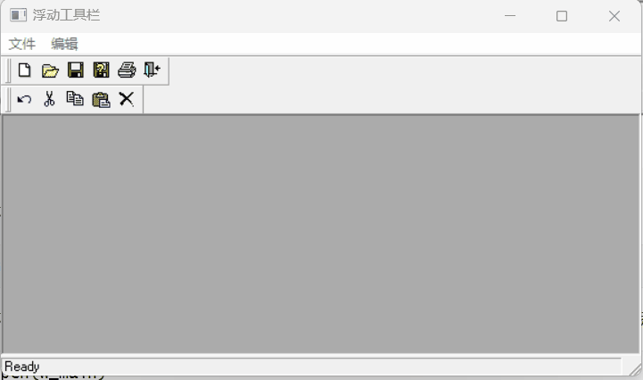
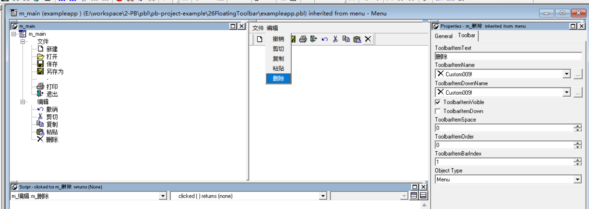
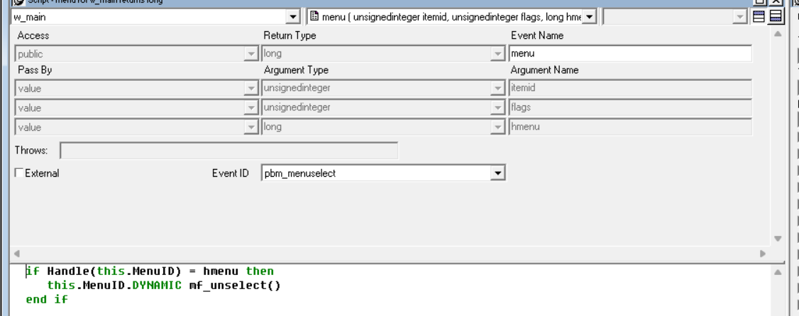

### 写在前面

这是PB案例学习笔记系列文章的第26篇，该系列文章适合具有一定PB基础的读者。

通过一个个由浅入深的编程实战案例学习，提高编程技巧，以保证小伙伴们能应付公司的各种开发需求。

文章中设计到的源码，小凡都上传到了gitee代码仓库[https://gitee.com/xiezhr/pb-project-example.git](https://gitee.com/xiezhr/pb-project-example.git)


需要源代码的小伙伴们可以自行下载查看，后续文章涉及到的案例代码也都会提交到这个仓库【**[pb-project-example](https://gitee.com/xiezhr/pb-project-example)**】

如果对小伙伴有所帮助，希望能给一个小星星⭐支持一下小凡。

### 一、小目标

通过本案例我们将制作一个带浮动图标的工具栏。当鼠标移动到一个命令图标上时，该图标会凸起显示，移开鼠标，工具栏图标又会恢复原来状态。通过案例我们将学会菜单对象`ToolBar`的使用，最终效果如下所示



### 二、创建程序基本框架

① 新建`examplework`工作区

② 新建`exampleapp`应用

③ 新建`w_main`窗口，将其`Title`属性设置成"浮动工具栏"， 并将`WindowType`属性设置成`mdihelp!`(**这儿一定要设置**)

由于文章篇幅原因，以上步骤不再赘述，如果忘记怎么新建的小伙伴可以翻一翻该系列文章的第一篇复习以下

### 三、新建`m_main`菜单

① 新建菜单基本框架，如下图所示



② 设置菜单命令属性

将各个菜单命令的`ToolBarItemText`与菜单命令名称设置成一致，`ToolBarItemName`与`ToolBarItemDownName`一致，如上图所示。

各个菜单命令的`ToolBarItemvisible`为`True`,`ToolBarItemDown`为`False`,`ToolBarItemSpace`与`ToolBarItemOrder`均为0，“新建”

、“打开”、“保存”、“另存为”、“-”、“打印”、“退出”的`ToolBarItemBarIndex`为1，“撤销”、“剪切”、“复制”、“粘贴”、“删除”的`ToolBarItemIndex`均为2

菜单栏各个属性说明如下

| 属性                  | 说明                                           |
| --------------------- | ---------------------------------------------- |
| `ToolBarItemText`     | 设置工具栏按钮的文本提示                       |
| `ToolBarItemName`     | 设置工具栏按钮的图标                           |
| `ToolBarItemDownName` | 设置工具栏按钮按下时的图标                     |
| `ToolBarItemVisible`  | 设置工具栏按钮是否显示                         |
| `ToolBarItemDown`     | 设置工具栏按钮是否为按下状态                   |
| `ToolBarItemSpace`    | 设置工具栏第一个按钮前预留的空位               |
| `ToolBarItemOrder`    | 设置工具栏按钮在工具栏上的位置                 |
| `ToolBarItemBarIndex` | 当有多个工具栏时，设置工具栏按钮所在的工具栏号 |


③ 保存菜单

④ 将窗口`w_main`的`MenuName`设置成刚刚创建的`m_main`

### 四、编写代码

① 在`m_main`菜单中新建`mf_select(menu am_menuitem) returns (none)`函数

函数体代码如下

```java
uint lui_flags, MF_HILITE = 128
lui_flags = IntHigh(Message.WordParm)
lui_flags -= mod(lui_flags, MF_HILITE)
if mod(lui_flags, MF_HILITE * 2) > 0 then return  // menu item text is selected
if am_menuitem.ToolBarItemDown then return // ignore icons that are displayed down
if am_menuitem.tag = "" then
	am_menuitem.tag = am_menuitem.ToolBarItemName
end if
im_last_selected = am_menuitem
am_menuitem.ToolBarItemName = am_menuitem.ToolBarItemDownName
```

② 在`m_main`菜单中新建`mf_unselect() returns (none)` 函数，函数体代码如下

```java
if isValid(im_last_selected) then
	if im_last_selected.tag <> "" then
		im_last_selected.ToolBarItemName = im_last_selected.tag
	end if
end if

```

③ 在`w_main`窗口中新建`menu(unsignedinteger itemid,unsignedinteger flags,long hmenu) returns long(pbm_menu)`事件，代码如下

```java
if Handle(this.MenuID) = hmenu then
	this.MenuID.DYNAMIC mf_unselect()
end if
```



④ 在`w_main`的`open`事件中 添加如下代码

```java
GetApplication().ToolBarText = True
```

⑤ 在开发界面左边`System Tree`窗口中双击`exampleapp`对象，并在其`open`事件中添加如下代码

```java
open(w_main)
```

### 五、运行程序

经过上面一波操作，代码编写，我们开看看最终效果


本期内容到这儿就结束了*★,°*:.☆(￣▽￣)/$:*.°★* 。 希望对您有所帮助

我们下期再见 ヾ(•ω•`)o (●'◡'●)